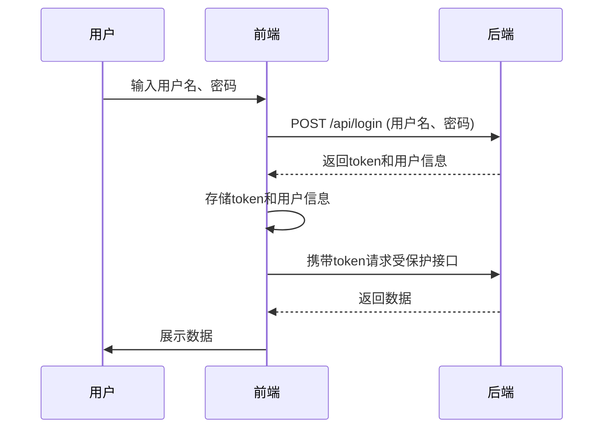
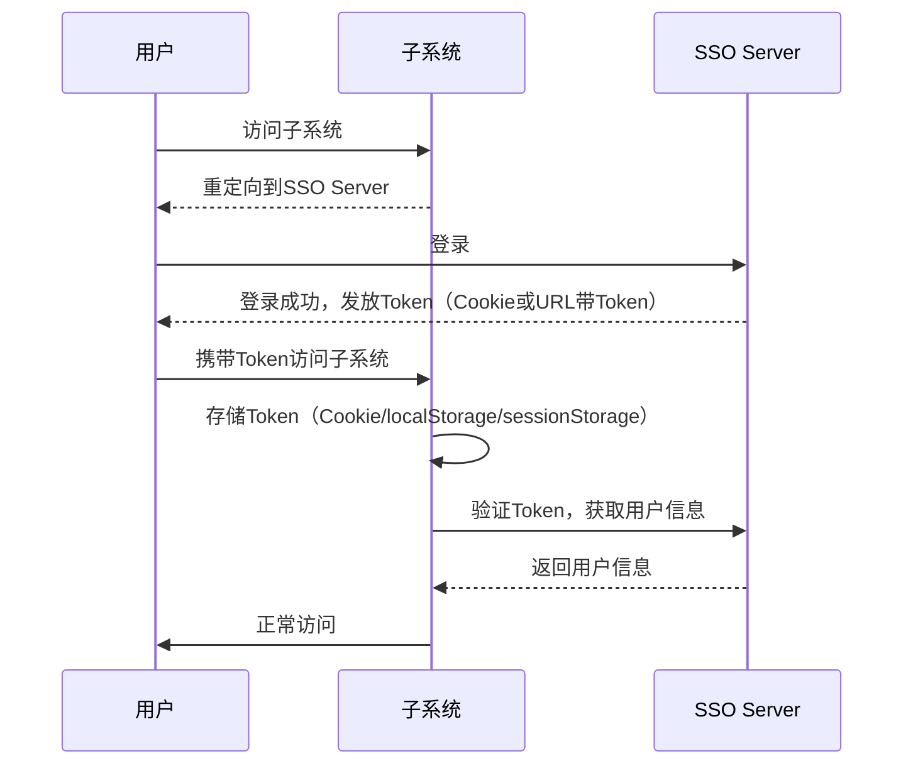

# 系统登录与SSO认证流程

[toc]

## 登录认证基础流程

1. **用户输入凭证** 
   用户在前端页面输入用户名和密码，点击登录。

2. **前端请求后端接口**
   前端将用户名和密码通过 HTTPS POST 请求发送到后端登录接口。

3. **后端验证并生成 Token**
   后端校验凭证，验证通过后生成登录凭证（如 JWT Token 或 Session ID），并返回给前端。

4. **前端存储 Token 和用户信息**
   前端收到 Token 和用户信息后，将其存储在本地（如 localStorage、sessionStorage、Cookie 或内存中）。

5. **前端携带 Token 请求受保护接口**
   后续所有需要认证的请求，前端都需携带 Token（通常放在 HTTP Header 的 Authorization 字段）。

6. **后端验证 Token 并返回数据**
   后端收到请求后，校验 Token，合法则返回数据，否则返回认证失败。

---

## 前端与后端的交互细节

### 1. 登录请求示例

````js
axios.post('/api/login', {
  username: 'user1',
  password: 'password123'
})
.then(res => {
  // 保存 Token 和用户信息
  localStorage.setItem('token', res.data.token);
  localStorage.setItem('userInfo', JSON.stringify(res.data.userInfo));
});
````

### 2. 携带 Token 的接口请求

````js
axios.get('/api/user/profile', {
  headers: {
    Authorization: `Bearer ${localStorage.getItem('token')}`
  }
});
````

### 3. 自动携带 Token（拦截器）

````js
axios.interceptors.request.use(config => {
  const token = localStorage.getItem('token');
  if (token) {
    config.headers.Authorization = `Bearer ${token}`;
  }
  return config;
});
````

---

## Token 与用户信息的存储

| 存储方式       | 特点                          | 场景               |
| -------------- | ----------------------------- | ------------------ |
| localStorage   | 持久化，页面关闭后仍保留      | SPA、需长时间登录  |
| sessionStorage | 会话级，关闭标签页即失效      | 临时会话           |
| Cookie         | 可设置 httpOnly、secure，跨域 | 传统Web、SSO推荐   |
| 内存（Vuex等） | 刷新丢失，适合临时状态        | 临时数据、状态管理 |
| 后端Session    | 服务端存储，安全性高          | 传统Web、SSO       |

> **安全建议**：Token 推荐存储在 httpOnly Cookie 中，防止 XSS 攻击。

---

## SSO（单点登录）机制详解

### 1. 基本概念

- SSO（Single Sign-On，单点登录）：用户只需登录一次，即可访问多个相互信任的系统，无需重复登录。
- 架构：**认证中心（SSO Server）+ 各业务系统（Client）**

### 2. SSO 登录流程

1. 用户访问子系统，发现未登录，重定向到 SSO Server。
2. 用户在 SSO Server 登录，认证通过后生成 Token。
3. SSO Server 通过 Cookie 或 URL 参数将 Token 传回子系统。
4. 子系统存储 Token，并通过 Token 换取用户信息。
5. 访问其他子系统时，自动携带 Token，无需再次登录。

### 3. Token 和用户信息的存储方式

#### SSO Server 端

- Token 存储在服务端 session、数据库或 JWT。
- 用户信息保存在服务端数据库或缓存。

#### 子系统端

- **Token 存储**：  
  - 跨域 Cookie（推荐，需顶级域名一致）
  - localStorage/sessionStorage（仅限当前域名，不能跨域）
- **用户信息存储**：  
  - 本地存储（localStorage、sessionStorage、内存）
  - 不存储，每次用 Token 换取（推荐，保证实时性）

#### SSO Cookie 模式

- SSO Server 设置顶级域名 Cookie（如 `.company.com`），所有子系统自动携带。

#### SSO Token 模式

- SSO Server 登录成功后，将 Token 通过 URL 参数重定向给子系统，子系统本地保存 Token。

---

## 安全性与最佳实践

- **Token 安全存储**：  
  - 推荐使用 httpOnly、secure 的 Cookie 存储 Token，防止 XSS。
- **最小化用户信息本地存储**：  
  - 建议只存储必要的用户信息，敏感信息不存前端。
- **Token 校验与刷新**：  
  - Token 过期需支持刷新机制，避免频繁登录。
- **统一登出**：  
  - 支持 SSO 统一注销，所有子系统同步退出。
- **权限控制**：  
  - 前端根据用户角色动态渲染菜单和页面，后端做最终权限校验。

---

## 流程图与代码示例

### 1. 登录与认证流程时序图



### 2. SSO 登录流程时序图



---

## 常见问题与优化建议

1. **Token 泄露风险**
   - 采用 httpOnly、secure Cookie，避免 Token 被 JS 获取。
   - 防范 XSS、CSRF 攻击。

2. **Token 过期处理**
   - 前端检测到 401/403，自动跳转登录或调用刷新接口。

3. **SSO 跨域问题**
   - 使用顶级域名 Cookie。
   - 或采用后端转发、前端重定向带 Token。

4. **用户信息同步问题**
   - 建议每次用 Token 换取用户信息，保证实时性。

5. **登出同步**
   - SSO Server 通知所有子系统注销，或前端清除所有存储。

---

## 总结

本文系统梳理了系统登录与SSO（单点登录）认证的核心流程与实现要点。通过对登录认证基本流程、前后端交互细节、Token与用户信息的存储方式、SSO机制原理与流程、安全性最佳实践等多个维度的讲解，帮助开发者建立了完整的认证体系知识框架。

在实际开发中，选择合适的Token存储方式、合理设计用户信息同步机制、注重安全防护（如XSS、CSRF防护、Token过期处理等），并结合业务场景采用SSO等集成化认证方案，能够显著提升系统的安全性、扩展性和用户体验。  
建议开发者根据自身系统架构和安全需求，灵活选用相关技术，实现高效可靠的认证与授权体系。
