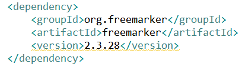
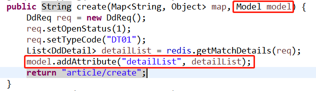
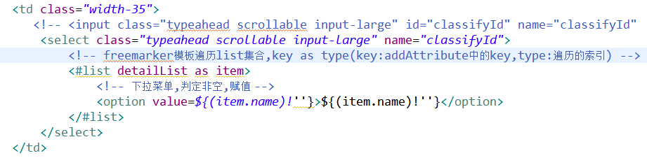

## 											前端FreeMarker框架遍历集合

[TOC]

#### 1.在pom文件中引入freemarker的依赖



#### 2.在控制器中用Model或者ModelAndView对象将参数传入到页面



#### 3.在页面中进行遍历



#### 4.附源码和注释

##### 	4.1 pom依赖

```java
	`<dependency>
        <groupId>org.freemarker</groupId>
        <artifactId>freemarker</artifactId>
        <version>2.3.28</version>
    </dependency>`
```
##### 	4.2 controller传参

```java
	`public String create(Map<String, Object> map, Model model) {
	DdReq req = new DdReq();
	req.setOpenStatus(1);
	req.setTypeCode("DT01");
	List<DdDetail> detailList = redis.getMatchDetails(req);
	model.addAttribute("detailList", detailList);
    return "article/create";
}`
```
##### 	4.3 HTML取值遍历

```html
	`<td class="width-35">
        <select class="typeahead scrollable input-large" name="classifyId">
			<!-- freemarker模板遍历list集合,key as type(key:addAttribute中的key,type:遍历的索引) -->
            <#list detailList as item>
                <!-- 下拉菜单,判定非空,赋值 -->
                <option value=${(item.code)!''}>${(item.name)!''}</option>
            </#list>
       </select>
    </td>`
```