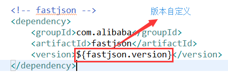
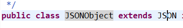
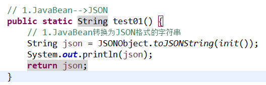
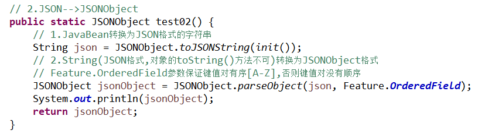
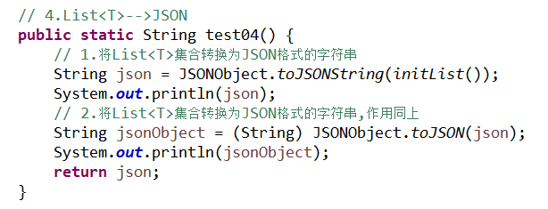
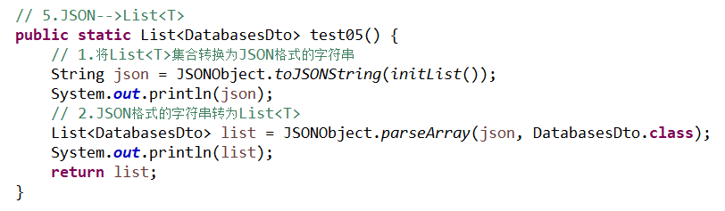
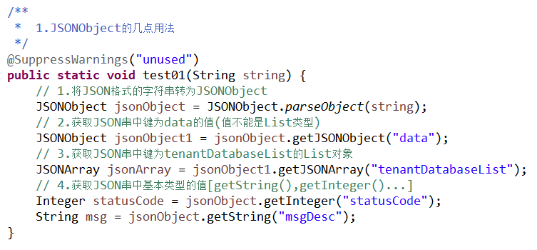

## 						JSON和对象之间的转换

[TOC]

#### 引入pom依赖

使用阿里的 fastjson。


​		

```java
		<!-- 阿里json -->
		<dependency>
			<groupId>com.alibaba</groupId>
			<artifactId>fastjson</artifactId>
			<version>1.2.8</version>
		</dependency>
```

---

#### JSON和JSONObject的关系

~~~java
/**
 * JSON.toJSONString(init()) 格式化时会将空值过滤掉, 即JSON串中没有key
 * 可以通过设置以下参数将空值转为"": 比如 name: ""
 * SerializerFeature.WriteMapNullValue 将对象中的空值保留key, 赋值null; SerializerFeature.WriteNullStringAsEmpty 将null转为""
 * JSON.toJSONString(init(), SerializerFeature.WriteMapNullValue, SerializerFeature.WriteNullStringAsEmpty)
 * <p>
 * SerializerFeature的几种用法
 * QuoteFieldNames: 输出key时是否使用双引号, 默认为true
 * WriteMapNullValue: 是否输出值为null的字段, 默认为false
 * WriteNullNumberAsZero: 数值字段如果为null, 输出为0, 而非null
 * WriteNullListAsEmpty: List字段如果为null, 输出为[], 而非null
 * WriteNullStringAsEmpty: 字符类型字段如果为null, 输出为”“, 而非null
 * WriteNullBooleanAsFalse: Boolean字段如果为null, 输出为false, 而非null
 */
~~~

JSONObject继承了JSON

​		

~~~java
public class JSONObject extends JSON implements Map<String, Object>, Cloneable, Serializable, InvocationHandler {}
~~~

---

####  3.JSON和JavaBean的简单转换

##### 	3-1. JavaBean-->JSON

​	

``` java
	// 1.JavaBean-->JSON
	public static String test01() {
		// 1.JavaBean转换为JSON格式的字符串
		String json = JSONObject.toJSONString(init());
		System.out.println(json);
		return json;
	}
```

---

##### 	3-2. JSON-->JSONObject

​	

``` java
	// 2.JSON-->JSONObject
	public static JSONObject test02() {
		// 1.JavaBean转换为JSON格式的字符串
		String json = JSONObject.toJSONString(init());
		// 2.String(JSON格式,对象的toString()方法不可)转换为JSONObject格式
		// Feature.OrderedField参数保证键值对有序[A-Z],否则键值对没有顺序
		JSONObject jsonObject = JSONObject.parseObject(json, Feature.OrderedField);
		System.out.println(jsonObject);
		return jsonObject;
	}
```

---

##### 	3-3. JSON(JSONObject)-->JavaBean

​	-JavaBean.png)

```java
	// 3.JSON(JSONObject)-->JavaBean
	public static DatabasesDto test03() {
		// JavaBean转换为JSON格式的字符串
		String json = JSONObject.toJSONString(init());
		// 1.用parseObject()方法,入参为String类型,且该String必须是JSON格式的(键值对,对象的toString()方法不能直接转)
		DatabasesDto res = JSONObject.parseObject(json, DatabasesDto.class);
		System.out.println(res);
		// 2.用toJavaObject()方法,入参为JSONObject类型(父类JSON也可)
		JSONObject jsonObject = JSONObject.parseObject(json);
		res = JSONObject.toJavaObject(jsonObject, DatabasesDto.class);
		System.out.println(res);
		return res;
	}
```

---

##### 	3-4. List<T>-->JSON

​	

```java
	// 4.List<T>-->JSON
	public static String test04() {
		// 1.将List<T>集合转换为JSON格式的字符串
		String json = JSONObject.toJSONString(initList());
		System.out.println(json);
		// 2.将List<T>集合转换为JSON格式的字符串,作用同上
		String jsonObject = (String) JSONObject.toJSON(json);
		System.out.println(jsonObject);
		return json;
	}
```

---

##### 	3-5. JSON-->List<T>



```java
	// 5.JSON-->List<T>
	public static List<DatabasesDto> test05() {
		// 1.将List<T>集合转换为JSON格式的字符串
		String json = JSONObject.toJSONString(initList());
		System.out.println(json);
		// 2.JSON格式的字符串转为List<T>
		List<DatabasesDto> list = JSONObject.parseArray(json, DatabasesDto.class);
		System.out.println(list);
		return list;
	}
```

---

#### 4.JSON和List<T>的复杂转换

* ##### 对于多层嵌套的JSON串,可以使用JSONObject类的方法获取JSON串中的某些值进行转换

* ##### JSONObject类的几个方法如下:

  

```java
	/**
	 * 	1.JSONObject的几点用法
	 */
	@SuppressWarnings("unused")
	public static void test01(String string) {
		// 1.将JSON格式的字符串转为JSONObject
		JSONObject jsonObject = JSONObject.parseObject(string);
		// 2.获取JSON串中键为data的值(值不能是List类型)
		JSONObject jsonObject1 = jsonObject.getJSONObject("data");
		// 3.获取JSON串中键为tenantDatabaseList的List对象
		JSONArray jsonArray = jsonObject1.getJSONArray("tenantDatabaseList");
		// 4.获取JSON串中基本类型的值[getString(),getInteger()...]
		Integer statusCode = jsonObject.getInteger("statusCode");
		String msg = jsonObject.getString("msgDesc");
	}
	
	// 1.JavaBean<List<T>>多层嵌套
	/**
	 * 	对于多层的嵌套转换,可分解逐步转换,使用JSONObject的方法进行获取,逐步转换
	 * 	对于多层的List嵌套要一步转换到位,可使用net.sf.json.JSONObject类(操作map)
	 */
```

---

#### 5. 源码参见GitHub地址:

> https://github.com/lzhcccccch/JSON-JavaBean

