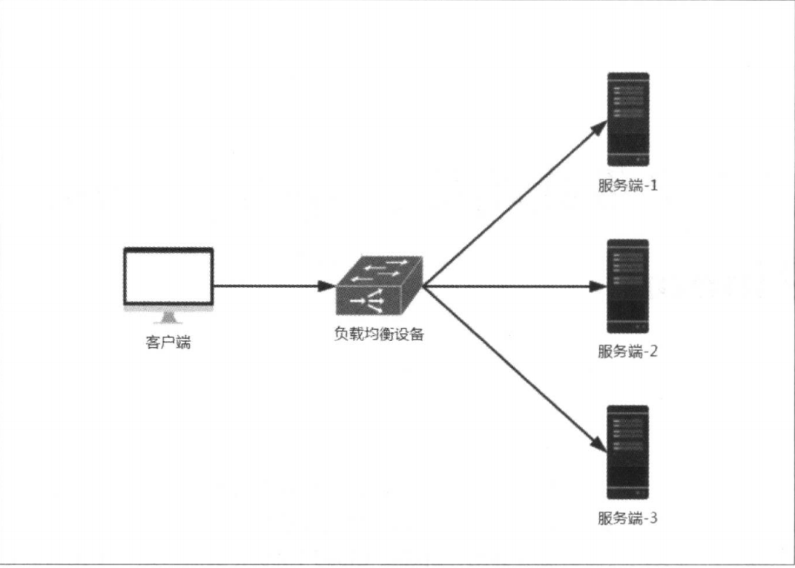

## Spring Cloud Ribbon

[toc]

#### 一、 Ribbon 简介

> Spring Cloud Ribbon 是一个基于 HTTP 和 TCP 的客户端负载均衡工具，它基于 Netflix Ribbon实现。通过 Spring Cloud 的封装，可以让我们轻松地将面向服务的 REST 模板请求自动转换成客户端负载均衡的服务调用。Spring Cloud Ribbon 只是一个工具类框架，它不像注册中心、配置中心、API 网关那样需要独立部署，但是它几乎存在于每一个 Spring Cloud 构建的微服务和基础设施中。因为微服务间的调用，API 网关的请求转发等内容，实际上都是通过 Ribbon 来实现的，包括 Feign，也是基于 Ribbon 实现的。

---

#### 二、客户端负载均衡

​	负载均衡在系统架构中是一个非常重要，而且是必须去实施的内容。因为负载均衡是对系统的高可用、网络压力的缓解和处理能力扩容的重要手段之一。我们通常所说的负载均衡都指的是服务端负载均衡，其中分为硬件负载均衡和软件负载均衡。硬件负载均衡主要通过在服务器节点之间安装专门用于负载均衡的设备，比如 F5 等；而软件负载均衡则是通过在服务器上安装一些具有负载均衡功能或模块的软件来完成请求分发工作，比如 nginx 等。不论采用硬件负载均衡还是软件负载均衡，只要是服务端负载均衡都能以类似下图的架构方式构建起来：



​	硬件负载均衡的设备或是软件负载均衡的软件模块都会维护一个下挂可用的服务端清单，通过心跳检测来剔除故障的服务端节点以保证清单中都是可以正常访问的服务端节点。当客户端发送请求到负载均衡设备的时候，该设备按照某种算法（比如线性轮询、按权重负载、按流量负载等）从维护的可用服务端清单中取出一台服务端的地址，然后进行转发。

​	而客户端负载均衡和服务端负载均衡最大的不同点在于上面所提到的服务清单所存储的位置。在客户端负载均衡中，所有客户端节点都维护着自己要访问的服务端清单，而这些服务端的清单都来自于注册中心，比如 Eureka。同服务端负载均衡的架构类似，在客户端负载均衡中也要心跳去维护服务端清单的健康性，只是这个步骤需要与注册中心配合完成。在 Spring Cloud 实现的服务治理框架中，默认会创建针对各个服务治理框架的 Ribbon 自动化整合配置，比如 Eureka 的 `orr.springframework.cloud.netflix.ribbon.eureka.RibbonEurekaAutoConfiguration` , Consul 中的 `org.springframework.cloud.consul.discovery.RibbonConsulAutoConfiguration` 。在实际使用的时候，我们可以通过查看这两个类的实现，来找到它们的配置详情以帮助我们更好地使用。

​	通过 Spring Cloud Ribbon 的封装，我们在微服务架构中使用客户端负载均衡调用非常简单，只需要如下两步即可：

- 服务提供者只需要启动多个服务实例并注册到一个注册中心或是多个相关联的注册中心。
- 服务消费者直接通过调用被 `@LoadBalanced` 注解修饰过的 RestTemplate 来实现面向服务的接口调用。

---

#### 三、 RestTemplate 详解

> 在 Ribbon 实现负载均衡功能时，使用到了 RestTemplate对象。 该对象会使用 Ribbon 的自动化配置，同时通过配置 `@LoadBalanced` 还能够开启客户端负载均衡。
>
> ~~~java
> // 可以在启动类（或配置类）添加以下代码开启 RestTemplate 负载均衡 
> @Bean
> @LoadBalanced
> public RestTemplate restTemplate() {
>   return new RestTemplate();
> }
> ~~~

##### 1. GET 请求

​	在 RestTemplate 中，对 GET 请求可以通过如下两个方法进行调用实现。

​	**第一种：getForEntity 方法。**该方法返回的是 ResponseEntity，该对象是 Spring 对 HTTP 请求响应的封装，其中主要存储了 HTTP 的几个重要元素，比如 HTTP 请求状态码的枚举对象 HttpStatus（也就是我们常说的 404、500 这些错误码）、在它的父类 HttpEntity 中还存储着 HTTP 请求的头信息对象 HttpHeaders 以及泛型类型的请求体对象。比如下面的例子，就是访问 TEST 服务的 /test 请求，同时最后一个参数 1001 会替换掉 url 中的 {1} 占位符，而返回的 ResponseEntity 对象中的 body 内容类型会根据第二个参数转换为 String 类型。

~~~java
	RestTemplate restTemplate = new RestTemplate();
	ResponseEntity<String> responseEntity = restTemplate.getForEntity("http://TEST/test?id={1}", String.class, 1001);
	String result = responseEntity.getBody();
~~~

​	如果想 body 返回一个 User 对象，可以这样实现：

~~~java
	RestTemplate restTemplate = new RestTemplate();
	ResponseEntity<User> responseEntity = restTemplate.getForEntity("http://TEST/test?id={1}", User.class, 1001);
	User result = responseEntity.getBody();
~~~

​	上面的例子是比较常用的方法，getForEntity 方法实际上提供了以下三种不同的重载实现。

- ```java
  public <T> ResponseEntity<T> getForEntity(String url, Class<T> responseType, Object... uriVariables)
  ```

  该方法提供了三个参数，其中 url 是请求地址，responseType 是请求响应体 body 的包装类型，urlVariables 是 url 中的参数绑定。GET 请求的参数绑定通常使用 url 中拼接的方式，比如 `http://TEST/test?id=1001`，我们可以像这样将参数拼接到 url 中，但更好的方法是在 url 中使用占位符并配合 urlVariables 参数实现 GET 请求的参数绑定，比如 url 定义为 `http://TEST/test?id={1}`，然后可以这样来调用：`getForEntity("http://TEST/test?id={1}", String.class, 1001)`，其中第三个参数 1001 会替换 url 中 {1} 占位符。这里需要注意的是，由于 urlVariables 参数是一个数组，所以它的顺序会对应 url 中占位符定义的数字顺序。

- ~~~java
  public <T> ResponseEntity<T> getForEntity(String url, Class<T> responseType, Map<String, ?> uriVariables)
  ~~~

  该方法提供的参数中，只有 urlVariables 的参数类型与上面的方法不同。这里使用了 Map 类型，所以使用该方法进行参数绑定时需要在占位符中指定 Map 中参数的 key 值，比如 URL 定义为 `http://TEST/test?id={id}`，在 Map 类型的 urlVariables 中，我们就需要 put 一个 key 为 id 的参数来绑定 url 中 {id} 占位符的值，比如： 

  ~~~java
  	RestTemplate restTemplate = new RestTemplate();
  	Map<String, Integer> map = new HashMap<>();
  	map.put("id", 1001);
  	ResponseEntity<String> responseEntity = restTemplate.getForEntity("http://TEST/test?id={id}", String.class, map);
  ~~~

- ```java
  public <T> ResponseEntity<T> getForEntity(URI url, Class<T> responseType)
  ```

  该方法使用 URI 对象来替代之前的 url 和 urlVariables 参数来指定访问地址 he参数绑定。URI 是 JDK java.net 包下的一个类，它表示一个统一资源标识符（Uniform Resource Identifier) 引用。比如下面的例子：

  ~~~java
  	UriComponents uriComponents = UriComponentsBuilder.fromUriString("http://TEST/test?id={id}")
  		.build()
  		.expand(1001)
  		.encode();
  	URI uri = uriComponents.toUri();
  	ResponseEntity<String> responseEntity = restTemplate.getForEntity(uri, String.class);
  ~~~

---

​	**第二种：getForObject 方法。**该方法可以理解为对 getForEntity 的进一步封装，它通过 `HttpMessageConverterExtractor` 对 HTTP 的请求响应体 body 内容进行对象转换，实现请求直接返回包装好的对象内容。比如：

~~~java
	RestTemplate restTemplate = new RestTemplate();
	String result = restTemplate.getForObject(uri, String.class);
	// 当 body 是一个 User 对象时
	User user = restTemplate.getForObject(uri, User.class);
~~~

​	当不需要关注请求响应出 body 外的其他内容时，该方法就非常好用，可以少一个从 Response 中获取 body 的步骤。它与 getForEntity 方法类似，也提供三种不同的重载实现。

- ~~~java
  public <T> T getForObject(String url, Class<T> responseType, Object... uriVariables
  ~~~

  与 getForEntity 的方法类似，url 参数指定访问的地址，responseType 参数定义该方法的返回类型，urlVariables 参数为 url 中占位符对应的参数。

- ~~~java
  public <T> T getForObject(String url, Class<T> responseType, Map<String, ?> uriVariables)
  ~~~

  在该方法中，使用 Map 类型 urlVariables 替代上面数组形式的 urlVariables，因此使用时在 url 中需要将占位符的名称与 Map 类型中的 key 一一对应设置。

- ~~~java
  public <T> T getForObject(URI url, Class<T> responseType)
  ~~~

  该方法使用 URI 对象来替代之前的 url 和 urlVariables 参数使用，URI 对象使用见 getForEntity 方法重载。

---

##### 2. POST 请求

​	在 RestTemplate 中，对 POST 请求时可以通过如下三个方法进行调用实现。

​	**第一种：postForEntity 方法。** 该方法同 GET 请求中的 getForEntity 类似，会在调用后返回 ResponseEntity<T> 对象，其中 T 为请求响应的 body 类型。比如：

~~~java
	RestTemplate restTemplate = new RestTemplate();
	User user = new User();
	// 提交的 body 内容为 user 对象，请求响应返回的 body 类型为 String。
	ResponseEntity<String> responseEntity = restTemplate.postForEntity("http://TEST/test", user, String.class);
	String body = responseEntity.getBody();
~~~

​	postForEntity 方法也实现了三种不同的重载方法。

- ~~~java
  public <T> ResponseEntity<T> postForEntity(String url, @Nullable Object request, Class<T> responseType, Object... uriVariables)
  ~~~

- ~~~java
  public <T> ResponseEntity<T> postForEntity(String url, @Nullable Object request, Class<T> responseType, Map<String, ?> uriVariables)
  ~~~

- ~~~java
  public <T> ResponseEntity<T> postForEntity(URI url, @Nullable Object request, Class<T> responseType)
  ~~~

  这些方法中的参数用法大部分都与 getForEntity 一致，比如，第一个重载方法和第二个重载方法中的 uriVariables 参数都是用来对 url 中的参数进行绑定使用；responseType 参数是对请求响应的 body 内容的类型定义。注意，request 参数是新增的，该参数可以是一个普通对象，也可以是一个 HttpEntity 对象。如果是一个普通对象，而非 HttpEntity 对象时，RestTemplate 会将请求对象转换为一个 HttpEntity 对象来处理，其中 Object 就是 request 的类型，request 内容会被视作完成的 body 来处理；而如果 request 是一个 HttpEntity 对象，那么就会被当作一个完整的 HTTP 请求对象来处理，这个 request 中不仅包含了 body 的内容，也包含了 header 的内容。

​	**第二种：postForObject 方法。** 该方法也跟 getForObject 的类型类似，它的作用是简化 postForEntity 的后续处理。通过直接将请求响应的 body 内容包装成对象来返回使用。比如：

~~~java
	RestTemplate restTemplate = new RestTemplate();
	User user = new User();
	String body = restTemplate.postForObject("http://TEST/test", user, String.class);
~~~

​	postForObject 方法也实现了三种不同的重载方法：

- ~~~java
  public <T> T postForObject(String url, @Nullable Object request, Class<T> responseType, Object... uriVariables)
  ~~~

- ~~~java
  public <T> T postForObject(String url, @Nullable Object request, Class<T> responseType, Map<String, ?> uriVariables)
  ~~~

- ~~~java
  public <T> T postForObject(URI url, @Nullable Object request, Class<T> responseType)
  ~~~

​	这三个方法除了返回的对象类型不同，方法的入参均与 postForEntity 一致，用法参考 postForEntity。

​	**第三种：postForLocation 方法。** 该方法实现了以 POST 请求提交资源，并返回新的资源的 URI。比如：

~~~java
	RestTemplate restTemplate = new RestTemplate();
	User user = new User();
	URI uri = restTemplate.postForLocation("http://TEST/test", user);
~~~

​	postForLocation 方法也实现了三种不同的重载方法：

- ~~~java
  public URI postForLocation(String url, @Nullable Object request, Object... uriVariables)
  ~~~

- ~~~java
  public URI postForLocation(String url, @Nullable Object request, Map<String, ?> uriVariables)
  ~~~

- ~~~java
  public URI postForLocation(URI url, @Nullable Object request)
  ~~~

​	由于 postForLocation 方法会返回新资源的 URI，该 URI 就相当于制定了返回类型，所以此方法实现的 POST 请求不需要像 postForEntity 和 postForObject 那样指定 responseType。其他用法相同，可参考。

---

##### 3. PUT 请求

​	在 RestTemplate 中，对 PUT 请求可以通过 put 方法进行调用实现。比如：

~~~java
	RestTemplate restTemplate = new RestTemplate();
	User user = new User();
	int id = 1001;
	restTemplate.put("http://TEST/test/{1}", user, id);
~~~

​	put 方法也提供了三种不同的重载：

- ~~~java
  public void put(String url, @Nullable Object request, Object... uriVariables
  ~~~

- ~~~java
  public void put(String url, @Nullable Object request, Map<String, ?> uriVariables)
  ~~~

- ~~~java
  public void put(URI url, @Nullable Object request)
  ~~~


​	put 方法为 void 类型，没有返回内容，所以也就没有定义 responseType 参数，除此之外，用于与 postForObject 基本一致。

---

##### 4. DELETE 请求

​	在 RestTemplate 中，对 DELETE 请求可以通过 delete 方法进行调用实现。比如：

~~~java
	RestTemplate restTemplate = new RestTemplate();
	int id = 1001;
	restTemplate.delete("http://TEST/test/{1}", id);
~~~

​	delete 方法也提供了三种重载:

- ~~~java
  public void delete(String url, Object... uriVariables)
  ~~~

- ~~~java
  public void delete(String url, Map<String, ?> uriVariables)
  ~~~

- ~~~java
  public void delete(URI url) throws RestClientException
  ~~~

​	由于我们在进行 REST 请求时，通常将 DELETE 请求的唯一标识拼接在 url 中，所以 DELETE 请求也不需要 request 的 body 信息，如上三种重载。url 指定 DELETE 请求的位置，urlVariables 绑定 url 中的参数即可。

---

##### 5. 小结

​	从 4 种请求方式的实现方法中，可以看出，GET 和 DELETE 请求是相似的，都是在 url 中绑定参数，只不过是返回类型不同；而 POST 和 PUT 是相似的，都可以在入参中传递对象，同时也可以在 url 中进行拼接，返回类型也是不同的。

​	4 种请求方式都可以通过 POST 来实现，因为 POST 是最全的，既可以 url 中拼接也可以入参中携带对象。

​	xxxForObject 方法是经过封装的，使用起来相对简便。

---

#### 四、 源码分析


---

#### 五、 