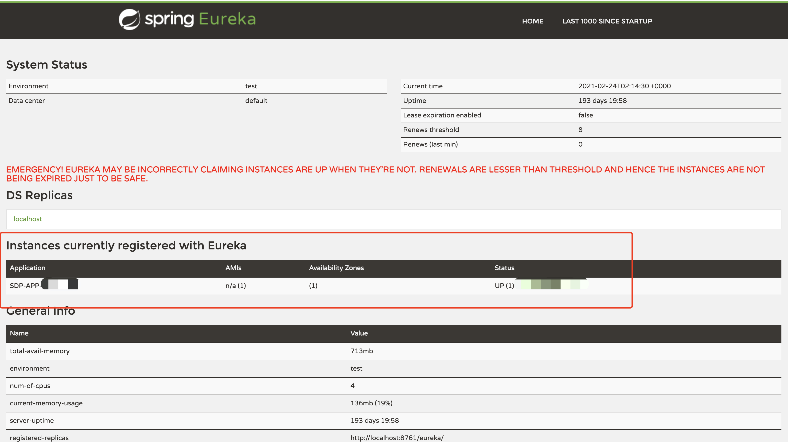

## Spring Cloud Eureka 实战

[toc]

#### 一、 Eureka 简介

> Spring Cloud Eureka 是 Spring Cloud Netflix 微服务套件中的一部分， 它基于 Netflix Eureka 做了二次封装，主要负责完成微服务架构中的服务治理功能。Spring Cloud 通过为 Eureka 增加了 Spring Boot 风格的自动化配置，我们只需通过简单引入依赖和注解配置就能让 Spring Boot 构建的微服务应用轻松地与 Eureka 服务治理体系进行整合。

---

#### 二、 Eureka 集成

#### Eureka Server

在 pom.xml 中添加相关 Eureka 依赖

~~~java
<dependency>
    <groupId>org.springframework.cloud</groupId>
    <artifactId>spring-cloud-starter-netflix-eureka-server</artifactId>
</dependency>

<!-- 2020.X.X版本官方重构了bootstrap引导配置的加载方式，需要添加以下依赖 -->
<dependency>
    <groupId>org.springframework.cloud</groupId>
    <artifactId>spring-cloud-starter-bootstrap</artifactId>
</dependency>
~~~

通过 @EnableEurekaServer 注解启动一个服务注册中心提供给其他应用进行对话。

~~~~java
@SpringBootApplication
@EnableEurekaServer
public class EurekaApplication {

    public static void main(String[] args) {
        SpringApplication.run(EurekaApplication.class, args);
        System.out.println("---------->start");
    }
  
}
~~~~

在默认设置下，该服务注册中心也会将自己作为客户端来尝试注册它自己，由于该应用是注册中心，并不需要注册中心注册自己，所以我们需要禁用它的客户端行为，在配置文件（application.yml、bootstrap.yml 等）增加如下配置：

~~~java
# 是否在Eureka服务器中注册自己的信息以供其他服务发现,默认true.单机时用false
eureka.client.register-with-eureka: false
~~~

由于注册中心的职责就是维护服务实例，它并不需要去检索服务，所以增加如下配置：

~~~java
# 此客户端是否获取eureka服务器注册表上服务提供者的注册信息, 默认为true.单机服务端时用false
eureka.client.fetch-registry: false
~~~

在完成常规配置（port、name等）并增加以上配置之后，启动应用并访问 `http://ip:port` 。便可以看到 Eureka 的信息面板。其中 Instances currently registered with Eureka 栏是在注册中心注册的服务，多实例会在 Status 列显示多 ip。

---

#### Eureka Client

服务提供者就是需要注册到注册中心的服务，即客户端。添加如下依赖表示该服务是 Eureka 的客户端。

~~~java
<dependency>
  <groupId>org.springframework.cloud</groupId>
  <artifactId>spring-cloud-starter-netflix-eureka-client</artifactId>
</dependency>

<!-- 2020.X.X版本官方重构了bootstrap引导配置的加载方式，需要添加以下依赖 -->
<dependency>
    <groupId>org.springframework.cloud</groupId>
    <artifactId>spring-cloud-starter-bootstrap</artifactId>
</dependency>
~~~

​	在启动类上添加 @EnableDiscoveryClient 注解，表示开启客户端

~~~java
@SpringBootApplication
@EnableDiscoveryClient
public class AdminServerApplication {

    public static void main(String[] args) {
        SpringApplication.run(AdminServerApplication.class, args);
        System.out.println("---------->start");
    }
  
}
~~~

最后，修改配置文件。

~~~java
# 设置服务名字，该名字便是在注册中心中显示的名字
spring.application.name= xxx
# 设置eureka服务器所在的地址, 查询服务和注册服务都需要依赖这个地址. 多个用,隔开
eureka.client.service-url.defalutZone : ${eureka-client-service-url-defaultZone}
~~~

启动应用，访问 Eureka 注册中心，可以查看应用是否成功注册到注册中心。

---

#### 高可用注册中心

​	Eureka Server 的设计一开始就考虑了高可用问题，在 Eureka 的服务治理设计中，所有节点既是服务提供方，也是服务消费方，服务注册中心也不例外。Eureka Server 的高可用实际上就是将自己作为服务向其他服务注册中心注册自己，这样就可以形成一组互相注册的服务注册中心，以实现服务清单的互相同步，达到高可用的效果。

​	修改配置文件，将如下连个配置设置为 true 或者不进行配置（默认为 true）

~~~java
# 是否在Eureka服务器中注册自己的信息以供其他服务发现,默认true.单机时用false
eureka.client.register-with-eureka: true
# 此客户端是否获取eureka服务器注册表上服务提供者的注册信息, 默认为true.单机服务端时用false
eureka.client.fetch-registry: true
~~~

​	为每一个 Eureka 应用设置 hostname 和 defaultZone

~~~java
eureka.instance.hostname: xxx
# hostname 是其他 Eureka 服务的 hostname 
eureka.client.service-url.defalutZone : http://hostname:port/eureka/, http:// ...
~~~

​	在本机配置时 hostname 不能相同，所以不能使用 localhost 或者 ip，需要修改 hosts 文件添加相应域名。如果是集群配置则可使用不同的 ip 即可。

​	其他客户端服务在进行服务注册时需要同时向多个注册中心服务进行注册，如下：

~~~java
eureka.client.service-url.defalutZone : http://hostname:port/eureka/, http:// ...
~~~

---

#### 项目地址

> https://github.com/lzhcccccch/SDP-MSP-SpringCloud/tree/master/MSP-Eureka
