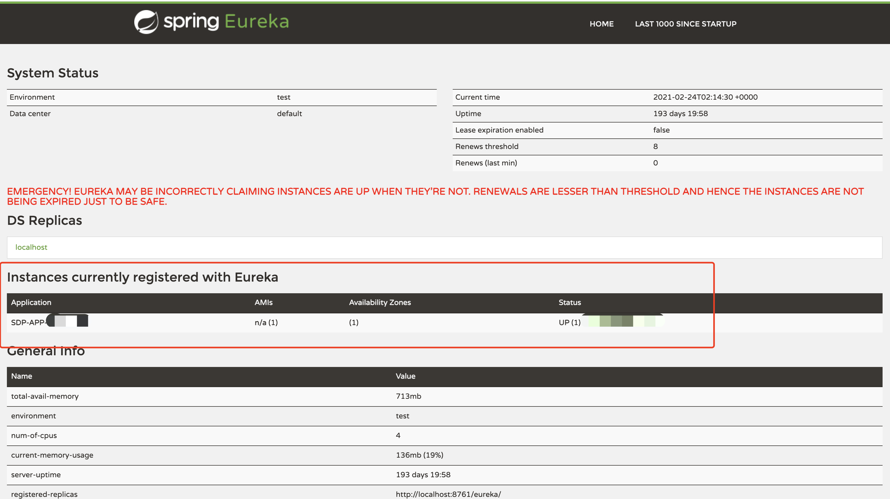

## Spring Cloud Eureka

[toc]

#### 一、 Eureka 简介

> Spring Cloud Eureka 是 Spring Cloud Netflix 微服务套件中的一部分， 它基于 Netflix Eureka 做了二次封装，主要负责完成微服务架构中的服务治理功能。Spring Cloud 通过为 Eureka 增加了 Spring Boot 风格的自动化配置，我们只需通过简单引入依赖和注解配置就能让 Spring Boot 构建的微服务应用轻松地与 Eureka 服务治理体系进行整合。

###### 服务治理

> 服务治理可以说是微服务架构中最为核心和基础的模块，它主要用来实现各个微服务实例的自动化注册与发现。

* 服务注册

> 在服务治理框架中，通常都会构建一个注册中心，每个服务单元向注册中心登记自己提供的服务，将主机与端口号、版本号、通信协议等一些附加信息告诉注册中心，注册中心按服务名分类组织服务清单。服务注册中心还需要以心跳的方式去监测清单中的服务是否可用，若不可用需要从服务清单中剔除，达到排除故障服务的效果。

* 服务发现

> 由于在服务治理框架下运作，服务间的调用不再通过指定具体的实例地址来实现，而是通过向服务名发起请求调用实现。所以，服务的调用方在调用服务提供方接口的时候，并不知道具体的服务实例位置。因此，调用方需要向服务注册中心咨询服务，并获取所有服务的实例清单，以实现对具体服务实例的访问。比如：服务 A 调用服务 B，A 先向注册中心发起咨询服务请求，服务注册中心就会将 B 的位置清单（ip 等）返回给 A，假设 B 是多实例（多 ip），那么 A 就获得了 B 的多个实例地址，当 A 要发起调用的时候就会从该位置清单中以某种轮训策略取出一个位置来进行服务调用，这就是客户端的负载均衡。这是一种简单的服务治理逻辑，实际的框架为了性能等因素，不会采用每次都向服务注册中心获取服务的方式，并且不同的应用场景在缓存和服务剔除等机制上也会有一些不同的实现策略。

###### Netflix Eureka

> Spring Cloud Eureka 使用 Netflix Eureka 来实现服务注册与发现，它既包含了服务端组件，也包含了客户端组件，并且服务端和客户端均采用 Java 编写，所以 Eureka 主要适用于通过 Java 实现的分布式系统，或是与 JVM 兼容语言构建的系统。由于 Eureka 服务端的服务治理机制提供了完备的 RESTful API，所以它也支持非 Java 语言，只不过需要自己实现客户端，其他较为流行的平台也应有了客户端的实现框架。

* Eureka 服务端

> 服务注册中心。同其他服务注册中心一样，支持高可用配置。如果 Eureka 以集群模式部署，当集群中有分片出现故障时，那么 Eureka 就转入自我保护模式。它允许在分片故障期间继续提供服务的发现和注册，当故障分片恢复运行时，集群中的其它分片会把它们的状态再次同步回来。

* Eureka 客户端

> 主要处理服务的注册与发现。客户端服务通过注解和参数配置的方式，嵌入在客户端应用程序的代码中，在应用程序运行时，Eureka 客户端向注册中心注册自身提供的服务并周期性地发送心跳来更新它的服务租约。同时，它也能从服务端查询当前注册的服务信息并把它们缓存到本地并周期性地刷新服务状态。

---

#### 二、 Eureka 使用

###### 1. 搭建服务注册中心

​	在 pom.xml 中添加相关 Eureka 依赖

~~~java
        <dependency>
            <groupId>org.springframework.cloud</groupId>
            <artifactId>spring-cloud-starter-netflix-eureka-server</artifactId>
            <version>${version.spring.boot.starter}</version>
        </dependency>
~~~

​	在最外层 pom 文件中添加 Spring Cloud 统一版本管理，防止版本冲突导致项目报错

~~~java
    <dependencyManagement>
        <dependencies>
            <dependency>
                <groupId>org.springframework.cloud</groupId>
                <artifactId>spring-cloud-dependencies</artifactId>
                <version>Hoxton.RELEASE</version>
                <type>pom</type>
                <scope>import</scope>
            </dependency>
        </dependencies>
    </dependencyManagement>
~~~

​	通过 @EnableEurekaServer 注解启动一个服务注册中心提供给其他应用进行对话。

~~~~java
@SpringBootApplication
@EnableEurekaServer
public class EurekaApplication {

    public static void main(String[] args) {
        SpringApplication.run(EurekaApplication.class, args);
        System.out.println("---------->start");
    }
  
}
~~~~

​	在默认设置下，该服务注册中心也会将自己作为客户端来尝试注册它自己，由于该应用是注册中心，并不需要注册中心注册自己，所以我们需要禁用它的客户端行为，在配置文件（application.yml、bootstrap.yml 等）增加如下配置：

~~~java
# 是否在Eureka服务器中注册自己的信息以供其他服务发现,默认true.单机时用false
eureka.client.register-with-eureka: false
~~~

​	由于注册中心的职责就是维护服务实例，它并不需要去检索服务，所以增加如下配置：

~~~java
# 此客户端是否获取eureka服务器注册表上服务提供者的注册信息, 默认为true.单机服务端时用false
eureka.client.fetch-registry: false
~~~

​	在完成常规配置（port、name等）并增加以上配置之后，启动应用并访问 `http://ip:port` 。便可以看到 Eureka 的信息面板。其中 Instances currently registered with Eureka 栏是在注册中心注册的服务，多实例会在 Status 列显示多 ip。

---

###### 2. 注册服务提供者（客户端）

​	服务提供者就是需要注册到注册中心的服务，即客户端。除了添加 Spring Boot 的基础依赖之外，还需要添加如下依赖表示该服务是 Eureka 的客户端。

~~~java
		<dependency>
			<groupId>org.springframework.cloud</groupId>
			<artifactId>spring-cloud-starter-netflix-eureka-client</artifactId>
			<version>${version.spring.boot.starter}</version>
		</dependency>
~~~

​	在启动类上添加 @EnableDiscoveryClient 注解，表示开启客户端

~~~java
@SpringBootApplication
@EnableDiscoveryClient
public class AdminServerApplication {

    public static void main(String[] args) {
        SpringApplication.run(AdminServerApplication.class, args);
        System.out.println("---------->start");
    }
  
}
~~~

​	最后，修改配置文件。

~~~java
# 设置服务名字，该名字便是在注册中心中显示的名字
spring.application.name= xxx
# 设置eureka服务器所在的地址, 查询服务和注册服务都需要依赖这个地址. 多个用,隔开
eureka.client.service-url.defalutZone : ${eureka-client-service-url-defaultZone}
~~~

​	启动应用，访问 Eureka 注册中心，可以查看应用是否成功注册到注册中心。

---

###### 3. 高可用注册中心

​	Eureka Server 的设计一开始就考虑了高可用问题，在 Eureka 的服务治理设计中，所有节点既是服务提供方，也是服务消费方，服务注册中心也不例外。Eureka Server 的高可用实际上就是将自己作为服务向其他服务注册中心注册自己，这样就可以形成一组互相注册的服务注册中心，以实现服务清单的互相同步，达到高可用的效果。

​	修改配置文件，将如下两个配置设置为 true 或者不进行配置（默认为 true）

~~~java
# 是否在Eureka服务器中注册自己的信息以供其他服务发现,默认true.单机时用false
eureka.client.register-with-eureka: true
# 此客户端是否获取eureka服务器注册表上服务提供者的注册信息, 默认为true.单机服务端时用false
eureka.client.fetch-registry: true
~~~

​	为每一个 Eureka 应用设置 hostname 和 defaultZone

~~~java
eureka.instance.hostname: xxx
# hostname 是其他 Eureka 服务的 hostname 
eureka.client.service-url.defalutZone : http://hostname:port/eureka/, http:// ...
~~~

​	在本机配置时 hostname 不能相同，所以不能使用 localhost 或者 ip，需要修改 hosts 文件添加相应域名。如果是集群配置则可使用不同的 ip 即可。

​	其他客户端服务在进行服务注册时需要同时向多个注册中心服务进行注册，如下：

~~~java
eureka.client.service-url.defalutZone : http://hostname:port/eureka/, http:// ...
~~~

---

###### 4. 服务发现与消费

​	作为一个服务消费者，它需要完成两个目标，发现服务以及消费服务。其中发现服务的任务由 Eureka 的客户端（自身向注册中心发送请求，获取服务提供方的位置信息等，注册中心将服务提供方的位置信息返回给自身，自身根据某种轮训策略选择某一位置信息进行调用）完成，而服务消费的任务由 Ribbon 完成。Ribbon 是一个基于 HTTP 和 TCP 的客户端负载均衡器，它可以在通过客户端配置的 ribbonServerList 服务端列表去轮训访问已达到负载均衡的作用。当 Ribbon 与 Eureka 联合使用时，Ribbon 的服务实例清单 RibbonServerList 会被 DiscoveryEnableNIWSServerList 重写，扩展成从 Eureka 注册中心中获取服务端列表。同时它也会用 NIWSDiscoveryPing 来取代 IPing，它将职责委托给 Eureka 来确定服务端是否已经启动。

---

#### 三、 Eureka 详解

###### 1. 基础架构

* 服务注册中心：Eureka 提供的服务端，提供服务注册与发现的功能。
* 服务提供者：提供服务的应用，可以是 Spring Boot 应用，也可以是其他技术平台且遵循 Eureka 通信机制的应用。它将自己提供的服务注册到 Eureka，以供其他应用发现。
* 服务消费者：消费者应用从服务注册中心获取服务列表，从而使消费者可以知道去何处调用其所需要的服务。

###### 2. 服务治理机制

​	结合下图来进一步了解一下 Eureka 基础架构中各个元素的一些通信行为，以此来理解基于 Eureka 实现的服务治理体系是如何运作的。

* “服务注册中心-1” 和 “服务注册中心-2”，它们互相注册组成了高可用集群。
* “服务提供者” 启动了两个实例，一个注册到 “服务注册中心-1” 上，另一个注册到 “服务注册中心-2” 上。
* 还有两个“服务消费者”，它们也都分别只指向了一个注册中心。

​	结合上图中的结构，理解一下从服务注册开始到服务调用，及各个元素所涉及的一些重要通信行为。

###### 	2.1 服务提供者

* 服务注册

  ​	“服务提供者” 在启动的时候会通过发送 REST 请求的方式将自己注册到 Eureka Server 上，同时带上了自身服务的一些元数据信息。Eureka Server 接收到这个 REST 请求之后，将元数据信息存储在一个双层结构 Map 中，其中第一层的 key 是服务名，第二层的 key 是具体服务的实例名。（参考实现 Ribbon 负载均衡，Eureka 信息面板中一个服务有多个实例的情况，这些内容就是以这样的双层 Map 形式存储的。）

  ​	在服务注册时，需要确认 `eureka.client.register-with-eureka: true` 参数是否正确，该值默认 true。若设置为 false 则不会启动注册操作。

* 服务同步

  ​	如上架构图中，这里的两个服务提供者分别注册到了两个不同的服务注册中心上，也就是说，它们的信息分别被两个服务注册中心所维护。此时，由于服务注册中心之间是互相注册为服务，当服务提供者发送注册请求到其中一个服务注册中心时，它会将该请求转发给集群中相连的其他注册中心，从而实现注册中心之间的服务同步。通过服务同步，两个服务提供者的服务信息就可以通过这两台服务注册中心中的任意一台获取到。

* 服务续约

  ​	在注册完服务之后，服务提供者会维护一个心跳用来持续告诉 Eureka Server 自己还活着，以防止 Eureka Server 的 ”剔除任务“ 将该服务实例从服务列表中排除出去，该操作称为服务续约（Renew）。

  ​	关于服务续约有两个重要属性，我们可以根据需要来进行调整：

  ~~~java
  # 服务续约任务调用时间间隔,即每隔多久client需要向EurekaServer发送心跳证明自己还活着(心跳机制),默认30秒
  eureka.instance.lease-renewal-interval-in-seconds: 30
  # 服务失效时间,即Eureka服务器在收到最后一次心跳信号之后,多长时间内没有再次接收到client发送的心跳信号,会将该节点剔除
  eureka.instance.lease-expiration-duration-in-seconds: 90
  ~~~

  ​	`eureka.instance.lease-renewal-interval-in-seconds: 30`  参数用于定义服务续约任务的调用间隔时间（即每隔多久client需要向EurekaServer发送心跳证明自己还活着），默认 30 秒。

  ​    `eureka.instance.lease-expiration-duration-in-seconds: 90`  参数用于定义服务失效时间（即即Eureka服务器在收到最后一次心跳信号之后,多长时间内没有再次接收到client发送的心跳信号,会将该节点剔除），默认为 90 秒。

###### 	2.2 服务消费者

* 获取服务

  ​	比如，在服务注册中心已经注册了一个服务，并且该服务有两个实例。当启动服务消费者的时候，它会发送一个 REST 请求给服务注册中心，来获取上面注册的服务清单。为了性能考虑，Eureka Server 会维护一份只读的服务清单来返回给客户端，同时该缓存清单会每隔 30 秒更新一次。

  > 那么在这个时候是不是就可以说，服务发现功能既可以是 Eureka Server 提供的（在缓存失效或者第一次请求时），也可以说是客户端自己提供的（在缓存有效时，不会请求 Eureka Server）。

  ​	获取服务是服务消费者的基础，所以必须确保 `eureka.client.register-with-eureka: true` 参数的正确性。若希望修改缓存清单的更新时间，可以通过 `eureka.client.registry-fetch-interval-seconds: 30` 参数进行修改，该值默认 30 秒。

* 服务调用

  ​	服务消费者在获取服务清单后，通过服务名可以获得具体提供服务的实例名和该实例的元数据信息。因为有这些服务实例的详细信息，所以客户端可以根据自己的需要决定具体调用哪个实例，在 Ribbon 中会默认采用轮询的方式进行调用，从而实现客户端的负载均衡。

  ​	对于访问实例的选择，Eureka 中有 Region 和 Zone 的概念，一个 Region 中可以包含多个 Zone，每个服务客户端需要被注册到一个 Zone 中，所以每个客户端对应一个 Region 和一个 Zone。在进行服务调用的时候，优先访问同处一个 Zone 中的服务提供方，若访问不到，就访问其他的 Zone。

* 服务下线

  ​	在系统运行过程中必然会面临关闭或重启服务的某个实例的情况，在服务关闭期间，我们不希望该服务继续被调用。所以在客户端程序中，当服务实例进行正常的关闭操作是，它会触发一个服务下线的 REST 请求给 Eureka Server，告诉服务注册中心自己要下线了。服务端在接收到请求之后，将该服务状态设置为下线（DOWN），并把该下线事件传播出去。

###### 	2.3 服务注册中心

* 失效剔除

  ​	有些时候，我们的服务实例并不会正常下线，比如因为内存溢出、网络故障等原因无法继续工作，而此时注册中心也未收到”服务下线“的请求。为了可以将无法正常提供服务的实例从服务清单中剔除，Eureka Server 在启动的时候会创建一个定时任务，默认每隔一段时间（默认 60 秒）将当前清单中超时（默认 90 秒）没有续约的服务实例剔除出去。

* 自我保护

  ​	在访问 Eureka Server 时，会出现如下警告信息：

  

  ​	其实，该警告就是触发了 Eureka Server 的自我保护机制。服务注册到 Eureka Server 之后，会维护一个心跳连接，告诉 Eureka Server 自己还活着。Eureka Server 在运行期间，会统计心跳失败的比例在 15 分钟之内是否低于 85%，如果出现低于的情况，Eureka Server 会将当前的实例注册信息保护起来，让这些实例不会过期，尽可能保护这些注册信息。也就是说，如果在 15 分钟内 85%及以上的服务实例没有问题，心跳正常，那么就会被 Eureka Server 进行保护，不会轻易的将服务实例剔除。但是，在这段保护期间内实例若出现问题，那么客户端很容易拿到实际已经不存在的服务实例（即异常但是被保护的实例），会出现调用失败的情况，所以客户端必须要有容错机制，比如可以使用请求重试、断路器等机制。

  ​	由于本地调试很容易触发注册中心的保护机制，这会使得注册中心维护的服务实例不准确。所以可以使用`eureka.server.enable-self-preservation: false` 参数来关闭自我保护机制，从而可以确保注册中心可以将不可用的实例及时地进行剔除。

---

#### 四、 源码分析（Spring Cloud 微服务实战与 2.2.0 版本代码有冲突，待整理）

> 对于服务注册中心、服务提供者、服务消费者这三个主要元素来说，后两者（也就是 Eureka 客户端）在整个运行机制中大部分通信行为的主动发起者，而注册中心主要是处理请求的接受者。

​	在将一个普通的 Spring Boot 应用注册到 Eureka Server 或是从 Eureka Server 中获取服务列表时，我们主要就做了两件事：

- 在应用启动类中配置了 `@EnableDiscoveryClient` 注解。
- 在配置文件中使用 `eureka.client.service-url.defaultZone` 制定了注册中心地址。

​	顺着上面的线索，我们来看一下 `@EnableDiscoveryClient` 的源码。

~~~java
@Target({ElementType.TYPE})
@Retention(RetentionPolicy.RUNTIME)
@Documented
@Inherited
@Import({EnableDiscoveryClientImportSelector.class})
public @interface EnableDiscoveryClient {
    boolean autoRegister() default true;
}
~~~

​	从该注解的注释中我们可以知道，它主要用来开启 DiscoveryClient 的实例。通过搜索 DIscoveryClient，可以发现有一个类和一个接口。通过梳理可以得到如下图所示的关系：

​	其中，左边的 `org.springframework.cloud.client.discovery.DiscoveryClient` 是 Spring Cloud 的接口，它定义了用来发现服务的常用抽象方法，通过该接口可以有效地屏蔽服务治理的实现细节，所以使用 Spring Cloud 构建的微服务应用可以方便地切换不同服务治理框架，而不改动程序代码，只需要另外添加一些针对服务治理框架的配置即可。`org.springframework.cloud.netflix.eureka.EurekaDiscoveryClient` 是对该接口的实现，从命名来判断，它实现的是对 Eureka 发现服务的封装。所以，

#### 五、配置详解

> ​	在 Eureka 的服务治理体系中，主要分为服务端与客户端两个不同的角色，服务端为服务注册中心，而客户端为各个提供接口的微服务应用。当构建了高可用的注册中心之后，该集群中所有的微服务应用都可以视作该体系下的一个微服务（Eureka 客户端）。服务注册中心也一样，只是高可用环境下的服务注册中心除了作为客户端之外，还为集群中的其他客户端提供了服务注册的特殊功能。所以，Eureka 客户端的配置对象存在于所有 Eureka 服务治理体系下的应用实例中。在实际使用 Spring Cloud Eureka 的过程中，我们所做的配置内容几乎都是对 Eureka 客户端配置进行的操作。

​	Eureka 客户端的配置主要分为以下两个方面。

* 服务注册相关的配置信息，包括服务注册中心的地址、服务获取的间隔时间、可用区域等。
* 服务实例相关的配置信息，包括服务实例的名称、IP 地址、端口号、健康检查路径等。

​	Eureka 服务端基本是一个现成的产品，大多数情况下，并不需要修改它的配置信息。在 `org.springframework.cloud.netflix.eureka.server` 包下的 `EurekaServerConfigBean` 类中可以进一步查看 Eureka Server 的参数配置，这些参数均以 `eureka.server` 为前缀。

##### 	1. 服务注册类配置

​		关于服务注册类的配置信息，可以通过查看 `org.springframework.cloud.netflix.eureka` 包下的 `EurekaClientConfigBean` 类来查看更多配置参数，这些配置信息都是以 `eureka.client` 为前缀。记录一些常用的配置信息。

* ###### 1.1 指定注册中心

  要将一个 Spring Boot 应用纳入 Eureka 的服务治理体系中，除了要引入 Eureka 的依赖外，还要在配置文件中指定注册中心，主要通过 `eureka.client.serviceUrl` 参数来实现，该参数的定义如下所示，它的配置信息存储在 HashMap 类型中，并且设置有一组默认值，默认值的 key 为 `defaultZone`、value 为 `http://localhost:8761/eureka/` 。

  ~~~java
  代码为简略版，在`org.springframework.cloud.netflix.eureka.EurekaClientConfigBean`中
  // 定义 serviceURL 变量
  private Map<String, String> serviceUrl = new HashMap();
  // 在构造方法中进行初始化赋值
  this.serviceUrl.put(DEFAULT_URL, DEFAULT_ZONE); // 语义
  this.serviceUrl.put("defaultZone", "http://localhost:8761/eureka/"); // 编译之后
  // DEFAULT_URL、DEFAULT_ZONE 的值
  public static final String DEFAULT_URL = "http://localhost:8761/eureka/";
  public static final String DEFAULT_ZONE = "defaultZone";
  ~~~

  在分布式环境中，我们往往不会使用 `DEFAULT_URL` 默认值，因为无法定位 localhost，通常修改配置来将应用注册到对应的 Eureka 的服务端中。高可用集群部署时，可以设置多个注册中心，多个地址用 `,` 进行隔开。

  ~~~java
  eureka.client.service-url.defalutZone : http://hostname:port/eureka/, http:// ...
  ~~~

  另外，为了服务注册中心的安全考虑，很多时候我们会把服务注册中心加入安全校验。这个时候，在配置 serviceUrl 时，需要在 value 值的 URL 中加入相应的安全校验信息，比如 `http://<username>:<password>@hostname:port/eureka` 。其中， `<username>` 是安全校验信息的用户名，`<password>` 是该用户的密码。

* ###### 1.2 其他配置

  下面是一些 `org.springframework.cloud.netflix.eureka.EurekaClientConfigBean` 中定义的常用配置参数以及对应的说明和默认值，这些参数均以 `eureka.client` 为前缀。

  | 参数名                                             | 说明                                                         | 默认值 |
  | -------------------------------------------------- | ------------------------------------------------------------ | ------ |
  | enabled                                            | 启用 Eureka 客户端                                           | true   |
  | registry-fetch-interval-seconds                    | 从 Eureka 服务端获取注册信息的间隔时间， 单位为秒            | 30     |
  | instance-info-replication-interval-seconds         | 更新实例信息的变化到 Eureka 服务端的间隔， 单位为秒          | 30     |
  | initial-instance-info-replication-interval-seconds | 初始化实例信息到 Eureka 服务端的间隔，单位为秒               | 40     |
  | eureka-service-url-poll-interval-seconds           | 轮询 Eureka 服务端地址更改的间隔时间，单位为秒。当我们与 Spring Cloud Config 配合，动态刷新 Eureka 的 serviceURL 地址时需要关注该参数 | 300    |
  | eureka-server-read-timeout-seconds                 | 读取 Eureka  Server 信息的超时时间，单位为秒                 | 8      |
  | eureka-server-connect-timeout-seconds              | 连接 Eureka  Server  的超时时间 ，单位为秒                   | 5      |
  | eureka-server-total-connections                    | 从 Eureka 客户端到所有 Eureka  服务端的连接总数              | 200    |
  | eureka-server-total-connections-per-host           | 从 Eureka 客户端到每个 Eureka 服务端主机的连接总数           | 50     |
  | eureka-connection-idle-timeout-seconds             | Eureka   服务端连接的空闲关闭时间，单位为秒                  | 30     |
  | heartbeat-executor-thread-pool-size                | 心跳连接池的初始化线程数                                     | 2      |
  | heartbeat-executor-exponential-back-off-bound      | 心跳超时重试延迟时间的最大乘数值                             | 10     |
  | cache-refresh-executor-thread-pool-size            | 缓存刷新线程池的初始化线程数                                 | 2      |
  | cache-refresh-executor-exponential-back-off-bound  | 缓存刷新重试延迟时间的最大乘数值                             | 10     |
  | use-dns-for-fetching-service-urls                  | 使用 DNS 来获取 Eureka 服务端的 serviceUrl                   | false  |
  | register-with-eureka                               | 是否要将 自身的实例信息注册到Eureka 服务端                   | true   |
  | prefer-same-zone-eureka                            | 是否偏好使用处于相同Zone 的Eureka 服务端                     | true   |
  | filter-only-up-instances                           | 获取实例时是否过滤，仅保留UP 状态的实例                      | true   |
  | fetch-registry                                     | 是否从 Eureka 服务端获取注册信息                             | true   |

##### 	2. 服务实例类配置

​		关于服务实例类的配置信息，可以通过 `org.springframework.cloud.netflix.eureka` 包下的`EurekaInstanceConfigBean` 类来查看更多配置参数，这些配置嘻嘻都是以 `eureka.instance` 为前缀的。记录一下常用的配置信息。

- ###### 2.1 元数据

  ​	在 `org.springframework.cloud.netflix.eureka.EurekaInstanceConfigBean` 中有很多都是对服务实例元数据的配置。

  ​	元数据是 Eureka 客户端在向服务注册中心发送注册请求时，用来描述自身服务信息的对象，其中包含了一些标准化的元数据，比如服务名称、实例名称、实例 IP、实例端口等用于服务治理的重要信息；以及一些用于负载均衡策略或是其他特殊用途的自定义元数据信息。

  ​	在使用 Spring Cloud Eureka 的时候，所有的配置信息都是通过`org.springframework.cloud.netflix.eureka.EurekaInstanceConfigBean` 进行加载，但在真正服务注册的时候，还是会包装成 `com.netflix.appinfo.InstanceInfo` 对象发送给 Eureka 服务端。这两个类的定义非常相似，可以查看 `com.netflix.appinfo.InstanceInfo` 类中的详细定义来了解原生 Eureka 对元数据的定义。其中，`private volatile Map<String, String> metadata;` 是自定义的元数据信息，而其他成员变量则是标准化的元数据信息。Spring Cloud 的 `EurekaInstanceConfigBean` 则是对原生元数据对象做了一些配置优化处理。

  ~~~java
  // InstanceInfo 中元数据定义
  @XStreamAlias("metadata")
  private volatile Map<String, String> metadata; // 声明
  // 在构造方法中进行初始化
  this.metadata = new ConcurrentHashMap();
  ~~~

  ​	我们可以通过 `eureka.instance.<properties>=<value>` 的格式对标准化元数据进行配置，其中 `<properties>` 就是 `EurekaInstanceConfigBean` 对象中的成员变量名。对于自定义元数据，可以通过 `eureka.instance.metadataMap.<key>=<value>` 的格式来进行配置，比如：

  ~~~java
  eureka.instace.metadataMap.zone=shanghai
  ~~~

  ​	下面是常用的元数据配置的介绍和说明。

- ###### 2.2 实例名配置

  ​	实例名，即`InstanceInfo` 中的 `instanceId` 参数，它是区分同一服务中不同实例的唯一标识。在 Netflix Eureka 的原生实现中，实例名采用主机名作为默认值，这样的设置使得在同一主机上无法启动多个相同的服务实例。所以，在 Spring Cloud Eureka 的配置中，针对同一主机中启动多实例的情况，对实例名的默认命名做了更为合理的扩展，采用如下规则：

  ~~~java
  ${spring.cloud.client.hostname}:${spring.application.name}:${spring.applicaiton.instance_id}:${server.port}
  ~~~

  ​	对于实例名的命名规则，可以通过 `eureka.instace.instaceId` 参数来进行配置。在本地进行客户端负载均衡调试时，可以通过设置 `eureka.instance.instaceId=${spring.application.name}:${random.int}` 的形式来实现。

- ###### 2.3 端点配置

  ​	在 `InstanceInfo` 中，我们可以看到一些 URL 的配置信息，比如 `homePageUrl` `statusPageUrl` `healthCheckUrl` ，它们分别代表了应用主页的 URL、状态页的 URL、健康检查的 URL。其中，状态页和健康检查的 URL 在 Spring Cloud Eureka 中默认使用了 spring-boot-actuator 模块提供的 /info 端点和 /health 端点。为了服务的正常运作，必须确保 Eureka 客户端的 /health 端点在发送元数据的时候，是一个能够被注册中心访问到的地址，否则服务注册中心不会根据应用的健康检查来更改状态（仅当开启了 healthcheck 功能时，以该端点信息作为健康检查标准）。而 /info 端点如果不正确的话，会导致在 Eureka 面板中单击服务实例时，无法访问到服务实例提供的信息接口。

  ​	大多数情况下，并不需要修改这几个 URL 的配置，但是在一些特殊情况下，比如，为应用设置了 context-path，这时，所有的 spring-boot-actuator 模块的监控端点都会增加一个前缀。所以，我们也要为 /info 和 /health 端点也加上类似前缀，配置如下：

  ~~~java
  management.context-path=xxx
    
  eureka.instance.status-page-url-path=${magegement.context-path}/info
  eureka.instance.health-check-url-path=${magegement.context-path}/health
  ~~~

  ​	另外，有时候为了安全考虑，也有可能会修改 /info 和 /health 端点的原始路径。配置如下：

  ~~~java
  endpoints.info.path=/xxx
  endpoints.health.path=/yyy
    
  eureka.instance.status-page-url-path=${endpoints.info.path}
  eureka.instance.health-check-url-path=${endpoints.health.path}
  ~~~

  ​	`eureka.instance.status-page-url-path` 和  `eureka.instance.health-check-url-path` 两个参数都是使用相对路径来进行配置。由于 Eureka 的服务注册中心会默认以 HTTP 的方式来访问和暴露这些端点，因此当客户端应用以 HTTPS 的方式来暴露服务和监控端点时，相对路径就无法满足需求。Spring Cloud Eureka 提供的绝对路径配置如下：

  ~~~java
  eureka.instance.status-page-url-path=https://${eureka.instance.hostname}/info
  eureka.instance.health-check-url-path=https://${eureka.instance.hostname}/health
  eureka.instance.home-page-url=https://${home-page-url-path}/
  ~~~

- ###### 2.4 健康监测

  ​	默认情况下，Eureka 中各个服务实例的健康监测并不是通过 spring-boot-actuator 模块的 /health 端点来实现的，而是依靠客户端心跳的方式来保持服务实例的存活。在 Eureka 的服务续约与剔除机制下，客户端的健康状态从注册到注册中心开始都会处于 UP 状态，除非心跳终止一段时间之后，服务注册中心将其剔除，默认的心跳实现方式可以有效地检查客户端进程是否正常运作，但是无法保证客户端能够正常提供服务。比如，当微服务应用无法与数据库、缓存、消息代理等资源进行联通时，此时的服务已经不能正常提供服务了，但是因为客户端心跳依然在运行，所以还是被消费者进行调用，此时的调用已经是无法满足预期的了。

  ​	在 Spring Cloud Eureka 中，可以通过简单配置，把 Eureka 客户端的健康监测交给 spring-boot-actuator 模块的 /health 端点，以实现更加全面的健康状态维护。配置步骤如下：

  ​	1. 在 pom.xml 中引入 spring-boot-starter-actuator 模块的依赖。

  ​	2. 在 application.yml 中增加参数配置 `eureka.client.healthcheck.enabled=true` 。

  ​	3. 如果客户端的 /health 端点路径做了一些特殊处理，需要按照 **端点配置** 中的方法进行配置，使注册中心能够正确访问到健康检测端点。

- ###### 2.5 其他配置

  ​	除以上配置外，`org.springframework.cloud.netflix.eureka.EurekaInstanceConfigBean` 中其他常用配置说明如下，这些参数均以 `eureka.instance` 为前缀：

  | 参数名                               | 说明                                                         | 默认值  |
  | ------------------------------------ | ------------------------------------------------------------ | ------- |
  | prefer-ip-address                    | 是否优先使用 ip 地址作为主机名的标识                         | false   |
  | lease-renewal-interval-in-seconds    | Eureka 客户端向服务端发送心跳的时间间隔，单位为秒            | 30      |
  | lease-expiration-duration-in-seconds | Eureka 服务端在收到最后一次心跳之后等待的时间上限，单位为秒。超过该时间之后服务端会将服务实例从服务清单中剔除，从而禁止服务调用请求被发送到该实例上 | 90      |
  | non-secure-port                      | 非安全的通信端口号                                           | 80      |
  | secure-port                          | 安全的通信端口号                                             | 443     |
  | non-secure-port-enabled              | 是否启用非安全的通信端口号                                   | true    |
  | secure-port-enabled                  | 是否启用安全的通信端口号                                     | false   |
  | appname                              | 服务名，默认取 spring.application.name 的值，如果没有则为 unknown | unknown |
  | hostname                             | 主机名，不配置的时候将根据操作系统的主机名来获取             |         |

---

#### 六、跨平台支持

> Eureka 的通信机制使用了 HTTP 的 REST 接口实现，这也是 Eureka 同其他服务注册工具的一个关键不同点。由于 HTTP 的平台无关性，虽然 Eureka Server 通过 Java 实现，但是在其下的微服务应用并不仅限于使用 Java 进行开发。跨平台本身就是微服务架构的九大特性之一。

###### 通信协议

​	默认情况下，Eureka 使用 Jersey 和 XStream 配合 JSON 作为 Server 和 Client 之间的通信协议。也可以选择实现自己的协议来替代。

​	Jersey 是 JAX-RS 的参考实现，它包含三个主要部分：

		1. 核心服务器（Core Server）：通过提供 JSR 311 中标准化的注释和 API 标准化，可以用直观的方式开发 RESTful Web 服务。
		2. 核心客户端（Core Client）：Jersey 客户端 API 可以与 REST 服务轻松通信。
		3. 继承（Integration）：Jersey 还提供可以轻松集成 Spring、Guice、Apache Abdera 的库。

​	XStream 是用来将对象序列化成 XML（JSON）或反序列化为对象的一个 Java 类库。XStream 在运行时使用 Java 反射机制对要进行序列化的对象树的结构进行探索，并不需要对对象作出修改。XStream 可以序列化内部字段，包括 private 和 final 字段，并且支持非公开类以及内部类。默认情况下，XStream 不需要配置映射关系，对象和字段将映射为同名 XML 元素。但是当对象和字段名与 XML 中的元素名不同时，XStream 支持指定别名。XStream 支持以方法调用的方式，或是 Java 标注的方式指定别名。XStream 在进行数据类型转换时，使用系统默认的类型转换器。同时，也支持用户自定义的类型转换器。

​	JAX-RS 是在 Java EE 6 中引入的一种新技术。JAX-RS 即 Java API for REStful Web Services，是一个 Java 编程语言的应用程序接口，支持按照表述性状态转移（REST）架构风格创建 Web 服务。JAX-RS 使用了 Java SE5 引入的 Java 标注来简化 Web 服务的客户端和服务端的开发和部署。包括”

		1. @Path，标注资源类或方法的相对路径。
		2. @GET、@PUT、@POST、@DELETE，标注方法时 HTTP 请求的类型。
		3. @Produces，标注返回的 MIME 媒体类型。
		4. @Consumes，标注可接受请求的 MIME 媒体类型。
		5. @PathParam、@QueryParam、@HeaderParam、@CookieParam、@MatrixParam、@FormParam，标注方法的参数来自 HTTP 请求的不同位置。例如，@PathParam 来自 URL 的路径，@QueryParam 来自 URL 的查询参数，@HeaderParam 来自 HTTP 请求的头信息，@CookieParam 来自 HTTP 请求的 Cookie。

---

