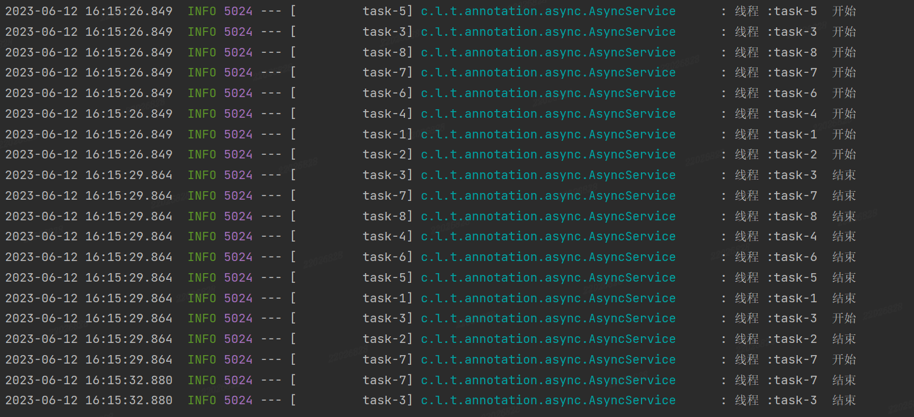
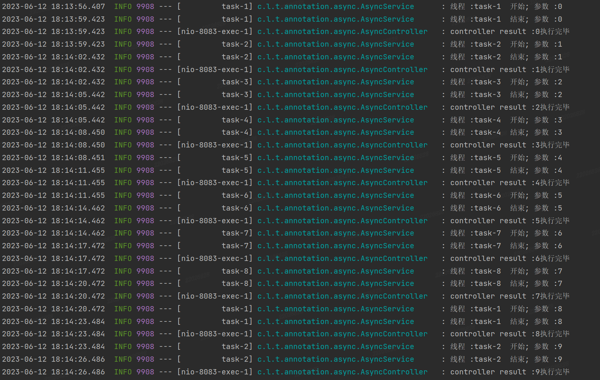
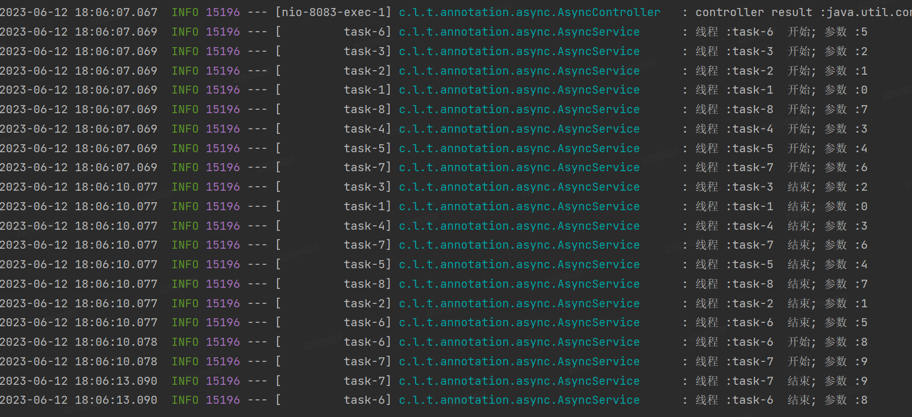
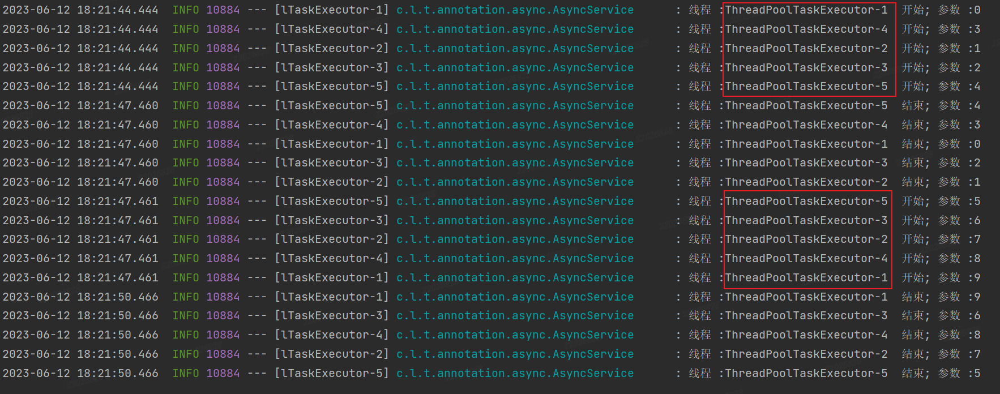

# @Async 的使用

[toc]

## 简介

@Async顾名思义，异步处理。将复杂或耗时长的业务可以进行梳理归纳分为多线程去执行，@Async在使用上会更简单一些。

@Async的默认线程池为**SimpleAsyncTaskExecutor**。

---

## 基础使用

该注解是spring3提供的，所以只需要引入`spring-context` 和 `spring-boot-starter-aop` 即可。

只需要在类上添加@EnableAsync注解，在方法上添加@Async注解即可，核心代码如下：

~~~java
package com.lzhch.thread.annotation.async;

import lombok.extern.slf4j.Slf4j;
import org.springframework.scheduling.annotation.Async;
import org.springframework.scheduling.annotation.EnableAsync;
import org.springframework.stereotype.Service;

import java.util.concurrent.CompletableFuture;
import java.util.concurrent.Future;

/**
 * <p>
 * author: lzhch
 * version: v1.0
 * date: 2023/6/12 15:33
 */

@Slf4j
@EnableAsync // 在调用异步方法的类上添加该注解, 不是在启动类上
@Service(value = "iAsyncService")
public class AsyncService {

    /**
     * 没有返回值的异步调用
     * <p>
     * Author: lzhch 2023/6/12 18:07
     */
    @Async
    public void asyncMethod() {
        try {
            String name = Thread.currentThread().getName();
            log.info("线程 :{}  开始", name);
            Thread.sleep(3000);
            log.info("线程 :{}  结束", name);
        } catch (InterruptedException e) {
            throw new RuntimeException(e);
        }
    }

    /**
     * 需要返回值的异步调用
     *
     * @param param param
     * @return CompletableFuture<String>
     * Author: lzhch 2023/6/12 17:03
     */
    @Async
    public CompletableFuture<String> asyncParamMethod(String param) {
        try {
            String name = Thread.currentThread().getName();
            log.info("线程 :{}  开始; 参数 :{}", name, param);
            Thread.sleep(3000);
            log.info("线程 :{}  结束; 参数 :{}", name, param);

            // 直接使用 CompletableFuture 来处理异步的结果, 比Future更加灵活
            return CompletableFuture.completedFuture(param + "执行完毕");
        } catch (InterruptedException e) {
            throw new RuntimeException(e);
        }
    }

}
~~~

测试类代码：

~~~java
package com.lzhch.thread.annotation.async;

import lombok.extern.slf4j.Slf4j;
import org.springframework.web.bind.annotation.GetMapping;
import org.springframework.web.bind.annotation.RequestMapping;
import org.springframework.web.bind.annotation.RestController;

import javax.annotation.Resource;
import java.util.concurrent.CompletableFuture;
import java.util.concurrent.ExecutionException;

/**
 * <p>
 * author: lzhch
 * version: v1.0
 * date: 2023/6/12 15:56
 */

@Slf4j
@RestController
@RequestMapping(value = "async")
public class AsyncController {

    @Resource
    private AsyncService asyncService;

    @GetMapping(value = "asyncMethod")
    public void asyncMethod() {
        for (int i = 0; i < 10; i++) {
            this.asyncService.asyncMethod();
        }
    }

    @GetMapping(value = "asyncParamMethod")
    public void asyncParamMethod() throws ExecutionException, InterruptedException {
        for (int i = 0; i < 10; i++) {
            CompletableFuture<String> result = this.asyncService.asyncParamMethod(String.valueOf(i));
            // get 方法会造成阻塞, 它会等待异步操作完成并返回结果, 相当于同步执行
            // log.info("controller result :{}", result.get());
            // thenApply()、thenAccept() 或 thenRun() 为异步方法
            log.info("controller result :{}", result.thenApplyAsync(item-> item));
        }
    }

}
~~~

因为@Async是基于AOP切面进行的，所以要注意**避免切面失效**。

该注解还会引起**循环依赖**，需要注意业务的分层和代码解耦，或者对某些类进行懒加载（@Lazy）。

没有返回值执行日志：



有返回值get阻塞请求执行日志:



有返回值异步非阻塞执行日志:



---

## 自定义线程池

spring提供的默认的线程池为**SimpleAsyncTaskExecutor**。

CompletableFuture默认的线程池为**ForkJoinPool.commonPool()**。

两者均不太满足正常项目的使用，所以使用自定义线程池**ThreadPoolTaskExecutor**。

只需要实现AsyncConfigurer接口并重写相关方法即可进行自定义配置。

~~~java
package com.lzhch.thread.annotation.async.config;

import org.springframework.context.annotation.Configuration;
import org.springframework.scheduling.annotation.AsyncConfigurer;
import org.springframework.scheduling.concurrent.ThreadPoolTaskExecutor;

import java.util.concurrent.Executor;

/**
 * 自定义线程池
 * <p>
 * author: lzhch
 * version: v1.0
 * date: 2023/6/12 18:18
 */

@Configuration
public class AsyncConfig implements AsyncConfigurer {

    @Override
    public Executor getAsyncExecutor() {
        // 自定义线程池配置
        ThreadPoolTaskExecutor executor = new ThreadPoolTaskExecutor();
        executor.setCorePoolSize(5);
        executor.setMaxPoolSize(10);
        executor.setQueueCapacity(25);
        executor.initialize();
        return executor;
    }

}
~~~

执行日志：



通过日志可以发现，线程池替换成功，并且设置核心线程为5也成功。

---

## 异常处理

`CompletableFuture` 提供了多种方法来处理异常情况。下面是一些常用的异常处理方法：

### 1. `exceptionally(Function<Throwable, ? extends T> fn)`：

- 当异步操作抛出异常时，使用指定的函数处理异常，并返回一个默认值或处理结果的 `CompletableFuture`。
- 该方法可以处理异步操作的异常情况，并提供一个替代值或处理结果。
- 例如：

```java
javaCopy codeCompletableFuture<Integer> future = CompletableFuture.supplyAsync(() -> {
    // 异步操作
    throw new RuntimeException("发生异常");
}).exceptionally(ex -> {
    System.out.println("捕获到异常: " + ex.getMessage());
    return 0; // 返回默认值
});
```

### 2. `handle(BiFunction<? super T, Throwable, ? extends U> fn)`：

- 当异步操作完成时，使用指定的函数处理结果和异常，并返回一个新的 `CompletableFuture`。
- 该方法可以同时处理异步操作的结果和异常情况，并返回一个新的 `CompletableFuture`。
- 例如：

```java
javaCopy codeCompletableFuture<Integer> future = CompletableFuture.supplyAsync(() -> {
    // 异步操作
    return 42;
}).handle((result, ex) -> {
    if (ex != null) {
        System.out.println("捕获到异常: " + ex.getMessage());
        return 0; // 返回默认值
    }
    return result;
});
```

### 3. `whenComplete(BiConsumer<? super T, ? super Throwable> action)`：

- 当异步操作完成时，使用指定的消费函数对结果和异常进行处理，没有返回值。
- 该方法可以在异步操作完成后执行一些处理操作，无论是否发生异常。
- 例如：

```java
javaCopy codeCompletableFuture<Integer> future = CompletableFuture.supplyAsync(() -> {
    // 异步操作
    return 42;
}).whenComplete((result, ex) -> {
    if (ex != null) {
        System.out.println("捕获到异常: " + ex.getMessage());
    } else {
        System.out.println("异步操作结果: " + result);
    }
});
```

### 4. `exceptionallyAsync(Function<Throwable, ? extends T> fn)`：

- 类似于 `exceptionally()`，但使用默认的 `ForkJoinPool` 执行异常处理函数。
- 该方法在异常处理时使用指定的函数，并返回一个默认值或处理结果的 `CompletableFuture`。
- 例如：

```java
javaCopy codeCompletableFuture<Integer> future = CompletableFuture.supplyAsync(() -> {
    // 异步操作
    throw new RuntimeException("发生异常");
}).exceptionallyAsync(ex -> {
    System.out.println("捕获到异常: " + ex.getMessage());
    return 0; // 返回默认值
});
```

---

## 几种线程池的区别

### 1. SimpleAsyncTaskExecutor

- `SimpleAsyncTaskExecutor` 是Spring框架提供的一个简单的线程池实现，@Async默认的线程池。
- 它是一个基于线程的执行器，每个任务都会在独立的线程中执行。
- 默认情况下，它为每个任务创建一个新的线程，适用于简单的并发任务，不适合高负载的并发场景。

优点：

- 简单易用，不需要进行复杂的配置和调优。
- 对于简单的并发任务，可以快速启动新线程执行任务。

缺点：

- 每个任务都会创建一个新线程，线程的创建和销毁开销较大，不适用于高负载的并发场景。
- 线程数量无法进行自动调整（默认为Integer的最大值），不支持线程池的高级功能。

### 2. **ForkJoinPool**

- `ForkJoinPool` 是Java提供的一个基于工作窃取算法的线程池实现。
- 它适用于处理递归的任务，并且任务可以通过分割成更小的子任务来利用并行处理能力。
- `ForkJoinPool` 在Java 7及以上版本中可用，并且通常用于处理CPU密集型的并行任务。
- CompletableFuture 默认使用该线程池。

优点：

- 适用于处理递归的任务，可以将任务分解为更小的子任务，并利用并行处理能力提高性能。
- 自动管理线程池的大小，根据任务的负载情况动态增加或减少线程数。

缺点：

- 仅适用于处理CPU密集型任务，对于IO密集型任务效果可能不佳。
- 在某些情况下，需要仔细设计任务的分割方式，以充分利用并行处理能力。

### 3. **ThreadPoolTaskExecutor**

- `ThreadPoolTaskExecutor` 是Spring框架提供的一个功能强大的线程池实现，基于Java的 `ThreadPoolExecutor`。
- 它支持配置线程池的核心线程数、最大线程数、线程存活时间、任务队列等参数，以及线程池的拒绝策略。
- `ThreadPoolTaskExecutor` 适用于各种并发场景，包括IO密集型和CPU密集型任务，可以控制线程池的大小和任务调度。

优点：

- 可以灵活配置线程池的核心线程数、最大线程数、任务队列等参数，适应不同的并发需求。
- 支持各种线程池的高级功能，如线程池的拒绝策略、线程池监控等。
- 适用于各种并发场景，包括IO密集型和CPU密集型任务。

缺点：

- 配置复杂，需要根据具体场景进行调优和配置。
- 在线程数量和任务队列大小设置不当时，可能导致资源浪费或任务堆积。

---

## 六、项目地址

> [Personal-Practice/Multi-Thread at master · lzhcccccch/Personal-Practice (github.com)](https://github.com/lzhcccccch/Personal-Practice/tree/master/Multi-Thread)
