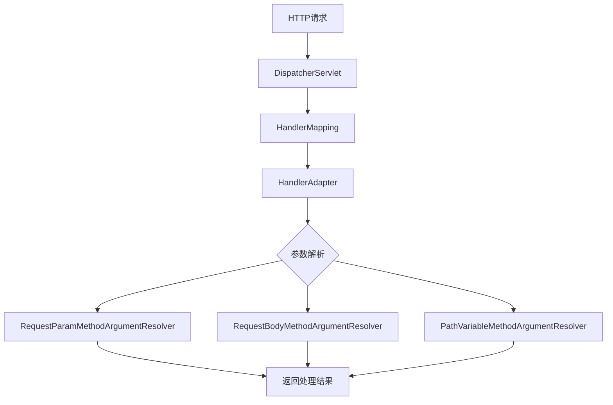
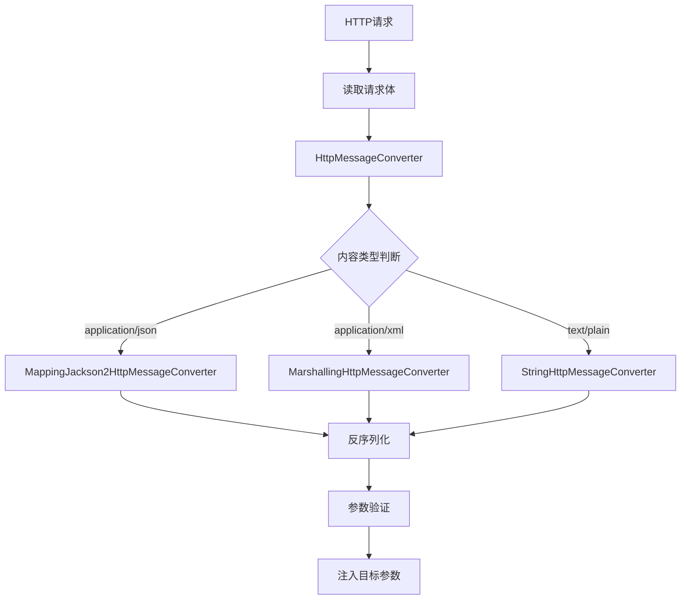
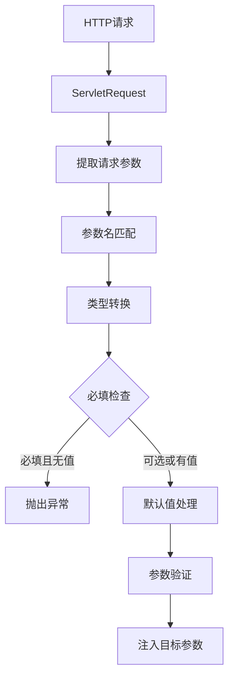
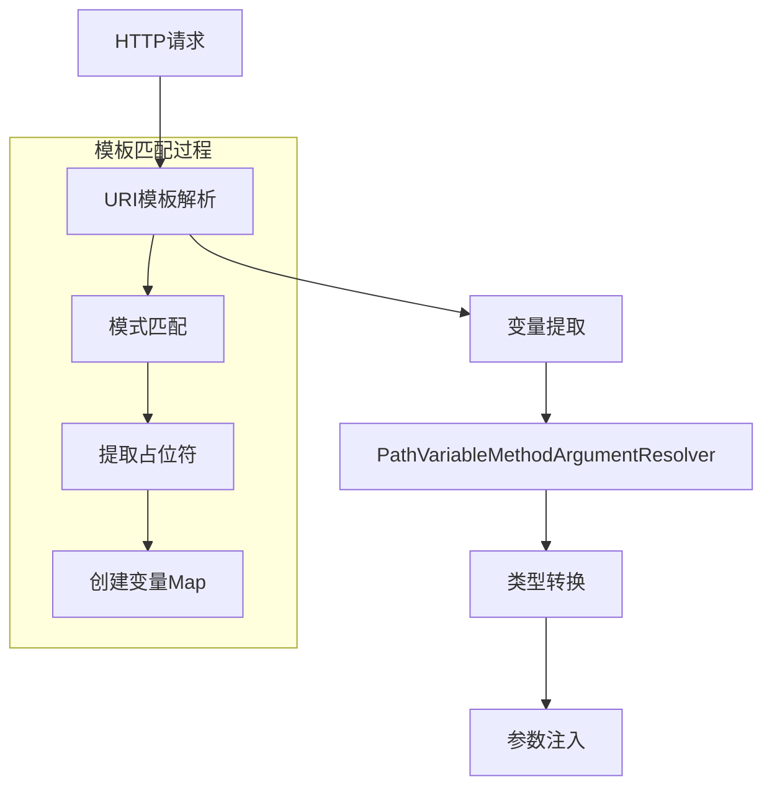
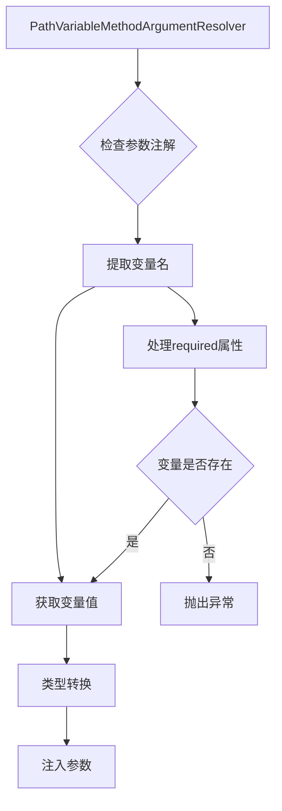
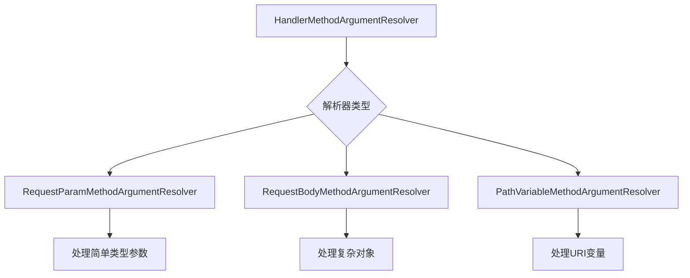

# Spring 请求参数注解

[toc]

## 简介

Spring MVC 框架提供了多种处理 HTTP 请求参数的注解机制。本报告深入分析 `@RequestBody`、`@RequestParam` 和 `@PathVariable` 等核心注解的使用方法、应用场景、工作原理和最佳实践，帮助开发者更好地理解和使用这些注解。

---

## Spring MVC 参数注解分类
Spring MVC 中的请求参数注解可以根据其处理的请求内容分为四类：

1. URI 部分处理注解
   - `@PathVariable`：处理 URI 模板变量
2. 请求头部处理注解
   - `@RequestHeader`：处理请求头信息
   - `@CookieValue`：处理 Cookie 值
3. 请求体处理注解
   - `@RequestBody`：处理请求体数据
   - `@RequestParam`：处理查询参数和表单数据
4. 属性处理注解
   - `@SessionAttributes`：处理会话属性
   - `@ModelAttribute`：处理模型属性

---

## 注解工作原理



---

## @RequestBody 详细解析

### 工作原理



详细说明：
- 请求进入时，首先通过 `HttpMessageConverter` 接口的实现类进行处理
- 根据 Content-Type 选择合适的转换器
- 使用选定的转换器将请求体转换为 Java 对象
- 最终将转换后的对象注入到控制器方法的参数中

### 高级特性

1. 多种内容类型支持：

```java
@RestController
public class ContentTypeController {
    // JSON 处理
    @PostMapping(value = "/json", consumes = MediaType.APPLICATION_JSON_VALUE)
    public User handleJson(@RequestBody User user) {
        return user;
    }

    // XML 处理
    @PostMapping(value = "/xml", consumes = MediaType.APPLICATION_XML_VALUE)
    public User handleXml(@RequestBody User user) {
        return user;
    }

    // 自定义内容类型
    @PostMapping(value = "/custom", consumes = "application/x-custom")
    public String handleCustom(@RequestBody String content) {
        return content;
    }
}
```

2. 嵌套对象处理：

```java
public class Order {
    private Long id;
    private List<OrderItem> items;
    private Customer customer;
    
    @JsonFormat(pattern = "yyyy-MM-dd HH:mm:ss")
    private LocalDateTime orderTime;
    
    // getter/setter
}

@PostMapping("/orders")
public ResponseEntity<Order> createOrder(
    @RequestBody @Valid Order order) {
    // 自动处理嵌套对象的反序列化
}
```

### 异常处理

1. 常见异常处理：

```java
@ControllerAdvice
public class RequestBodyExceptionHandler {
    
    @ExceptionHandler(HttpMessageNotReadableException.class)
    public ResponseEntity<String> handleNotReadable(HttpMessageNotReadableException ex) {
        return ResponseEntity.badRequest()
            .body("Invalid request body: " + ex.getMessage());
    }
    
    @ExceptionHandler(MethodArgumentNotValidException.class)
    public ResponseEntity<Map<String, String>> handleValidationExceptions(
        MethodArgumentNotValidException ex) {
        Map<String, String> errors = new HashMap<>();
        ex.getBindingResult().getAllErrors().forEach(error -> {
            String fieldName = ((FieldError) error).getField();
            String errorMessage = error.getDefaultMessage();
            errors.put(fieldName, errorMessage);
        });
        return ResponseEntity.badRequest().body(errors);
    }
}
```

2. 自定义反序列化：

```java
public class CustomDeserializer extends JsonDeserializer<MyObject> {
    @Override
    public MyObject deserialize(JsonParser p, DeserializationContext ctxt) 
        throws IOException {
        // 自定义反序列化逻辑
    }
}

@JsonDeserialize(using = CustomDeserializer.class)
public class MyObject {
    // 类定义
}
```

---

## @RequestParam 详细解析

### 工作原理



处理步骤：
1. 从 ServletRequest 中获取参数
2. 通过 `ConversionService` 进行类型转换
3. 执行参数验证（如果配置了验证规则）
4. 将转换后的值注入到目标参数

### 参数处理特性

1. 基础用法：

```java
@GetMapping("/search")
public List<Product> searchProducts(
    @RequestParam(required = false) String name,
    @RequestParam(defaultValue = "1") int page,
    @RequestParam(value = "size", defaultValue = "10") int pageSize,
    @RequestParam(name = "sort", required = false) String sortField
) {
    // 处理逻辑
}
```

2. 集合参数处理：

```java
@GetMapping("/filter")
public List<Product> filterProducts(
    @RequestParam List<String> categories,
    @RequestParam(required = false) Set<String> tags,
    @RequestParam Map<String, String> dynamicParams
) {
    // 处理多值参数
}
```

### 高级特性

1. 类型转换支持：

```java
public class ProductController {
    @GetMapping("/products")
    public List<Product> getProducts(
        @RequestParam @DateTimeFormat(pattern = "yyyy-MM-dd") 
        LocalDate startDate,
        
        @RequestParam(required = false) 
        @NumberFormat(style = NumberFormat.Style.CURRENCY) 
        BigDecimal minPrice,
        
        @RequestParam ProductStatus status // 枚举类型自动转换
    ) {
        // 处理逻辑
    }
}
```

2. 自定义转换器：

```java
@Configuration
public class WebConfig implements WebMvcConfigurer {
    @Override
    public void addFormatters(FormatterRegistry registry) {
        registry.addConverter(new StringToEnumConverter());
        registry.addConverter(new StringToLocalDateConverter());
    }
}
```

### 参数验证

1. 基础验证：

```java
@GetMapping("/users")
public List<User> searchUsers(
    @RequestParam @Size(min = 2, max = 50) String name,
    @RequestParam @Min(1) @Max(100) int age,
    @RequestParam @Email String email
) {
    // 带验证的参数处理
}
```

2. 自定义验证：

```java
@Target({ElementType.PARAMETER})
@Retention(RetentionPolicy.RUNTIME)
@Constraint(validatedBy = ValidPageSizeValidator.class)
public @interface ValidPageSize {
    String message() default "Invalid page size";
    Class<?>[] groups() default {};
    Class<? extends Payload>[] payload() default {};
}

@GetMapping("/paged")
public Page<Product> getPagedProducts(
    @RequestParam @ValidPageSize int pageSize
) {
    // 使用自定义验证注解
}
```

###  最佳实践

1. 参数命名规范：

```java
@GetMapping("/api/v1/products")
public List<Product> getProducts(
    @RequestParam(value = "q", required = false) String query,        // 搜索查询
    @RequestParam(value = "cat", required = false) String category,   // 类别
    @RequestParam(value = "sort", defaultValue = "name") String sortBy, // 排序字段
    @RequestParam(value = "order", defaultValue = "asc") String sortOrder // 排序方向
) {
    // 使用简短但明确的参数名
}
```

2. 安全处理：

```java
@GetMapping("/secure/data")
public Data getSecureData(
    @RequestParam @Pattern(regexp = "^[a-zA-Z0-9]+$") String id,
    @RequestParam @Size(max = 100) String query
) {
    // 参数安全性验证
}
```

---

## @PathVariable 深入解析

### 工作原理



### URI模板处理机制

1. 基础语法：

```java
@RequestMapping("/users/{userId}/orders/{orderId}")
public String getOrder(@PathVariable("userId") Long userId, 
                      @PathVariable("orderId") String orderId) {
    // 处理逻辑
}
```

2. 高级用法：

```java
// 正则表达式约束
@GetMapping("/users/{userId:[0-9]+}")
public User getUser(@PathVariable Long userId) {
    // 只接受数字类型的userId
}

// 矩阵变量支持
@GetMapping("/users/{userId}/orders{params}")
public List<Order> getOrders(@PathVariable String userId,
                            @MatrixVariable Map<String, String> params) {
    // params可以处理如：/users/123/orders;date=2024;status=active
}
```

### 内部处理流程

1. URI模板解析：
   - 使用 AntPathMatcher 进行路径匹配
   - 提取路径变量值
   - 创建变量名和值的映射关系
2. 参数处理：



### 高级特性

1. 多种绑定方式：

```java
// 方式1：变量名显式声明
@GetMapping("/users/{id}")
public User getUser(@PathVariable("id") Long userId) {}

// 方式2：变量名推断
@GetMapping("/users/{userId}")
public User getUser(@PathVariable Long userId) {}

// 方式3：Map收集
@GetMapping("/users/{userId}/roles/{roleId}")
public String getUserRole(@PathVariable Map<String, String> pathVars) {
    // pathVars.get("userId"), pathVars.get("roleId")
}
```

2. 类型转换支持：

```java
// 枚举类型转换
public enum UserType { ADMIN, USER }

@GetMapping("/users/type/{userType}")
public List<User> getUsersByType(@PathVariable UserType userType) {
    // 自动将字符串转换为枚举值
}

// 日期类型转换
@GetMapping("/records/{date}")
public List<Record> getRecordsByDate(
    @PathVariable @DateTimeFormat(pattern = "yyyy-MM-dd") LocalDate date) {
    // 自动将"2024-03-20"转换为LocalDate
}
```

### 异常处理

1. 常见异常类型：

```java
@ControllerAdvice
public class PathVariableExceptionHandler {
    
    @ExceptionHandler(MissingPathVariableException.class)
    public ResponseEntity<String> handleMissingPathVariable(MissingPathVariableException ex) {
        return ResponseEntity.badRequest()
            .body("Missing path variable: " + ex.getVariableName());
    }
    
    @ExceptionHandler(TypeMismatchException.class)
    public ResponseEntity<String> handleTypeMismatch(TypeMismatchException ex) {
        return ResponseEntity.badRequest()
            .body("Invalid parameter type: " + ex.getMessage());
    }
}
```

2. 验证处理：

```java
@GetMapping("/users/{userId}")
public User getUser(@PathVariable @Min(1) @Max(999999) Long userId) {
    // 使用Bean Validation注解进行路径变量验证
}
```

### 最佳实践

1. 安全考虑：

```java
// 添加长度限制和格式验证
@GetMapping("/documents/{documentId}")
public Document getDocument(
    @PathVariable @Pattern(regexp = "^[a-zA-Z0-9]{1,32}$") String documentId) {
    // 确保documentId只包含字母和数字，且长度不超过32
}
```

2. RESTful API设计：

```java
@RestController
@RequestMapping("/api/v1")
public class UserController {
    
    // 资源层级关系清晰
    @GetMapping("/users/{userId}/departments/{deptId}/roles")
    public List<Role> getUserDepartmentRoles(
        @PathVariable Long userId,
        @PathVariable Long deptId) {
        // 处理逻辑
    }
    
    // 使用子资源表示关系
    @GetMapping("/teams/{teamId}/members")
    public List<User> getTeamMembers(@PathVariable Long teamId) {
        // 处理逻辑
    }
}
```

3. 性能优化建议：

- 合理设计URI模板，避免过深的嵌套
- 使用缓存机制优化频繁访问的路径
- 考虑URI模板的编译缓存

---

## 参数绑定内部实现

### 参数解析器工作流程


### 无注解参数的处理规则
1. 简单类型：
   - 默认使用 @RequestParam 规则处理
   - 支持基本类型、包装类型和 String

2. 复杂类型：
   - 默认使用 @ModelAttribute 规则处理
   - 支持自定义对象和集合类型

---

## 使用建议

### 注解使用建议
1. 请求体处理：
   - 大数据量使用 @RequestBody
   - 注意设置合适的最大请求体大小

2. 参数验证：
   - 合理使用 @Valid 注解
   - 实现自定义验证逻辑

### 性能优化建议
1. 缓存优化：
   - 使用 HttpMessageConverter 缓存
   - 复用反序列化器实例

2. 内存优化：
   - 合理设置最大请求大小
   - 使用流式处理大数据量

---

## 结论
1. Spring MVC 的参数绑定注解提供了灵活且强大的请求处理机制
2. 了解注解的工作原理有助于更好地使用和优化应用
3. 选择合适的注解和配置对于应用性能至关重要
4. 合理的使用和优化可以显著提升应用的性能和可维护性