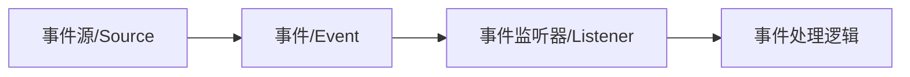
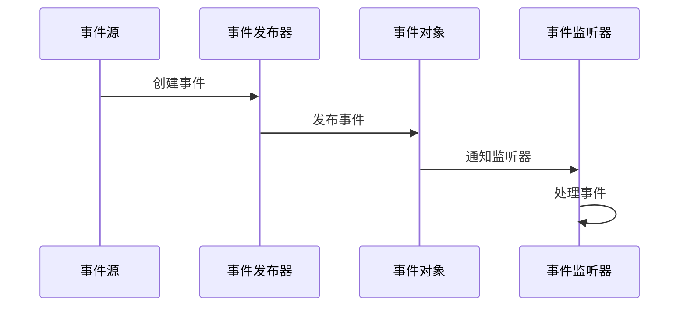

# Spring 事件推送机制使用

[toc]

## 简介

Spring事件机制是框架提供的一种观察者模式实现，用于在不同组件间进行松耦合的消息传递。本文详细介绍Spring事件推送机制的原理、实现方式及最佳实践。

---

## 事件机制概述

### 基本介绍
- Spring事件推送基于`ApplicationContext.publishEvent`方法实现
- 默认采用同步处理方式
- 支持通过`@Async`注解实现异步处理
- 适用场景：
  - 系统内部模块解耦
  - 业务流程解耦
  - 日志记录、监控等横切关注点

###  核心组件


---

## 实现原理

### 观察者模式
Spring事件机制基于观察者模式实现，包含以下核心要素：
- 事件源（Srouce）：被观察的对象
- 事件（Event）：封装变更信息
- 监听器（Listener）：处理事件的观察者

### 事件处理流程


---

## 实现方式

### 定义事件源

事件源就是要监听的对象，比如要记录系统登录信息，那就定义一个对象以及表来存储信息，定义的对象就是事件源。

本文以 Map 为例。

### 事件定义

事件中需要在构造方法中调用父类的构造方法，将事件源传入。

也可以在构造方法中添加其他参数或者在事件源中添加其他方法，在监听类中可以调用相应方法，结合具体业务进行拓展。

```java
public class SelfEvent extends ApplicationEvent {
    public SelfEvent(Object source) {
        super(source);
    }
    // 可添加自定义属性和方法
}
```

### 监听器实现
监听对象有两种形式：一种是类定义，就是针对一个事件用一个监听类；另一种是基于注解实现，该方式可以针对一类业务，即一个监听类中可以监听多个事件。

1. 类定义方式（单一事件监听）：
```java
@Component
public class SelfEventListener implements ApplicationListener<SelfEvent> {

  	/**
     *  类定义方式 只能针对于一个事件进行处理
     */
  
    @Override
    @Async
    public void onApplicationEvent(SelfEvent selfEvent) {
        HashMap<String, Object> source = (HashMap<String, Object>) selfEvent.getSource();

        System.out.println("类形式监听: {} " + source.toString());
    }

}
```

2. 注解方式（支持多事件监听）：
```java
@Component
public class AnnotationEventListener {

    /**
     * 基于注解实现的监听 可以在一个监听类中实现对多个事件的监听 适合某一类业务
     * 比如: 记录日志信息, 有多种日志格式, 多个事件, 但是是同一类业务
     */
    
    @Async
    @EventListener(SelfEvent.class)
    // 事务监听, 使用该监听方式要注意失效问题(发送事件的动作必须在事务中，否则监听会失效)
    // @TransactionalEventListener(value = MdmMaterialInfoEvent.class, phase = TransactionPhase.AFTER_COMMIT)
    public void typeOne(SelfEvent event) {
        HashMap<String, Object> source = (HashMap<String, Object>) event.getSource();

        System.out.println("基于注解的监听 :{} " + source.toString());
    }

    // 可以根据 typeOne 进行对其他事件进行监听 建议根据业务分类:比如不同的日志可以用同一个监听类
    public void typeTwo() {
        return;
    }

}
```

### 事件发布

定义统一发送事件类，相当于工厂，可以在里面进行一些拓展。

```java
@Component
public class SelfEventPublisher {

    @Resource
    private ApplicationContext applicationContext;

    // 直接以 ApplicationContext 为入参 统一发布路径
    public void publish(ApplicationEvent applicationEvent) {
        applicationContext.publishEvent(applicationEvent);
    }

}
```

### 测试

~~~java
@RestController
@RequestMapping("/publishEvent")
public class PublishEventController {

    @Resource
    private SelfEventPublisher eventPublisher;

    @PostMapping("/classListener")
    public void classListener(@RequestParam Map<String, Object> params) {
        this.eventPublisher.publish(new SelfEvent(params));
    }

    @PostMapping("/annotationListener")
    public void annotationListener(Map<String, Object> params) {
        this.eventPublisher.publish(new SelfEvent(params));
    }

}
~~~

---

## 最佳实践

### 异步处理配置
```java
@Configuration
@EnableAsync
public class AsyncConfig implements AsyncConfigurer {
    @Override
    public Executor getAsyncExecutor() {
        ThreadPoolTaskExecutor executor = new ThreadPoolTaskExecutor();
        executor.setCorePoolSize(5);
        executor.setMaxPoolSize(10);
        executor.setQueueCapacity(25);
        executor.initialize();
        return executor;
    }
}
```

### 使用建议
1. 事件粒度控制
   - 避免过于频繁的事件发布
   - 合理划分事件类型

2. 异常处理
   - 监听器中做好异常捕获
   - 考虑添加重试机制

3. 性能考虑
   - 大量事件考虑使用异步处理
   - 考虑使用事件批处理

4. 替代方案
   - 大规模分布式系统考虑使用消息队列
   - 定时任务考虑使用调度框架

---

## 结论

Spring事件机制提供了一种优雅的方式来实现系统组件间的解耦。通过合理使用事件机制，可以：
- 降低系统组件间的耦合度
- 提高代码的可维护性
- 实现业务逻辑的异步处理
- 便于系统的横向扩展

在实际应用中，需要根据具体场景选择合适的实现方式，并注意性能和异常处理等关键点。