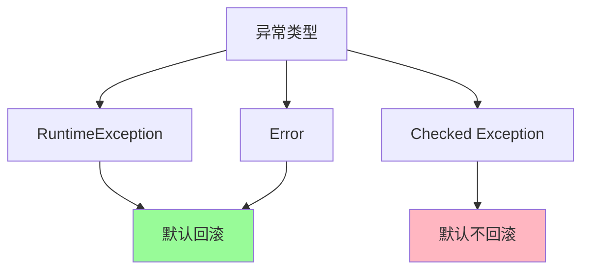
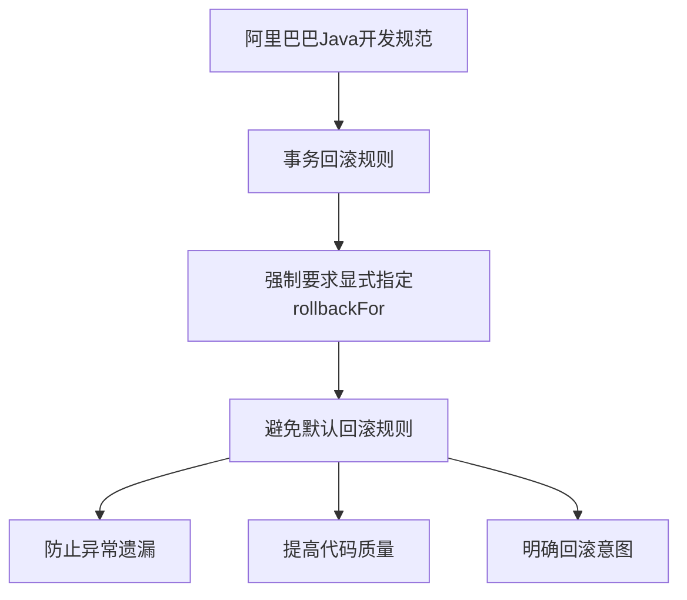

# Spring事务管理详解

[toc]

## 简介

在企业应用开发中，事务管理是确保数据一致性和可靠性的核心机制。Spring框架提供的声明式事务管理大大简化了开发复杂度，但要正确使用它，需要深入理解其工作原理和各种配置选项。本文将全面介绍Spring事务管理的方方面面，从基础概念到高级特性，从常见陷阱到最佳实践。

---

## 第1部分：事务基础与演进

### 1.1 传统JDBC事务控制
在Spring框架出现之前，开发人员需要手动管理事务，代码冗长且易出错：

```java
public void traditionalTransactionManagement(DataSource dataSource) {
  Connection conn = null;
  try {
      // 1. 获取连接
      conn = dataSource.getConnection();
      // 2. 关闭自动提交
      conn.setAutoCommit(false);
      // 3. 设置事务隔离级别
      conn.setTransactionIsolation(TransactionIsolation.READ_COMMITTED.getLevel());
      
      // 4. 执行SQL
      PreparedStatement ps = conn.prepareStatement("insert into users (id, name) values (?, ?)");
      ps.setString(1, "1");
      ps.setString(2, "test");
      ps.executeUpdate();
      
      // 5. 提交事务
      conn.commit();
  } catch (Exception e) {
      // 6. 回滚事务
      if (conn != null) {
          try {
              conn.rollback();
          } catch (SQLException ex) {
              logger.error("回滚失败", ex);
          }
      }
  } finally {
      // 7. 释放资源
      if (conn != null) {
          try {
              conn.close();
          } catch (SQLException e) {
              logger.error("关闭连接失败", e);
          }
      }
  }
}
```

这种方式存在以下问题：
- 代码结构复杂，业务逻辑被事务代码掩埋
- 异常处理繁琐
- 资源管理容易出错
- 难以统一管理事务策略
- 代码可维护性差

### 1.2 Spring声明式事务
Spring通过AOP实现声明式事务管理，将事务管理代码与业务代码完全分离：

```java
@Service
public class UserService {
  @Autowired
  private UserDao userDao;
  
  @Transactional
  public void createUser(User user) {
      userDao.insert(user);
  }
}
```

### 1.3 Spring 事务执行流程

~~~mermaid
graph TB
  A[方法调用] --> B{是否有@Transactional注解?}
  B -->|是| C[创建事务代理]
  B -->|否| D[直接执行方法]
  C --> E[获取数据库连接]
  E --> F[关闭自动提交]
  F --> G[执行业务方法]
  G --> H{是否发生异常?}
  H -->|是| I[检查异常类型]
  H -->|否| J[提交事务]
  I --> K{是否需要回滚?}
  K -->|是| L[回滚事务]
  K -->|否| J
  J --> M[释放资源]
  L --> M
  D --> N[结束]
  M --> N
~~~

这个流程图展示了Spring事务的完整执行过程：

1. 首先检查方法是否有@Transactional注解
2. 如果有注解，创建事务代理
3. 获取数据库连接并关闭自动提交
4. 执行业务方法
5. 根据执行结果决定提交或回滚
6. 最后释放资源

### 1.4 事务代理创建流程

```mermaid
graph LR
  A[Spring容器启动] --> B[扫描@Transactional注解]
  B --> C[创建代理对象]
  C --> D[注册事务拦截器]
  D --> E[生成代理类]
  E --> F[注入IoC容器]
```

---

## 第2部分：@Transactional注解详解

### 2.1 核心属性

```java
@Transactional(
  propagation = Propagation.REQUIRED,           // 传播行为
  isolation = Isolation.READ_COMMITTED,         // 隔离级别
  timeout = 30,                                // 超时时间（秒）
  readOnly = false,                            // 是否只读
  rollbackFor = Exception.class,               // 触发回滚的异常类
  noRollbackFor = IOException.class,           // 不触发回滚的异常类
  value = "transactionManager"                 // 事务管理器
)
```

### 2.2 事务传播行为概述

事务传播行为定义了当一个事务方法被另一个事务方法调用时，当前方法的事务如何传播。

~~~mermaid
graph TB
  A[事务传播行为] --> B[REQUIRED]
  A --> C[REQUIRES_NEW]
  A --> D[SUPPORTS]
  A --> E[MANDATORY]
  A --> F[NOT_SUPPORTED]
  A --> G[NEVER]
  A --> H[NESTED]
  
  B --> B1[默认行为]
  B --> B2[有事务加入<br>无事务新建]
  
  C --> C1[总是新建事务]
  C --> C2[挂起当前事务]
  
  D --> D1[有事务加入<br>无事务非事务执行]
  
  E --> E1[必须在事务中]
  E --> E2[无事务抛异常]
  
  F --> F1[以非事务方式执行]
  F --> F2[挂起已有事务]
  
  G --> G1[禁止在事务中]
  G --> G2[有事务抛异常]
  
  H --> H1[嵌套事务]
  H --> H2[可独立回滚]
~~~

### 2.3 事务传播行为详解

| 传播行为 | 值 | 描述 | 示例场景 | 注意事项 |
|---------|-----|------|----------|----------|
| REQUIRED | 0 | 当前有事务则加入，否则新建 | 常规业务操作 | 最常用的传播行为 |
| REQUIRES_NEW | 3 | 总是新建事务，挂起当前事务 | 独立日志记录 | 注意事务嵌套开销 |
| SUPPORTS | 1 | 有事务则加入，无则非事务执行 | 查询操作 | 不确保事务性 |
| MANDATORY | 2 | 必须在事务中执行 | 重要业务操作 | 无事务则抛异常 |
| NOT_SUPPORTED | 4 | 以非事务方式执行 | 耗时查询 | 挂起现有事务 |
| NEVER | 5 | 禁止在事务中执行 | 特殊业务限制 | 有事务则抛异常 |
| NESTED | 6 | 嵌套事务 | 可选操作 | 依赖保存点机制（数据库） |

#### REQUIRED（默认行为）

- **定义**：如果当前存在事务，则加入该事务；如果当前没有事务，则创建一个新的事务。
- **特点**：共用一个事务，一起提交或回滚。
- **使用场景**：适用于大多数情况，特别是在同一个业务流程中的操作。

```java
@Service
public class OrderService {
  @Autowired
  private PaymentService paymentService;
  
  @Transactional(propagation = Propagation.REQUIRED)
  public void createOrder(Order order) {
      // 保存订单
      orderDao.save(order);
      // 调用支付服务，共享同一个事务
      paymentService.processPayment(order.getPaymentInfo());
      // 如果任何一步失败，整个事务都会回滚
  }
}

@Service
public class PaymentService {
  @Transactional(propagation = Propagation.REQUIRED)
  public void processPayment(PaymentInfo paymentInfo) {
      // 处理支付
      paymentDao.processPayment(paymentInfo);
  }
}
```

#### REQUIRES_NEW

- **定义**：总是创建一个新的事务，如果当前存在事务，则将当前事务挂起。
- **特点**：独立的事务，可以独立提交或回滚。
- **使用场景**：适用于不依赖于外部事务的操作，如日志记录、审计等。

```java
@Service
public class OrderService {
  @Autowired
  private AuditService auditService;
  
  @Transactional
  public void processOrder(Order order) {
      try {
          orderDao.save(order);
          // 即使订单处理失败，审计日志也会保存
          auditService.logOperation("创建订单", order);
          throw new RuntimeException("订单处理失败");
      } catch (Exception e) {
          // 订单事务回滚，但审计日志已经保存
      }
  }
}

@Service
public class AuditService {
  @Transactional(propagation = Propagation.REQUIRES_NEW)
  public void logOperation(String operation, Object data) {
      auditDao.save(new AuditLog(operation, data));
  }
}
```

#### 嵌套事务示例

```java
@Service
public class ComplexBusinessService {
  @Autowired
  private OrderService orderService;
  @Autowired
  private PaymentService paymentService;
  @Autowired
  private NotificationService notificationService;
  
  @Transactional
  public void processBusiness() {
      // 主事务开始
      BusinessContext context = new BusinessContext();
      
      try {
          // REQUIRED：使用同一个事务
          orderService.createOrder(context);
          
          try {
              // REQUIRES_NEW：新建独立事务
              paymentService.processPayment(context);
          } catch (PaymentException e) {
              // 支付失败，但不影响主事务
              handlePaymentError(e);
          }
          
          // NESTED：创建保存点
          try {
              notificationService.sendNotifications(context);
          } catch (NotificationException e) {
              // 通知失败，可以单独回滚到保存点
              handleNotificationError(e);
          }
          
      } catch (Exception e) {
          // 主事务回滚
          throw new BusinessException("业务处理失败", e);
      }
  }
}
```

#### 多重事务传播示例

```java
@Service
public class TransactionPropagationDemo {
  
  // 场景1：订单处理 + 支付 + 积分 + 通知
  @Transactional
  public void complexOrderProcess(Order order) {
      // 1. 保存订单（REQUIRED - 同一事务）
      orderService.saveOrder(order);
      
      try {
          // 2. 处理支付（REQUIRES_NEW - 独立事务）
          paymentService.processPayment(order.getPayment());
      } catch (PaymentException e) {
          // 支付失败单独处理，不影响主订单流程
          handlePaymentError(order, e);
      }
      
      // 3. 更新积分（NESTED - 可以部分回滚）
      try {
          pointsService.updatePoints(order.getCustomerId(), order.getPoints());
      } catch (PointsException e) {
          // 积分更新失败，回滚到保存点
          handlePointsError(order, e);
      }
      
      // 4. 发送通知（NOT_SUPPORTED - 非事务）
      notificationService.sendOrderNotification(order);
  }
}

@Service
public class OrderService {
  @Transactional(propagation = Propagation.REQUIRED)
  public void saveOrder(Order order) {
      orderDao.save(order);
      orderItemDao.saveAll(order.getItems());
  }
}

@Service
public class PaymentService {
  @Transactional(propagation = Propagation.REQUIRES_NEW)
  public void processPayment(Payment payment) {
      paymentDao.save(payment);
      externalPaymentGateway.process(payment);
  }
}

@Service
public class PointsService {
  @Transactional(propagation = Propagation.NESTED)
  public void updatePoints(Long customerId, int points) {
      Customer customer = customerDao.findById(customerId);
      customer.addPoints(points);
      customerDao.update(customer);
  }
}

@Service
public class NotificationService {
  @Transactional(propagation = Propagation.NOT_SUPPORTED)
  public void sendOrderNotification(Order order) {
      // 非事务执行，避免长时间占用数据库连接
      notificationSystem.send(createNotification(order));
  }
}
```

### 2.4 事务传播行为决策流程

~~~mermaid
flowchart TD
  A[开始] --> B{是否需要事务?}
  B -->|是| C{当前是否有事务?}
  B -->|否| D{是否允许非事务执行?}
  
  C -->|有| E{是否需要独立事务?}
  C -->|无| F{是否必须有事务?}
  
  E -->|是| G[REQUIRES_NEW]
  E -->|否| H{是否需要嵌套?}
  
  H -->|是| I[NESTED]
  H -->|否| J[REQUIRED]
  
  F -->|是| K[MANDATORY]
  F -->|否| L[REQUIRED]
  
  D -->|是| M[NOT_SUPPORTED/SUPPORTS]
  D -->|否| N[NEVER]
~~~

### 2.5 使用建议

#### 性能考虑

```java
// 不推荐：事务粒度过大
@Transactional
public void largeTransaction() {
  for (Item item : items) {
      processItem(item);  // 每个item都在同一个大事务中
  }
}

// 推荐：适当的事务粒度
public void batchProcess() {
  for (Item item : items) {
      processItemWithTransaction(item);  // 每个item一个独立事务
  }
}

@Transactional(propagation = Propagation.REQUIRES_NEW)
public void processItemWithTransaction(Item item) {
  // 处理单个item的逻辑
}
```

#### 事务嵌套过深

```java
// 不推荐
@Transactional
public void method1() {
  method2();  // REQUIRED
  method3();  // REQUIRES_NEW
  method4();  // NESTED
}

// 推荐
public void method1() {
  transactionTemplate.execute(status -> {
      method2();
      method3();
      method4();
      return null;
  });
}
```

#### 事务传播混乱

```java
// 问题代码
@Transactional(propagation = Propagation.REQUIRES_NEW)
public void problematicMethod() {
  // 这里的REQUIRED会创建新事务，可能不是预期行为
  otherService.doSomething();  // REQUIRED
}

// 解决方案
@Transactional(propagation = Propagation.REQUIRED)
public void betterMethod() {
  // 明确指定需要新事务的部分
  transactionTemplate.execute(new TransactionCallbackWithoutResult() {
      protected void doInTransactionWithoutResult(TransactionStatus status) {
          otherService.doSomething();
      }
  });
}
```

---

## 第3部分：事务失效场景及解决方案

### 3.1 方法可见性问题

```java
@Service
public class UserService {
  @Transactional
  private void createUser() {  // 事务无效
      // ...
  }
  
  @Transactional
  protected void updateUser() { // 事务无效
      // ...
  }
  
  @Transactional
  public void deleteUser() {    // 事务有效
      // ...
  }
}
```

### 3.2 自调用问题

```java
@Service
public class UserService {
  @Transactional(propagation = Propagation.REQUIRED)
  public void methodA() {
      this.methodB(); // methodB的事务会失效
      // ...
  }
  
  @Transactional(propagation = Propagation.REQUIRES_NEW)
  public void methodB() {
      // ...
  }
}
```

#### 解决方案1：使用AopContext

```java
@Service
public class UserService {
  @Transactional(propagation = Propagation.REQUIRED)
  public void methodA() {
      ((UserService) AopContext.currentProxy()).methodB(); // 使用代理对象调用
      // ...
  }
}
```

#### 解决方案2：注入自身

```java
@Service
public class UserService {
  @Autowired
  private UserService self;
  
  @Transactional(propagation = Propagation.REQUIRED)
  public void methodA() {
      self.methodB(); // 使用注入的代理对象调用
      // ...
  }
}
```

### 3.3 异常处理问题

```java
@Service
public class UserService {
  @Transactional
  public void createUser() {
      try {
          userDao.insert(user);
          throw new SQLException("数据库错误");
      } catch (SQLException e) {
          log.error("创建用户失败", e);
          // 错误：吞掉异常导致事务不回滚
      }
  }
}
```

正确处理方式：
```java
@Service
public class UserService {
  @Transactional(rollbackFor = Exception.class)
  public void createUser() {
      try {
          userDao.insert(user);
          throw new SQLException("数据库错误");
      } catch (SQLException e) {
          log.error("创建用户失败", e);
          throw new RuntimeException("创建用户失败", e); // 抛出运行时异常触发回滚
      }
  }
}
```

---

## 第4部分：事务优化与最佳实践

### 4.1 事务边界优化

```java
public class OrderService {
  // 错误示例：事务边界过大
  @Transactional
  public void processOrder(Order order) {
      validateOrder(order);         // 不需要事务
      enrichOrderData(order);       // 不需要事务
      computePrice(order);         // 不需要事务
      saveOrder(order);            // 需要事务
      notifyCustomer(order);       // 不需要事务
  }
  
  // 正确示例：精确控制事务边界
  public void processOrder(Order order) {
      validateOrder(order);
      enrichOrderData(order);
      computePrice(order);
      saveOrderWithTransaction(order);
      notifyCustomer(order);
  }
  
  @Transactional
  protected void saveOrderWithTransaction(Order order) {
      saveOrder(order);
  }
}
```

### 4.2 只读事务优化

```java
@Service
public class ProductService {
  @Transactional(readOnly = true)
  public List<Product> queryProducts(ProductCriteria criteria) {
      return productDao.query(criteria);
  }
  
  @Transactional(readOnly = true)
  public Product getProduct(Long id) {
      return productDao.getById(id);
  }
}
```

### 4.3 事务超时控制

```java
@Service
public class ReportService {
  @Transactional(timeout = 30) // 30秒超时
  public Report generateReport(ReportCriteria criteria) {
      // 复杂报表生成逻辑
      return report;
  }
}
```

---

## 第5部分：事务监控与排查

### 5.1 事务监控指标
- 事务执行时间
- 事务成功率
- 事务回滚率
- 并发事务数

### 5.2 常见问题排查清单
1. 检查方法可见性
2. 确认异常处理方式
3. 验证事务传播配置
4. 检查是否存在自调用
5. 确认数据源和事务管理器配置
6. 检查是否开启了事务支持（@EnableTransactionManagement）

---

## 第6部分：为什么要显式指定回滚类型

### 6.1 默认回滚行为分析

Spring事务默认只对 `RuntimeException` 和 `Error` 进行回滚，这个设计基于以下考虑：

```java
// Spring框架中的默认实现
public boolean rollbackOn(Throwable ex) {
  return (ex instanceof RuntimeException || ex instanceof Error);
}
```

存在的问题：

1. 检查异常（Checked Exception）默认不回滚
2. 可能导致数据不一致
3. 开发人员容易忽视异常处理

### 6.2 实际案例分析

```java
@Service
public class TransferService {
  // 有潜在问题的代码
  @Transactional
  public void transfer(String fromAccount, String toAccount, BigDecimal amount) 
      throws SQLException {  // 检查异常
      try {
          accountDao.deduct(fromAccount, amount);
          accountDao.add(toAccount, amount);
      } catch (SQLException e) {
          // SQLException是检查异常，默认不会回滚！
          log.error("转账失败", e);
          throw e;
      }
  }
  
  // 正确的做法
  @Transactional(rollbackFor = Exception.class)
  public void transfer(String fromAccount, String toAccount, BigDecimal amount) 
      throws SQLException {
      try {
          accountDao.deduct(fromAccount, amount);
          accountDao.add(toAccount, amount);
      } catch (SQLException e) {
          log.error("转账失败", e);
          throw e;  // 现在会回滚
      }
  }
}
```

### 6.3 异常分类与事务回滚关系



### 6.4 显式指定回滚的好处

#### 明确的意图

```java
@Transactional(rollbackFor = Exception.class)
public void businessMethod() {
  // 明确表示所有异常都会导致回滚
}
```

#### 防止遗漏

```java
@Transactional(rollbackFor = {
  SQLException.class,
  IOException.class,
  TimeoutException.class
})
public void complexOperation() {
  // 明确列出需要回滚的异常
}
```

#### 更好的可维护性

```java
public class TransactionConfig {
  // 集中定义事务回滚策略
  public static final Class<?>[] ROLLBACK_EXCEPTIONS = {
      SQLException.class,
      DataAccessException.class,
      ServiceException.class
  };
}

@Service
public class BusinessService {
  @Transactional(rollbackFor = TransactionConfig.ROLLBACK_EXCEPTIONS)
  public void execute() {
      // 使用统一的回滚策略
  }
}
```

### 6.5 阿里巴巴Java开发手册规范说明



主要原因：

1. 避免因为默认回滚规则导致的数据不一致
2. 提高代码的可读性和可维护性
3. 强制开发人员思考异常处理策略
4. 符合"明确胜于隐含"的原则

### 6.6 最佳实践建议

#### 统一异常处理策略

```java
@Transactional(rollbackFor = Exception.class)
public void businessMethod() {
  try {
      // 业务逻辑
  } catch (Exception e) {
      log.error("操作失败", e);
      throw new BusinessException("操作失败", e);
  }
}
```

#### 自定义异常体系

```java
public class BusinessException extends RuntimeException {
  private String errorCode;
  private boolean shouldRollback = true;
  
  // 构造方法...
}

@Transactional(rollbackFor = BusinessException.class)
public void execute() {
  if (shouldRollback()) {
      throw new BusinessException("ROLL_BACK", true);
  } else {
      throw new BusinessException("NO_ROLL_BACK", false);
  }
}
```

---

## 结论

Spring声明式事务是一个强大的特性，但需要正确理解和使用：

1. 始终使用恰当的事务传播行为
2. 明确指定回滚规则
3. 正确处理异常
4. 优化事务边界
5. 注意性能影响
6. 遵循最佳实践

通过深入理解Spring事务机制，合理使用其特性，可以构建出健壮、高效的事务管理系统。

---

## 延伸

- 只读事务有什么优点？

  通过使用只读事务，可以在保证数据一致性的同时，提升系统的性能和并发能力，是开发中一种重要的优化手段。

