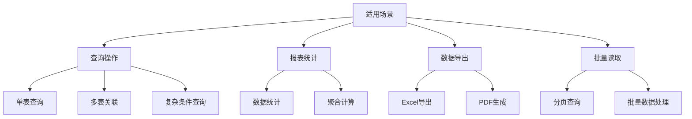
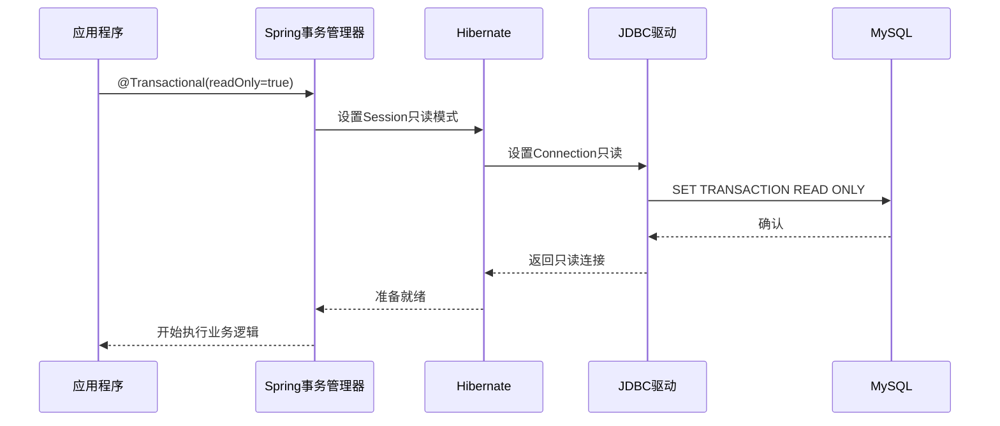
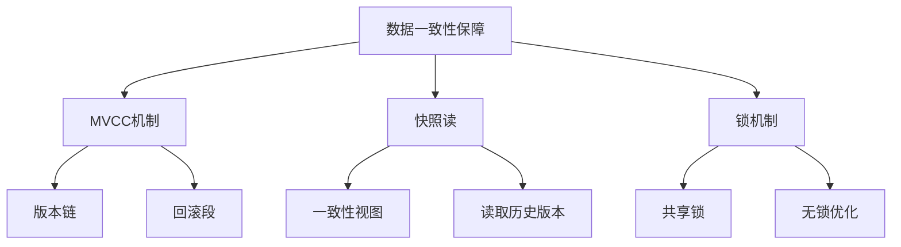
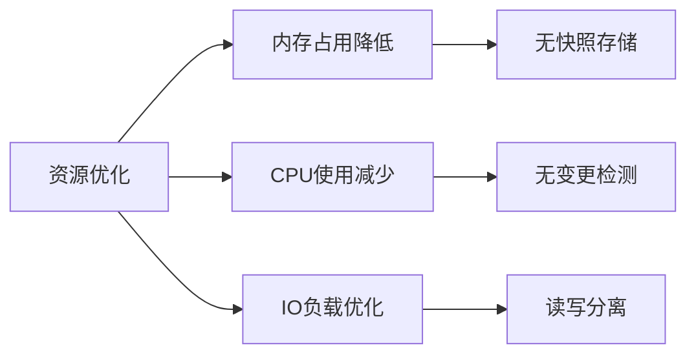

# Spring 只读事务详解

[toc]

## 简介

只读事务（Read-only Transaction）是数据库事务的一种特殊类型，专门用于执行查询操作，而不会对数据库中的数据进行任何修改（如插入、更新或删除）。在只读事务中，数据库管理系统可以通过优化策略减少锁定、日志记录等操作，从而提升查询性能和并发能力。

在Spring中，通过`@Transactional(readOnly = true)`注解来声明。

```java
@Transactional(readOnly = true)
public User getUser(Long id) {
  return userRepository.findById(id);
}
```

---

## 适用场景



这个流程图展示了只读事务的四大主要应用场景：

### 查询操作

- 单表查询：如用户信息查询、订单详情查询等
- 多表关联：如订单与用户信息关联查询
- 复杂条件查询：包含多个查询条件的高级搜索

### 报表统计

- 数据统计：如日销售额统计、用户增长统计
- 聚合计算：如平均值、总和等聚合函数计算

### 数据导出

- Excel导出：将查询结果导出为Excel文件
- PDF生成：生成PDF格式的报表文件

### 批量读取

- 分页查询：大数据量的分页显示
- 批量数据处理：批量导出、批量统计等场景

---

## 原理

### 工作机制



这个时序图展示了只读事务的完整工作流程：

1. **应用程序层**

- 开发者通过`@Transactional(readOnly=true)`注解声明只读事务
- Spring框架识别到这个注解并开始事务处理

2. **Spring事务管理器**

- 接收到只读事务请求
- 创建事务上下文
- 通知Hibernate设置只读模式

3. **Hibernate层**

- 接收Spring的只读设置
- 配置Session为只读模式
- 通知JDBC驱动设置连接属性

4. **JDBC驱动层**

- 设置数据库连接为只读模式
- 向MySQL发送只读事务命令

5. **MySQL数据库**

- 接收只读事务设置
- 启用相应的优化机制
- 返回确认信息

6. **返回流程**

- MySQL确认设置完成
- JDBC获取优化后的连接
- Hibernate准备就绪
- Spring允许业务逻辑执行

### MySQL层面的处理

```sql
-- MySQL服务器针对只读事务的处理
SHOW VARIABLES LIKE 'transaction_read_only';  -- 查看事务读写状态
SET SESSION TRANSACTION READ ONLY;  -- 设置会话级只读
SET GLOBAL READ_ONLY = 1;  -- 设置全局只读（通常用于从库）
```

### 数据一致性保障机制



这个流程图展示了MySQL中只读事务的数据一致性保障机制：

1. **MVCC机制（多版本并发控制）**

- 版本链：维护数据的历史版本
- 回滚段：存储旧版本数据，支持数据回滚
- 快照隔离：通过MVCC机制，确保只读事务读取的是事务开始时的数据快照，即使其他事务正在修改数据。

2. **快照读**

- 一致性视图：保证事务看到的数据是一致的
- 读取历史版本：可以读取到特定时间点的数据状态

3. **锁机制**

- 共享锁：必要时使用共享锁保证数据一致性
- 无锁优化：在可能的情况下使用MVCC避免加锁
- 避免脏读：只读事务不会读取未提交的数据，确保查询结果的可靠性。

---

## 优缺点

### 优势

1. **性能优化**
   - 减少锁竞争，提高并发能力。
   
   - 无需写日志(redo/undo log)，降低磁盘I/O负载。
   
2. **数据一致性**

   - 保证事务内查询结果的一致性。

3. **安全性**

   - 防止误操作导致的数据修改。
4. **资源利用**



这个流程图展示了只读事务带来的资源优化：

1. **内存占用降低**

- 无快照存储：不需要在内存中维护实体快照
- 减少了内存开销和GC压力

2. **CPU使用减少**

- 无变更检测：不需要进行实体状态检查
- 避免了不必要的CPU计算

3. **IO负载优化**

- 读写分离：可以将读请求路由到从库
- 减轻主库压力，提高整体性能

### 局限性

- **功能限制**：
  - 无法执行数据修改操作，无法使用悲观锁。
- **隔离级别限制**：
  - 在低隔离级别（如`READ UNCOMMITTED`）下，可能无法保证一致性。
- **事务阻塞**：
  - 可能会被优先级高的写事务阻塞。
- **适用范围有限**：
  - 仅适用于查询密集型场景，不适用于需要混合读写的业务逻辑。

---

## 事务对比

### 事务特性对比表

| 特性         | 只读事务    | 读写事务      | 无事务   |
| ------------ | ----------- | ------------- | -------- |
| 一致性保证   | 是          | 是            | 否       |
| 隔离级别支持 | 全支持      | 全支持        | 不适用   |
| 锁机制       | 共享锁/无锁 | 共享锁+排他锁 | 无锁     |
| 日志记录     | 不写日志    | 要写日志      | 不写日志 |
| 性能开销     | 中等        | 较高          | 最低     |
| 内存占用     | 低          | 高            | 最低     |
| 适用场景     | 读操作      | 读写操作      | 简单查询 |

### 隔离级别对比

| 隔离级别         | 脏读 | 不可重复读 | 幻读 | 性能 |
| ---------------- | ---- | ---------- | ---- | ---- |
| READ UNCOMMITTED | 可能 | 可能       | 可能 | 高   |
| READ COMMITTED   | 否   | 可能       | 可能 | 中   |
| REPEATABLE READ  | 否   | 否         | 可能 | 较低 |
| SERIALIZABLE     | 否   | 否         | 否   | 最低 |

---

## 代码示例

### Java 代码示例

使用Spring框架和MyBatis的只读事务示例：

```java
@Service
public class UserService {

    @Transactional(readOnly = true)
    public UserDTO getUserById(Long userId) {
        return userMapper.selectById(userId);
    }

    @Transactional(readOnly = true)
    public List<OrderDTO> getOrdersByUserId(Long userId) {
        return orderMapper.selectByUserId(userId);
    }
}
```

### MySQL 查询示例

在MySQL中显式开启只读事务：

```sql
START TRANSACTION READ ONLY;
SELECT * FROM users WHERE id = 1;
COMMIT;
```

### Java 读写分离配置

```java
@Configuration
public class ReadWriteDataSourceConfig {
  
  @Bean
  @ConfigurationProperties("spring.datasource.master")
  public DataSource masterDataSource() {
      return DataSourceBuilder.create().build();
  }
  
  @Bean
  @ConfigurationProperties("spring.datasource.slave")
  public DataSource slaveDataSource() {
      return DataSourceBuilder.create().build();
  }
  
  @Bean
  public DataSource routingDataSource() {
      Map<Object, Object> targetDataSources = new HashMap<>();
      targetDataSources.put(DataSourceType.MASTER, masterDataSource());
      targetDataSources.put(DataSourceType.SLAVE, slaveDataSource());
      
      return new AbstractRoutingDataSource() {
          @Override
          protected Object determineCurrentLookupKey() {
              return TransactionSynchronizationManager.isCurrentTransactionReadOnly()
                  ? DataSourceType.SLAVE
                  : DataSourceType.MASTER;
          }
      };
  }
}
```

---

## 注意事项

- **明确事务范围，避免长事务**
  - 只读事务的生命周期应尽量短，避免长时间占用资源。
  - 长时间运行的只读事务可能导致MVCC版本过多，增加存储开销。

- **合理选择隔离级别**
  - 根据业务需求选择`REPEATABLE READ`或`READ COMMITTED`。

- **结合缓存机制**
  - 对频繁查询的数据，结合Redis等缓存工具，进一步提高性能。

- **减少锁竞争**
  - 只读事务避免了写锁争用，提高系统吞吐量。
- **监控与优化**
  - 使用MySQL的性能监控工具（如`EXPLAIN`和`SHOW PROFILES`）分析和优化查询。

---

## 总结

只读事务是Java应用与MySQL数据库交互中一种高效的查询方式，能够在保障数据一致性的同时，显著提升系统性能。通过合理使用只读事务并遵循最佳实践，可以更好地满足现代应用对高并发和高性能的需求。