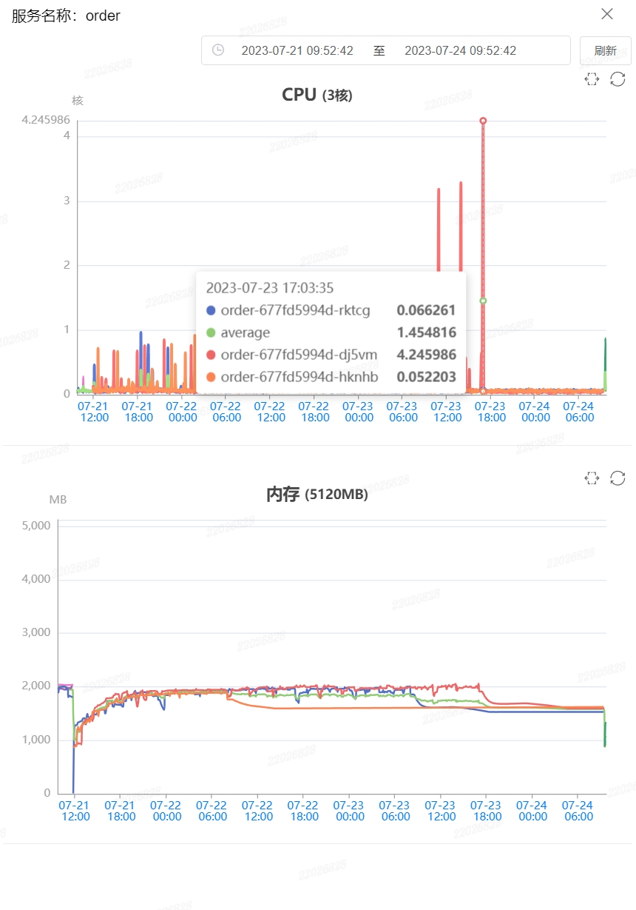
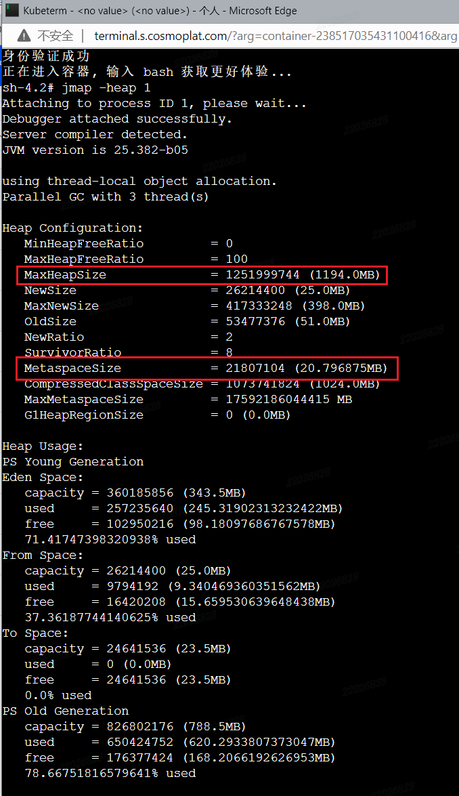
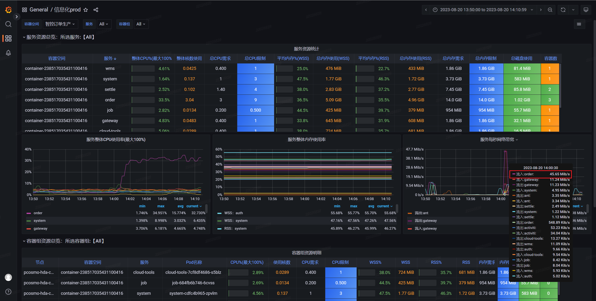
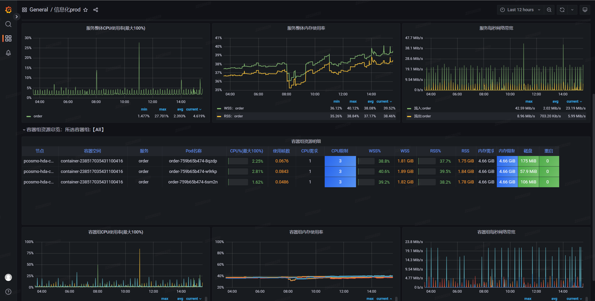
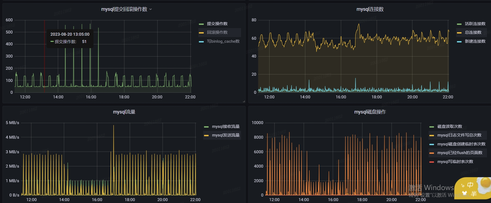
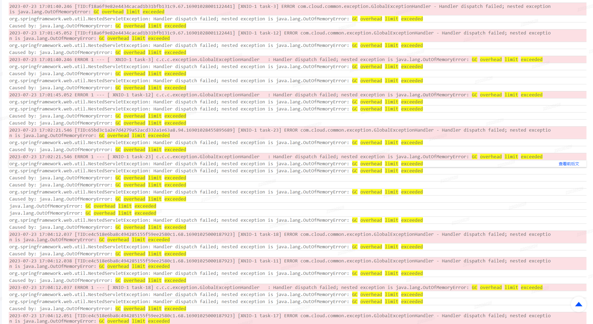
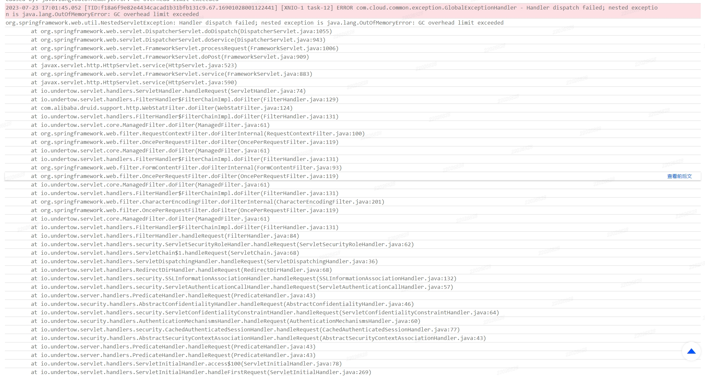
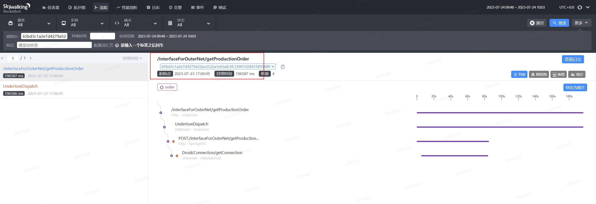
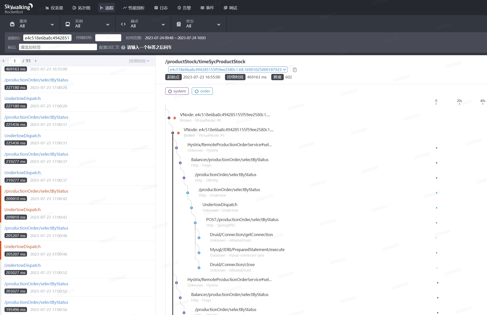
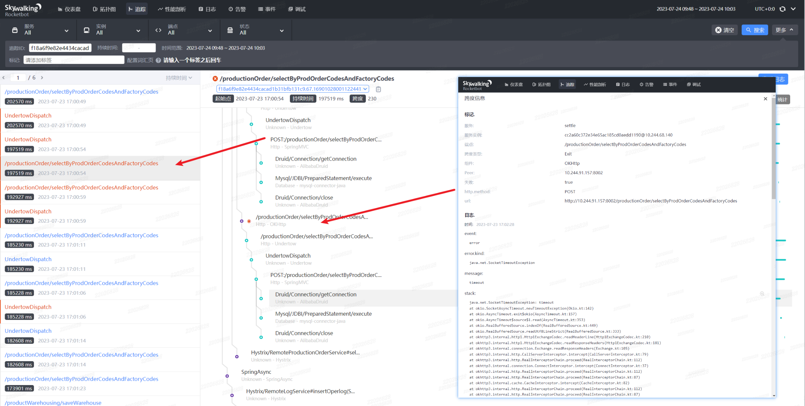

## GC overhead limit exceeded排查

[toc]

#### 一、背景

当前系统system中的某个服务ServiceA，最近总是在周末发生定时任务执行失败的情况，重启ServiceA即可解决。

报错信息：

- ```xml
  2023-07-23 17:01:40.246 [TID:f18a6f9e82e4434cacad1b31bfb131c9.67.16901028001122441] [XNIO-1 task-3] ERROR com.cloud.common.exception.GlobalExceptionHandler - Handler dispatch failed; nested exception is java.lang.OutOfMemoryError: GC overhead limit exceeded
  ```

- ```xml
  org.springframework.web.util.NestedServletException: Handler dispatch failed; nested exception is java.lang.OutOfMemoryError: GC overhead limit exceeded
  ```

---

#### 二、排查思路

- 日志
  - 事中可实时查看日志，查看报错信息，确定事故原因。
  - 事后可通过监控先确定事故发生的大致时间段在查看日志信息）。
- grafana监控
  - 查看服务CPU、内存、带宽等使用情况，确定事故发生的大致时间。
  - 查看MySQL的使用情况，确定是否是MySQL异常。
  - 着重查看异常时间段，然后拉长时间查看CPU、内存以及带宽等信息是否有周期性的规律，排查是否有定时任务或定点的业务操作等。
- skywalking
  - 结合日志信息获取TID，查看请求链路信息。


查看服务监控，发现当前时间点并无异常，CPU基本没在使用，内存利用率也很低。

使用jstat命令查看JVM情况，发现当前时间无GC，与上述内存利用率低呼应。


查看定时任务开始报错时间点Time1，发现自Time1开始，定时任务没有成功执行过。查看Time1时间节点前后的服务监控，发现CPU使用率高，且自此之后服务一直半死不活状态啊。



2023-08-21补充：上图内存为docker容器内存，并不是Java应用的最大内存。进入docker容器，通过`jmap -heap pid` 查看Java应用的JVM配置。发现最大堆内存只有1G多一点点。

且MetaspaceSize（元空间）只有默认的20M，元空间设置过小，会导致GC频繁。（Java8中使用元空间替代了永久代，所以该值会影响GC的频率）。




查看grafana监控，发现在Time1时间节点前后order服务带宽异常。



order服务监控：



MySQL的监控情况：




查看Time1时间节点前后日志，发现大量GC异常。（或通过EFK日志，根据时间段搜索log中的error信息）



报错详情：




结合skywalking进行分析，发现多个TID提示该错误。






通过skywalking查看接口调用情况，发现在同一时间点，会有大量外部系统来请求获取数据，加上系统自身多个定时任务的执行，造成CPU超频和内存占用大，GC异常。

回归到开始排查的定时任务，发现在调用时会发生超时，因为服务已经无法及时响应了。

值得一提的是，在时间节点还有大量慢SQL！！！（千里之堤毁于蚁穴）




2023-08-21错误排查：

2023-08-20 order服务无法正常响应，已重启服务，无法查看实时信息。

通过grafana查看监控信息，发现在14:00左右带宽飙升，通过查看EFK日志，发现OOM异常，根据TID去skywalking中查看调用方法，发现是定时任务A（在25,55分执行）导致。拉长时间轴，查看grafana发现每十分钟便会有一次带宽升高，具有规律性，于是怀疑还有其他定时任务存在大批量数据的读写情况，排查定时任务发现定时任务B会一次性读取十几万数据进行统计。

调高Java应用在docker容器中的内存，设置Xmx以及元数据空间。


---

#### 三、错误原因

> "GC overhead limit exceeded" 是 Java 应用程序在进行垃圾回收（Garbage Collection，GC）时遇到的错误。这个错误通常发生在垃圾回收所花费的时间过长，而且回收的内存量很少的情况下。它是 Java 虚拟机为了避免应用程序长时间运行在垃圾回收过程中导致系统负载过重而触发的一种保护机制
>
> ​															           - 来自ChatGPT 2023-7-24 10:44:34

个人理解：

JVM花费了1分钟进行GC，结果只释放了5%（200M）的内存，而释放的这200M内存很快（90秒）就又会被占满，所以又要花1分钟进行GC，导致JVM需要频繁进行GC，导致CPU一直满载运行，形成恶性循环。为了避免这种情况，Java在1.6之后引入该异常。

---

#### 四、解决方案

解决方案来自ChatGPT（2023-7-24 10:49:00）。

要解决这个问题，你可以考虑以下几个方法：

1. 增加堆内存：通过调整 Java 虚拟机的堆内存大小，增加可用内存空间，让垃圾回收有更多的空间处理。可以使用以下参数调整堆内存大小：

   ```
   arduinoCopy code-Xms<size>：设置初始堆大小
   -Xmx<size>：设置最大堆大小
   ```

   例如：`java -Xms512m -Xmx1024m YourApp`

   注意，如果增加堆内存后问题得到解决，但仍然遇到了 GC 问题，可能需要进一步调优。

2. **优化代码：检查应用程序代码，尽量避免创建过多临时对象或者循环引用等导致频繁垃圾回收的情况。优化代码有助于减少垃圾回收的频率和时间。长久之计！增加内存只是临时方案！**

3. 使用并行垃圾回收器：Java 虚拟机提供了不同的垃圾回收器，其中一些是并行的，能够更好地利用多核处理器的性能。尝试使用并行垃圾回收器可能会提高垃圾回收的效率。

   ```
   rubyCopy code
   -XX:+UseParallelGC
   ```

4. 压缩类空间：通过使用以下参数来压缩类空间，释放更多的内存。

   ```
   rubyCopy code-XX:+UseCompressedClassPointers
   -XX:+UseCompressedOops
   ```

5. 分析内存泄漏：使用工具如 Profiler 来分析应用程序是否存在内存泄漏问题，及时释放不再使用的对象。

6. 升级 Java 版本：如果你的应用程序运行在旧版本的 Java 上，考虑升级到较新的 Java 版本，因为新版本通常会改进垃圾回收性能。

在尝试上述方法之前，建议先进行性能测试和监控，以确保你了解应用程序的行为和瓶颈所在。同时，对于生产环境的调整，务必谨慎并进行适当的备份。

总结："GC overhead limit exceeded" 错误通常是由于垃圾回收过程过于频繁或效率低下导致的。通过增加堆内存、优化代码、使用并行垃圾回收器等方法，可以缓解或解决这个问题。但务必在进行任何调整之前，先进行性能测试和监控，以便更好地了解问题的根本原因。

