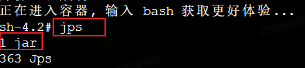
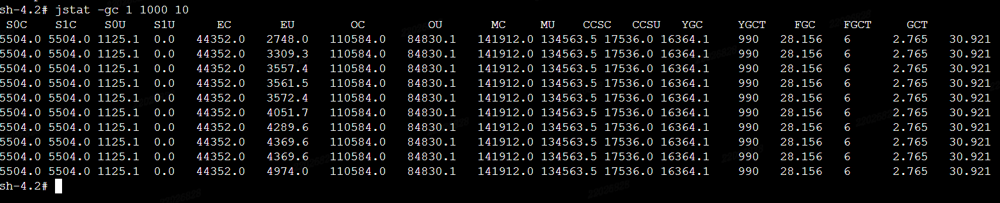
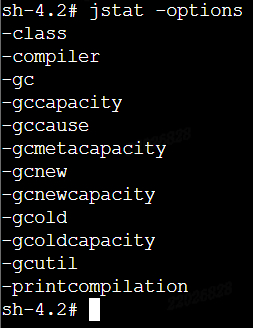

## jstat查看GC

[toc]

#### 一、简介

`jstat`是Java虚拟机提供的用于监控和收集统计信息的命令行工具。它用于显示Java应用程序的垃圾回收（GC）情况，以及类加载、编译等相关信息。通过`jstat`，你可以实时监控Java应用程序的性能，并根据输出结果进行性能优化和调试。

---

#### 二、查看GC情况

##### 1. 获取Java应用pid

使用 `jps` 命令查看Java应用的pid，如图所示，当前docker容器中的Java应用的pid为1。

##### 2. 查看GC情况

~~~shell
jstat -gc <pid> <interval> <count>
~~~

- `<pid>`：Java进程的进程ID。
- `<interval>`：数据采样间隔时间，单位为毫秒。
- `<count>`：采样次数。

示例：

~~~shell
jstat -gc 12345 1000 10
~~~

每隔1秒采样一次GC情况，共采样10次。

输出结果解析（不同虚拟机可能有差异）：

1. **S0C：** 年轻代中第一个Survivor区的容量（单位：KB）。
2. **S1C：** 年轻代中第二个Survivor区的容量（单位：KB）。
3. **S0U：** 年轻代中第一个Survivor区的使用量（单位：KB）。
4. **S1U：** 年轻代中第二个Survivor区的使用量（单位：KB）。
5. **EC：** 年轻代的Eden区的容量（单位：KB）。
6. **EU：** 年轻代的Eden区的使用量（单位：KB）。
7. **OC：** 老年代（Old Generation）的容量（单位：KB）。
8. **OU：** 老年代（Old Generation）的使用量（单位：KB）。
9. **MC：** 元数据区（Metaspace）的容量（单位：KB）。
10. **MU：** 元数据区（Metaspace）的使用量（单位：KB）。
11. **CCSC：** 压缩类空间的容量（单位：KB）。
12. **CCSU：** 压缩类空间的使用量（单位：KB）。
13. **YGC：** 年轻代垃圾回收的次数。
14. **YGCT：** 年轻代垃圾回收所花费的总时间（单位：秒）。
15. **FGC：** 老年代垃圾回收的次数。
16. **FGCT：** 老年代垃圾回收所花费的总时间（单位：秒）。
17. **GCT：** 所有垃圾回收所花费的总时间（单位：秒）。

综上返回结果，可以比较YGC和FGC的次数是否在增大来判断是否正在进行GC。

---

#### 三、其他操作

jstat命令还有其他操作，可以使用 -options 来进行查看。

