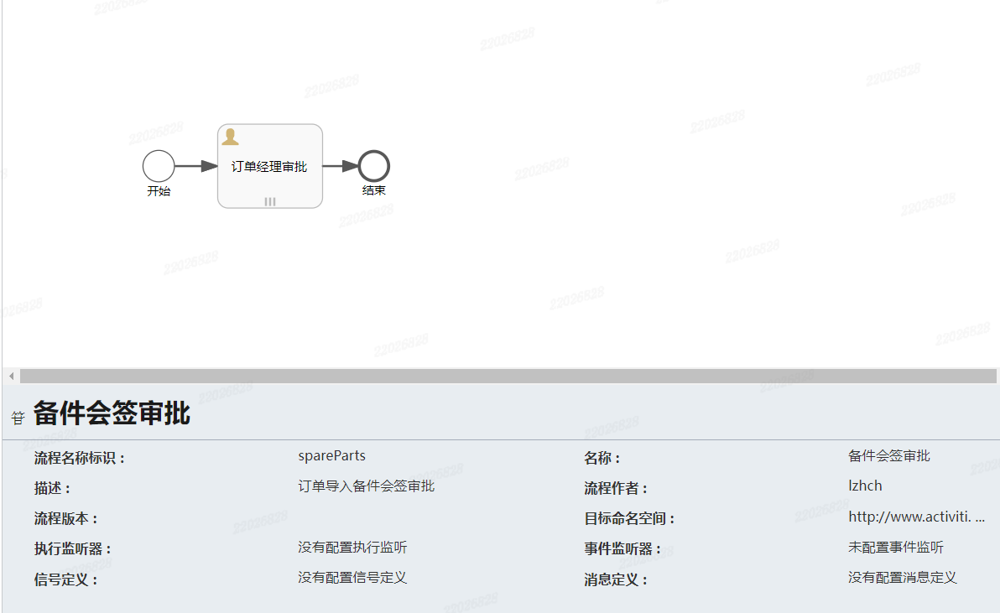
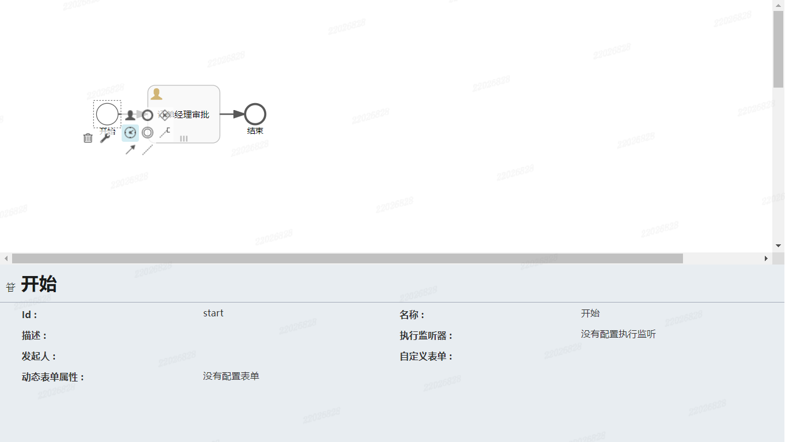
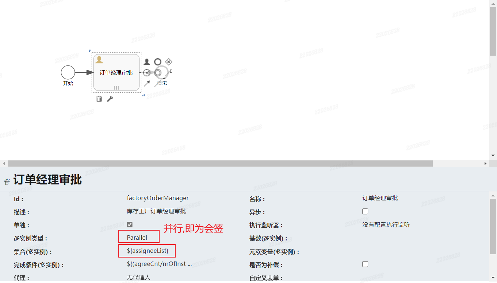
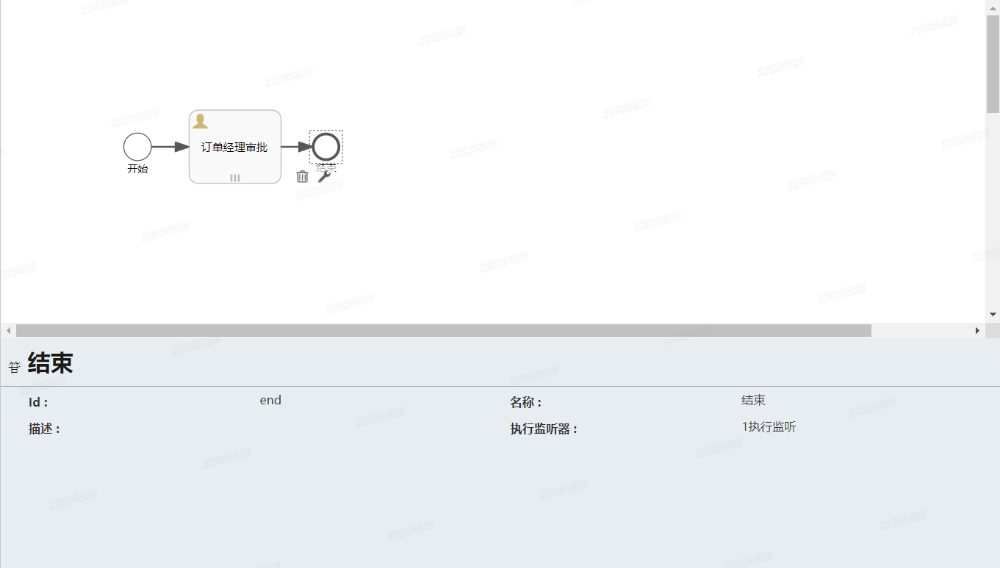
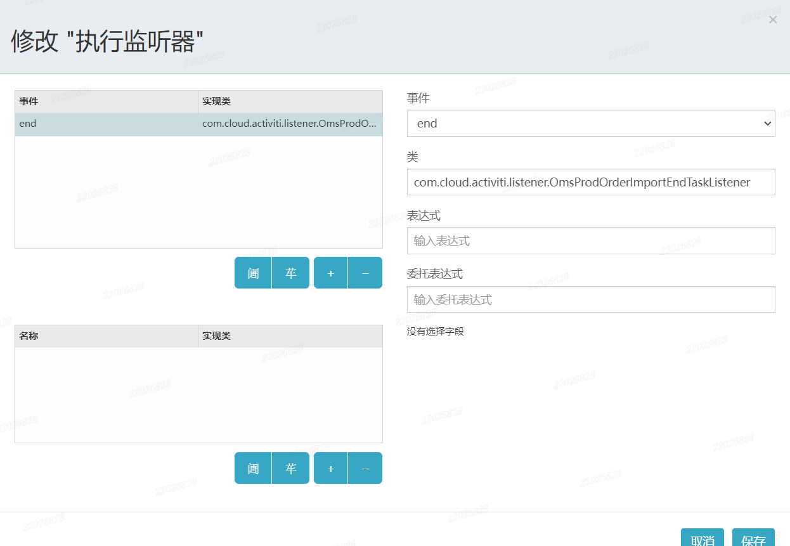

## activity5.0会签审批

[toc]

#### 一、背景

基于activity5.0进行会签审批的开启和推进，以及包含执行监听器的监听。

基于流程画布进行流程模型的配置，实现会签审批时，全部通过则通过，一人驳回则流程中止的效果。

---

---

#### 二、流程模型配置

**整体流程配置**

**开始节点配置**

**任务节点（订单经理审批）配置**

- 多实例类型：选择Parallel，即可开启多个流程实例，即多任务。

- 集合（多实例）：设置一个参数为审批人（${assigneeList}），在开启审批流时，将审批人集合赋值到该参数，即可为每个审批人开启代办任务。

  该参数存在争议，在网上看到其他例子，还需要设置元素变量（多实例）和代理人，即可赋值之后为任务节点设置处理人，但在我这个版本不生效，开启流程之后在act_ru_task.assignee_字段中均为配置的参数，无法变更，导致无法通过代办（条件taskCandidateOrAssigned）查出。

- 完成条件：${(agreeCnt/nrOfInstances==1)||(disagreeCnt>0)} 全部通过或者一人驳回该节点即完成。

  其中，agreeCnt和disagreeCnt为自己赋值，开启时默认为0。nrOfInstances是自带参数，表示全部任务数。

**结束任务节点**

**结束任务节点监听配置**

结束任务节点只能配置执行监听，执行监听虽然可以贯穿全流程的监听，但是只在配置了执行监听的节点才会生效。

---

----

#### 三、代码编写

**开启会签审批**

~~~java
/**
 * 根据流程定义 key 开启会签审批流
 *
 * @param baseReqDto params
 * @return R
 * Author: lzhch 2023/6/29 17:40
 */
@Override
@Transactional(rollbackFor = Exception.class)
public R startSignProcessInstanceByDefKey(BaseBpmStartProcessReqDto baseReqDto) {
    Assert.notNull(baseReqDto, "启动审批流入参不能为空");
    Map<String, Object> processVariables = CollectionUtil.isEmpty(baseReqDto.getProcessVariables()) ? new HashMap<>() : baseReqDto.getProcessVariables();
    processVariables.put(BaseBpmInsVarEnum.START_USER_NAME.getProcessVariable(), baseReqDto.getStartUserName());
    // 根据流程图配置参数在启动流程实例前赋值, 否则报错: Unknown property used in expression: ${assignee}
    processVariables.put(BaseBpmInsVarEnum.ASSIGNEE_LIST.getProcessVariable(), baseReqDto.getFirstNodeAuditors());
    processVariables.put(BaseBpmInsVarEnum.AGREE_CNT.getProcessVariable(), 0);
    processVariables.put(BaseBpmInsVarEnum.DISAGREE_CNT.getProcessVariable(), 0);
    String processInstanceId;

    try {
        // 设置流程发起人 act_ru_identitylink.TYPE_='starter', act_ru_identitylink.USER_ID_='userId'
        this.identityService.setAuthenticatedUserId(baseReqDto.getStartUserId());

        // 根据流程定义 key 开启工作流
        ProcessInstance processInstance = this.runtimeService.startProcessInstanceByKey(baseReqDto.getProcessDefinitionKey(), baseReqDto.getBusinessKey(), processVariables);
        processInstanceId = processInstance.getProcessInstanceId();

        if (StrUtil.isNotBlank(baseReqDto.getProcessInstanceName())) {
            // 设置流程实例名称: act_ru_execution.NAME act_hi_procinst.NAME
            this.runtimeService.setProcessInstanceName(processInstanceId, baseReqDto.getProcessInstanceName());
        } else {
            // 获取最新版本的流程定义
            ProcessDefinition processDefinition = this.repositoryService.createProcessDefinitionQuery()
                    .processDefinitionKey(baseReqDto.getProcessDefinitionKey())
                    .latestVersion()
                    .singleResult();

            this.runtimeService.setProcessInstanceName(processInstanceId, processDefinition.getName());
        }

        // 查询会签任务, 为每个任务设置审批人
        List<String> firstNodeAuditors = baseReqDto.getFirstNodeAuditors();
        List<Task> taskList = this.taskService.createTaskQuery().active().processInstanceId(processInstanceId).list();
        if (CollUtil.isEmpty(taskList) || taskList.size() != firstNodeAuditors.size()) {
            throw new BusinessException("该流程的会签任务数与审批人数不对应");
        }

        // 设置受理人SQL如下: 1. type为participant; 2. task_id为null, 无法查询已办; 3. proc_insd_id 不为 null
        // insert into ACT_HI_IDENTITYLINK(ID_, TYPE_, USER_ID_, GROUP_ID_, TASK_ID_, PROC_INST_ID_) values ('1675704133593260032', 'participant', '611', null, null, '1675704084776673280');
        // for (int i = 0; i < taskList.size(); i++) {
        //     this.taskService.setAssignee(taskList.get(i).getId(), firstNodeAuditors.get(i));
        // }

        // 设置候选人SQL如下: 1. type为candidate; 2. task_id有值, 查询已办时可添加candidate为条件; 3. proc_insd_id 为 null
        // insert into ACT_HI_IDENTITYLINK(ID_, TYPE_, USER_ID_, GROUP_ID_, TASK_ID_, PROC_INST_ID_) values ('1675704335070744576', 'candidate', '611', null, '1675704084939808768', null);
        for (int i = 0; i < taskList.size(); i++) {
            this.taskService.addCandidateUser(taskList.get(i).getId(), firstNodeAuditors.get(i));
        }

    } catch (Exception e) {
        log.error("会签审批流开始失败 :{} ", e.getMessage());
        return R.error("会签审批流开始失败");
    }

    return R.okData(processInstanceId);
}
~~~

**会签审批推进**

~~~java
/**
 * 会签推进流程
 *
 * @param taskReqDto param
 * @return R
 * Author: lzhch 2023/7/3 17:05
 */
@Override
public R completeSignTask(BaseBpmCompleteTaskReqDto taskReqDto) {
    Task task = this.initTaskInfo(taskReqDto);
    String taskId = task.getId();

    // 设置受理人
    this.taskService.setAssignee(taskId, taskReqDto.getUserId());

    // 设置的是整个流程实例的变量，全局可见，无法指定 task；与 this.taskService.setVariable(taskId, AUDIT_RESULT, variables); 一致
    Map<String, Object> variables = CollectionUtil.isEmpty(taskReqDto.getVariables()) ? MapUtil.newHashMap(3) : taskReqDto.getVariables();
    variables.put(BaseBpmInsVarEnum.AUDIT_RESULT.getProcessVariable(), taskReqDto.getResult());
    Map<String, Object> proInsVariables = this.runtimeService.getVariables(task.getExecutionId());
    if (Objects.equals(taskReqDto.getResult(), ActResultConstant.RESULT_PASS)) {
        Integer agreeCnt = (Integer) proInsVariables.get(BaseBpmInsVarEnum.AGREE_CNT.getProcessVariable());
        agreeCnt++;
        variables.put(BaseBpmInsVarEnum.AGREE_CNT.getProcessVariable(), agreeCnt);
    }
    if (Objects.equals(taskReqDto.getResult(), ActResultConstant.RESULT_FAIL)) {
        Integer disagreeCnt = (Integer) proInsVariables.get(BaseBpmInsVarEnum.DISAGREE_CNT.getProcessVariable());
        disagreeCnt++;
        variables.put(BaseBpmInsVarEnum.DISAGREE_CNT.getProcessVariable(), disagreeCnt);
    }
    this.taskService.complete(taskId, variables);

    return R.ok();
}

/**
 *  初始化任务信息
 *
 * @param taskReqDto param
 * @return Task
 * Author: lzhch 2023/7/3 16:23
 */
private Task initTaskInfo(BaseBpmCompleteTaskReqDto taskReqDto) {
    Assert.notNull(taskReqDto, "审批任务入参不能为空");

    String taskId = taskReqDto.getTaskId();
    Task task = this.taskService.createTaskQuery()
            .taskId(taskId)
            .singleResult();
    Assert.notNull(task, "当前任务不存在");

    // 用于将当前已认证的用户ID设置为流程引擎的认证用户ID, 作用是与活动任务相关的用户操作建立关联, 当前线程内有效
    // 比如一次审批中的多个操作（如审批、评论、附件等）可以通过设置已认证的用户ID一次来关联到同一个用户
    this.identityService.setAuthenticatedUserId(taskReqDto.getUserId());
    this.taskService.addComment(taskId, taskReqDto.getInstanceId(), taskReqDto.getComment());

    // 该方式 activity 引擎会以对象的形式存储(ACT_HI_VARINST.VAR_TYPE_='serializable'), 在查询时会先查询 ACT_HI_VARINST 表, 再遍历查询 ACT_GE_BYTEARRAY
    // HashMap<String, Object> localVariables = MapUtil.newHashMap(2);
    // localVariables.put(AUDIT_RESULT, taskReqDto.getResult());
    // localVariables.put(AUDIT_COMMENT, taskReqDto.getComment());
    // this.taskService.setVariableLocal(taskId, AUDIT_RESULT, localVariables);

    this.taskService.setVariableLocal(taskId, BaseBpmInsVarEnum.AUDIT_RESULT.getProcessVariable(), taskReqDto.getResult());
    // TODO 后续可封装查询 comment 的方法, 取消此处放值
    this.taskService.setVariableLocal(taskId, BaseBpmInsVarEnum.AUDIT_COMMENT.getProcessVariable(), taskReqDto.getComment());

    return task;

    /* tags:
        1. 如果任务节点设置的是候选人的话, 需要手动签收(claim)任务, 然后执行 complete. 否则无法在已办任务中查询到
        2. 如果任务节点设置的是办理人的话, 需要设置办理人, 然后执行 complete. 否则无法在已办任务中查询到
     */
}
~~~

**执行监听（结合业务）**

~~~java
package com.cloud.activiti.listener;

import cn.hutool.core.collection.CollUtil;
import com.cloud.activiti.common.base.enums.BaseBpmInsVarEnum;
import com.cloud.activiti.consts.ActivitiConstant;
import com.cloud.activiti.domain.BizBusiness;
import com.cloud.activiti.service.IBizBusinessService;
import com.cloud.common.constant.ProductOrderConstants;
import com.cloud.common.utils.spring.ApplicationContextUtil;
import com.cloud.order.feign.RemoteProductionOrderService;
import lombok.extern.slf4j.Slf4j;
import org.activiti.engine.ProcessEngine;
import org.activiti.engine.ProcessEngines;
import org.activiti.engine.RuntimeService;
import org.activiti.engine.delegate.DelegateExecution;
import org.activiti.engine.delegate.ExecutionListener;
import org.springframework.stereotype.Component;

import java.util.List;

/**
 * 排产订单导入结束任务节点监听
 * 

 * author: lzhch
 * version: v1.0
 * date: 2023/7/5 14:08
 */

@Slf4j
@Component
public class OmsProdOrderImportEndTaskListener implements ExecutionListener {

    /**
     * 对结束任务节点设置流程监听可以用来判断是否还有其他审批流以及进行一些相同的任务处理
     * 在结束任务节点设置, 事件类型选择 end, 任务监听无法对开始和结束节点进行监听
     * 流程监听虽然可以进行全流程的监听, 但是也要配置在相应的节点才会生效
     * 1. 查询当前订单是否还有其他的开启的审批流, 根据通过/驳回进行不同的处理
     * 1.1 通过: 有其他审批流不做处理; 反之修改订单状态为审核完成
     * 1.2 驳回: 有其他审批流时删除其他审批流, 并修改订单状态为驳回
     * 

     * PS: 当前只针对备件审批流采用该方式, 所以使用 IBizBusinessService 查询其他审批流即为其余全部审批流;
     * 若后续新增其他审批流, 需要增加 activity 的流程引擎查询, 根据 businessKey 查询
     * 

     * Author: lzhch 2023/7/5 14:12
     */
    @Override
    public void notify(DelegateExecution execution) throws Exception {
        log.info("============ 开始执行对结束任务节点的监听器 ====================");
        // 获取 BEAN
        IBizBusinessService bizBusinessService = ApplicationContextUtil.getBean(IBizBusinessService.class);
        RemoteProductionOrderService remoteProductionOrderService = ApplicationContextUtil.getBean(RemoteProductionOrderService.class);

        // 获取 activity 引擎
        ProcessEngine processEngine = ProcessEngines.getDefaultProcessEngine();
        RuntimeService runtimeService = processEngine.getRuntimeService();

        // 根据订单号查询处在流程中的审批流程
        BizBusiness business = new BizBusiness();
        business.setOrderNo(execution.getProcessBusinessKey());
        business.setResult(ActivitiConstant.RESULT_DEALING);
        // 兼容历史流程, 所以使用business表进行查询, 后续统一之后可使用activity引擎根据businessKey直接查询
        List<BizBusiness> businessList = bizBusinessService.selectBizBusinessList(business);

        // 获取任务审批结果
        Integer result = (Integer) execution.getVariable(BaseBpmInsVarEnum.AUDIT_RESULT.getProcessVariable());
        boolean pass = ActivitiConstant.RESULT_PASS.equals(result);

        if (pass && CollUtil.isNotEmpty(businessList)) {
            log.info("============ 对结束任务节点的监听器执行完毕 ====================");
            return;
        }

        if (pass && CollUtil.isEmpty(businessList)) {
            remoteProductionOrderService.updateAuditStatusByOrderCodeOrId(null, execution.getProcessBusinessKey(), ProductOrderConstants.AUDIT_STATUS_TWO);
            log.info("============ 对结束任务节点的监听器执行完毕 ====================");
            return;
        }

        // 驳回
        if (CollUtil.isNotEmpty(businessList)) {
            // 删除其他审批流
            businessList.forEach(item -> runtimeService.deleteProcessInstance(item.getProcInstId(), ActivitiConstant.SUSPEND_PRE + "reject"));
        }

        remoteProductionOrderService.updateAuditStatusByOrderCodeOrId(null, execution.getProcessBusinessKey(), ProductOrderConstants.AUDIT_STATUS_THREE);
        log.info("============ 对结束任务节点的监听器执行完毕 ====================");
    }

}

~~~

