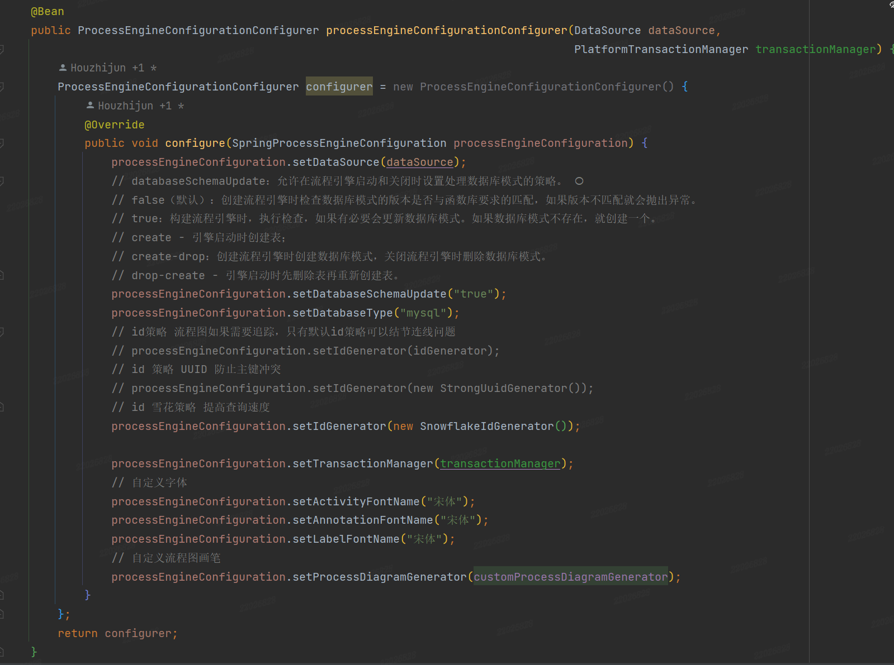

## activity5自定义主键策略为雪花ID

[toc]

#### 一、背景

线上生产环境为多实例（4个）部署，且项目使用了seata，有些流程调用时间过长，导致seata超时进行回滚，使用默认的主键策略会造成流程引擎主键冲突的问题。

所以对主键策略进行修改，初步为UUID，但是UUID无序且包含符号，排序时间长。

最终，采用雪花算法。

---

#### 二、自定义主键策略

修改流程引擎配置

~~~java
@Bean
public ProcessEngineConfigurationConfigurer processEngineConfigurationConfigurer(DataSource dataSource, PlatformTransactionManager transactionManager) {
    ProcessEngineConfigurationConfigurer configurer = new ProcessEngineConfigurationConfigurer() {
        @Override
        public void configure(SpringProcessEngineConfiguration processEngineConfiguration) {
            processEngineConfiguration.setDataSource(dataSource);
            // databaseSchemaUpdate：允许在流程引擎启动和关闭时设置处理数据库模式的策略。 
            // false（默认）：创建流程引擎时检查数据库模式的版本是否与函数库要求的匹配，如果版本不匹配就会抛出异常。
            // true：构建流程引擎时，执行检查，如果有必要会更新数据库模式。如果数据库模式不存在，就创建一个。
            // create - 引擎启动时创建表；
            // create-drop：创建流程引擎时创建数据库模式，关闭流程引擎时删除数据库模式。
            // drop-create - 引擎启动时先删除表再重新创建表。
            processEngineConfiguration.setDatabaseSchemaUpdate("true");
            processEngineConfiguration.setDatabaseType("mysql");
            // id策略 流程图如果需要追踪，只有默认id策略可以结节连线问题
            // processEngineConfiguration.setIdGenerator(idGenerator);
            // id 策略 UUID 防止主键冲突
            // processEngineConfiguration.setIdGenerator(new StrongUuidGenerator());
            // id 雪花策略 提高查询速度
            processEngineConfiguration.setIdGenerator(new SnowflakeIdGenerator());

            processEngineConfiguration.setTransactionManager(transactionManager);
            // 自定义字体
            processEngineConfiguration.setActivityFontName("宋体");
            processEngineConfiguration.setAnnotationFontName("宋体");
            processEngineConfiguration.setLabelFontName("宋体");
            // 自定义流程图画笔
            processEngineConfiguration.setProcessDiagramGenerator(customProcessDiagramGenerator);
        }
    };
    return configurer;
}
~~~

在设置主键时，activity5提供了默认的主键策略和UUID的方式，如果要自定义为雪花策略则需自己生成雪花策略主键。

activity自定义主键策略主需要实现IdGenerator接口，并重写getNextId()方法即可。

---

#### 三、雪花主键策略

自定义配置类，实现IdGenerator接口，并重写getNextId()方法，最后将该配置类在流程引擎配置中赋值`processEngineConfiguration.setIdGenerator(new SnowflakeIdGenerator());`。

雪花主键的生成直接使用Hutool的工具类，在多实例部署中，workerId（终端ID）和datacenterId（数据中心ID）两个参数十分重要，这是保证多实例部署生成的主键不重复的关键参数。

在Hutool方法中workerId和datacenterId都是[0,31]范围内的数，雪花算法本身也是2^5字节，转换十进制也是32以内，相当于32个机房，每个机房里面有32台机器，共有1024种形式。

由于数据并发量并没有非常大，所以设置workerId和datacenterId为随机数即可，更精确的可以采用IP或Redis等措施来进行控制。

~~~java
package com.cloud.activiti.config;

import cn.hutool.core.lang.Snowflake;
import cn.hutool.core.util.IdUtil;
import cn.hutool.core.util.RandomUtil;
import lombok.extern.slf4j.Slf4j;
import org.activiti.engine.impl.cfg.IdGenerator;
import org.springframework.stereotype.Component;

/**
 * 雪花算法ID生成器
 * 

 * author: lzhch
 * version: v1.0
 * date: 2023/6/1 11:16
 */

@Slf4j
@Component
public class SnowflakeIdGenerator implements IdGenerator {

    @Override
    public String getNextId() {
        // 尽可能保证极限情况下(不同实例同时生成主键)主键不冲突. 最好是可以根据一定规则给每个实例分配不同的机器码
        Snowflake snowflake = IdUtil.getSnowflake(RandomUtil.randomLong(0, 31), RandomUtil.randomLong(0, 31));
        return snowflake.nextIdStr();
    }

    public static void main(String[] args) {
        // for (int i = 0; i < 20; i++) {
        //     Snowflake snowflake = IdUtil.getSnowflake(i, i);
        //     System.out.println(snowflake.nextIdStr());
        // }

        Snowflake snowflake = IdUtil.getSnowflake(0, 31);
        System.out.println(snowflake.nextIdStr());
    }

}
~~~

---

#### 雪花算法简介

> 雪花算法（SnowFlake）是Twitter开源的分布式ID生成算法。其核心思想是使用一个64bit的long类型的数字作为全局唯一ID。在分布式系统中的应用十分广泛且ID中引入了时间戳，基本保持自增（注意并不是绝对自增）。

由于在Java中64bit的整数是long类型，所以在Java中SnowFlake算法生成的id就是long来存储的。

雪花算法结构图

- 1bit，不用，因为二进制中最高位是符号位，1表示负数，0表示正数。生成的id一般都是用整数，所以最高位固定为0。
- 41bit时间戳，毫秒级。可以表示的数值范围是 （2^41-1），转换成单位年则是69年。
- 10bit工作机器ID，用来表示工作机器的ID，包括5位datacenterId和5位workerId。
- 12bit序列号，用来记录同毫秒内产生的不同id，12位可以表示的最大整数为4095，来表示同一机器同一时间截（毫秒)内产生的4095个ID序号。

---

#### 雪花算法优缺点

优点：

- 高性能高可用：生成时不依赖数据库，完全在内存中生成
- 容量大：每秒钟能生成数百万的自增ID
- ID自增：存入数据库，索引效率高（非完全自增，工作机器ID不同）

缺点：

- 依赖系统时间，若时间回调，会造成主键冲突