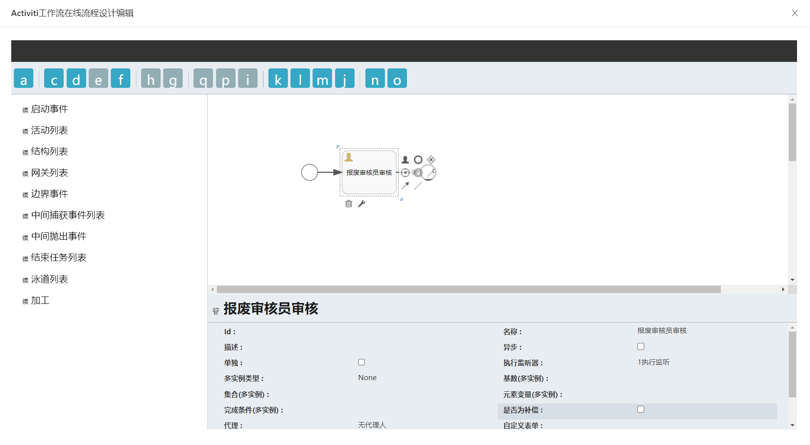
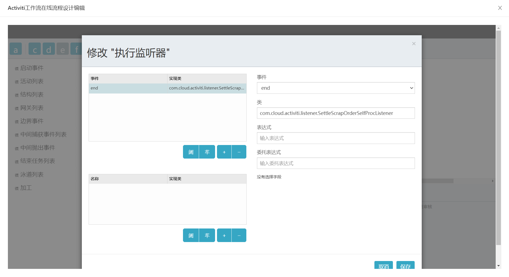
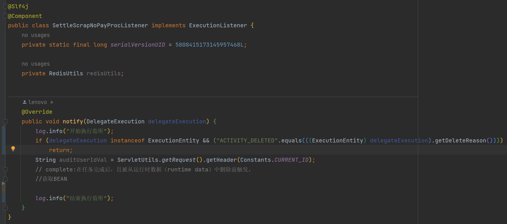
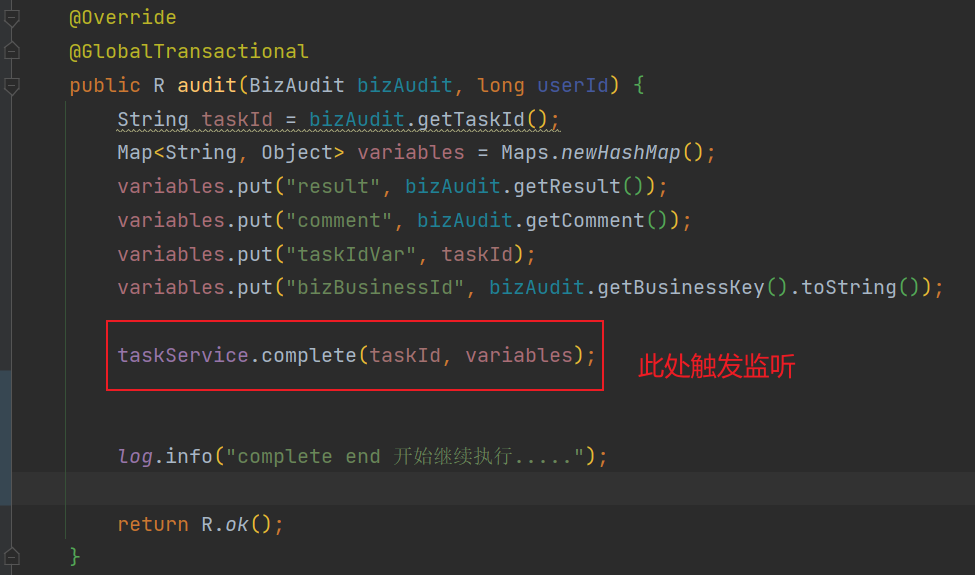
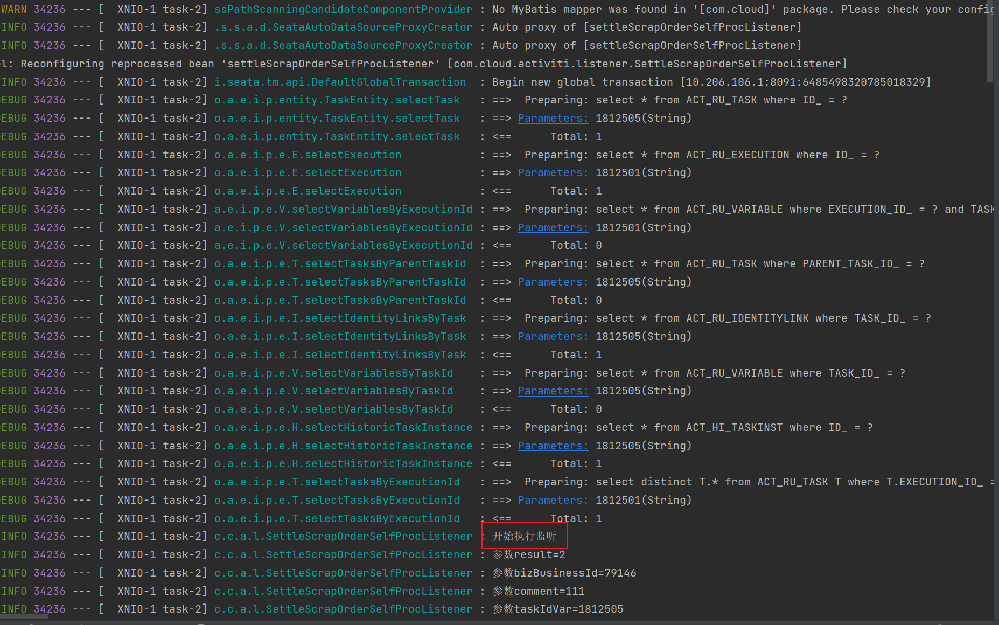
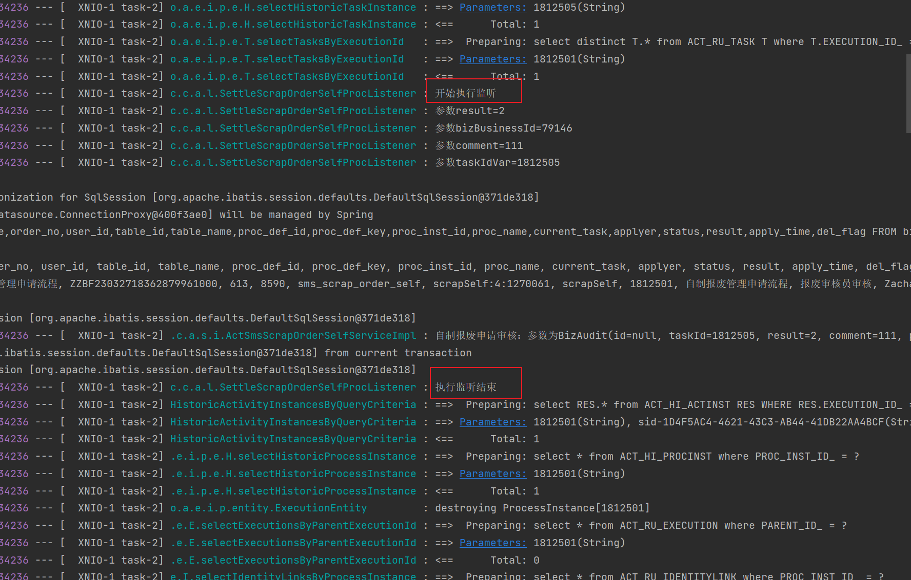
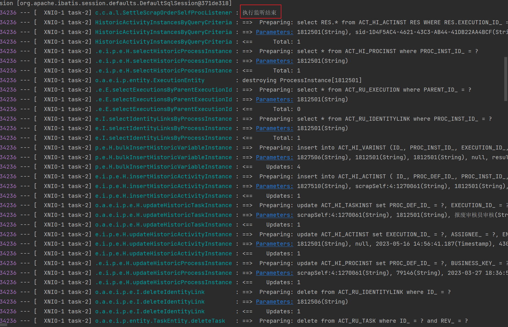
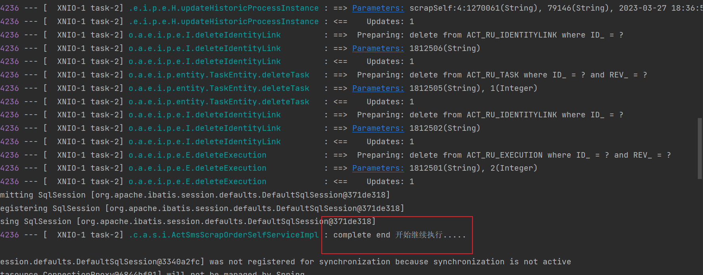

## activity监听器执行时机

[toc]

#### 一、 监听器种类

监听器分为任务监听器TaskListener和流程监听器ExecutionListener 。

> ##### ExecutionListener
>
> ExecutionListener 是针对整个流程实例的事件监听器，它可以**监听流程实例启动、结束、活动开始、活动结束、连线选择**等事件。ExecutionListener 的事件类型和执行时机都是固定的，它不能直接访问任务相关的信息（例如任务的候选人、任务的执行者等），因此通常用于处理与流程实例相关的事件

> ##### TaskListener
>
> TaskListener 顾名思义它是针对任务的事件监听器，它可以**监听任务的创建、分配、完成**等事件。TaskListener 的事件类型和执行时机是与任务相关的，它可以访问任务相关的信息，并可以对任务进行操作（例如设置任务的执行人、指定任务的代理人等），因此通常用于处理与任务相关的事件。

---

#### 二、 监听器执行时机

以执行监听器在进行审批时为例进行说明，不能包含所有情况。

流程配置：

代码（关键代码略）：

日志：

在complete执行中开始触发监听器，执行监听器内的代码。

complete执行的步骤为先查询当前的流程和任务的相关信息，然后更新（最后一个任务节点为删除）ACT_RU_**表中的相关信息。

所以准确的说监听器的执行时机是在complete在查询完当前的流程和任务信息之后，在更新ACT_RU_**表的信息之前执行的。所以监听器的代码一定在complete执行完毕之前执行完。

在complete方法执行完毕后，才继续执行后续业务代码。