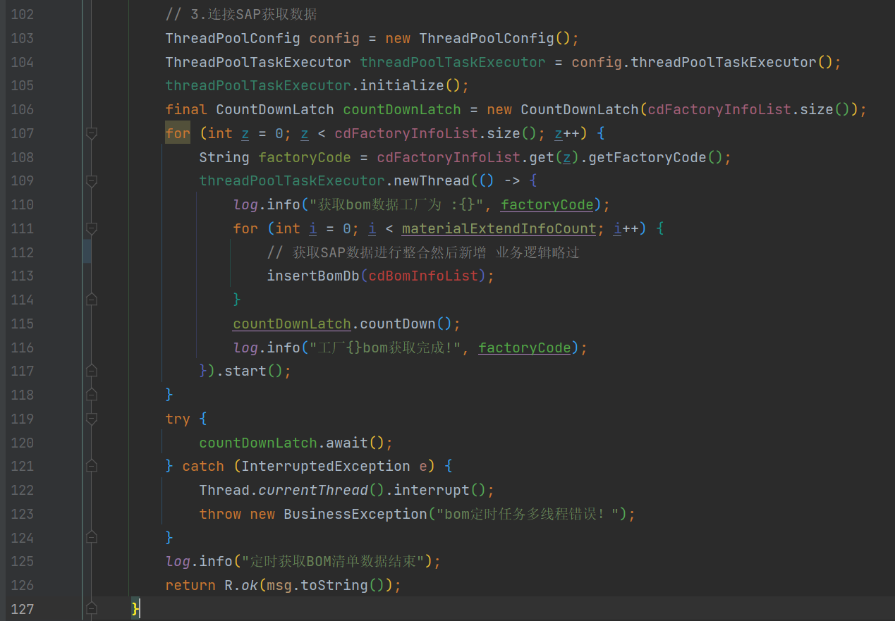
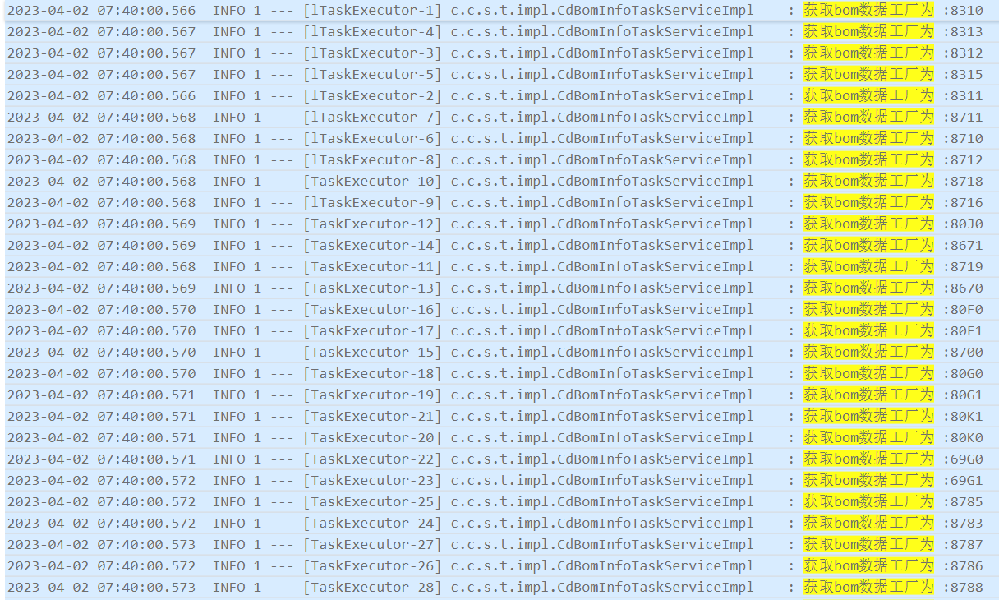
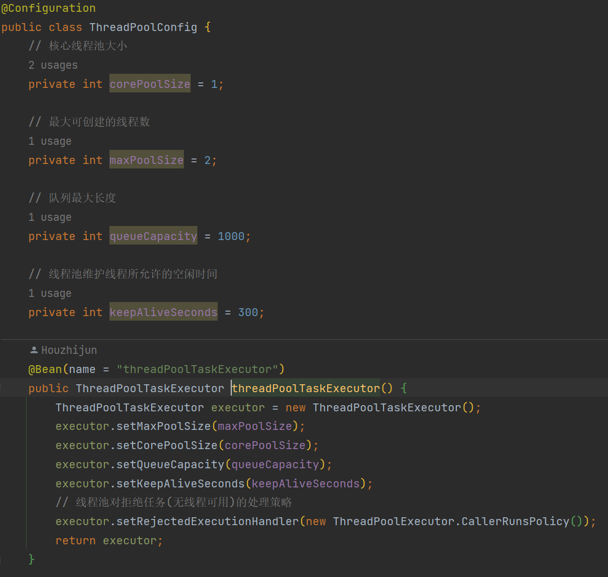
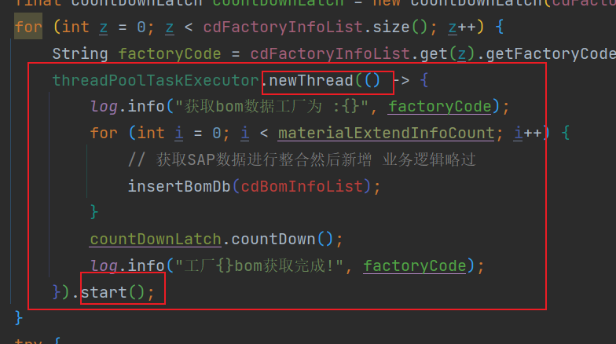
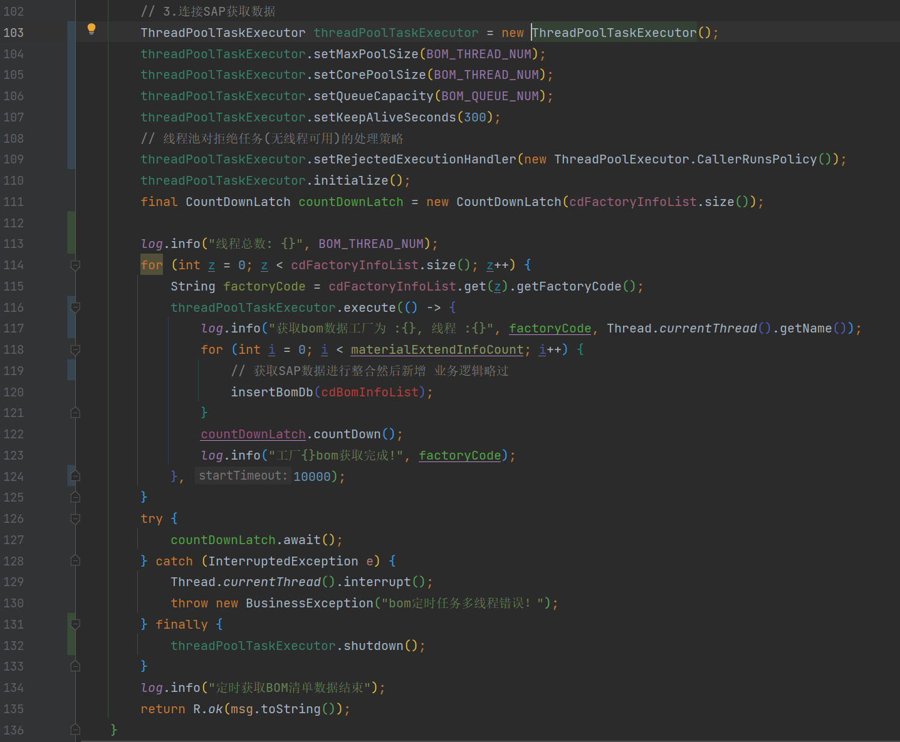
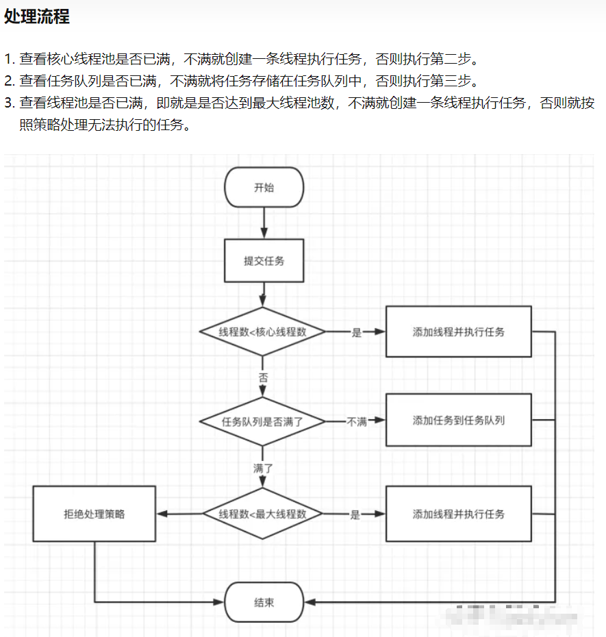

## BOM同步开启多线程导致CPU飙升

[toc]

#### 一、 背景

同步BOM采用多线程的形式进行，根据【工厂+物料】获取BOM信息。原始业务只有5个左右工厂会有大量BOM数据，在增加了EPG工厂后，拥有大量数据的工厂直接翻倍。每次同步的总数据了为小400万。

基于以上业务信息，在服务端的表现为：分配2核的服务在跑定时任务时，CPU会飙升至4核左右，且同步时间长达40多分钟（仍然同步不完），造成服务假死，无法进行正常响应。

---

---

#### 二、 排查

CPU飙升超核，猜测为多线程导致，由此排查是否是线程开启过多。核心代码如下：

---

##### 1. 查看日志，查看线程开启数

通过日志发现，确实同时开启了28个线程，接下来排查为何会开启这么多线程。

---

##### 2. 查看线程池设置

~~~java
// 103-105行
ThreadPoolConfig config = new ThreadPoolConfig();
ThreadPoolTaskExecutor threadPoolTaskExecutor = config.threadPoolTaskExecutor();
threadPoolTaskExecutor.initialize();
~~~

由此可以看出，线程池的设置核心线程数：1；最大线程数：2；队列长度：1000。

排除由于线程池参数配置导致线程过多的情况。

---

##### 3. 排查 CountDownLatch 使用

该排查步骤是因为对 CountDownLatch 不熟悉，所以猜测是否是因为使用不当。但是CountDownLatch不会造成线程的多开。

CountDownLatch可以使一个或多个线程等待其他线程各自执行完毕后再执行。

在上述代码中，CountDownLatch的作用是让主线程等待子线程全部执行完毕，再执行主线程。

---

##### 4. 排查是否共用线程池

排查是否有其他业务逻辑同时使用该线程池，经排查未发现。

线程池应尽量做到隔离、独立。每个业务逻辑采用自定义的线程池配置。

---

##### 5. 排查代码

问题点！如下图，在开启线程时使用的是newThread（），即每次开启一个新的线程！

应使用*threadPoolTaskExecutor*.execute 或 *threadPoolTaskExecutor*.submit。

---

##### 6. 优化后代码

1. 自定义线程池配置，可通过配置文件动态修改。
2. 子线程执行不需要返回值，所以采用execute（）方法。
3. 主线程关闭线程池。

---

##### 6. 其他问题

至此，已排查出问题所在。在本次排查中通过搜索资料还发现需要排查任务队列以及拒绝策略等。

由于是使用spring提供的线程池ThreadPoolTaskExecutor，默认采用的是阻塞任务队列，无需手动设置。

---

---

#### 三、 巩固

##### 1. 多线程执行原理

