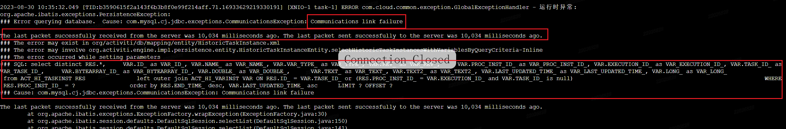
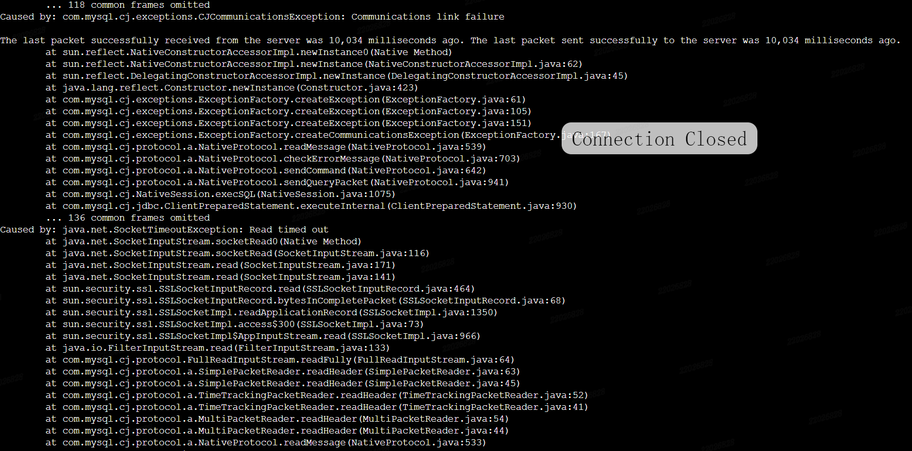
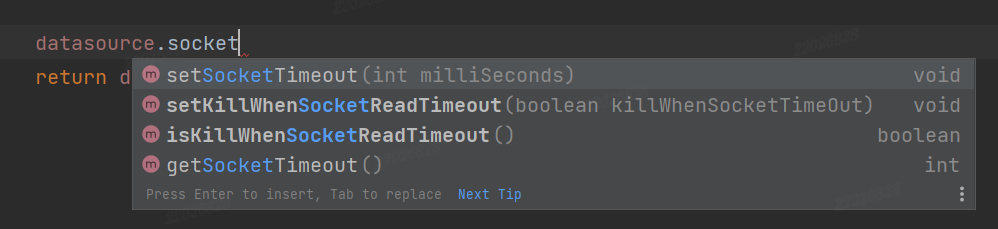
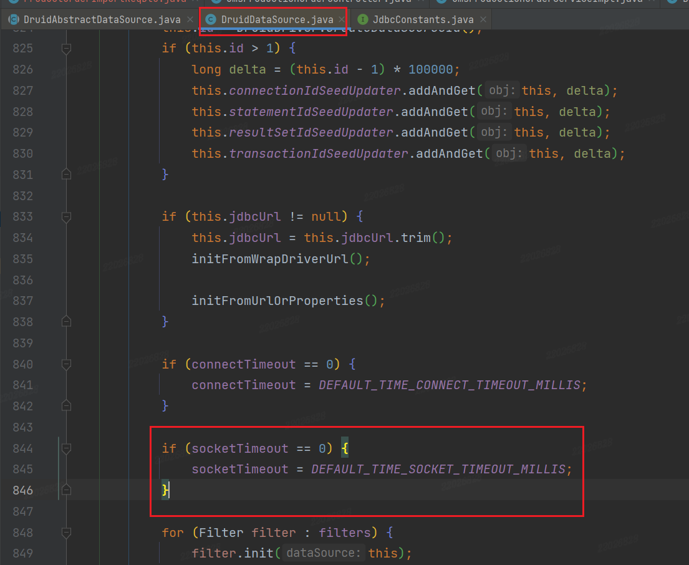

## 慢SQL导致数据库连接超时

[toc]

#### 一、背景

使用activity工作流引擎开启会签审批流，在某日进行功能调整后，该审批流的审核人员增多，在查看该流程历史时会报错。

报错详情如下：

~~~shell
2023-08-30 10:35:32.049 [TID:b3590615f2a143f6b3b8f0e99f214aff.71.16933629219330191] [XNIO-1 task-1] ERROR com.cloud.common.exception.GlobalExceptionHandler - 运行时异常:
org.apache.ibatis.exceptions.PersistenceException: 
### Error querying database.  Cause: com.mysql.cj.jdbc.exceptions.CommunicationsException: Communications link failure

The last packet successfully received from the server was 10,034 milliseconds ago. The last packet sent successfully to the server was 10,034 milliseconds ago.
### The error may exist in org/activiti/db/mapping/entity/HistoricTaskInstance.xml
### The error may involve org.activiti.engine.impl.persistence.entity.HistoricTaskInstanceEntity.selectHistoricTaskInstancesWithVariablesByQueryCriteria-Inline
### The error occurred while setting parameters
### SQL: select distinct RES.*,     VAR.ID_ as VAR_ID_, VAR.NAME_ as VAR_NAME_, VAR.VAR_TYPE_ as VAR_TYPE_, VAR.REV_ as VAR_REV_,     VAR.PROC_INST_ID_ as VAR_PROC_INST_ID_, VAR.EXECUTION_ID_ as VAR_EXECUTION_ID_, VAR.TASK_ID_ as VAR_TASK_ID_,     VAR.BYTEARRAY_ID_ as VAR_BYTEARRAY_ID_, VAR.DOUBLE_ as VAR_DOUBLE_,      VAR.TEXT_ as VAR_TEXT_, VAR.TEXT2_ as VAR_TEXT2_, VAR.LAST_UPDATED_TIME_ as VAR_LAST_UPDATED_TIME_, VAR.LONG_ as VAR_LONG_                  from ACT_HI_TASKINST RES               left outer join ACT_HI_VARINST VAR ON RES.ID_ = VAR.TASK_ID_ or (RES.PROC_INST_ID_ = VAR.EXECUTION_ID_ and VAR.TASK_ID_ is null)                                                        WHERE  RES.PROC_INST_ID_ = ?                order by RES.END_TIME_ desc, VAR.LAST_UPDATED_TIME_ asc      LIMIT ? OFFSET ?
### Cause: com.mysql.cj.jdbc.exceptions.CommunicationsException: Communications link failure

The last packet successfully received from the server was 10,034 milliseconds ago. The last packet sent successfully to the server was 10,034 milliseconds ago.
        at org.apache.ibatis.exceptions.ExceptionFactory.wrapException(ExceptionFactory.java:30)
        at org.apache.ibatis.session.defaults.DefaultSqlSession.selectList(DefaultSqlSession.java:150)
        at org.apache.ibatis.session.defaults.DefaultSqlSession.selectList(DefaultSqlSession.java:141)
        at org.activiti.engine.impl.db.DbSqlSession.selectListWithRawParameterWithoutFilter(DbSqlSession.java:450)
        at org.activiti.engine.impl.persistence.entity.HistoricTaskInstanceEntityManager.findHistoricTaskInstancesAndVariablesByQueryCriteria(HistoricTaskInstanceEntityManager.java:78)
        at org.activiti.engine.impl.HistoricTaskInstanceQueryImpl.executeList(HistoricTaskInstanceQueryImpl.java:141)
        at org.activiti.engine.impl.AbstractQuery.execute(AbstractQuery.java:164)
        at org.activiti.engine.impl.interceptor.CommandInvoker.execute(CommandInvoker.java:24)
        at org.activiti.engine.impl.interceptor.CommandContextInterceptor.execute(CommandContextInterceptor.java:57)
        at org.activiti.spring.SpringTransactionInterceptor$1.doInTransaction(SpringTransactionInterceptor.java:47)
        at org.springframework.transaction.support.TransactionTemplate.execute(TransactionTemplate.java:140)
        at org.activiti.spring.SpringTransactionInterceptor.execute(SpringTransactionInterceptor.java:45)
        at org.activiti.engine.impl.interceptor.LogInterceptor.execute(LogInterceptor.java:31)
        at org.activiti.engine.impl.cfg.CommandExecutorImpl.execute(CommandExecutorImpl.java:40)
        at org.activiti.engine.impl.cfg.CommandExecutorImpl.execute(CommandExecutorImpl.java:35)
        at org.activiti.engine.impl.AbstractQuery.list(AbstractQuery.java:138)
        at com.cloud.activiti.common.base.service.impl.BaseBpmTaskServiceImpl.getTasksByProInsId(BaseBpmTaskServiceImpl.java:233)
        at com.cloud.activiti.common.base.service.impl.BaseBpmTaskServiceImpl$$FastClassBySpringCGLIB$$dce79734.invoke(<generated>)
        at org.springframework.cglib.proxy.MethodProxy.invoke(MethodProxy.java:218)
        at org.springframework.aop.framework.CglibAopProxy$CglibMethodInvocation.invokeJoinpoint(CglibAopProxy.java:769)
        at org.springframework.aop.framework.ReflectiveMethodInvocation.proceed(ReflectiveMethodInvocation.java:163)
        at org.springframework.aop.framework.CglibAopProxy$CglibMethodInvocation.proceed(CglibAopProxy.java:747)
        at com.alibaba.druid.support.spring.stat.DruidStatInterceptor.invoke(DruidStatInterceptor.java:70)
        at org.springframework.aop.framework.ReflectiveMethodInvocation.proceed(ReflectiveMethodInvocation.java:186)
        at org.springframework.aop.framework.CglibAopProxy$CglibMethodInvocation.proceed(CglibAopProxy.java:747)
        at org.springframework.aop.framework.CglibAopProxy$DynamicAdvisedInterceptor.intercept(CglibAopProxy.java:689)
        at com.cloud.activiti.common.base.service.impl.BaseBpmTaskServiceImpl$$EnhancerBySpringCGLIB$$d973bb99.getTasksByProInsId(<generated>)
        at com.cloud.activiti.service.impl.BizAuditServiceImpl.getHistoryTaskListNew(BizAuditServiceImpl.java:299)
        at com.cloud.activiti.service.impl.BizAuditServiceImpl$$FastClassBySpringCGLIB$$9e608921.invoke(<generated>)
        at org.springframework.cglib.proxy.MethodProxy.invoke(MethodProxy.java:218)
        at org.springframework.aop.framework.CglibAopProxy$CglibMethodInvocation.invokeJoinpoint(CglibAopProxy.java:769)
        at org.springframework.aop.framework.ReflectiveMethodInvocation.proceed(ReflectiveMethodInvocation.java:163)
        at org.springframework.aop.framework.CglibAopProxy$CglibMethodInvocation.proceed(CglibAopProxy.java:747)
        at com.alibaba.druid.support.spring.stat.DruidStatInterceptor.invoke(DruidStatInterceptor.java:70)
        at org.springframework.aop.framework.ReflectiveMethodInvocation.proceed(ReflectiveMethodInvocation.java:186)
        at org.springframework.aop.framework.CglibAopProxy$CglibMethodInvocation.proceed(CglibAopProxy.java:747)
        at io.seata.spring.annotation.GlobalTransactionalInterceptor.invoke(GlobalTransactionalInterceptor.java:156)
        at org.springframework.aop.framework.ReflectiveMethodInvocation.proceed(ReflectiveMethodInvocation.java:186)
        at org.springframework.aop.framework.CglibAopProxy$CglibMethodInvocation.proceed(CglibAopProxy.java:747)
        at org.springframework.aop.framework.CglibAopProxy$DynamicAdvisedInterceptor.intercept(CglibAopProxy.java:689)
        at com.cloud.activiti.service.impl.BizAuditServiceImpl$$EnhancerBySpringCGLIB$$5b7aad80.getHistoryTaskListNew(<generated>)
        at com.cloud.activiti.controller.ActTaskController.flow$original$5MR4UnCn(ActTaskController.java:192)
        at com.cloud.activiti.controller.ActTaskController.flow$original$5MR4UnCn$accessor$l0EWjtRj(ActTaskController.java)
        at com.cloud.activiti.controller.ActTaskController$auxiliary$f76hMXIZ.call(Unknown Source)
        at org.apache.skywalking.apm.agent.core.plugin.interceptor.enhance.InstMethodsInter.intercept(InstMethodsInter.java:86)
        at com.cloud.activiti.controller.ActTaskController.flow(ActTaskController.java)
        at com.cloud.activiti.controller.ActTaskController$$FastClassBySpringCGLIB$$972fcea.invoke(<generated>)
        at org.springframework.cglib.proxy.MethodProxy.invoke(MethodProxy.java:218)
        at org.springframework.aop.framework.CglibAopProxy$CglibMethodInvocation.invokeJoinpoint(CglibAopProxy.java:769)
        at org.springframework.aop.framework.ReflectiveMethodInvocation.proceed(ReflectiveMethodInvocation.java:163)
        at org.springframework.aop.framework.CglibAopProxy$CglibMethodInvocation.proceed(CglibAopProxy.java:747)
        at com.alibaba.druid.support.spring.stat.DruidStatInterceptor.invoke(DruidStatInterceptor.java:70)
        at org.springframework.aop.framework.ReflectiveMethodInvocation.proceed(ReflectiveMethodInvocation.java:186)
        at org.springframework.aop.framework.CglibAopProxy$CglibMethodInvocation.proceed(CglibAopProxy.java:747)
        at org.springframework.aop.framework.CglibAopProxy$DynamicAdvisedInterceptor.intercept(CglibAopProxy.java:689)
        at com.cloud.activiti.controller.ActTaskController$$EnhancerBySpringCGLIB$$5b702e7b.flow(<generated>)
        at sun.reflect.NativeMethodAccessorImpl.invoke0(Native Method)
        at sun.reflect.NativeMethodAccessorImpl.invoke(NativeMethodAccessorImpl.java:62)
        at sun.reflect.DelegatingMethodAccessorImpl.invoke(DelegatingMethodAccessorImpl.java:43)
        at java.lang.reflect.Method.invoke(Method.java:498)
        at org.springframework.web.method.support.InvocableHandlerMethod.doInvoke(InvocableHandlerMethod.java:190)
        at org.springframework.web.method.support.InvocableHandlerMethod.invokeForRequest(InvocableHandlerMethod.java:138)
        at org.springframework.web.servlet.mvc.method.annotation.ServletInvocableHandlerMethod.invokeAndHandle(ServletInvocableHandlerMethod.java:106)
        at org.springframework.web.servlet.mvc.method.annotation.RequestMappingHandlerAdapter.invokeHandlerMethod(RequestMappingHandlerAdapter.java:879)
        at org.springframework.web.servlet.mvc.method.annotation.RequestMappingHandlerAdapter.handleInternal(RequestMappingHandlerAdapter.java:793)
        at org.springframework.web.servlet.mvc.method.AbstractHandlerMethodAdapter.handle(AbstractHandlerMethodAdapter.java:87)
        at org.springframework.web.servlet.DispatcherServlet.doDispatch(DispatcherServlet.java:1040)
        at org.springframework.web.servlet.DispatcherServlet.doService(DispatcherServlet.java:943)
        at org.springframework.web.servlet.FrameworkServlet.processRequest(FrameworkServlet.java:1006)
        at org.springframework.web.servlet.FrameworkServlet.doGet(FrameworkServlet.java:898)
        at javax.servlet.http.HttpServlet.service(HttpServlet.java:503)
        at org.springframework.web.servlet.FrameworkServlet.service(FrameworkServlet.java:883)
        at javax.servlet.http.HttpServlet.service(HttpServlet.java:590)
        at io.undertow.servlet.handlers.ServletHandler.handleRequest(ServletHandler.java:74)
        at io.undertow.servlet.handlers.FilterHandler$FilterChainImpl.doFilter(FilterHandler.java:129)
        at com.alibaba.druid.support.http.WebStatFilter.doFilter(WebStatFilter.java:114)
        at io.undertow.servlet.core.ManagedFilter.doFilter(ManagedFilter.java:61)
        at io.undertow.servlet.handlers.FilterHandler$FilterChainImpl.doFilter(FilterHandler.java:131)
        at org.springframework.web.filter.RequestContextFilter.doFilterInternal(RequestContextFilter.java:100)
        at org.springframework.web.filter.OncePerRequestFilter.doFilter(OncePerRequestFilter.java:119)
        at io.undertow.servlet.core.ManagedFilter.doFilter(ManagedFilter.java:61)
        at io.undertow.servlet.handlers.FilterHandler$FilterChainImpl.doFilter(FilterHandler.java:131)
        at org.springframework.web.filter.FormContentFilter.doFilterInternal(FormContentFilter.java:93)
        at org.springframework.web.filter.OncePerRequestFilter.doFilter(OncePerRequestFilter.java:119)
        at io.undertow.servlet.core.ManagedFilter.doFilter(ManagedFilter.java:61)
        at io.undertow.servlet.handlers.FilterHandler$FilterChainImpl.doFilter(FilterHandler.java:131)
        at org.springframework.web.filter.CharacterEncodingFilter.doFilterInternal(CharacterEncodingFilter.java:201)
        at org.springframework.web.filter.OncePerRequestFilter.doFilter(OncePerRequestFilter.java:119)
        at io.undertow.servlet.core.ManagedFilter.doFilter(ManagedFilter.java:61)
        at io.undertow.servlet.handlers.FilterHandler$FilterChainImpl.doFilter(FilterHandler.java:131)
        at io.undertow.servlet.handlers.FilterHandler.handleRequest(FilterHandler.java:84)
        at io.undertow.servlet.handlers.security.ServletSecurityRoleHandler.handleRequest(ServletSecurityRoleHandler.java:62)
        at io.undertow.servlet.handlers.ServletChain$1.handleRequest(ServletChain.java:68)
        at io.undertow.servlet.handlers.ServletDispatchingHandler.handleRequest(ServletDispatchingHandler.java:36)
        at io.undertow.servlet.handlers.RedirectDirHandler.handleRequest(RedirectDirHandler.java:68)
        at io.undertow.servlet.handlers.security.SSLInformationAssociationHandler.handleRequest(SSLInformationAssociationHandler.java:132)
        at io.undertow.servlet.handlers.security.ServletAuthenticationCallHandler.handleRequest(ServletAuthenticationCallHandler.java:57)
        at io.undertow.server.handlers.PredicateHandler.handleRequest(PredicateHandler.java:43)
        at io.undertow.security.handlers.AbstractConfidentialityHandler.handleRequest(AbstractConfidentialityHandler.java:46)
        at io.undertow.servlet.handlers.security.ServletConfidentialityConstraintHandler.handleRequest(ServletConfidentialityConstraintHandler.java:64)
        at io.undertow.security.handlers.AuthenticationMechanismsHandler.handleRequest(AuthenticationMechanismsHandler.java:60)
        at io.undertow.servlet.handlers.security.CachedAuthenticatedSessionHandler.handleRequest(CachedAuthenticatedSessionHandler.java:77)
        at io.undertow.security.handlers.AbstractSecurityContextAssociationHandler.handleRequest(AbstractSecurityContextAssociationHandler.java:43)
        at io.undertow.server.handlers.PredicateHandler.handleRequest(PredicateHandler.java:43)
        at io.undertow.server.handlers.PredicateHandler.handleRequest(PredicateHandler.java:43)
        at io.undertow.servlet.handlers.ServletInitialHandler.handleFirstRequest(ServletInitialHandler.java:269)
        at io.undertow.servlet.handlers.ServletInitialHandler.access$100(ServletInitialHandler.java:78)
        at io.undertow.servlet.handlers.ServletInitialHandler$2.call(ServletInitialHandler.java:133)
        at io.undertow.servlet.handlers.ServletInitialHandler$2.call(ServletInitialHandler.java:130)
        at io.undertow.servlet.core.ServletRequestContextThreadSetupAction$1.call(ServletRequestContextThreadSetupAction.java:48)
        at io.undertow.servlet.core.ContextClassLoaderSetupAction$1.call(ContextClassLoaderSetupAction.java:43)
        at io.undertow.servlet.handlers.ServletInitialHandler.dispatchRequest(ServletInitialHandler.java:249)
        at io.undertow.servlet.handlers.ServletInitialHandler.access$000(ServletInitialHandler.java:78)
        at io.undertow.servlet.handlers.ServletInitialHandler$1.handleRequest(ServletInitialHandler.java:99)
        at io.undertow.server.Connectors.executeRootHandler(Connectors.java:376)
        at io.undertow.server.HttpServerExchange$1.run(HttpServerExchange.java:830)
        at org.apache.skywalking.apm.plugin.undertow.v2x.SWRunnable.run(SWRunnable.java:45)
        at java.util.concurrent.ThreadPoolExecutor.runWorker(ThreadPoolExecutor.java:1149)
        at java.util.concurrent.ThreadPoolExecutor$Worker.run(ThreadPoolExecutor.java:624)
        at java.lang.Thread.run(Thread.java:750)
Caused by: com.mysql.cj.jdbc.exceptions.CommunicationsException: Communications link failure

The last packet successfully received from the server was 10,034 milliseconds ago. The last packet sent successfully to the server was 10,034 milliseconds ago.
        at com.mysql.cj.jdbc.exceptions.SQLError.createCommunicationsException(SQLError.java:174)
        at com.mysql.cj.jdbc.exceptions.SQLExceptionsMapping.translateException(SQLExceptionsMapping.java:64)
        at com.mysql.cj.jdbc.ClientPreparedStatement.executeInternal(ClientPreparedStatement.java:953)
        at com.mysql.cj.jdbc.ClientPreparedStatement.execute$original$LVilWdGt(ClientPreparedStatement.java:370)
        at com.mysql.cj.jdbc.ClientPreparedStatement.execute$original$LVilWdGt$accessor$qaovvCRU(ClientPreparedStatement.java)
        at com.mysql.cj.jdbc.ClientPreparedStatement$auxiliary$htIa8d58.call(Unknown Source)
        at org.apache.skywalking.apm.agent.core.plugin.interceptor.enhance.InstMethodsInter.intercept(InstMethodsInter.java:86)
        at com.mysql.cj.jdbc.ClientPreparedStatement.execute(ClientPreparedStatement.java)
        at com.alibaba.druid.filter.FilterChainImpl.preparedStatement_execute(FilterChainImpl.java:3446)
        at com.alibaba.druid.filter.FilterEventAdapter.preparedStatement_execute(FilterEventAdapter.java:434)
        at com.alibaba.druid.filter.FilterChainImpl.preparedStatement_execute(FilterChainImpl.java:3444)
        at com.alibaba.druid.proxy.jdbc.PreparedStatementProxyImpl.execute(PreparedStatementProxyImpl.java:158)
        at com.alibaba.druid.pool.DruidPooledPreparedStatement.execute(DruidPooledPreparedStatement.java:483)
        at org.apache.ibatis.executor.statement.PreparedStatementHandler.query(PreparedStatementHandler.java:63)
        at org.apache.ibatis.executor.statement.RoutingStatementHandler.query(RoutingStatementHandler.java:79)
        at org.apache.ibatis.executor.SimpleExecutor.doQuery(SimpleExecutor.java:63)
        at org.apache.ibatis.executor.BaseExecutor.queryFromDatabase(BaseExecutor.java:326)
        at org.apache.ibatis.executor.BaseExecutor.query(BaseExecutor.java:156)
        at org.apache.ibatis.executor.CachingExecutor.query(CachingExecutor.java:109)
        at org.apache.ibatis.executor.CachingExecutor.query(CachingExecutor.java:83)
        at org.apache.ibatis.session.defaults.DefaultSqlSession.selectList(DefaultSqlSession.java:148)
        ... 118 common frames omitted
Caused by: com.mysql.cj.exceptions.CJCommunicationsException: Communications link failure

The last packet successfully received from the server was 10,034 milliseconds ago. The last packet sent successfully to the server was 10,034 milliseconds ago.
        at sun.reflect.NativeConstructorAccessorImpl.newInstance0(Native Method)
        at sun.reflect.NativeConstructorAccessorImpl.newInstance(NativeConstructorAccessorImpl.java:62)
        at sun.reflect.DelegatingConstructorAccessorImpl.newInstance(DelegatingConstructorAccessorImpl.java:45)
        at java.lang.reflect.Constructor.newInstance(Constructor.java:423)
        at com.mysql.cj.exceptions.ExceptionFactory.createException(ExceptionFactory.java:61)
        at com.mysql.cj.exceptions.ExceptionFactory.createException(ExceptionFactory.java:105)
        at com.mysql.cj.exceptions.ExceptionFactory.createException(ExceptionFactory.java:151)
        at com.mysql.cj.exceptions.ExceptionFactory.createCommunicationsException(ExceptionFactory.java:167)
        at com.mysql.cj.protocol.a.NativeProtocol.readMessage(NativeProtocol.java:539)
        at com.mysql.cj.protocol.a.NativeProtocol.checkErrorMessage(NativeProtocol.java:703)
        at com.mysql.cj.protocol.a.NativeProtocol.sendCommand(NativeProtocol.java:642)
        at com.mysql.cj.protocol.a.NativeProtocol.sendQueryPacket(NativeProtocol.java:941)
        at com.mysql.cj.NativeSession.execSQL(NativeSession.java:1075)
        at com.mysql.cj.jdbc.ClientPreparedStatement.executeInternal(ClientPreparedStatement.java:930)
        ... 136 common frames omitted
Caused by: java.net.SocketTimeoutException: Read timed out
        at java.net.SocketInputStream.socketRead0(Native Method)
        at java.net.SocketInputStream.socketRead(SocketInputStream.java:116)
        at java.net.SocketInputStream.read(SocketInputStream.java:171)
        at java.net.SocketInputStream.read(SocketInputStream.java:141)
        at sun.security.ssl.SSLSocketInputRecord.read(SSLSocketInputRecord.java:464)
        at sun.security.ssl.SSLSocketInputRecord.bytesInCompletePacket(SSLSocketInputRecord.java:68)
        at sun.security.ssl.SSLSocketImpl.readApplicationRecord(SSLSocketImpl.java:1350)
        at sun.security.ssl.SSLSocketImpl.access$300(SSLSocketImpl.java:73)
        at sun.security.ssl.SSLSocketImpl$AppInputStream.read(SSLSocketImpl.java:966)
        at java.io.FilterInputStream.read(FilterInputStream.java:133)
        at com.mysql.cj.protocol.FullReadInputStream.readFully(FullReadInputStream.java:64)
        at com.mysql.cj.protocol.a.SimplePacketReader.readHeader(SimplePacketReader.java:63)
        at com.mysql.cj.protocol.a.SimplePacketReader.readHeader(SimplePacketReader.java:45)
        at com.mysql.cj.protocol.a.TimeTrackingPacketReader.readHeader(TimeTrackingPacketReader.java:52)
        at com.mysql.cj.protocol.a.TimeTrackingPacketReader.readHeader(TimeTrackingPacketReader.java:41)
        at com.mysql.cj.protocol.a.MultiPacketReader.readHeader(MultiPacketReader.java:54)
        at com.mysql.cj.protocol.a.MultiPacketReader.readHeader(MultiPacketReader.java:44)
        at com.mysql.cj.protocol.a.NativeProtocol.readMessage(NativeProtocol.java:533)
        ... 141 common frames omitted
~~~

提取关键信息：

可定位到具体报错SQL以及详细原因。

---

#### 二、排查过程

- 查看activity服务是否正常可用，服务有上述报错发生，但处于可用状态。

- 查看其他类型的审批流历史是否可正常打开，其他类型可正常打开，同类型的在某日发版前的也可正常打开。（通过postman以及查数据库进行）

- 确定是发版之后出现的问题，在测试环境进行尝试，测试环境使用正常，暂时排除代码编写问题。

- 排查配置问题，查看MySQL的超时时间，druid的连接池超时时间，配置均没发生变更。

- 连接生产环境，对nacos配置做切换，注册到不同的group中实现服务隔离。查看具体报错原因（与上述一致，很失望），找到具体的SQL，如下：

  ~~~sql
  SELECT DISTINCT RES.*,
                  VAR.ID_                AS VAR_ID_,
                  VAR.NAME_              AS VAR_NAME_,
                  VAR.VAR_TYPE_          AS VAR_TYPE_,
                  VAR.REV_               AS VAR_REV_,
                  VAR.PROC_INST_ID_      AS VAR_PROC_INST_ID_,
                  VAR.EXECUTION_ID_      AS VAR_EXECUTION_ID_,
                  VAR.TASK_ID_           AS VAR_TASK_ID_,
                  VAR.BYTEARRAY_ID_      AS VAR_BYTEARRAY_ID_,
                  VAR.DOUBLE_            AS VAR_DOUBLE_,
                  VAR.TEXT_              AS VAR_TEXT_,
                  VAR.TEXT2_             AS VAR_TEXT2_,
                  VAR.LAST_UPDATED_TIME_ AS VAR_LAST_UPDATED_TIME_,
                  VAR.LONG_              AS VAR_LONG_
  FROM ACT_HI_TASKINST RES
           LEFT OUTER JOIN
       ACT_HI_VARINST VAR
       ON RES.ID_ = VAR.TASK_ID_
           OR (
                      RES.PROC_INST_ID_ = VAR.EXECUTION_ID_
                  AND VAR.TASK_ID_ IS NULL
              )
  WHERE RES.PROC_INST_ID_ = '1696470476002308096'
  ORDER BY RES.END_TIME_ DESC,
           VAR.LAST_UPDATED_TIME_ ASC
  LIMIT 20000 OFFSET 0;
  ~~~

  找到报错的代码行：

  ~~~java
  // 查询该实例的任务节点
  List<HistoricTaskInstance> list = this.historyService.createHistoricTaskInstanceQuery()
          .processInstanceId(proInsId)
          .includeProcessVariables()
          .includeTaskLocalVariables()
          .orderByHistoricTaskInstanceEndTime().desc()
          .list();
  ~~~

- 将SQL放到datagrip中执行，发现SQL执行慢，要七八秒。

- 开始优化SQL，此处我觉得是弯路，实在是无从下手，尝试后放弃。

- 对代码进行调整，发现不带参数查询即可正常返回，于是断定是该语句执行慢导致的错误。

- 此时忽然想到在报错信息中，有一段话：

  ~~~shell
  The last packet successfully received from the server was 10,034 milliseconds ago. The last packet sent successfully to the server was 10,034 milliseconds ago.
  
  从服务器成功接收的最后一个数据包是10034毫秒前。最后一个成功发送到服务器的数据包是10034毫秒前。
  ~~~

  这其实可以说明：代码功能、数据库连接都是正常的，所以上面走了很多弯路！

  该错误的理解：从MySQL查询数据还没查询完，就被中止了！

  基于上述理解，结合最后的错误信息：

  ~~~shell
  Caused by: java.net.SocketTimeoutException: Read timed out
  ~~~

  突然想到是不是因为druid进行了升级，配置了监控，导致超时时间发生了变化。

  到durid的通用配置中，查看是否设置相关值，如图：

  

- 尝试延长socketTime，发现可正常返回。

- debug启动，查看原始值，发现默认为0，如果为则设置为10秒，如图：

  

- 将时间设置为30秒，问题解决，可能是druid版本进行了升级导致socketTimeout默认值发生了变化。

- 为什么不进行SQL优化，因为该服务中含有大量的慢SQL，后续会进行整体的优化。为了不影响大部分业务的正常运行，先延长超时时间。

---

#### 三、排查总结

将报错信息看完整，逐步分析，特别是没见过的错误！

在确定其他类型审批流和之前日期的审批流可正常查看历史后，便应该再次分析报错信息，便会发现配置问题，分析超时原因。