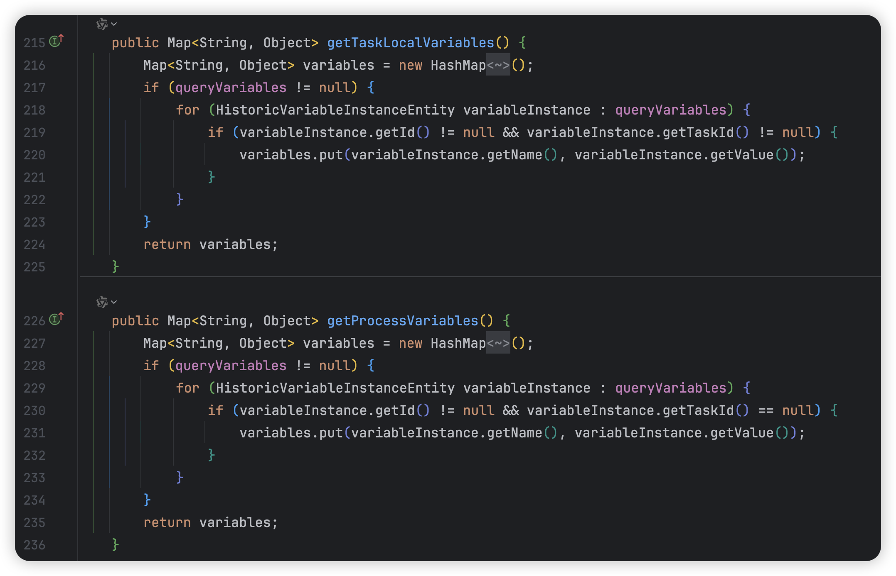

## 流程变量参数查询慢的解决方案

[toc]

#### 背景

在使用 activiti 引擎时，启动流程时会设置流程变量（比如发起人），在对任务进行处理时会对任务本地变量（比如处理结果和意见），同时会根据任务处理结果来得出流程的处理结果（同意或反对等）。

所以，在查询某一个流程实例的审批历史时，需要查询流程变量和任务的本地变量，此时使用 activiti 引擎的 API 进行查询在数据量大的情况下会特别慢。

---

#### 原查询方式

activiti 引擎提供了可以一次性查询出所有任务的 API，同时支持流程变量参数和本地任务参数的查询。

Java 代码如下：

~~~java
List<HistoricTaskInstance> list = this.historyService.createHistoricTaskInstanceQuery()
        .processInstanceId(proInsId)
        .includeProcessVariables()
        .includeTaskLocalVariables()
        .orderByHistoricTaskInstanceEndTime().desc()
        .list();
~~~

对应的 SQL 执行耗时 27 秒，SQL 如下：

~~~sql
-- includeTaskLocalVariables && includeProcessVariables
-- 27 s 366 ms (execution: 27 s 235 ms, fetching: 131 ms)
SELECT DISTINCT RES.*,
                VAR.ID_                AS VAR_ID_,
                VAR.NAME_              AS VAR_NAME_,
                VAR.VAR_TYPE_          AS VAR_TYPE_,
                VAR.REV_               AS VAR_REV_,
                VAR.PROC_INST_ID_      AS VAR_PROC_INST_ID_,
                VAR.EXECUTION_ID_      AS VAR_EXECUTION_ID_,
                VAR.TASK_ID_           AS VAR_TASK_ID_,
                VAR.BYTEARRAY_ID_      AS VAR_BYTEARRAY_ID_,
                VAR.DOUBLE_            AS VAR_DOUBLE_,
                VAR.TEXT_              AS VAR_TEXT_,
                VAR.TEXT2_             AS VAR_TEXT2_,
                VAR.LAST_UPDATED_TIME_ AS VAR_LAST_UPDATED_TIME_,
                VAR.LONG_              AS VAR_LONG_
FROM ACT_HI_TASKINST RES
         LEFT OUTER JOIN
     ACT_HI_VARINST VAR
     ON RES.ID_ = VAR.TASK_ID_
         OR (
            RES.PROC_INST_ID_ = VAR.EXECUTION_ID_
                AND VAR.TASK_ID_ IS NULL
            )
WHERE RES.PROC_INST_ID_ = '1696470476002308096'
ORDER BY RES.END_TIME_ DESC,
         VAR.LAST_UPDATED_TIME_ ASC
LIMIT 20000 OFFSET 0;
~~~

---

#### 原查询方式分析

从查询的执行 SQL 来看，主要就是两张表的关联查询，分别是 `ACT_HI_TASKINST` 和 `ACT_HI_VARINST`,一个存放任务，一个存放变量。其中，`ACT_HI_TASKINST` 数据量为 2306441， `ACT_HI_VARINST` 数据量为 702146。

从 SQL 来看，基本就可以得出是没有走索引了，使用 `EXPLAIN` 查看，`ACT_HI_VARINST` 的 type 为 ref_or_null，因为这是引擎自动生成的 SQL，无法对 SQL 进行优化，尝试优化索引，此时 ACT_HI_VARINST 表的索引如下：

~~~SQL
CREATE INDEX ACT_IDX_HI_PROCVAR_EXECUTION_ID
    ON act_hi_varinst (EXECUTION_ID_)
    COMMENT '流程ID索引';

CREATE INDEX ACT_IDX_HI_PROCVAR_NAME_TYPE
    ON act_hi_varinst (NAME_, VAR_TYPE_);

CREATE INDEX ACT_IDX_HI_PROCVAR_PROC_INST
    ON act_hi_varinst (PROC_INST_ID_);

CREATE INDEX ACT_IDX_HI_PROCVAR_TASK_ID
    ON act_hi_varinst (TASK_ID_);

CREATE INDEX ACT_IDX_HI_PROVAR_TASKID_NAME
    ON act_hi_varinst (TASK_ID_, NAME_);
~~~

通过对已有索引的分析，并不适合再建立其他索引，索引失效的原因可能跟`ACT_HI_VARINST` 表的 `ON` 关联时使用了 `OR` 以及 表的 `TASK_ID_` 使用了 IS NULL 的情况。 

再次通过对 SQL 分析，猜测 `JOIN` 条件中的 `OR` 分别对应了流程变量和本地任务变量的查询。如果是这样的话，那么便可以在代码层面进行一些优化。

---

#### 分析验证

为了验证对 SQL 查询的分析，分别在执行时只查询流程变量或者本地任务变量，查看相应的 SQL 执行情况。

##### 只查流程参数

Java 代码：

~~~java
List<HistoricTaskInstance> list = this.historyService.createHistoricTaskInstanceQuery()
        .processInstanceId(proInsId)
        .includeProcessVariables()
        // .includeTaskLocalVariables()
        .orderByHistoricTaskInstanceEndTime().desc()
        .list();
~~~

SQL 执行如下：

~~~SQL
-- includeProcessVariables
-- 144 ms (execution: 89 ms, fetching: 55 ms)
SELECT DISTINCT RES.*,
                VAR.ID_                AS VAR_ID_,
                VAR.NAME_              AS VAR_NAME_,
                VAR.VAR_TYPE_          AS VAR_TYPE_,
                VAR.REV_               AS VAR_REV_,
                VAR.PROC_INST_ID_      AS VAR_PROC_INST_ID_,
                VAR.EXECUTION_ID_      AS VAR_EXECUTION_ID_,
                VAR.TASK_ID_           AS VAR_TASK_ID_,
                VAR.BYTEARRAY_ID_      AS VAR_BYTEARRAY_ID_,
                VAR.DOUBLE_            AS VAR_DOUBLE_,
                VAR.TEXT_              AS VAR_TEXT_,
                VAR.TEXT2_             AS VAR_TEXT2_,
                VAR.LAST_UPDATED_TIME_ AS VAR_LAST_UPDATED_TIME_,
                VAR.LONG_              AS VAR_LONG_
FROM ACT_HI_TASKINST RES
         LEFT OUTER JOIN
     ACT_HI_VARINST VAR
     ON RES.PROC_INST_ID_ = VAR.EXECUTION_ID_
         AND VAR.TASK_ID_ IS NULL
WHERE RES.PROC_INST_ID_ = '1696470476002308096'
ORDER BY RES.END_TIME_ DESC,
         VAR.LAST_UPDATED_TIME_ ASC
LIMIT 20000 OFFSET 0;
~~~

##### 只查本地任务变量

~~~Java
List<HistoricTaskInstance> list = this.historyService.createHistoricTaskInstanceQuery()
        .processInstanceId(proInsId)
        // .includeProcessVariables()
        .includeTaskLocalVariables()
        .orderByHistoricTaskInstanceEndTime().desc()
        .list();
~~~

SQL 执行如下：

~~~SQL
-- includeTaskLocalVariables
-- 128 ms (execution: 86 ms, fetching: 42 ms)
SELECT DISTINCT RES.*,
                VAR.ID_                AS VAR_ID_,
                VAR.NAME_              AS VAR_NAME_,
                VAR.VAR_TYPE_          AS VAR_TYPE_,
                VAR.REV_               AS VAR_REV_,
                VAR.PROC_INST_ID_      AS VAR_PROC_INST_ID_,
                VAR.EXECUTION_ID_      AS VAR_EXECUTION_ID_,
                VAR.TASK_ID_           AS VAR_TASK_ID_,
                VAR.BYTEARRAY_ID_      AS VAR_BYTEARRAY_ID_,
                VAR.DOUBLE_            AS VAR_DOUBLE_,
                VAR.TEXT_              AS VAR_TEXT_,
                VAR.TEXT2_             AS VAR_TEXT2_,
                VAR.LAST_UPDATED_TIME_ AS VAR_LAST_UPDATED_TIME_,
                VAR.LONG_              AS VAR_LONG_
FROM ACT_HI_TASKINST RES
         LEFT OUTER JOIN
     ACT_HI_VARINST VAR
     ON RES.ID_ = VAR.TASK_ID_
WHERE RES.PROC_INST_ID_ = '1696470476002308096'
ORDER BY RES.END_TIME_ DESC,
         VAR.LAST_UPDATED_TIME_ ASC
LIMIT 20000 OFFSET 0;
~~~

##### 不查询流程变量和本地任务变量

Java 代码：

~~~java
List<HistoricTaskInstance> list = this.historyService.createHistoricTaskInstanceQuery()
        .processInstanceId(proInsId)
        // .includeProcessVariables()
        // .includeTaskLocalVariables()
        .orderByHistoricTaskInstanceEndTime().desc()
        .list();
~~~

SQL 执行：

~~~SQL
-- delete  includeTaskLocalVariables && includeProcessVariables
-- 112 ms (execution: 83 ms, fetching: 29 ms)
SELECT DISTINCT RES.*
FROM ACT_HI_TASKINST RES
WHERE RES.PROC_INST_ID_ = '1696470476002308096'
ORDER BY RES.END_TIME_ DESC
LIMIT 2147483647 OFFSET 0;
~~~

##### 变量查询 API

在 activiti 引擎中，同时提供了对流程实例的变量查询 API，可以查询某流程实例的流程变量和本地任务变量。

Java 代码：

~~~java
// 查询流程变量
List<HistoricVariableInstance> historicVariableInstanceList = this.historyService.createHistoricVariableInstanceQuery()
        .processInstanceId(proInsId)
        .list();
~~~

SQL 执行：

~~~sql 
-- createHistoricVariableInstanceQuery
-- 109 ms (execution: 77 ms, fetching: 32 ms)
SELECT RES.*
FROM ACT_HI_VARINST RES
WHERE RES.PROC_INST_ID_ = '1696470476002308096'
ORDER BY RES.ID_ ASC
LIMIT 2147483647 OFFSET 0;
~~~

##### 总结

通过上述的代码和 SQL 验证，可以确认是原 SQL 的索引失效，同时，可以得出两种解决方案：1.分别查流程参数和本地任务变量；2.不查询流程变量和本地任务变量和使用变量查询 API。

---

#### 解决方案分析

##### 分别查流程参数和本地任务变量

使用该方式查询本地任务变量之后，如果没有进行处理的任务会为空，此时使用 fastjson 进行格式化时，会报空指针。进行格式化只是本地本地调试使用，查看返回值，但是担心因为空值会引起其他问题，所以暂不使用本方案。

##### 使用变量 API 查询

在使用原查询方式时，便考虑过 activiti 引擎是怎么赋值的，随着这个疑问找到了`HistoricTaskInstanceEntity` 类，实现了 `HistoricTaskInstance` 接口。

`HistoricTaskInstanceEntity` 类中处理方式如下：

---

#### 最终解决方案

参考 activiti 的处理方式以及对原 SQL 的分析，得出最终解决方案。

先查询所有的任务节点，然后再查询该流程的所有变量，在代码中进行参数的转换和赋值。此时，两次查询都是单表查询，即使对 `ACT_HI_VARINST` 的查询是根据 `PROC_INST_ID_` ，但是设置了索引，会有一次回表查询，但是可以保证使用索引，大幅提高查询效率。

~~~java
// 查询该实例的任务节点
List<HistoricTaskInstance> list = this.historyService.createHistoricTaskInstanceQuery()
        .processInstanceId(proInsId)
        // .includeProcessVariables()
        // .includeTaskLocalVariables()
        .orderByHistoricTaskInstanceEndTime().desc()
        .list();
if (CollUtil.isEmpty(list)) {
    return Collections.emptyList();
}
// 对象转换
List<BaseBpmHisTaskDto> resList = list.stream()
        .map(ConvertActInterfaceToDtoUtil::convertToBaseBpmHisTaskDto)
        .collect(Collectors.toList());

// 查询流程变量
List<HistoricVariableInstance> historicVariableInstanceList = this.historyService.createHistoricVariableInstanceQuery()
        .processInstanceId(proInsId)
        .list();

// 设置流程变量和任务变量
Map<String, Object> processVariablesMap = new HashMap<>();
if (CollUtil.isNotEmpty(historicVariableInstanceList)) {
    resList.forEach(item -> {
        Map<String, Object> taskLocalVariablesMap = new HashMap<>();
        for (HistoricVariableInstance it : historicVariableInstanceList) {
            if (it.getTaskId() == null) {
                processVariablesMap.put(it.getVariableName(), it.getValue());
            }
            if (it.getTaskId() != null && item.getTaskId().equals(it.getTaskId())) {
                taskLocalVariablesMap.put(it.getVariableName(), it.getValue());
            }
        }
        item.setProcessVariables(processVariablesMap);
        item.setTaskLocalVariables(taskLocalVariablesMap);
    });
}
~~~

---

#### 难点

本次改动的难点并不在于方案的实现，而是对于变更后的数据的验证，要保证变更后的返回值和变更前一致，不能影响现有的业务。所以，要对返回值进行反复验证，这也是上述提到的 JSON 格式化问题。