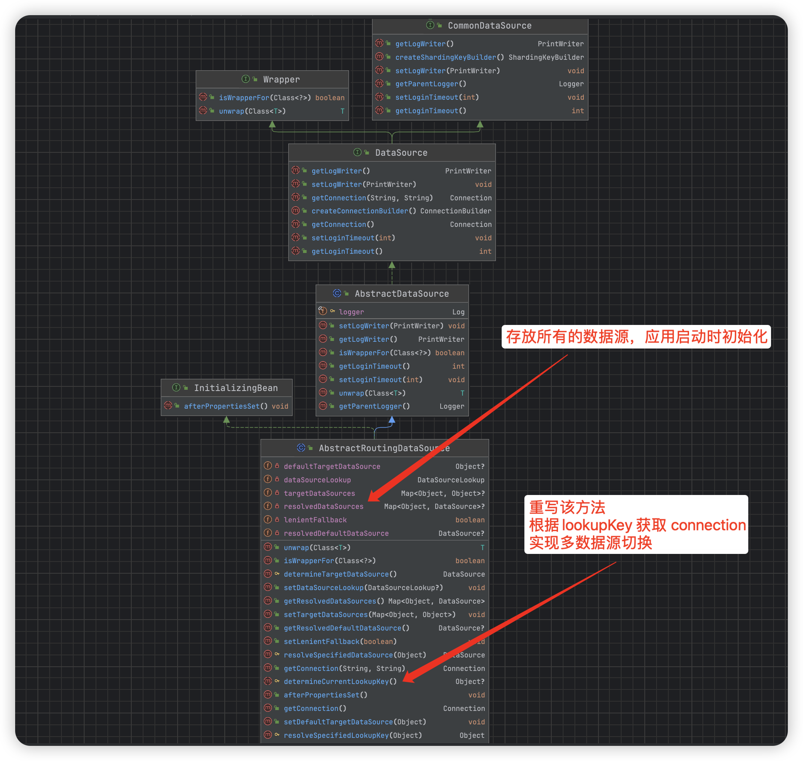
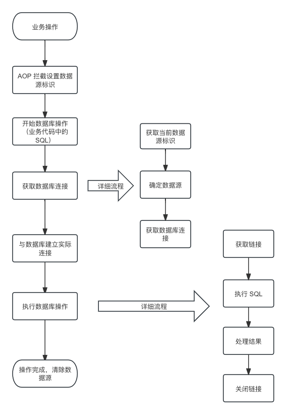

## Springboot多数据源及事务实现方案

[toc]

#### 背景

因业务需要，现要将当前系统的业务数据拆分为两部分 A 和 B，分别在不同的数据库中存储。本次方案在不借助中间件的情况下，在代码层面进行实现多数据源及事务。

业务系统技术栈：springboot、mybatis、tkmybatis、Druid、MySQL。

---

#### 问题分析

1. 本次变动是发生在数据层，即业务逻辑不变，只是数据的走向发生了变化。

2. 本次变动影响的维度有前端界面操作、定时任务以及第三方接口。

针对以上两点，所以在本次技术实现中，要做到：

1. 支持手动切换数据源，即自定义注解控制数据源切换。
2. 支持用户操作前端页面时，携带默认的数据源，即用切面实现数据源的控制。
3. 改动要小，不改动业务逻辑，少改动业务代码。（这个目标就注定要用 AOP。。。）

---

#### 实现原理

##### 1. 数据源抽象与动态路由

Spring 框架提供了`AbstractRoutingDataSource`，这是一个数据源路由抽象类，允许动态切换数据源。它内部维护了一个数据源映射（Map） `resolvedDataSources` ，可以根据某个键值（通常是当前线程的某种状态）来决定实际使用哪个数据源。在每次数据库操作前通过覆写 `determineCurrentLookupKey` 方法来提供这个键值，获取不同的 connection（数据库连接），从而实现动态数据源的选择。

 `AbstractRoutingDataSource` 类图如下：

##### 2. 线程本地存储（ThreadLocal）

为了在整个请求处理过程中保持数据源的一致性，通常会使用`ThreadLocal`来存储当前线程所选择的数据源标识。`ThreadLocal`提供了线程局部变量，确保每个线程只能访问自己的数据源标识，这样就可以在并发环境下安全地改变和存取当前线程的数据源选择。

##### 3. 面向切面编程（AOP）

通过使用AOP（面向切面编程），可以在不修改业务代码的前提下，实现数据源的动态切换。具体做法是定义一个切面（Aspect），在这个切面中拦截特定的方法调用（比如，使用自定义注解标记的方法）。在方法执行前，根据方法上的注解或其他逻辑来设置 `ThreadLocal` 中的数据源标识，方法执行后清除这个标识。这样，当执行数据库操作时，就会根据当前线程的数据源标识来选择相应的数据源。

##### 4. 自定义注解

为了更灵活地控制数据源的选择，通常会定义一个或多个自定义注解（如`@DataSource`）。在业务方法上使用这些注解来指明该方法应当使用的数据源。结合AOP，可以在方法执行前读取这些注解的值，据此动态切换数据源。

---

#### 实现流程

通过AOP切面，在方法执行前后分别设置和清除`ThreadLocal`中的数据源标识。这一步骤是通过拦截带有`@TargetDataSource`注解的方法来实现的。

##### 1. 设置数据源标识

通过AOP，在方法执行前分别设置 `ThreadLocal`中的数据源标识。

##### 2. 开始数据库操作

当开始执行一个数据库操作（如查询、更新）时，MyBatis 会尝试通过 `SqlSessionFactoryBean` 中配置的 `DataSource` 获取数据库连接。

##### 3. 获取数据库连接

MyBatis 通过 `SqlSessionFactoryBean` 配置的 `DataSource` 获取数据库连接，确定使用的数据源之后，再去 Druid 连接池中获取相应的连接。

  1. **获取当前数据源标识（determineCurrentLookupKey）**：

     我们配置的`DataSource` 是 `DynamicDataSource`，则会触发`DynamicDataSource` 的 `getConnection` 方法（因为没有重写该方法，所以实际使用的还是 `AbstractRoutingDataSource ` 中的`getConnection`方法）。

     `getConnection` 方法内部会调用`determineTargetDataSource`方法，该方法又会调用`determineCurrentLookupKey`。

     在`determineCurrentLookupKey`方法中，通过`DynamicDataSourceContextHolder.peek()` 获取当前线程设置的数据源标识。

2. **确定数据源**：

   根据上一步中获取的数据源标识，`AbstractRoutingDataSource`从其维护的目标数据源映射中选择相应的 `DataSource`。

3. **获取数据库连接**：

   根据上一步选定的 `DataSource` 从 Druid 连接池中获取一个池子分配的现有连接，或者在没有可用连接时建立一个新的数据库连接相应的数据库连接。

##### 4. 执行数据库操作

​		有了数据库连接后，MyBatis 就可以执行相应的数据库操作了，以下操作 Mybatis 已经实现自动化，无需编写代码实现。

1. **获取连接（`getConnection`）**：

   使用上一步获取到的连接。

2. **执行SQL语句**：

   一旦获取到数据库连接，系统就可以使用这个连接来创建一个或多个SQL语句（Statement、PreparedStatement等），并通过这些语句执行具体的SQL操作（如查询、更新、删除等）。

3. **处理结果**：

   对于查询操作，执行SQL之后会得到一个结果集（ResultSet），接下来需要对这个结果集进行处理，提取出需要的数据。对于更新、删除等操作，通常会返回一个表示受影响行数的整数。

4. **关闭连接**：

   在SQL操作完成后，应当关闭ResultSet、Statement以及Connection，释放资源。在使用连接池的情况下，关闭连接通常意味着将连接返回给连接池，以便再次使用，而不是真正关闭物理连接。

##### 5. 操作完成

数据库操作完成后，通过AOP切面在方法执行后清除 `ThreadLocal` 中的数据源标识，保证下一次操作不会受到影响。

流程图如下：

---

#### 多数据源事务

##### 1. 多数据源事务简介

在多数据源的情况下，具体来说是在一个方法中既使用了数据源 A 又使用了数据源 B 的情况下，事务会失效，即无法实现数据源 A 和数据源 B 同时提交和回滚。

事务的具体原理不在本篇作过多的介绍（后面有时间就补一篇），本篇会对比集中实现多数据源事务的方案。

**多数据源情况下事务失效简单来说就是 Spring 默认的事务只是针对同一个数据库链接实现的，不支持多个数据库链接。**由上面的实现原理和实现流程可知，在执行 SQL 语句时会获取数据库链接，Spring 的事务会缓存第一个数据库链接，当第二个SQL 是不同的数据源时，不会重新获取链接，导致事务失效。

##### 2. 多数据源事务实现方案对比：

1. 通过改变传播机制，即通过新开事务的方式。

   该方案需要对所有使用到事务的业务代码进行重构，费时费力。

2. 配置多套 Mapper，使用不同的事务管理器

   该方案需要将现有的 Mapper 拆分为多套，从而实现事务控制。该方案维护成本以及后续开发成本高，更适合将读写拆分为不同 Mapper 的项目。

3. XA 二阶段提交

   MySQL 支持 XA 二阶段提交，但该方式比较重，会存在一定的性能问题。且该方式使用 tkmybatis 时，tkmybatis 框架的方法失效；mybatis-plus 框架正常。

4. 自定义事务管理器

   采用该方案。从数据源失效的原因可知，实现多数据源事务需要将多个数据库链接放到同一个事务中，所以自定义事务管理器，实现多个数据库链接的提交和回滚。

---

#### 代码实现

##### 1. 数据源切换控制器

用于进行数据源的切换和清除。

~~~java
package com.cloud.common.multidatasource;

import org.springframework.core.NamedThreadLocal;
import java.util.ArrayDeque;
import java.util.Deque;
import java.util.Objects;

/**
 * 动态数据源切换控制器
 * 

 * author: lzhch
 * version: v3.0.1
 * date: 2023/12/5 11:06
 */

public final class DynamicDataSourceContextHolder {

    /**
     * 为什么要用链表存储(准确的是栈)
     * <pre>
     * 为了支持嵌套切换，如ABC三个service都是不同的数据源
     * 其中A的某个业务要调B的方法，B的方法需要调用C的方法。一级一级调用切换，形成了链。
     * 传统的只设置当前线程的方式不能满足此业务需求，必须使用栈，后进先出。
     * </pre>
     */
    private static final ThreadLocal<Deque<String>> LOOKUP_KEY_HOLDER = new NamedThreadLocal<Deque<String>>("dynamic-datasource") {
        @Override
        protected Deque<String> initialValue() {
            return new ArrayDeque<>();
        }
    };

    private DynamicDataSourceContextHolder() {
    }

    /**
     * 获得当前线程数据源
     *
     * @return 数据源名称
     */
    public static String peek() {
        return LOOKUP_KEY_HOLDER.get().peek();
    }

    /**
     * 设置当前线程数据源
     * 

     * 如非必要不要手动调用，调用后确保最终清除
     * 

     *
     * @param ds 数据源名称
     */
    public static void push(String ds) {
        String dataSourceStr = Objects.isNull(ds) || ds.isEmpty() ? "" : ds;
        LOOKUP_KEY_HOLDER.get().push(dataSourceStr);
    }

    /**
     * 清空当前线程数据源
     * 

     * 如果当前线程是连续切换数据源 只会移除掉当前线程的数据源名称
     * 

     */
    public static void poll() {
        Deque<String> deque = LOOKUP_KEY_HOLDER.get();
        deque.poll();
        if (deque.isEmpty()) {
            clear();
        }
    }

    /**
     * 强制清空本地线程
     * 

     * 防止内存泄漏，如手动调用了push可调用此方法确保清除
     * 

     */
    public static void clear() {
        LOOKUP_KEY_HOLDER.remove();
    }

}
~~~

##### 2.  多数据源配置

读取配置文件中的多数据源配置并初始化，怎么读取配置不过多介绍。

~~~java
package com.cloud.common.multidatasource.config;

import com.alibaba.druid.pool.DruidDataSource;
import com.alibaba.druid.support.http.StatViewServlet;
import com.alibaba.druid.support.http.WebStatFilter;
import com.alibaba.druid.support.spring.stat.DruidStatInterceptor;
import org.springframework.aop.support.DefaultPointcutAdvisor;
import org.springframework.aop.support.JdkRegexpMethodPointcut;
import org.springframework.boot.context.properties.ConfigurationProperties;
import org.springframework.boot.web.servlet.FilterRegistrationBean;
import org.springframework.boot.web.servlet.ServletRegistrationBean;
import org.springframework.context.annotation.Bean;
import org.springframework.context.annotation.Configuration;
import org.springframework.context.annotation.Primary;
import org.springframework.context.annotation.Scope;
import javax.annotation.Resource;
import javax.sql.DataSource;
import java.sql.SQLException;
import java.util.HashMap;
import java.util.Map;

/**
 * druid 配置
 * 

 * Author: lzhch 2023/8/17 15:35
 * Since: 3.0.1 
 */
@Configuration
public class DruidCommonConfig {

    @Resource
    private DruidCommonProperties druidCommonProperties;

    /**
     * 设置主数据源
     * initMethod = "init", 其中 init 调用 DruidDataSource 中的 init 方法;
     * 指定该属性, 可在应用启动时控制台看到初始化日志; 若不指定, 则在使用时进行初始化, 且不会打印初始化日志.
     *
     * @return DataSource
     * Author: lzhch 2023/12/6 17:36
     * Since: v3.0.1
     */
    @Bean(name = "masterDataSource")
    @ConfigurationProperties("spring.datasource.druid.master")
    public DataSource masterDataSource() throws SQLException {
        // 获取Druid配置的从数据库映射Map
        DataSourceBasicProperties master = druidCommonProperties.getMaster();

        // 创建Druid数据源对象
        DruidDataSource druidDataSource = druidCommonProperties.dataSource();
        // 设置数据源名称/数据库连接URL/用户名/密码/驱动类名
        druidDataSource.setName(master.getName());
        druidDataSource.setUrl(master.getUrl());
        druidDataSource.setUsername(master.getUsername());
        druidDataSource.setPassword(master.getPassword());
        druidDataSource.setDriverClassName(master.getDriverClassName());

        // 初始化数据源
        druidDataSource.init();

        return druidDataSource;
    }

    /**
     * 进行多数据源设置
     *
     * @return DynamicDataSource
     * Author: lzhch 2023/12/6 17:38
     * Since: v3.0.1
     */
    @Primary
    @Bean(name = "dynamicDataSource")
    public DynamicDataSource dataSource() throws SQLException {
        Map<Object, Object> targetDataSources = new HashMap<>();
        targetDataSources.put(DataSourceType.MASTER, masterDataSource());

        // 获取Druid配置的从数据库映射Map
        Map<String, DataSourceBasicProperties> allDataSourcesMap = druidCommonProperties.getSlaveDataSourcesMap();

        // 遍历从数据库映射Map
        for (Map.Entry<String, DataSourceBasicProperties> entry : allDataSourcesMap.entrySet()) {

            // 获取键值
            String key = entry.getValue().getName();
            DataSourceBasicProperties value = entry.getValue();

            // 创建Druid数据源对象
            DruidDataSource druidDataSource = druidCommonProperties.dataSource();
            // 设置数据源名称/数据库连接URL/用户名/密码/驱动类名
            druidDataSource.setName(key);
            druidDataSource.setUrl(value.getUrl());
            druidDataSource.setUsername(value.getUsername());
            druidDataSource.setPassword(value.getPassword());
            druidDataSource.setDriverClassName(value.getDriverClassName());

            // 初始化数据源
            druidDataSource.init();

            // 将数据源添加到targetDataSources中
            targetDataSources.put(key, druidDataSource);
        }

        // 返回动态数据源
        return new DynamicDataSource(masterDataSource(), targetDataSources);
    }

}
~~~

##### 3. 动态数据源

进行多数据源的初始化，继承 `AbstractRoutingDataSource` 并且重写 `determineCurrentLookupKey` 。

~~~java
package com.cloud.common.multidatasource.config;

import cn.hutool.core.util.StrUtil;
import com.cloud.common.multidatasource.DynamicDataSourceContextHolder;
import org.springframework.jdbc.datasource.lookup.AbstractRoutingDataSource;
import javax.sql.DataSource;
import java.util.Map;

/**
 * 动态数据源
 * 

 * author: lzhch
 * version: v3.0.1
 * date: 2023/12/5 15:51
 */

public class DynamicDataSource extends AbstractRoutingDataSource {

    /**
     * 默认数据源
     */
    private final DataSource defaultTargetDataSource;

    /**
     * 所有数据源(包含默认数据源)
     */
    private final Map<Object, Object> targetDataSources;

    /**
     * 设置所有的数据源
     */
    public DynamicDataSource(DataSource defaultTargetDataSource, Map<Object, Object> targetDataSources) {
        this.defaultTargetDataSource = defaultTargetDataSource;
        this.targetDataSources = targetDataSources;
    }

    /**
     * 确定当前数据源
     *
     * @return Object
     * Author: lzhch 2023/12/6 16:16
     * Since: v3.0.1
     */
    @Override
    protected Object determineCurrentLookupKey() {
        String ds = DynamicDataSourceContextHolder.peek();
        return StrUtil.isBlank(ds) ? DataSourceType.MASTER : ds;
    }

    @Override
    public void afterPropertiesSet() {
        super.setDefaultTargetDataSource(defaultTargetDataSource);
        super.setTargetDataSources(targetDataSources);
        super.afterPropertiesSet();
    }

}
~~~

##### 4. 自定义注解和切面

自定义注解搭配 AOP 实现手动控制多数据源切换

~~~java
package com.cloud.common.multidatasource.annotation;

import com.cloud.common.multidatasource.config.DataSourceType;
import java.lang.annotation.*;

/**
 * 多数据源注解
 * 

 * author: lzhch
 * version: v3.0.1
 * date: 2023/12/8 11:23
 */

@Target({ElementType.METHOD, ElementType.TYPE})
@Retention(RetentionPolicy.RUNTIME)
@Documented
public @interface DataSource {

    String value() default DataSourceType.MASTER;

}
~~~

##### 5. 切面

在切面中定义切点（Pointcut），对切点进行不同的设置即可实现不同场景的需求。下面的代码是实现拦截自定义注解的示例，也可以拦截包路径、方法等，从而可以实现根据登录的用户信息切换不同的数据源。

~~~java
package com.cloud.common.multidatasource.aspect;

import com.cloud.common.multidatasource.DynamicDataSourceContextHolder;
import com.cloud.common.multidatasource.annotation.DataSource;
import lombok.extern.slf4j.Slf4j;
import org.aspectj.lang.ProceedingJoinPoint;
import org.aspectj.lang.annotation.Around;
import org.aspectj.lang.annotation.Aspect;
import org.aspectj.lang.annotation.Pointcut;
import org.aspectj.lang.reflect.MethodSignature;
import org.springframework.stereotype.Component;
import java.lang.reflect.Method;

/**
 * 数据源切面, 进行数据源的切换
 * 

 * author: lzhch
 * version: v3.0.1
 * date: 2023/12/6 11:25
 */

@Slf4j
@Aspect
@Component
public class DataSourceAspect {

    /*
     * @annotation 匹配所有被 DataSource 注解标记的方法。
     * @within 匹配所有在被 DataSource 注解标记的类中定义的方法。
     * 注意：这里只拦截所注解的类，如果调用的是父类的方法，那么不会拦截，除非父类方法在子类中被覆盖。
     */
    @Pointcut("@annotation(com.cloud.common.multidatasource.annotation.DataSource) || @within(com.cloud.common.multidatasource.annotation.DataSource)")
    public void dataSourcePointCut() {
    }

    /**
     * 在指定的切点表达式dataSourcePointCut()周围进行拦截。
     *
     * @param point 过程节点，包含需要被拦截的方法
     * @return 拦截后的方法返回值
     * @throws Throwable 可能抛出的异常
     */
    @Around("dataSourcePointCut()")
    public Object around(ProceedingJoinPoint point) throws Throwable {
        MethodSignature signature = (MethodSignature) point.getSignature();
        Method method = signature.getMethod();
        String methodName = method.getName();
        Class<?> dataClass = Class.forName(signature.getDeclaringTypeName());
        String className = dataClass.getName();

        DataSource dsMethod = method.getAnnotation(DataSource.class);
        DataSource dsClass = dataClass.getAnnotation(DataSource.class);
        if (dsMethod != null) {
            //方法优先，如果方法上存在注解，则优先使用方法上的注解
            DynamicDataSourceContextHolder.push(dsMethod.value());
            log.info("方法优先，{} 方法设置数据源为: {}", methodName, dsMethod.value());
        } else if (dsClass != null) {
            //其次类优先，如果类上存在注解，则使用类上的注解
            DynamicDataSourceContextHolder.push(dsClass.value());
            log.info("类优先，{} 类设置数据源为： {}", className, dsClass.value());
        }

        try {
            return point.proceed();
        } finally {
            DynamicDataSourceContextHolder.poll();
            log.info("清理数据源");
        }
    }

}
~~~

##### 6. 事务

1. 多数据源事务控制器

   用于控制事务的提交和回滚

   ~~~java
   package com.cloud.common.multidatasource.transaction;
   
   import com.cloud.common.multidatasource.DynamicDataSourceContextHolder;
   import com.cloud.common.multidatasource.config.DataSourceType;
   import com.google.common.base.Strings;
   import com.google.common.collect.Maps;
   import org.apache.ibatis.transaction.Transaction;
   import org.springframework.jdbc.datasource.DataSourceUtils;
   import org.springframework.util.Assert;
   import javax.sql.DataSource;
   import java.sql.Connection;
   import java.sql.SQLException;
   import java.util.concurrent.ConcurrentMap;
   
   
   /**
    * 多数据源事务管理器
    * 

    * spring 原生的事务管理是只会获取一次连接, 并将连接缓存, 第二次获取时直接从缓存中获取
    * 所以导致了切换数据源失效, 因为第二次(不同数据源)并没有去重新获取数据库连接, 还是使用第一次的连接
    * 所以这里重写了事务管理器, 每次都会重新获取数据库连接, 并将连接缓存到 datasourceConnMap 中
    * 从而实现不同的数据源获取不同的连接, 从而开启不同的事务
    */
   public class MultiDataSourceTransaction implements Transaction {
   
       private final DataSource dataSource;
   
       private final ConcurrentMap<String, Connection> datasourceConnMap;
   
       private boolean autoCommit;
   
       public MultiDataSourceTransaction(DataSource dataSource) {
           Assert.notNull(dataSource, "No DataSource specified");
           this.dataSource = dataSource;
           datasourceConnMap = Maps.newConcurrentMap();
       }
   
       /**
        * 获取数据库连接
        * 每次都根据数据源标识获取数据库连接, 并将连接缓存到 datasourceConnMap 中
        * 从而实现不同的数据源获取不同的连接, 从而开启不同的事务
        * spring 原生的只会获取一次连接, 所以会导致开启事务时切换数据源失效
        */
       @Override
       public Connection getConnection() throws SQLException {
           String ds = DynamicDataSourceContextHolder.peek();
           if (Strings.isNullOrEmpty(ds)) {
               ds = DataSourceType.MASTER;
           }
   
           if (this.datasourceConnMap.containsKey(ds)) {
               return this.datasourceConnMap.get(ds);
           }
   
           Connection conn = this.dataSource.getConnection();
           autoCommit = false;
           conn.setAutoCommit(autoCommit);
           this.datasourceConnMap.put(ds, conn);
           return conn;
       }
   
       /**
        * 提交事务
        * 将所有的数据源连接分别进行事务的提交
        */
       @Override
       public void commit() throws SQLException {
           for (Connection conn : this.datasourceConnMap.values()) {
               if (!autoCommit) {
                   conn.commit();
               }
           }
       }
   
       /**
        * 回滚事务
        * 将所有的数据源连接分别进行事务的回滚
        */
       @Override
       public void rollback() throws SQLException {
           for (Connection conn : this.datasourceConnMap.values()) {
               conn.rollback();
           }
       }
   
       /**
        * 关闭连接
        * 将所有的数据源连接分别进行关闭
        */
       @Override
       public void close() throws SQLException {
           for (Connection conn : this.datasourceConnMap.values()) {
               DataSourceUtils.releaseConnection(conn, dataSource);
           }
       }
   
       @Override
       public Integer getTimeout() {
           return null;
       }
   
   }
   ~~~

2. 多数据源事务工厂，使用自定义事务替换默认事务

   ~~~java
   package com.cloud.common.multidatasource.transaction;
   
   import org.apache.ibatis.session.TransactionIsolationLevel;
   import org.apache.ibatis.transaction.Transaction;
   import org.mybatis.spring.transaction.SpringManagedTransactionFactory;
   import javax.sql.DataSource;
   
   public class MultiDataSourceTransactionFactory extends SpringManagedTransactionFactory {
   
   	/**
   	 *  自定义事务管理器, 替换掉 spring 默认的 SpringManagedTransaction
   	 * @param dataSource DataSource to take the connection from
   	 * @param level Desired isolation level
   	 * @param autoCommit Desired autocommit
   	 * @return Transaction 新的事务管理器
   	 */
   	@Override
   	public Transaction newTransaction(DataSource dataSource, TransactionIsolationLevel level, boolean autoCommit) {
   		return new MultiDataSourceTransaction(dataSource);
   	}
   
   }
   ~~~

3. 多数据源事务配置，在 sqlSession 中设置自定义事务

   ~~~java
   package com.cloud.common.multidatasource.transaction;
   
   import org.apache.ibatis.session.SqlSessionFactory;
   import org.mybatis.spring.SqlSessionFactoryBean;
   import org.springframework.beans.factory.annotation.Qualifier;
   import org.springframework.context.annotation.Bean;
   import org.springframework.context.annotation.Configuration;
   import org.springframework.core.io.Resource;
   import org.springframework.core.io.support.PathMatchingResourcePatternResolver;
   import org.springframework.util.Assert;
   import tk.mybatis.mapper.autoconfigure.MybatisProperties;
   import tk.mybatis.spring.annotation.MapperScan;
   import javax.sql.DataSource;
   import java.util.ArrayList;
   import java.util.Arrays;
   import java.util.List;
   
   /**
    * 多数据源事务的相关配置
    * 

    * author: lzhch
    * version: v1.0
    * date: 2024/1/24 17:29
    */
   
   @Configuration
   @MapperScan(value = "com.cloud.*.mapper")
   public class MultiDataSourceTransactionConfig {
   
       @javax.annotation.Resource
       private MybatisProperties mybatisProperties;
   
       /**
        * 设置 SqlSessionFactory
        */
       @Bean
       public SqlSessionFactory sqlSessionFactory(@Qualifier("dynamicDataSource") DataSource dataSource) throws Exception {
           SqlSessionFactoryBean sqlSessionFactoryBean = new SqlSessionFactoryBean();
           sqlSessionFactoryBean.setTransactionFactory(new MultiDataSourceTransactionFactory());
           sqlSessionFactoryBean.setDataSource(dataSource);
           sqlSessionFactoryBean.setTypeAliasesPackage(mybatisProperties.getTypeAliasesPackage());
           List<Resource> resourceList = new ArrayList<>();
           for (String mapperLocation : mybatisProperties.getMapperLocations()) {
               resourceList.addAll(Arrays.asList(new PathMatchingResourcePatternResolver().getResources(mapperLocation)));
           }
           Assert.notEmpty(resourceList, "mapperLocations can't be empty");
           sqlSessionFactoryBean.setMapperLocations(resourceList.toArray(new org.springframework.core.io.Resource[resourceList.size()]));
   
           org.apache.ibatis.session.Configuration configuration = mybatisProperties.getConfiguration();
           sqlSessionFactoryBean.setConfiguration(configuration);
   
           return sqlSessionFactoryBean.getObject();
       }
   
   }
   ~~~

---

