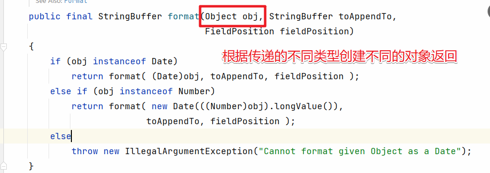
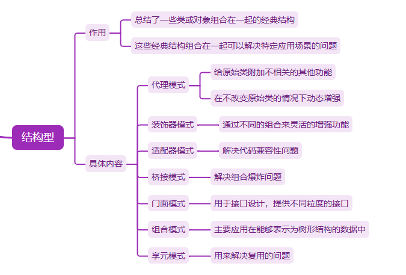
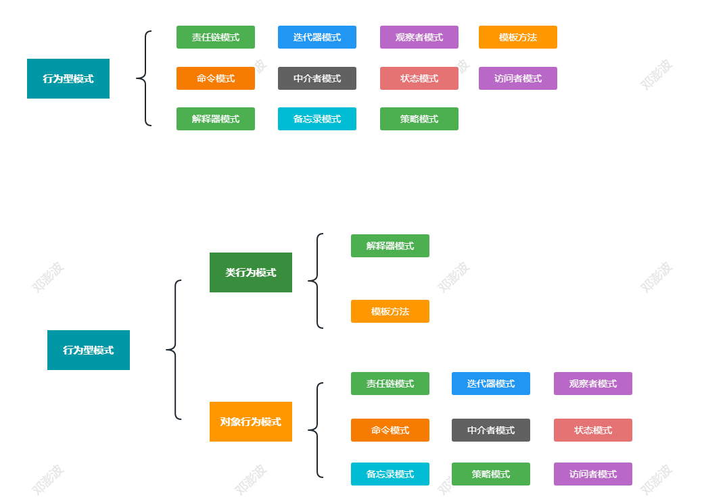

# 设计模式-从原理到案例实战

> lecture：波哥


# 一、设计模式的介绍

## 1.什么是设计模式

​	`设计模式`是软件开发中的最佳实践，帮助开发者在面对复杂设计问题时提供有效的解决方案。设计模式也是前人根据经验总结出来的。设计模式不仅仅只是一种规范，更多的是一种设计思路和经验总结。

​	设计模式的作用：经验的传承，提高了软件复用的水平，最终达到提高软件开发效率。

​	设计模式讲的是如何写出可扩展、可读、可维护的⾼质量代码，所以，它们跟平时的编码会有直接的关系，也会直接影响到你的开发能⼒。

## 2. 为什么要学习设计模式

1. 当然是应对面试中涉及到的设计模式的相关问题
2. 提高自身应对复杂代码的设计和开发能力
3. 为我们学习底层技术，读源码更加事半功倍
4. 让自身的职业生涯更好的发展


## 3.设计模式涉及到的设计原则

​	设计原则是指导我们代码设计的⼀些经验总结，对于某些场景下，是否应该应⽤某种设计模式，具有指导意义。

| 设计原则                    | 简单说明                                                     |
| --------------------------- | :----------------------------------------------------------- |
| 单一职责                    | 一个类只负责一项职责                                         |
| 里氏替换原则                | 子类可以扩展父类的功能，但不能改变父类原有的功能             |
| 依赖倒置原则                | 要依赖于抽象，不要依赖于具体，核心思想是**面向接口编程**     |
| 接口隔离原则                | 建立单一接口，不要建立庞大臃肿的接口，尽量细化接口，接口中的方法尽量少 |
| 迪米特法则 （最少知道原则） | 一个对象应该对其他对象保持最少的了解                         |
| 开闭原则                    | 对扩展开放，对修改关闭                                       |

​	掌握好设计模式的目的只有一个：提高你编码的能力，写出高质量的代码，使用好设计模式相当于站在了前人的肩膀上。

## 4. 设计模式的分类

设计模式的分类


创建型模式：都是用来帮助我们创建对象的！


结构性模式:关注对象和类的组织


行为型模式:关注系统中对象之间的相互交换，研究系统在运行时对象之间的相互通信和协作，进一步明确对象的职责，共有11中模式


# 二、创建型模式

创建型模式：对象的创建问题，封装复杂的创建过程，以及解耦对象的创建和代码的使用过程。

- 单例模式：负责创建全局唯一的对象
- 工厂模式：创建类型不同但相关的对象【父子关系-继承接口】
- 建造者模式：创建复杂对象
- 原型模式：针对创建成本较大的对象。利用对已有对象的复制的方式来进行创建，达到节省创建时间的目的

## 1. 单例模式

​	

### 1.1 单例模式设计与实现

​	单例模式的作用：单例模式的核心是**保证一个类只有一个实例，并且提供一个访问实例的全局访问点。**对应的实现方式有5中。各自的优缺点如下：

| 实现方式     | 优缺点                                         |
| ------------ | :--------------------------------------------- |
| 饿汉式       | 线程安全，调用效率高 ，但是不能延迟加载        |
| 懒汉式       | 线程安全【方法同步】，调用效率不高，能延迟加载 |
| 双重检测锁式 | 在懒汉式的基础上解决并发问题                   |
| 静态内部类式 | 线程安全，资源利用率高，可以延时加载           |
| 枚举单例     | 线程安全，调用效率高，但是不能延迟加载         |

饿汉式：也就是类加载的时候立即实例化对象，实现的步骤是先私有化构造方法，对外提供唯一的静态入口方法，实现如下

```java
/**
 * 单例模式：饿汉式
 *
 */
public class SingletonInstance1 {
	// 声明此类型的变量，并实例化，当该类被加载的时候就完成了实例化并保存在了内存中
	private final static SingletonInstance1 instance = new SingletonInstance1();

	// 私有化所有的构造方法,防止直接通过new关键字实例化
	private SingletonInstance1(){}
	// 对外提供一个获取实例的静态方法
	public static SingletonInstance1 getInstance(){
		return instance;
	}
}
```

​	static变量会在类装载时初始化，此时也不会涉及多个线程对象访问该对象的问题。虚拟机保证只会装载一次该类，肯定不会发生并发访问的问题。因此，可以省略synchronized关键字

问题：如果只是加载本类，而不是要调用getInstance()，甚至永远没有调用，则会造成资源浪费！比如下面的代码：

```java
/**
 * 单例模式：饿汉式
 *
 */
public class SingletonInstance1 {
    private byte[] b1 = new byte[1024*1024];
    private byte[] b2 = new byte[1024*1024];
    private byte[] b3 = new byte[1024*1024];
	// 声明此类型的变量，并实例化，当该类被加载的时候就完成了实例化并保存在了内存中
	private final static SingletonInstance1 instance = new SingletonInstance1();

	// 私有化所有的构造方法,防止直接通过new关键字实例化
	private SingletonInstance1(){}
	// 对外提供一个获取实例的静态方法
	public static SingletonInstance1 getInstance(){
		return instance;
	}
}
```


懒汉式:相比于饿汉式我们可以优化下。在类加载的时候就不去实例化了，而是在需要的时候再处理了。

```java
/**
 * 单例模式：懒汉式
 *
 */
public class SingletonInstance2 {
	// 声明此类型的变量,但没有实例化
	private static SingletonInstance2 instance = null;

	// 私有化所有的构造方法,防止直接通过new关键字实例化
	private SingletonInstance2(){}
	// 对外提供一个获取实例的静态方法，为了数据安全添加synchronized关键字
	public static synchronized SingletonInstance2 getInstance(){
		if(instance == null){
			// 当instance不为空的时候才实例化
			instance = new SingletonInstance2();
		}
		return instance;
	}
}
```

​	此种方式在类加载后如果我们一直没有调用getInstance方法，那么就不会实例化对象。实现了延迟加载，但是因为在方法上添加了synchronized关键字，每次调用getInstance方法都会同步，所以对性能的影响比较大。


双重检测锁式:在懒汉式的基础上解决并发问题

```java
/**
 * 单例模式：懒汉式
 * 双重检测机制
 *
 */
public class SingletonInstance3 {
	// 声明此类型的变量,但没有实例化
	private static volatile  SingletonInstance3 instance = null;

	// 私有化所有的构造方法,防止直接通过new关键字实例化
	private SingletonInstance3(){}
	// 对外提供一个获取实例的静态方法，
	public static  SingletonInstance3 getInstance(){
		if(instance == null){
			synchronized(SingletonInstance3.class){
				if(instance == null){
                    // 1.分配内存空间  2. 执行构造方法，实例化对象 3.把这个对象赋值给这个空间
                    // 如果不加volatile 会执行重排序 1 3 2 
					instance = new SingletonInstance3();
				}
			}
		}
		return instance;
	}
}
```

​	双重检测锁式的方式主要是解决懒汉式在并发的情况下的性能问题，因为懒汉式获取对象每次都有进入到同步的方法中。但是我们知道单例的特性。只要对象已经创建出来我们直接使用就可以了。所以可以加入相关的判断来减少同步加锁的处理，但这里还有个指令重排序的问题。也就是上面代码中 `instance = new SingletonInstance3();` 的这块。有可能出现 1 3 2 的情况。造成还没创建对象就把对应的空间赋值给了变量。造成使用的时候出现了问题。这时需要添加`volatile`关键字来防止指令重排序。


静态内部类：线程安全，资源利用率高，可以延时加载

```java
/**
 * 静态内部类实现方式
 *
 */
public class SingletonInstance4 {
	// 静态内部类
	public static class SingletonClassInstance{
		// 声明外部类型的静态常量
		public static final SingletonInstance4 instance = new SingletonInstance4();
	}
	// 私有化构造方法
	private SingletonInstance4(){}

	// 对外提供的唯一获取实例的方法
	public static SingletonInstance4 getInstance(){
		return SingletonClassInstance.instance;
	}
}
```


枚举单例:线程安全，调用效率高，但是不能延迟加载

```java
/**
 * 单例模式：枚举方式实现
 */
public enum SingletonInstance5 {

	// 定义一个枚举元素，则这个元素就代表了SingletonInstance5的实例
	INSTANCE;

	public void singletonOperation(){
		// 功能处理
	}
}
```


​	单例设计的目的是保证某个类型的对象在整个应用中只有一个。但是基于上面的各种实现。如果有人想要通过反射来破坏这种设计怎么办呢？在单例中我们定义的私有的构造器，但是我们知道反射是可以操作私有的属性和方法的，这时我们应该怎么处理？

```java
public static void main(String[] args) throws Exception, IllegalAccessException {
	SingletonInstance1 s1 = SingletonInstance1.getInstance();
	// 反射方式获取实例
	Class c1 = SingletonInstance1.class;
	Constructor constructor = c1.getDeclaredConstructor(null);
	constructor.setAccessible(true);
	SingletonInstance1 s2 = (SingletonInstance1)constructor.newInstance(null);
	System.out.println(s1);
	System.out.println(s2);
}
```

输出结果

```txt
com.dpb.single.SingletonInstance1@15db9742
com.dpb.single.SingletonInstance1@6d06d69c

```

产生了两个对象，和单例的设计初衷违背了。
解决的方式是在无参构造方法中手动抛出异常控制,或者声明一个全局变量来控制。

```java
// 私有化所有的构造方法,防止直接通过new关键字实例化
private SingletonInstance2(){
	if(instance != null){
		// 只能有一个实例存在，如果再次调用该构造方法就抛出异常，防止反射方式实例化
		throw new RuntimeException("单例模式只能创建一个对象");
	}
}
```

上面这种方式我们还可以通过反序列化的方式来破解

```java
public static void main(String[] args) throws Exception, IllegalAccessException {
	SingletonInstance2 s1 = SingletonInstance2.getInstance();
	// 将实例对象序列化到文件中
	ObjectOutputStream oos = new ObjectOutputStream(
			new FileOutputStream("c:/tools/a.txt"));
	oos.writeObject(s1);
	oos.flush();
	oos.close();
	// 将实例从文件中反序列化出来
	ObjectInputStream ois = new ObjectInputStream(
			new FileInputStream("c:/tools/a.txt"));
	SingletonInstance2 s2 = (SingletonInstance2) ois.readObject();
	ois.close();
	System.out.println(s1);
	System.out.println(s2);
}
```

我们只需要在单例类中重写readResolve方法并在该方法中返回单例对象即可，如下:

```java
package com.dpb.single;

import java.io.ObjectStreamException;
import java.io.Serializable;

/**
 * 单例模式：懒汉式
 *
 */
public class SingletonInstance2 implements Serializable{

	// 声明此类型的变量,但没有实例化
	private static SingletonInstance2 instance = null;

	// 私有化所有的构造方法,防止直接通过new关键字实例化
	private SingletonInstance2(){
		if(instance != null){
			// 只能有一个实例存在，如果再次调用该构造方法就抛出异常，防止反射方式实例化
			throw new RuntimeException("单例模式只能创建一个对象");
		}
	}
	// 对外提供一个获取实例的静态方法，为了数据安全添加synchronized关键字
	public static synchronized SingletonInstance2 getInstance(){
		if(instance == null){
			// 当instance不为空的时候才实例化
			instance = new SingletonInstance2();
		}
		return instance;
	}
	// 重写该方法，防止序列化和反序列化获取实例
	private Object readResolve() throws ObjectStreamException{
		return instance;
	}
}
```

说明:readResolve方法是基于回调的，反序列化时，如果定义了readResolve()则直接返回此方法指定的对象，而不需要在创建新的对象！


### 1.2 单例模式的经典应用

​	单例模式是我们接触到的第一个设计模式。也是作用突出结构简单的一个设计模式。在很多的开源框架中都有应用，我们罗列一些有代表性的：

1. Spring中的Bean对象，默认是单例模式

2. 相关的工厂对象都是单例，比如：MyBatis中的SqlSessionFactory，Spring中的BeanFactory

3. 保存相关配置信息的都是单例，比如：MyBatis中的Configuration对象，SpringBoot中的各个XXXAutoConfiguration对象等

4. 应用程序的日志应用，一般都会通过单例来实现

5. 数据库连接池【线程池】的设计也是单例模式


### 1.3 单例模式的业务实现


​	单例模式在业务开发中用到的就很少了。但是在这些场景下我们都可以使用单例来设计：

1.  配置管理模块：保证系统中只有一个配置管理实例，可以统一管理系统的配置信息。
2. 日志管理模块：保证系统中只有一个日志管理实例，可以确保日志记录的一致性和准确性。
3. 缓存管理模块：保证系统中只有一个缓存管理实例，可以提高系统的性能和效率。
4. 数据库连接池模块：保证系统中只有一个数据库连接池实例，可以避免数据库连接资源的浪费和冲突。


## 2. 工厂模式

​	工厂模式的作用是帮助我们创建对象，我们不用自己来创建，即封装对象的创建过程，将对象的创建和使用分离，以此来降低代码的复杂度。

### 2.1 工厂模式的设计与实现

​	在工厂模式中根据需要创建的对象的复杂度我们可以把工厂模式分为简单工厂，工厂方法和抽象工厂。


​	**简单工厂模式**又称为静态工厂方法，他可以根据不同的参数而返回不同的实例，简单工厂模式专门定义一个类来负责创建其他类的实例，被创建的实例通常都具有共同的父类。

JDK中的简单工厂应用：DataFormat



自己写一个简单工厂的案例


```java
/**
 * 简单工厂
 */
public class SimpleFactory {

    public static void main(String[] args) {
        // 根据对应的类型返回相关产品
        CarFactory.createCar("奥迪").run();
        CarFactory.createCar("Byd").run();
    }
}

// 定义公共的接口
interface Car{
    void run();
}

class Audi implements Car{
    @Override
    public void run() {
        System.out.println("奥迪在跑...");
    }
}

class Byd implements Car{
    @Override
    public void run() {
        System.out.println("Byd在跑...");
    }
}

// 创建对应的简单工厂类
class CarFactory{
    public static Car createCar(String type){
        if("奥迪".equals(type)){
            return new Audi();
        }else if("Byd".equals(type)){
            return new Byd();
        }else{
            throw new RuntimeException("该产品不能生产");
        }
    }
}
```

我们可以发现简单工厂对于新增产品是无能为力的！不修改原有代码根本就没办法扩展!!!


**工厂方法**

​	针对于简单工厂的短板，引出了工厂方法模式，定义一个用户创建对象的接口，让子类决定实例化哪个类，工厂方法使一个类的实例化延迟到了其子类中。


代码实现：

```java
/**
 * 工厂方法模式
 */
public class FactoryMethod {

    public static void main(String[] args) {
        new AudiCarFactory().createCar().run();
        new BydCarFactory().createCar().run();
    }


    public static interface  Car{
        public void run();
    }

    public static class Byd implements Car{
        @Override
        public void run() {
            System.out.println("比亚迪...");
        }
    }

    public static class Audi implements Car{
        @Override
        public void run() {
            System.out.println("奥迪...");
        }
    }

    public static interface CarFactory{
        public Car createCar();
    }

    // 扩展的工厂
    public static class AudiCarFactory implements CarFactory{
        @Override
        public Car createCar() {
            return new Audi();
        }
    }

    public static class BydCarFactory implements CarFactory{
        @Override
        public Car createCar() {
            return new Byd();
        }
    }
}
```

简单工厂和工厂方法模式的对比

1. 简单工厂只有一个工厂，而工厂方法有多个工厂
2. 简单工厂不支持扩展，而工厂方法支持扩展，扩展的方式就是添加对应的工厂类即可
3. 简单工厂代码复杂度低，工厂方法代码复杂度高
4. ...


**抽象工厂**

​	上面的两种方式实现的工厂都是生产同一大类的产品，如果要实现生产不同类型的产品这时我们就可以用抽象工厂模式来实现。


代码实现：

```java
/**
 * 抽象工厂：多个产品族
 */
public class AbstractFactory {

    public static void main(String[] args) {
        Car car = new LuxuryEngineCarFacory().createCar();
        Engine engine = new LuxuryEngineCarFacory().createEngine();
        car.run();
        engine.run();
    }

    // 抽象工厂
    public static interface AbstarctComponentFactory{
        Car createCar();
        Engine createEngine();
    }

    public static class LuxuryEngineCarFacory implements AbstarctComponentFactory{
        @Override
        public Engine createEngine() {
            return new LuxuryEngineFactory().createEngine();
        }

        @Override
        public Car createCar() {
            return new BydCarFactory().createCar();
        }
    }

    public static class LowEngineCarFacory implements AbstarctComponentFactory{
        @Override
        public Car createCar() {
            return new AudiCarFactory().createCar();
        }

        @Override
        public Engine createEngine() {
            return new LowEngineFactory().createEngine();
        }
    }

    // 汽车产品族
    public static interface  Car{
        public void run();
    }

    public static class Byd implements Car {
        @Override
        public void run() {
            System.out.println("比亚迪...");
        }
    }

    public static class Audi implements Car {
        @Override
        public void run() {
            System.out.println("奥迪...");
        }
    }

    public static interface CarFactory{
        public Car createCar();
    }

    // 扩展的工厂
    public static class AudiCarFactory implements CarFactory {
        @Override
        public Car createCar() {
            return new Audi();
        }
    }

    public static class BydCarFactory implements  CarFactory{
        @Override
        public Car createCar() {
            return new Byd();
        }
    }

    // 发动机产品族
    public static interface Engine{
        public void run();
    }

    public static class LuxuryEngine implements Engine{
        @Override
        public void run() {
            System.out.println("豪华版发动机...");
        }
    }

    public static class LowEngine implements Engine{
        @Override
        public void run() {
            System.out.println("低配版发动机...");
        }
    }

    public static interface EngineFactory{
        public Engine createEngine();
    }

    public static class LuxuryEngineFactory implements EngineFactory{
        @Override
        public Engine createEngine() {
            return new LuxuryEngine();
        }
    }

    public static class LowEngineFactory implements EngineFactory{
        @Override
        public Engine createEngine() {
            return new LowEngine();
        }
    }
}

```

三者的对比：

1. 简单工厂模式(静态工厂模式) ：虽然某种程度不符合设计原则，但实际使用最多。
2. 工厂方法模式：不修改已有类的前提下，通过增加新的工厂类实现扩展。
3. 抽象工厂模式：不可以增加产品，可以增加产品族！


### 2.2 工厂模式的经典应用

​	开源框架中的经典应用：

1. **Spring框架**

- **BeanFactory和ApplicationContext**：Spring的核心接口BeanFactory是一个工厂模式的实现，它负责创建和管理应用中的bean。而ApplicationContext是BeanFactory的子接口，提供了更丰富的功能，如国际化支持、事件传播等。
- **FactoryBean**：Spring还提供了一个FactoryBean接口，允许用户定义如何创建对象，而不仅仅是简单地通过类的构造器来实例化。FactoryBean提供了一种更灵活的方式来创建复杂对象。

2. **MyBatis框架**

- **SqlSessionFactory**：MyBatis通过SqlSessionFactory来创建SqlSession实例，SqlSession用于执行SQL命令、获取映射器实例和管理事务。SqlSessionFactory是一个工厂类，它遵循了工厂模式的设计原则。

3. **Hibernate框架**

- **SessionFactory**：在Hibernate中，SessionFactory是一个用于创建Session实例的工厂类。Session是Hibernate中用于执行数据库操作的主要接口，而SessionFactory则负责管理Session的创建和配置。

4. **其他框架和API**

- **日志框架（如Log4j、SLF4J）**：这些框架通常提供了工厂类或方法来创建日志记录器（Logger）实例。例如，在SLF4J中，LoggerFactory类用于创建Logger实例。
- **JDBC连接池**：在JDBC连接池中，如Apache Commons DBCP、C3P0等，都使用了工厂模式来管理数据库连接的创建、复用和销毁。
- **依赖注入框架**：除了Spring之外，还有其他依赖注入框架（如Google Guice）也使用了工厂模式来管理对象的创建和依赖注入


### 2.3 工厂模式的业务实现

​	工厂模式的业务实现我们可以根据工厂模式的分类来具体的分析：

**简单工厂模式**

**应用场景**：

- 当需要创建的对象较少且不会频繁增加时，可以使用简单工厂模式。
- 客户端只需要知道传入工厂类的参数，无需知道具体产品的类名。

**业务案例**：

- 在一个基于控制台的日志系统中，可以根据用户输入的日志级别（如INFO、DEBUG、ERROR）来创建不同类型的日志记录器（Logger）对象。
- 在一个图形界面应用程序中，可以根据用户的选择来创建不同种类的按钮（Button）对象。


**工厂方法模式**

**应用场景**：

- 当一个类不知道它所必须创建的对象的类时。
- 当一个类希望由它的子类来指定它所创建的对象时。
- 当类将创建对象的职责委托给多个帮助子类中的某一个，并且你希望将哪一个帮助子类是代理者这一信息局部化时。

**业务案例**：

- 在一个文档处理系统中，可以定义一个Document接口，然后为不同类型的文档（如Word、PDF、Text等）创建具体的类，并分别实现Document接口。同时，可以定义一个DocumentFactory接口，并为每种类型的文档创建一个实现了DocumentFactory接口的工厂类。这样，在需要创建文档对象时，只需调用相应的工厂类即可。


**抽象工厂模式**

**应用场景**：

- 当一个系统不应当依赖于产品类实例如何被创建、组合和表达的细节时。
- 当这个系统有多于一个的产品族，而系统只消费其中某一族的产品时。
- 当同一个产品族中的多个对象被设计在一起工作时，它能够保证客户端始终只使用同一个产品族中的对象。

**业务案例**：

- 在一个图形界面库中，可能需要创建不同风格的按钮（Button）和文本框（TextField）对象。每种风格（如Windows风格、Mac风格）都包含一套按钮和文本框的类。此时，可以使用抽象工厂模式来定义一个抽象工厂接口，该接口包含创建按钮和文本框的方法。然后，为每种风格创建一个实现了抽象工厂接口的工厂类。这样，在需要创建特定风格的图形界面组件时，只需调用相应风格的工厂类即可。


## 3. 建造者模式

​	建造者模式（Builder Pattern）又称为构建者模式或生成器模式。建造者模式和代码理解和实现都非常简单，掌握起来并不难，关键的难点是应用场景。所以这个设计模式我们就直接通过业务场景的案例实现来给大家讲解建造者模式。

### 3.1 业务案例

​	设计一个资源池配置类。有四个对应的属性：

```txt
name 资源名称   必填     没有默认值
maxTotal 最大连接数  非必填  16
maxIdle  最大空闲数  非必填  8
minIdle  最小空闲数  非必填  0
```

​	我们先通过构造方法来完成属性的处理操作。

```java
/**
 * 有一个数据库连接池的需求
 *    name 资源名称   必填     没有默认值
 *    maxTotal 最大连接数  非必填  16
 *    maxIdle  最大空闲数  非必填  8
 *    minIdle  最小空闲数  非必填  0
 */
public class ResourcePoolConfig1 {

    private static final int DEFAULT_MAX_TOTAL = 16;
    private static final int DEFAULT_MAX_IDLE = 8;
    private static final int DEFAULT_MIN_IDLE = 0;

    private String name;
    private int maxTotal = DEFAULT_MAX_TOTAL;
    private int maxIdle = DEFAULT_MAX_IDLE;
    private int minIdel = DEFAULT_MIN_IDLE;

    public ResourcePoolConfig1(String name, Integer maxTotal, Integer maxIdle, Integer minIdel){
        if(name == null || name.isEmpty()){
            throw new IllegalArgumentException("name 不能为空!");
        }
        this.name = name;

        if(maxTotal != null){
            if(maxTotal < 0){
                throw new IllegalArgumentException("maxTotal 不能小于0!");
            }
            this.maxTotal = maxTotal;
        }

        if(maxIdle != null){
           if(maxIdle < 0){
               throw new IllegalArgumentException("maxIdle 不能小于0!");
           }
           this.maxIdle = maxIdle;
        }

        if(minIdel != null){
            if(minIdel < 0){
                throw new IllegalArgumentException("minIdel 不能小于0!");
            }
            this.minIdel = minIdel;
        }

    }

    public static void main(String[] args) {
        ResourcePoolConfig1 config = new ResourcePoolConfig1("连接池A",null,null,null);
    }
}
```

​	上面的代码是解决了我们的诉求，但是如果我们的可配置项变成了8个，16个或者更多。那么我们的构造方法就会变的愈加的繁琐，代码的可读性和易用性都会变差，这时我们可以通过setter方法来完成变量的赋值，也就是把必填项还是通过构造方法初始化，非必填项我们就通过setter方法来处理。

```Java
/**
 * 有一个数据库连接池的需求
 *    name 资源名称   必填     没有默认值
 *    maxTotal 最大连接数  非必填  16
 *    maxIdle  最大空闲数  非必填  8
 *    minIdle  最小空闲数  非必填  0
 */
public class ResourcePoolConfig2 {

    private static final int DEFAULT_MAX_TOTAL = 16;
    private static final int DEFAULT_MAX_IDLE = 8;
    private static final int DEFAULT_MIN_IDLE = 0;

    private String name;
    private int maxTotal = DEFAULT_MAX_TOTAL;
    private int maxIdle = DEFAULT_MAX_IDLE;
    private int minIdel = DEFAULT_MIN_IDLE;


    public ResourcePoolConfig2(String name, Integer maxTotal, Integer maxIdle, Integer minIdel){
        if(name == null || name.isEmpty()){
            throw new IllegalArgumentException("name 不能为空!");
        }
        this.name = name;

        if(maxTotal != null){
            if(maxTotal < 0){
                throw new IllegalArgumentException("maxTotal 不能小于0!");
            }
            this.maxTotal = maxTotal;
        }

        if(maxIdle != null){
           if(maxIdle < 0){
               throw new IllegalArgumentException("maxIdle 不能小于0!");
           }
           this.maxIdle = maxIdle;
        }

        if(minIdel != null){
            if(minIdel < 0){
                throw new IllegalArgumentException("minIdel 不能小于0!");
            }
            this.minIdel = minIdel;
        }

    }

    public ResourcePoolConfig2(String name){
        if(name == null || name.isEmpty()){
            throw new IllegalArgumentException("name 不能为空!");
        }
        this.name = name;
    }


    public void setMaxTotal(int maxTotal) {
        if(maxTotal <= 0){
            throw new IllegalArgumentException("maxTotal 不能小于0!");
        }
        this.maxTotal = maxTotal;
    }

    public void setMaxIdle(int maxIdle) {
        if(maxIdle <= 0){
            throw new IllegalArgumentException("maxIdle 不能小于0!");
        }
        this.maxIdle = maxIdle;
    }

    public void setMinIdel(int minIdel) {
        if(minIdel <= 0){
            throw new IllegalArgumentException("minIdel 不能小于0!");
        }
        this.minIdel = minIdel;
    }

    public static void main(String[] args) {
        ResourcePoolConfig2 config2 = new ResourcePoolConfig2("连接池2");
        config2.setMaxTotal(20);
        config2.setMaxIdle(12);
    }
}
```

​	到现在为止我们还没有使用到建造者模式，只是通过构造方法和setter来满足了我们的需求，如果我们对要求提高。比如：

1. name是必填项，这时我们再添加一个timeout的必填项
2. 配置项之间增加依赖关系，比如maxTotal需要大于maxIdle等
3. ResourcesPoolConfig类的对象是不可变的

为了解决上面的问题。这时建造者模式就可以使用了。具体如下：

```Java
public class ResourcePoolConfig3 {

    private static final int DEFAULT_MAX_TOTAL = 16;
    private static final int DEFAULT_MAX_IDLE = 8;
    private static final int DEFAULT_MIN_IDLE = 0;

    private String name;
    private int maxTotal = DEFAULT_MAX_TOTAL;
    private int maxIdle = DEFAULT_MAX_IDLE;
    private int minIdel = DEFAULT_MIN_IDLE;

    public ResourcePoolConfig3() {
    }

    public ResourcePoolConfig3(String name, int maxTotal, int maxIdle, int minIdel) {
        this.name = name;
        this.maxTotal = maxTotal;
        this.maxIdle = maxIdle;
        this.minIdel = minIdel;
    }

    public static class Builder{
        private static final int DEFAULT_MAX_TOTAL = 16;
        private static final int DEFAULT_MAX_IDLE = 8;
        private static final int DEFAULT_MIN_IDLE = 0;

        private String name;
        private int maxTotal = DEFAULT_MAX_TOTAL;
        private int maxIdle = DEFAULT_MAX_IDLE;
        private int minIdel = DEFAULT_MIN_IDLE;


        /**
         * 完成建造对象的创建和合法性的校验
         * @return
         */
        public ResourcePoolConfig3 build(){
            if(name == null || name.isEmpty()){
                throw new IllegalArgumentException("name 不能为空!");
            }
            if(maxTotal < maxIdle){
                throw new IllegalArgumentException("最大连接数不能小于最大空闲数");
            }
            if(maxIdle > maxTotal || minIdel > maxIdle){
                throw new IllegalArgumentException("最小空闲数 设置不合理");
            }
            return new ResourcePoolConfig3(name,maxTotal,maxIdle,minIdel);
        }

        public Builder setName(String name){
            if(name == null || name.isEmpty()){
                throw new IllegalArgumentException("name 不能为空!");
            }
            this.name = name;
            return this;
        }

        public Builder setMaxTotal(int maxTotal){
            if(maxTotal <= 0){
                throw new IllegalArgumentException("maxTotal 不能小于0!");
            }
            this.maxTotal = maxTotal;
            return this;
        }

        public Builder setMaxIdle(int maxIdle){
            if(maxIdle <= 0){
                throw new IllegalArgumentException("maxIdle 不能小于0!");
            }
            this.maxIdle = maxIdle;
            return this;
        }

        public Builder setMinIdle(int minIdel){
            if(minIdel <= 0){
                throw new IllegalArgumentException("minIdel 不能小于0!");
            }
            this.minIdel = minIdel;
            return this;
        }
    }

    public static void main(String[] args) {
        ResourcePoolConfig3 config3 = new Builder().setName("连接资源3")
                .setMaxTotal(22)
                .setMaxIdle(18)
                .setMinIdle(5)
                .build();
    }
}
```


### 3.2 建造者模式经典应用

​	建造者模式在开源框架中的应用还是非常多的，比如：

1. Guava中的缓存处理
2. MyBatis中的SqlSessionFactoryBuilder的处理
3. MyBatis中的MappedStatement的创建


### 3.3 建造者和工厂模式的区别

​	首先建造者和工厂模式都可以创建对象，只是他们创建对象的关注点不一样，工厂模式用来创建类型不同但有相关的对象(继承同一父类或接口的一组子类)，通过参数来决定创建哪种类型的对象，建造者模式则是用来创建同一种类型的复杂对象，通过设置不同的可选参数来`定制化`的创建不同的对象。

​	餐厅吃饭：

- 工厂模式：炒饭，火锅，炒菜...
- 建造者模式：火锅【不同的口味：麻辣、香辣、清汤.....】


## 4. 原型模式

### 4.1 原型模式的设计与实现

​	在java中我们知道通过new关键字创建的对象是非常繁琐的(类加载判断，内存分配，初始化等)，在我们需要大量对象的情况下，原型模式就是我们可以考虑实现的方式。
&emsp;&emsp;原型模式我们也称为克隆模式，即以某个对象为原型克隆出来一个一模一样的对象，该对象的属性和原型对象一模一样。而且对于原型对象没有任何影响。原型模式的克隆方式有两种：浅克隆和深度克隆.

| 原型模式 | 说明                                                         |
| -------- | ------------------------------------------------------------ |
| 浅克隆   | 只是拷贝本对象,其对象内部的数组、引用对象等都不拷贝，还是指向原生对象的内部元素地址 |
| 深克隆   | 深复制把要复制的对象所引用的对象都复制了一遍                 |

#### 4.1.1 浅克隆

​	被复制对象的所有变量都含有与原来的对象相同的值，而所有的对其他对象的引用仍然指向原来的对象。换言之，浅复制仅仅复制所考虑的对象，而不复制它所引用的对象。 Object类提供的方法clone=只是拷贝本对象= ， =其对象内部的数组、引用对象等都不拷贝= ，还是指向原生对象的内部元素地址.

&emsp;&emsp;被克隆的对象必须Cloneable,Serializable这两个接口;

```java
package com.bobo.prototype;

import java.io.Serializable;
import java.util.Date;

public class User implements Cloneable, Serializable {

    private String name;

    private Date birth;

    private int age;

    /**
     * 实现克隆的方法
     * @return
     * @throws CloneNotSupportedException
     */
    @Override
    protected Object clone() throws CloneNotSupportedException {
        return super.clone();
    }

    public String getName() {
        return name;
    }

    public void setName(String name) {
        this.name = name;
    }

    public Date getBirth() {
        return birth;
    }

    public void setBirth(Date birth) {
        this.birth = birth;
    }

    public int getAge() {
        return age;
    }

    public void setAge(int age) {
        this.age = age;
    }

    public static void main(String[] args) throws Exception {
        // 创建一个普通对象
        Date date =  new Date(666666);
        User user = new User();
        user.setName("波波烤鸭");
        user.setAge(18);
        user.setBirth(date);
        System.out.println("原型对象的属性：" + user);
        // 克隆对象
        User cloneUser = (User) user.clone();
        System.out.println("克隆的对象的属性：" + cloneUser);
        // 修改原型对象的属性
        date.setTime(12345677);
        // 修改克隆对象的属性
        cloneUser.setName("波哥");
        System.out.println("原型对象的属性：" + user);
        System.out.println("克隆的对象的属性：" + cloneUser);
    }

    @Override
    public String toString() {
        return "User{" +
                "name='" + name + '\'' +
                ", birth=" + birth +
                ", age=" + age +
                '}';
    }
}
```

输出结果


浅克隆的问题:虽然产生了两个完全不同的对象，但是被复制的对象的所有变量都含有与原来的对象相同的值，而所有的对其他对象的引用都仍然指向原来的对象。


#### 4.1.2 深克隆

​	被复制对象的所有变量都含有与原来的对象相同的值，除去那些引用其他对象的变量。那些引用其他对象的变量将指向被复制过的新对象，而不再是原有的那些被引用的对象。换言之，深复制把要复制的对象所引用的对象都复制了一遍。

实现的效果是:


深度克隆(deep clone)有两种实现方式，第一种是在浅克隆的基础上实现，第二种是通过序列化和反序列化实现，我们分别来介绍

方式一：在浅克隆的基础上实现

```java
 /**
 * 实现克隆的方法
 * @return
 * @throws CloneNotSupportedException
 */
@Override
protected Object clone() throws CloneNotSupportedException {
    User user = (User) super.clone();
    // 实现深度克隆
    user.birth = (Date) this.birth.clone();
    return user;
}
```


方式二：序列化和反序列化


| 名称     | 说明                         |
| -------- | :--------------------------- |
| 序列化   | 把对象转换为字节序列的过程。 |
| 反序列化 | 把字节序列恢复为对象的过程。 |

```java
public static void main(String[] args) throws CloneNotSupportedException, Exception {
	Date date =  new Date(1231231231231l);
	User user = new User();
	user.setName("波哥");
	user.setAge(18);
	user.setBirth(date);
	System.out.println("-----原型对象的属性------");
	System.out.println(user);

	//使用序列化和反序列化实现深复制
	ByteArrayOutputStream bos = new ByteArrayOutputStream();
	ObjectOutputStream    oos = new ObjectOutputStream(bos);
	oos.writeObject(user);
	byte[] bytes = bos.toByteArray();

	ByteArrayInputStream  bis = new ByteArrayInputStream(bytes);
	ObjectInputStream	  ois = new ObjectInputStream(bis);

	//克隆好的对象！
	User user1 = (User) ois.readObject();   

	// 修改原型对象的值
	date.setTime(221321321321321l);
	System.out.println(user.getBirth());

	System.out.println("------克隆对象的属性-------");
	System.out.println(user1);
}
```


### 4.2 原型模式的经典应用

​	原型模式在Spring中应用应该是最出名的了。主要体现在Bean的作用域管理上。Spring默认以单例模式（Singleton  Scope）创建和管理Bean，但它也支持原型作用域（Prototype  Scope）。当Bean的作用域被设置为prototype时，Spring容器会对每次的getBean()请求都创建一个新的Bean实例，而不是返回同一个共享的实例。这在需要每次请求都拥有独立对象实例的场景中非常有用，比如处理用户会话或请求时。

​	Apache Commons Lang库中的`SerializationUtils`方法也实现了原型模式，通过序列化和反序列化的方式实现对象的深拷贝。这种方法可以处理复杂的对象图，包括那些含有循环引用的对象。

​	当然我们也可以在下面这些场景中来使用原型模式：

- **高成本对象的创建**：当对象的创建成本较高，例如涉及复杂的初始化过程、大量数据的加载或昂贵的I/O操作时，使用原型模式可以避免重复的创建过程，通过复制现有对象来快速生成新对象，从而提高性能。
- **减少初始化时间**：通过复制一个已经初始化的实例，可以快速生成新的实例，减少了初始化所需的时间。
- **相似对象的创建**：当系统中存在大量相似的对象，且这些对象之间的差异主要在于少数几个属性时，可以使用原型模式来复制基础对象，并根据需要修改这些属性，从而快速生成大量相似但不完全相同的对象。
- **图形界面组件**：在图形用户界面中，复杂的组件如表格、树等可能需要从磁盘或数据库加载大量数据。使用原型模式可以快速复制已有的组件实例，而无需重新加载数据。
- **数据库连接池**：数据库连接的创建和销毁成本较高，使用原型模式可以重用现有的连接对象，减少连接建立和关闭的开销。
- **对象缓存**：对于需要频繁访问但创建成本较高的对象，可以将其缓存起来，并在需要时通过复制缓存中的对象来快速获取新对象，从而减少创建新对象的次数。
- **灵活配置**：在复制过程中，可以对对象进行动态修改，以适应不同的使用场景或配置需求。这种灵活性使得原型模式在需要动态生成不同状态对象时非常有用。
- **游戏开发**：在游戏中，可能存在大量相似的敌人或物体，通过原型模式可以快速生成这些对象的不同变体，并根据游戏逻辑进行动态修改。
- **复杂构造函数**：当对象的构造函数过于复杂，或者存在多个构造函数时，原型模式提供了一种更灵活的创建方式。通过复制一个已经配置好的对象，可以避免调用复杂的构造函数。
- **对象间的依赖**：在某些情况下，对象的创建可能依赖于其他多个对象的状态或配置。使用原型模式可以简化这些依赖关系，通过复制一个已经正确配置的对象来快速生成新对象。

### 4.3 原型模式的业务实现

​	在我们的电商系统中为了统计用户的喜好和当然的热点方向。我们在数据库中存储了大约30万条搜索的关键词信息，这些信息能够及时帮助我们分析用户的喜好，从而为公司的决策提供支持，这些搜索关键词中包括了关键词，搜索的次数和时间戳等信息，

​	我们有个系统A会把检索数据加载到内存中来提高查询的效率，存储在了HashMap中，系统B会间隔一段时间来统计分析搜索日志信息并更新到数据库中。


​	因为有系统B的处理操作。系统A中的数据就会出现不一致的情况，这时我们就可以通过下面的实例代码来解决这个问题。

```java
/**
 * 系统A要同步数据库中的统计数据
 *   保证数据的一致性
 */
public class PrototypeDemo1 {
    // 记录缓存 检索统计数据
    private ConcurrentHashMap<String,SearchWord> currentKeyWords = new ConcurrentHashMap<>();

    // 记录统计的时间戳 第一次 设置为-1 第一次加载的时候全量加载
    // 加载后需要更新这个最近统计的时间戳  后面就在这个时间戳的基础上我们做增量的同步
    private long lastUpdateTime = -1;

    /**
     * 系统A 需要调用的同步的方法
     *  1.根据时间戳查询出对应的统计数据
     *  2.变量每条统计数据
     *       和已经在缓存中的数据比较 存在 就替换  不存在就插入
     */
    public void refresh(){
        // 从数据库中查询出时间戳 大于 lastUpdateTime 的数据
        List<SearchWord> list = getSearchWords(lastUpdateTime);
        // 找到最新的时间戳
        long maxNewUpdateTime = lastUpdateTime;
        if(list != null){
            // 遍历查询出来的记录
            for (SearchWord searchWord : list) {
                if(searchWord.getLastUpdateTime()>maxNewUpdateTime){
                    maxNewUpdateTime = searchWord.getLastUpdateTime();
                }
                if(currentKeyWords.contains(searchWord.getKeyWord())){
                   // 如果有那么更新
                   currentKeyWords.replace(searchWord.getKeyWord(),searchWord);
                }else{
                    // 原来不包含那么就添加进去
                    currentKeyWords.put(searchWord.getKeyWord(),searchWord);
                }
                // 记录最大的时间戳
                lastUpdateTime = maxNewUpdateTime;
            }
        }
    }

    private List<SearchWord> getSearchWords(long lastUpdateTime) {
        // TODO 从数据库中查询出对应的数据
        return null;
    }
}

```

针对上面在同步过程中数据又被使用的问题可以把同步的数据单独保存。同步完成后替换掉缓存的数据来处理

```java
/**
 * 系统A要同步数据库中的统计数据
 *   保证数据的一致性
 */
public class PrototypeDemo2 {
    // 记录缓存 检索统计数据
    private ConcurrentHashMap<String,SearchWord> currentKeyWords = new ConcurrentHashMap<>();

    // 记录统计的时间戳 第一次 设置为-1 第一次加载的时候全量加载
    // 加载后需要更新这个最近统计的时间戳  后面就在这个时间戳的基础上我们做增量的同步
    private long lastUpdateTime = -1;

    /**
     * 系统A 需要调用的同步的方法
     *  1.根据时间戳查询出对应的统计数据
     *  2.变量每条统计数据
     *       和已经在缓存中的数据比较 存在 就替换  不存在就插入
     *
     *  前面的设计存在的问题就是 在更新的某个时刻。缓存中既有老的数据也有新的数据
     */
    public void refresh(){
        // 记录新的数据
        ConcurrentHashMap<String,SearchWord> newKeyWords = new ConcurrentHashMap<>();
        List<SearchWord> list = getSearchWords();
        // 从数据库中找到所有的数据信息
        if(list != null){
            // 遍历查询出来的记录
            for (SearchWord searchWord : list) {
                newKeyWords.put(searchWord.getKeyWord(),searchWord);
            }
            currentKeyWords = newKeyWords;
        }
    }

    private List<SearchWord> getSearchWords() {
        // TODO 从数据库中查询出对应的数据
        return null;
    }
}

```

但是上面要创建的对象很多。这时可以考虑原型的使用

```java
/**
 * 系统A要同步数据库中的统计数据
 *   保证数据的一致性
 */
public class PrototypeDemo3 {
    // 记录缓存 检索统计数据
    private HashMap<String,SearchWord> currentKeyWords = new HashMap<>();

    // 记录统计的时间戳 第一次 设置为-1 第一次加载的时候全量加载
    // 加载后需要更新这个最近统计的时间戳  后面就在这个时间戳的基础上我们做增量的同步
    private long lastUpdateTime = -1;

    /**
     * 系统A 需要调用的同步的方法
     *  1.根据时间戳查询出对应的统计数据
     *  2.变量每条统计数据
     *       和已经在缓存中的数据比较 存在 就替换  不存在就插入
     *
     *  前面的设计存在的问题就是 在更新的某个时刻。缓存中既有老的数据也有新的数据
     */
    public void refresh(){
        // 记录新的数据
        HashMap<String,SearchWord> newKeyWords = (HashMap<String,SearchWord>)currentKeyWords.clone();
        // 根据时间戳查询出对应的记录信息
        List<SearchWord> list = getSearchWords(lastUpdateTime);
        long maxNewUpdateTime = lastUpdateTime;
        // 从数据库中找到所有的数据信息
        if(list != null){
            // 遍历查询出来的记录
            for (SearchWord searchWord : list) {
                if(searchWord.getLastUpdateTime()>maxNewUpdateTime){
                    maxNewUpdateTime = searchWord.getLastUpdateTime();
                }
                if(newKeyWords.containsKey(searchWord.getKeyWord())){
                    // 如果有那么更新
                    newKeyWords.replace(searchWord.getKeyWord(),searchWord);
                }else{
                    // 原来不包含那么就添加进去
                    newKeyWords.put(searchWord.getKeyWord(),searchWord);
                }
            }
            // 记录最大的时间戳
            lastUpdateTime = maxNewUpdateTime;
            currentKeyWords = newKeyWords;
        }
    }

    private List<SearchWord> getSearchWords(long lastUpdateTime) {
        // TODO 从数据库中查询出对应的数据
        return null;
    }
}

```

上面原型模式中用的是浅克隆。对应的深克隆我们也可以实现

```java
// 记录新的数据
        HashMap<String,SearchWord> newKeyWords = new HashMap<>();
        // 深克隆
        for (Map.Entry<String, SearchWord> entry : currentKeyWords.entrySet()) {
            SearchWord searchWord = entry.getValue();
            // 根据原来的对象创建一个新的对
            newKeyWords.put(searchWord.getKeyWord(),
                    new SearchWord(searchWord.getKeyWord(),searchWord.getCount(),searchWord.getLastUpdateTime()));
        }
```

和

```java
/**
     * 通过序列化和反序列化来克隆
     * @param obj
     * @return
     */
    public Object deepCopy(Object obj) throws Exception{
        ByteArrayOutputStream bos = new ByteArrayOutputStream();
        ObjectOutputStream oos = new ObjectOutputStream(bos);
        oos.writeObject(obj);

        ByteArrayInputStream bis = new ByteArrayInputStream(bos.toByteArray());
        ObjectInputStream ois = new ObjectInputStream(bis);
        return ois.readObject();
    }
```


## 5.创建型模式小结


# 三、结构型模式

​	结构型模式的作用：总结了一些类或对象组合在一起的经典结构，这些经典结构组合在一起可以解决特定应用场景的问题。




## 1.代理模式

### 1.1 代理模式的设计与实现

​	代理模式的作用是通过代理对象来增强目标对象的功能。利用的是AOP横切的思想。代理模式的实现方式有三种：静态代理，动态代理(JDK动态代理和CGLIB动态代理)


#### 1.1.1 静态代理


我们先声明接口和目标实现类

```java
/**
 * 定义公共接口
 */
public interface SomeService {
    String doSome();
}
```

目标类

```java
/**
 * 目标对象 target
 */
public class SomeServiceImpl implements SomeService {
    @Override
    public String doSome() {
        System.out.println("目标对象：doSome()" );
        return "hello ...";
    }
}
```

然后创建对应的代理类

```java
/**
 * 代理类
 *     增强实现类
 *     和实现类实现同一个接口
 */
public class SomeProxy implements SomeService{

    private SomeService target;

    public SomeProxy(SomeService target){
        this.target = target;
    }

    /**
     * 增强的方法
     * @return
     */
    @Override
    public String doSome() {
        System.out.println("目标方法执行之前...");
        String s = target.doSome();
        System.out.println("目标方法执行之后...");
        return s.toUpperCase();
    }
}
```

然后测试实现

```java
public class MainTest {
    public static void main(String[] args) {
        SomeService some = new SomeServiceImpl();
        SomeProxy proxy = new SomeProxy(some);
        System.out.println(proxy.doSome());
    }
}
```

对应的输出结果

```java
目标方法执行之前...
目标对象：doSome()
目标方法执行之后...
HELLO ...
```

可以看到代理对象实现了目标对象的调用，同时增强了目标对象的功能。


#### 1.1.2 JDK动态代理

​	上面的静态代理我们需要手动的创建一个对应的代理来实现，不是太灵活，针对目标对象有实现相关接口的情况，我们可以使用JDK动态代理。

```java
public class JdkDynamicProxy {

    /**
     * JDK动态代理：目标对象必须实现相关的接口
     * @param args
     */
    public static void main(String[] args) {
        SomeService target = new SomeServiceImpl();
        SomeService proxy = (SomeService) Proxy.newProxyInstance(JdkDynamicProxy.class.getClassLoader(), // 类加载器
                target.getClass().getInterfaces() // 目标对象实现的相关接口
                , new InvocationHandler() { // 代理对象的回调方法
                    @Override
                    public Object invoke(Object proxy, Method method, Object[] args) throws Throwable {
                        System.out.println("before...");
                        Object invoke = method.invoke(target, args);
                        System.out.println("end...");
                        if (invoke != null) {
                            return invoke.toString().toUpperCase();
                        }
                        return null;
                    }
                });
        // 通过代理对象来执行
        System.out.println("proxy.doSome() = " + proxy.doSome());

    }
}
```

输出结构

```
before...
目标对象：doSome()
end...
proxy.doSome() = HELLO ...
```


**源码分析**

首先我们来看下`Proxy.newProxyInstance(xxx)`方法

```java
public static Object newProxyInstance(ClassLoader loader,
                                          Class<?>[] interfaces,
                                          InvocationHandler h)
        throws IllegalArgumentException
    {　　　　　//校验InvocationHandler不能为空
        Objects.requireNonNull(h);

        final Class<?>[] intfs = interfaces.clone();
        final SecurityManager sm = System.getSecurityManager();　　　　　//进行权限校验，非关键代码可以不用关心
        if (sm != null) {
            checkProxyAccess(Reflection.getCallerClass(), loader, intfs);
        }

        /*
         * Look up or generate the designated proxy class.
         这个是关键代码，根据classloader、interfaces生成代理类字节码，直接生成的.class不是生成.java编译的
         */　　　　　
        Class<?> cl = getProxyClass0(loader, intfs);

        /*
         * Invoke its constructor with the designated invocation handler.
         */
        try {
            if (sm != null) {
                checkNewProxyPermission(Reflection.getCallerClass(), cl);
            }
　　　　　　　//获取代理类的构造器（构造器入参：{InvocationHandler.class}）
            final Constructor<?> cons = cl.getConstructor(constructorParams);
            final InvocationHandler ih = h;　
            　//如果代理类是不可访问的，通过特权将它设置它的构造器为可访问的
            if (!Modifier.isPublic(cl.getModifiers())) {
                AccessController.doPrivileged(new PrivilegedAction<Void>() {
                    public Void run() {
                        cons.setAccessible(true);
                        return null;
                    }
                });
            }　　　　　　　 
            //通过构造器生成代理对象并返回
            return cons.newInstance(new Object[]{h});
        } catch (IllegalAccessException|InstantiationException e) {
            throw new InternalError(e.toString(), e);
        } catch (InvocationTargetException e) {
            Throwable t = e.getCause();
            if (t instanceof RuntimeException) {
                throw (RuntimeException) t;
            } else {
                throw new InternalError(t.toString(), t);
            }
        } catch (NoSuchMethodException e) {
            throw new InternalError(e.toString(), e);
        }
    }
```

这里可以看到上面实现的核心关键步骤有三个

1. 通过classloader、interfaces获取代理类Class；
2. 通过代理类Class获取入参为{InvocationHandler}的构造器；
3. 通过构造器实例化代理对象。

其中，第一步是最关键的代码，我再深入getProxyClass0方法看看具体都干了什么

```java
private static Class<?> getProxyClass0(ClassLoader loader,Class<?>... interfaces) {　　　　 　　　　
    	//接口数不能大于65535
       if (interfaces.length > 65535) {
            throw new IllegalArgumentException("interface limit exceeded");
        }

        // If the proxy class defined by the given loader implementing
        // the given interfaces exists, this will simply return the cached copy;
        // otherwise, it will create the proxy class via the ProxyClassFactory        
        //如果代理类已存在与缓存中直接获取，如果不存在通过ProxyClassFactory生成并返回
        return proxyClassCache.get(loader, interfaces);
    }
```

​	我们这里主要关心代理类是如何生成的，缓存的机制我们先略过，我们这里只要知道如果缓存中没有对应的代理类就调用ProxyClassFactory的apply方法生成。

```java
public Class<?> apply(ClassLoader loader, Class<?>[] interfaces) {　　　　　　　 　　　　
    	Map<Class<?>, Boolean> interfaceSet = new IdentityHashMap<>(interfaces.length);　　　　
   		 for (Class<?> intf : interfaces) {
                /*
                 * Verify that the class loader resolves the name of this
                 * interface to the same Class object.
                 */
                Class<?> interfaceClass = null;
                try {
                    interfaceClass = Class.forName(intf.getName(), false, loader);
                } catch (ClassNotFoundException e) {
                }
                if (interfaceClass != intf) {
                    throw new IllegalArgumentException(
                        intf + " is not visible from class loader");
                }
                /*
                 * Verify that the Class object actually represents an
                 * interface.
                 */
                if (!interfaceClass.isInterface()) {
                    throw new IllegalArgumentException(
                        interfaceClass.getName() + " is not an interface");
                }
                /*
                 * Verify that this interface is not a duplicate.
                 */
                if (interfaceSet.put(interfaceClass, Boolean.TRUE) != null) {
                    throw new IllegalArgumentException(
                        "repeated interface: " + interfaceClass.getName());
                }
            }

            String proxyPkg = null;     // package to define proxy class in
            int accessFlags = Modifier.PUBLIC | Modifier.FINAL;

            /*
             * Record the package of a non-public proxy interface so that the
             * proxy class will be defined in the same package.  Verify that
             * all non-public proxy interfaces are in the same package.
             如果代理类实现的接口是否非public的，代理类和它实现的接口必须在一个包下
             */　　　　　　　
            for (Class<?> intf : interfaces) {
                int flags = intf.getModifiers();
                if (!Modifier.isPublic(flags)) {
                    accessFlags = Modifier.FINAL;
                    String name = intf.getName();
                    int n = name.lastIndexOf('.');
                    String pkg = ((n == -1) ? "" : name.substring(0, n + 1));
                    if (proxyPkg == null) {
                        proxyPkg = pkg;
                    } else if (!pkg.equals(proxyPkg)) {
                        throw new IllegalArgumentException(
                            "non-public interfaces from different packages");
                    }
                }
            }

            if (proxyPkg == null) {
                // if no non-public proxy interfaces, use com.sun.proxy package
                proxyPkg = ReflectUtil.PROXY_PACKAGE + ".";
            }

            /*
             * Choose a name for the proxy class to generate.
             */
            long num = nextUniqueNumber.getAndIncrement();　　
    		//代理类类名com.sun.proxy.$Proxy0
            String proxyName = proxyPkg + proxyClassNamePrefix + num;

            /*
             * Generate the specified proxy class.
             * 生成class文件
             */     　　　　
            byte[] proxyClassFile = ProxyGenerator.generateProxyClass(
                proxyName, interfaces, accessFlags);
            try {                
                //生成Class并加载到JVM  native 方法
                return defineClass0(loader, proxyName,
                                    proxyClassFile, 0, proxyClassFile.length);
            } catch (ClassFormatError e) {
                /*
                 * A ClassFormatError here means that (barring bugs in the
                 * proxy class generation code) there was some other
                 * invalid aspect of the arguments supplied to the proxy
                 * class creation (such as virtual machine limitations
                 * exceeded).
                 */
                throw new IllegalArgumentException(e.toString());
            }
        }
    }
```

ProxyClassFactory.apply方法总结一下就是以下步骤：

1. 校验入参Class<?>  interfaces，包括classloader加载的interfaceClass是否与入参是同一个Object、interfaceClass必须是接口类型、interfaceClass集合中不能重复（通过IdentityHashMap的特性，key值相等比的是地址，即key1=key2）。
2. 定义代理类的包名和类名。包名规则：如果接口不是public修饰的，接口必须在同一个包下，否则会抛异常。如果接口不是public修饰的，代理类包名与接口包名相同，否则默认包名为com.sun.proxy。类名规则：$Proxy+incrementNum。
3. 生成代理类class文件。
4. 调用native方法defineClass0方法生成Class类并加载到JVM。

我们通过ProxyGenerator.generateProxyClass生成代理类Class写入本地文件并反编译：

```java
public class Proxy0Test {
    public static void main(String[] args) throws Exception{
        byte[] proxyClass = ProxyGenerator.generateProxyClass("$Proxy0", new Class[]{SomeService.class});
        FileOutputStream outputStream = new FileOutputStream(new File("d:\\$Proxy0.class"));
        outputStream.write(proxyClass);
        outputStream.flush();
        outputStream.close();
    }
}
```


可以通过相关反编译工具或者通过idea直接来反编译查看内容

```java
import com.boge.proxy.proxy2.SomeService;
import java.lang.reflect.InvocationHandler;
import java.lang.reflect.Method;
import java.lang.reflect.Proxy;
import java.lang.reflect.UndeclaredThrowableException;

public final class $Proxy0 extends Proxy implements SomeService {
    private static Method m1;
    private static Method m4;
    private static Method m2;
    private static Method m3;
    private static Method m0;

    public $Proxy0(InvocationHandler var1) throws  {
        super(var1);
    }

    public final boolean equals(Object var1) throws  {
        try {
            return (Boolean)super.h.invoke(this, m1, new Object[]{var1});
        } catch (RuntimeException | Error var3) {
            throw var3;
        } catch (Throwable var4) {
            throw new UndeclaredThrowableException(var4);
        }
    }

    public final String fun1() throws  {
        try {
            return (String)super.h.invoke(this, m4, (Object[])null);
        } catch (RuntimeException | Error var2) {
            throw var2;
        } catch (Throwable var3) {
            throw new UndeclaredThrowableException(var3);
        }
    }

    public final String toString() throws  {
        try {
            return (String)super.h.invoke(this, m2, (Object[])null);
        } catch (RuntimeException | Error var2) {
            throw var2;
        } catch (Throwable var3) {
            throw new UndeclaredThrowableException(var3);
        }
    }

    public final String doSome() throws  {
        try {
            return (String)super.h.invoke(this, m3, (Object[])null);
        } catch (RuntimeException | Error var2) {
            throw var2;
        } catch (Throwable var3) {
            throw new UndeclaredThrowableException(var3);
        }
    }

    public final int hashCode() throws  {
        try {
            return (Integer)super.h.invoke(this, m0, (Object[])null);
        } catch (RuntimeException | Error var2) {
            throw var2;
        } catch (Throwable var3) {
            throw new UndeclaredThrowableException(var3);
        }
    }

    static {
        try {
            m1 = Class.forName("java.lang.Object").getMethod("equals", Class.forName("java.lang.Object"));
            m4 = Class.forName("com.boge.proxy.proxy2.SomeService").getMethod("fun1");
            m2 = Class.forName("java.lang.Object").getMethod("toString");
            m3 = Class.forName("com.boge.proxy.proxy2.SomeService").getMethod("doSome");
            m0 = Class.forName("java.lang.Object").getMethod("hashCode");
        } catch (NoSuchMethodException var2) {
            throw new NoSuchMethodError(var2.getMessage());
        } catch (ClassNotFoundException var3) {
            throw new NoClassDefFoundError(var3.getMessage());
        }
    }
}
```


Proxy0继承了Proxy类（JAVA只能单继承），所以JDK的动态代理只能基于接口。

1. 代理类会通过静态代码块初始化hashCode()、equals()、toString()这三个继承Object的方法，以及实现接口的方法
2. 构造方法实例化代理类，入参为InvocationHandler这是父类Proxy的属性*InvocationHandler h;* 
3. 覆盖接口方法，方法中调用InvocationHandler 的invoke方法，从而实现了动态代理。


#### 1.1.3 CGLIB动态代理

&emsp;&emsp;如果目标对象实现了对应的接口我们可以通过JDK动态代理的方式来实现，但如果目标对象没有实现任何的接口，这时我们只能通过CGLIB动态代理来实现了，这时我们需要单独引入cglib的依赖.

```java
public class CGLIBDynamicProxy {

    /**
     * CGLIB动态代理
     * @param args
     */
    public static void main(String[] args) {
        SomeService target = new SomeServiceImpl();
        SomeServiceImpl proxy = new MethodInterceptor() {

            /**
             * 创建 CGLIB 代理对象的方法
             * @return
             */
            public SomeServiceImpl createProxy() {
                // 创建增强器
                Enhancer e = new Enhancer();
                // 指定父类
                e.setSuperclass(target.getClass());
                // 指定回调接口对象
                e.setCallback(this);
                // 创建CGLIB代理对象
                return (SomeServiceImpl) e.create();
            }

            /**
             * 拦截回调的方法
             */
            @Override
            public Object intercept(Object o, Method method, Object[] objects, MethodProxy methodProxy) throws Throwable {
                System.out.println("cglib -- befor" );
                Object res = method.invoke(target, args);
                System.out.println("cglib -- end");
                return res.toString().toUpperCase();
            }
        }.createProxy();
        System.out.println("proxy.doSome() = " + proxy.doSome());
    }
}
```

输出的结果

```java
cglib -- befor
目标对象：doSome()
cglib -- end
proxy.doSome() = HELLO ...
```


**源码分析**

1.cglib生成代理类剖析

​	为了方便解析cglib的代理类讲解我们把案例代码调整下。单独创建了一个`MethodInterceptor`的实现

```java
public class MyMethodInterceptor implements MethodInterceptor {
    public MyMethodInterceptor() {
    }

    public Object intercept(Object o, Method method, Object[] objects, MethodProxy methodProxy) throws Throwable {
        System.out.println("cglib--- 执行之前");
        Object res = methodProxy.invokeSuper(o, objects);
        System.out.println("cglib--- 执行之后");
        return res;
    }
}
```

对应的测试代码如下

```java
    public static void main(String[] args) {
        Enhancer enhancer = new Enhancer();
        enhancer.setSuperclass(SomeServiceImpl.class);
        enhancer.setCallback(new MyMethodInterceptor());
        SomeServiceImpl proxy = (SomeServiceImpl)enhancer.create();
        proxy.run();
    }
```

所以我们分析的入口应该是`enhancer.create()`方法

```java
// 生成代理类名称是用到了 SOURCE 字段
private static final Source SOURCE = new Source(Enhancer.class.getName());
 
public Enhancer() {
    super(SOURCE);
}	
 
public Object create() {
    classOnly = false;
	argumentTypes = null;
	return createHelper();
}
```

进入到`createHelper()`方法中

```java
	private Object createHelper() {
		preValidate();
		Object key = KEY_FACTORY.newInstance((superclass != null) ? superclass.getName() : null,
				ReflectUtils.getNames(interfaces),
				filter == ALL_ZERO ? null : new WeakCacheKey<CallbackFilter>(filter),
				callbackTypes,
				useFactory,
				interceptDuringConstruction,
				serialVersionUID);
		this.currentKey = key;
        // 调用父类create方法
		Object result = super.create(key);
		return result;
	}
```

进入到`AbstractClassGenerator.create()`方法中

```java
	protected Object create(Object key) {
		try {
			ClassLoader loader = getClassLoader();
			Map<ClassLoader, ClassLoaderData> cache = CACHE;
			ClassLoaderData data = cache.get(loader);
			if (data == null) {
				synchronized (AbstractClassGenerator.class) {
					cache = CACHE;
					data = cache.get(loader);
					if (data == null) {
						Map<ClassLoader, ClassLoaderData> newCache = new WeakHashMap<ClassLoader, ClassLoaderData>(cache);
						data = new ClassLoaderData(loader);
						newCache.put(loader, data);
						CACHE = newCache;
					}
				}
			}
			this.key = key;
            // 也就是ClassLoaderData的get方法
			Object obj = data.get(this, getUseCache());
			if (obj instanceof Class) {
				return firstInstance((Class) obj);
			}
			return nextInstance(obj);
		}
		catch (RuntimeException | Error ex) {
			throw ex;
		}
		catch (Exception ex) {
			throw new CodeGenerationException(ex);
		}
	}
```

接下来我们关注 **`ClassLoaderData`** 的 `get` 方法的逻辑。

```java
// 代理类字节码的默认生成策略
private GeneratorStrategy strategy = DefaultGeneratorStrategy.INSTANCE;
 
// 代理类的默认命名策略
private NamingPolicy namingPolicy = DefaultNamingPolicy.INSTANCE;
 
protected Class generate(ClassLoaderData data) {
  Class gen;
  try {
    ClassLoader classLoader = data.getClassLoader();
    if (classLoader == null) {
      throw new IllegalStateException("ClassLoader is null while trying to define class " +
          getClassName() + ". It seems that the loader has been expired from a weak reference somehow. " +
          "Please file an issue at cglib's issue tracker.");
    }
    synchronized (classLoader) {
      // 1. 生成代理类的类名
      String name = generateClassName(data.getUniqueNamePredicate());              
      data.reserveName(name);
      this.setClassName(name);
    }
      // ....
    // 2. 生成代理类字节码的二进制数组
    byte[] b = strategy.generate(this);
    String className = ClassNameReader.getClassName(new ClassReader(b));
    ProtectionDomain protectionDomain = getProtectionDomain();
    synchronized (classLoader) { // just in case
      if (protectionDomain == null) {
        gen = ReflectUtils.defineClass(className, b, classLoader);
      } else {
        gen = ReflectUtils.defineClass(className, b, classLoader, protectionDomain);
      }
    }
    return gen;
}
 
private String generateClassName(Predicate nameTestPredicate) {
    return namingPolicy.getClassName(namePrefix, source.name, key, nameTestPredicate);
}
```

**CGLIB** 通过 **`DefaultNamingPolicy`** 类中的 **`getClassName`** 方法获取到代理类的名称，逻辑如下所示

```java
/**
 *  为代理类选择一个类名
 * @param prefix  被代理类的全路径名称，比如这里的 com.boge.proxy.proxy3.SomeServiceImpl
 * @param source  生成代理类的全限定名（如 "net.sf.cglib.Enhance", "net.sf.cglib.reflect.FastClass"）
 * @param key    表示参数状态的关键对象; 要使缓存正常工作，相等的键应该生成相同的生成类名。默认策略将 key.hashCode() 合并到类名中。
 * @param names  如果给定的类名已经在同一个 ClassLoader 中使用，则返回 true 的谓词。
 * @return 全限定的代理类类名
 */
public String getClassName(String prefix, String source, Object key, Predicate names) {
  String base =
    prefix + "$$" + 
    source.substring(source.lastIndexOf('.') + 1) +
    getTag() + "$$" +
    Integer.toHexString(STRESS_HASH_CODE ? 0 : key.hashCode());
  String attempt = base;
  int index = 2;
  
  // 检测生成的代理类名是否已经生成，如果已经生成，则需要添加后缀
  while (names.evaluate(attempt))
    attempt = base + "_" + index++;
  return attempt;
}
 
protected String getTag() {
    return "ByCGLIB";
}
```

再来看**`DefaultGeneratorStrategy`** 类中的 **`generate`** 方法，这是真正生成代理类的地方。 

```java
public byte[] generate(ClassGenerator cg) throws Exception {
  DebuggingClassWriter cw = getClassVisitor();
  // 生成代理类的地方，代码逻辑过于复杂，暂时忽略
  transform(cg).generateClass(cw);
  return transform(cw.toByteArray());
}
```

最后，我们重点关注下 **`DebuggingClassWriter`** 类中的 **`toByteArray`** 方法，在这个方法中我们可以看到**如何保存 CGLIB 代理类 Class 到文件中**。

```java
public static final String DEBUG_LOCATION_PROPERTY = "cglib.debugLocation";
    
private static String debugLocation;
 
static {
  debugLocation = System.getProperty(DEBUG_LOCATION_PROPERTY);
  if (debugLocation != null) {
    System.err.println("CGLIB debugging enabled, writing to '" + debugLocation + "'");
  }
}
 
public byte[] toByteArray() {
  return (byte[]) java.security.AccessController.doPrivileged(
  new java.security.PrivilegedAction() {
    public Object run() {
      byte[] b = ((ClassWriter) DebuggingClassWriter.super.cv).toByteArray();
      
      // 如果 DebuggingClassWriter.DEBUG_LOCATION_PROPERTY 系统属性被设置，则输出代理类到指定目录
      if (debugLocation != null) {
        String dirs = className.replace('.', File.separatorChar);
        try {
          new File(debugLocation + File.separatorChar + dirs).getParentFile().mkdirs();
          
          File file = new File(new File(debugLocation), dirs + ".class");
          OutputStream out = new BufferedOutputStream(new FileOutputStream(file));
          try {
            out.write(b);
          } finally {
            out.close();
          }
        } catch (Exception e) {
          throw new CodeGenerationException(e);
        }
      }
      return b;
     }  
    });
  }
}
```

所以我们要生成对应的代理类的文件并保存到对应的目录下只需要设置下这个环境参数即可

```java
    public static void main(String[] args) {
        // 通过参数设置。把动态代理生成的字节码.class 输出到d盘下的这个目录中
        System.setProperty("cglib.debugLocation", "D:\\code1");
        Enhancer enhancer = new Enhancer();
        enhancer.setSuperclass(SomeServiceImpl.class);
        enhancer.setCallback(new MyMethodInterceptor());
        SomeServiceImpl proxy = (SomeServiceImpl)enhancer.create();
        proxy.run();
    }
```

运行代码后可以看到生成的文件信息：


上面的c0335efe.class 就是CGLIB生成的代理类，它继承了SomeServiceImpl这个父类。

```java
public class SomeServiceImpl$$EnhancerByCGLIB$$c0335efe extends SomeServiceImpl implements Factory {
    // 省略部分代码
    private MethodInterceptor CGLIB$CALLBACK_0; // 拦截器
    private static Object CGLIB$CALLBACK_FILTER;
    private static final Method CGLIB$run$0$Method; // 被代理的 run 方法
    private static final MethodProxy CGLIB$run$0$Proxy; // 代理的 run 方法
    private static final Object[] CGLIB$emptyArgs;
    private static final Method CGLIB$hello$1$Method; // 被代理的 hello 方法
    private static final MethodProxy CGLIB$hello$1$Proxy; // 代理的 hello 方法
    // 以下是 Object 相关的方法
    private static final Method CGLIB$equals$2$Method;
    private static final MethodProxy CGLIB$equals$2$Proxy;
    private static final Method CGLIB$toString$3$Method;
    private static final MethodProxy CGLIB$toString$3$Proxy;
    private static final Method CGLIB$hashCode$4$Method;
    private static final MethodProxy CGLIB$hashCode$4$Proxy;
    private static final Method CGLIB$clone$5$Method;
    private static final MethodProxy CGLIB$clone$5$Proxy;

    static void CGLIB$STATICHOOK1() {
        CGLIB$THREAD_CALLBACKS = new ThreadLocal();
        CGLIB$emptyArgs = new Object[0];
        // 代理类
        Class var0 = Class.forName("com.boge.proxy.proxy3.SomeServiceImpl$$EnhancerByCGLIB$$c0335efe");
        // 被代理类
        Class var1;
        Method[] var10000 = ReflectUtils.findMethods(new String[]{"equals", "(Ljava/lang/Object;)Z", "toString", "()Ljava/lang/String;", "hashCode", "()I", "clone", "()Ljava/lang/Object;"}, (var1 = Class.forName("java.lang.Object")).getDeclaredMethods());
        CGLIB$equals$2$Method = var10000[0];
        CGLIB$equals$2$Proxy = MethodProxy.create(var1, var0, "(Ljava/lang/Object;)Z", "equals", "CGLIB$equals$2");
        CGLIB$toString$3$Method = var10000[1];
        CGLIB$toString$3$Proxy = MethodProxy.create(var1, var0, "()Ljava/lang/String;", "toString", "CGLIB$toString$3");
        CGLIB$hashCode$4$Method = var10000[2];
        CGLIB$hashCode$4$Proxy = MethodProxy.create(var1, var0, "()I", "hashCode", "CGLIB$hashCode$4");
        CGLIB$clone$5$Method = var10000[3];
        CGLIB$clone$5$Proxy = MethodProxy.create(var1, var0, "()Ljava/lang/Object;", "clone", "CGLIB$clone$5");
        var10000 = ReflectUtils.findMethods(new String[]{"run", "()V", "hello", "()Ljava/lang/String;"}, (var1 = Class.forName("com.boge.proxy.proxy3.SomeServiceImpl")).getDeclaredMethods());
        // 被代理的 run 方法
        CGLIB$run$0$Method = var10000[0];
        // 代理的 run 方法。通过MethodProxy.create() 方法来创建的 var1 被代理类 var0 代理类
        CGLIB$run$0$Proxy = MethodProxy.create(var1, var0, "()V", "run", "CGLIB$run$0");
        CGLIB$hello$1$Method = var10000[1];
        CGLIB$hello$1$Proxy = MethodProxy.create(var1, var0, "()Ljava/lang/String;", "hello", "CGLIB$hello$1");
    }

    final void CGLIB$run$0() {
        super.run();
    }

    public final void run() {
        MethodInterceptor var10000 = this.CGLIB$CALLBACK_0;
        if (var10000 == null) {
            CGLIB$BIND_CALLBACKS(this);
            var10000 = this.CGLIB$CALLBACK_0;
        }

        if (var10000 != null) {
            var10000.intercept(this, CGLIB$run$0$Method, CGLIB$emptyArgs, CGLIB$run$0$Proxy);
        } else {
            super.run();
        }
    }

    final String CGLIB$hello$1() {
        return super.hello();
    }

    public final String hello() {
        MethodInterceptor var10000 = this.CGLIB$CALLBACK_0;
        if (var10000 == null) {
            CGLIB$BIND_CALLBACKS(this);
            var10000 = this.CGLIB$CALLBACK_0;
        }

        return var10000 != null ? (String)var10000.intercept(this, CGLIB$hello$1$Method, CGLIB$emptyArgs, CGLIB$hello$1$Proxy) : super.hello();
    }

    final boolean CGLIB$equals$2(Object var1) {
        return super.equals(var1);
    }

    public final boolean equals(Object var1) {
        MethodInterceptor var10000 = this.CGLIB$CALLBACK_0;
        if (var10000 == null) {
            CGLIB$BIND_CALLBACKS(this);
            var10000 = this.CGLIB$CALLBACK_0;
        }

        if (var10000 != null) {
            Object var2 = var10000.intercept(this, CGLIB$equals$2$Method, new Object[]{var1}, CGLIB$equals$2$Proxy);
            return var2 == null ? false : (Boolean)var2;
        } else {
            return super.equals(var1);
        }
    }

    final String CGLIB$toString$3() {
        return super.toString();
    }

    public final String toString() {
        MethodInterceptor var10000 = this.CGLIB$CALLBACK_0;
        if (var10000 == null) {
            CGLIB$BIND_CALLBACKS(this);
            var10000 = this.CGLIB$CALLBACK_0;
        }

        return var10000 != null ? (String)var10000.intercept(this, CGLIB$toString$3$Method, CGLIB$emptyArgs, CGLIB$toString$3$Proxy) : super.toString();
    }

    final int CGLIB$hashCode$4() {
        return super.hashCode();
    }

    public final int hashCode() {
        MethodInterceptor var10000 = this.CGLIB$CALLBACK_0;
        if (var10000 == null) {
            CGLIB$BIND_CALLBACKS(this);
            var10000 = this.CGLIB$CALLBACK_0;
        }

        if (var10000 != null) {
            Object var1 = var10000.intercept(this, CGLIB$hashCode$4$Method, CGLIB$emptyArgs, CGLIB$hashCode$4$Proxy);
            return var1 == null ? 0 : ((Number)var1).intValue();
        } else {
            return super.hashCode();
        }
    }

    final Object CGLIB$clone$5() throws CloneNotSupportedException {
        return super.clone();
    }

    protected final Object clone() throws CloneNotSupportedException {
        MethodInterceptor var10000 = this.CGLIB$CALLBACK_0;
        if (var10000 == null) {
            CGLIB$BIND_CALLBACKS(this);
            var10000 = this.CGLIB$CALLBACK_0;
        }

        return var10000 != null ? var10000.intercept(this, CGLIB$clone$5$Method, CGLIB$emptyArgs, CGLIB$clone$5$Proxy) : super.clone();
    }

    public static MethodProxy CGLIB$findMethodProxy(Signature var0) {
        String var10000 = var0.toString();
        switch(var10000.hashCode()) {
        case -919875318:
            if (var10000.equals("run()V")) {
                return CGLIB$run$0$Proxy;
            }
            break;
        case -508378822:
            if (var10000.equals("clone()Ljava/lang/Object;")) {
                return CGLIB$clone$5$Proxy;
            }
            break;
        case 397774237:
            if (var10000.equals("hello()Ljava/lang/String;")) {
                return CGLIB$hello$1$Proxy;
            }
            break;
        case 1826985398:
            if (var10000.equals("equals(Ljava/lang/Object;)Z")) {
                return CGLIB$equals$2$Proxy;
            }
            break;
        case 1913648695:
            if (var10000.equals("toString()Ljava/lang/String;")) {
                return CGLIB$toString$3$Proxy;
            }
            break;
        case 1984935277:
            if (var10000.equals("hashCode()I")) {
                return CGLIB$hashCode$4$Proxy;
            }
        }

        return null;
    }

    public SomeServiceImpl$$EnhancerByCGLIB$$c0335efe() {
        CGLIB$BIND_CALLBACKS(this);
    }

    public static void CGLIB$SET_THREAD_CALLBACKS(Callback[] var0) {
        CGLIB$THREAD_CALLBACKS.set(var0);
    }

    public static void CGLIB$SET_STATIC_CALLBACKS(Callback[] var0) {
        CGLIB$STATIC_CALLBACKS = var0;
    }

    private static final void CGLIB$BIND_CALLBACKS(Object var0) {
        SomeServiceImpl$$EnhancerByCGLIB$$c0335efe var1 = (SomeServiceImpl$$EnhancerByCGLIB$$c0335efe)var0;
        if (!var1.CGLIB$BOUND) {
            var1.CGLIB$BOUND = true;
            Object var10000 = CGLIB$THREAD_CALLBACKS.get();
            if (var10000 == null) {
                var10000 = CGLIB$STATIC_CALLBACKS;
                if (var10000 == null) {
                    return;
                }
            }

            var1.CGLIB$CALLBACK_0 = (MethodInterceptor)((Callback[])var10000)[0];
        }

    }

    public Object newInstance(Callback[] var1) {
        CGLIB$SET_THREAD_CALLBACKS(var1);
        SomeServiceImpl$$EnhancerByCGLIB$$c0335efe var10000 = new SomeServiceImpl$$EnhancerByCGLIB$$c0335efe();
        CGLIB$SET_THREAD_CALLBACKS((Callback[])null);
        return var10000;
    }

    public Object newInstance(Callback var1) {
        CGLIB$SET_THREAD_CALLBACKS(new Callback[]{var1});
        SomeServiceImpl$$EnhancerByCGLIB$$c0335efe var10000 = new SomeServiceImpl$$EnhancerByCGLIB$$c0335efe();
        CGLIB$SET_THREAD_CALLBACKS((Callback[])null);
        return var10000;
    }

    public Object newInstance(Class[] var1, Object[] var2, Callback[] var3) {
        CGLIB$SET_THREAD_CALLBACKS(var3);
        SomeServiceImpl$$EnhancerByCGLIB$$c0335efe var10000 = new SomeServiceImpl$$EnhancerByCGLIB$$c0335efe;
        switch(var1.length) {
        case 0:
            var10000.<init>();
            CGLIB$SET_THREAD_CALLBACKS((Callback[])null);
            return var10000;
        default:
            throw new IllegalArgumentException("Constructor not found");
        }
    }

    public Callback getCallback(int var1) {
        CGLIB$BIND_CALLBACKS(this);
        MethodInterceptor var10000;
        switch(var1) {
        case 0:
            var10000 = this.CGLIB$CALLBACK_0;
            break;
        default:
            var10000 = null;
        }

        return var10000;
    }

    public void setCallback(int var1, Callback var2) {
        switch(var1) {
        case 0:
            this.CGLIB$CALLBACK_0 = (MethodInterceptor)var2;
        default:
        }
    }

    public Callback[] getCallbacks() {
        CGLIB$BIND_CALLBACKS(this);
        return new Callback[]{this.CGLIB$CALLBACK_0};
    }

    public void setCallbacks(Callback[] var1) {
        this.CGLIB$CALLBACK_0 = (MethodInterceptor)var1[0];
    }

    static {
        CGLIB$STATICHOOK1();
    }
}

```

上面看到了一个非常关键的类型`MethodProxy`.我们可以先看它的内部逻辑

```java
public class MethodProxy {
    private Signature sig1;
    private Signature sig2;
    private CreateInfo createInfo;
    
    private final Object initLock = new Object();
    private volatile FastClassInfo fastClassInfo;
    
    /**
     *
     * @param c1  被代理对象 Class
     * @param c2  CGLIB 代理对象 Class
     * @param desc 入参类型
     * @param name1 有拦截器逻辑的方法名 publicMethod
     * @param name2 直接调用父类方法的方法名 CGLIB$publicMethod$0
     * @return
     */
    public static MethodProxy create(Class c1, Class c2, String desc, String name1, String name2) {
        MethodProxy proxy = new MethodProxy();
        proxy.sig1 = new Signature(name1, desc);
        proxy.sig2 = new Signature(name2, desc);
        proxy.createInfo = new CreateInfo(c1, c2);
        return proxy;
    }
    
    private void init() {
          CreateInfo ci = createInfo;
          FastClassInfo fci = new FastClassInfo();
          // 1. 生成被代理类 FastClass，在这里是 SomeServiceImpl$$FastClassByCGLIB$$9b517fce
          fci.f1 = helper(ci, ci.c1);
          // 2. 生成代理类 FastClass，在这里是 SomeServiceImpl$$EnhancerByCGLIB$$c0335efe$$FastClassByCGLIB$$f3355194
          fci.f2 = helper(ci, ci.c2);
          // 3. 得到被代理类 FastClass 中的 run 方法签名
          fci.i1 = fci.f1.getIndex(sig1);
          // 4. 得到代理类 FastClass 中的 CGLIB$run$0 方法签名
          fci.i2 = fci.f2.getIndex(sig2);
          fastClassInfo = fci;
          createInfo = null;
    }
    
    private static class FastClassInfo {
        FastClass f1; //被代理类 FastClass，在这里是 SomeServiceImpl$$FastClassByCGLIB$$9b517fce
        FastClass f2; //代理类 FastClass，在这里是 SomeServiceImpl$$EnhancerByCGLIB$$c0335efe$$FastClassByCGLIB$$f3355194
        int i1; // 被代理类 FastClass 中的 run(index)
        int i2; // 代理类 FastClass 中的 CGLIB$run$0 的方法签名
    }
    
    /**
     * 在相同类型的不同对象上调用原始方法。如果传入的是代理对象，则调用的是 CGLIB 代理类重写的方法     
     * @param obj 方法调用的对象，如果使用 MethodInterceptor 的 intercept 方法的第一个参数，将导致递归
     * @param args 参数列表
     */
    public Object invoke(Object obj, Object[] args) throws Throwable {
        try {
            init();
            FastClassInfo fci = fastClassInfo;
            // 调用 SomeServiceImpl$$FastClassByCGLIB$$9b517fce 类中的 run 方法
            return fci.f1.invoke(fci.i1, obj, args);
        } catch (InvocationTargetException e) {
            throw e.getTargetException();
        } catch (IllegalArgumentException e) {
            if (fastClassInfo.i1 < 0)
                throw new IllegalArgumentException("Protected method: " + sig1);
            throw e;
        }
    }
 
    /**
     * 在代理对象上调用父类的原始方法
     * @param obj CGLIB 生成的代理对象
     * @param args 参数列表
     */
    public Object invokeSuper(Object obj, Object[] args) throws Throwable {
        try {
            init();
            FastClassInfo fci = fastClassInfo;
            // 调用 SomeServiceImpl$$EnhancerByCGLIB$$c0335efe$$FastClassByCGLIB$$f3355194 方法
            return fci.f2.invoke(fci.i2, obj, args);
        } catch (InvocationTargetException e) {
            throw e.getTargetException();
        }
    }
}
```

从上面的代码我们可以看出`MethodProxy`类有两个主要方法

- invoke：调用代理类中被调用的方法，如果传入的是代理对象。就会调用代理类的增强方法，如果是目标对象那么调用的就是未增强的目标类中的目标方法
- invokeSuper：直接在代理类中调用父类的方法。


2.FastClass 机制

前面我们看到生成的代理类有3个

- SomeServiceImpl$$FastClassByCGLIB$$9b517fce 是被代理类的FastClass
- SomeServiceImpl$$EnhancerByCGLIB$$c0335efe$$FastClassByCGLIB$$f3355194 是代理类的FastClass

可以看看对应的代码信息。

```java
public class SomeServiceImpl$$FastClassByCGLIB$$9b517fce extends FastClass {
    public SomeServiceImpl$$FastClassByCGLIB$$9b517fce(Class var1) {
        super(var1);
    }
// 根据方法签名，获取到 FastClass 中的方法 index 值 
    public int getIndex(Signature var1) {
        String var10000 = var1.toString();
        switch(var10000.hashCode()) {
        case -919875318:
            if (var10000.equals("run()V")) {
                return 0;
            }
            break;
        case 397774237:
            if (var10000.equals("hello()Ljava/lang/String;")) {
                return 1;
            }
            break;
        case 1826985398:
            if (var10000.equals("equals(Ljava/lang/Object;)Z")) {
                return 2;
            }
            break;
        case 1913648695:
            if (var10000.equals("toString()Ljava/lang/String;")) {
                return 3;
            }
            break;
        case 1984935277:
            if (var10000.equals("hashCode()I")) {
                return 4;
            }
        }

        return -1;
    }
   
    public int getIndex(String var1, Class[] var2) {
        switch(var1.hashCode()) {
        case -1776922004:
            if (var1.equals("toString")) {
                switch(var2.length) {
                case 0:
                    return 3;
                }
            }
            break;
        case -1295482945:
            if (var1.equals("equals")) {
                switch(var2.length) {
                case 1:
                    if (var2[0].getName().equals("java.lang.Object")) {
                        return 2;
                    }
                }
            }
            break;
        case 113291:
            if (var1.equals("run")) {
                switch(var2.length) {
                case 0:
                    return 0;
                }
            }
            break;
        case 99162322:
            if (var1.equals("hello")) {
                switch(var2.length) {
                case 0:
                    return 1;
                }
            }
            break;
        case 147696667:
            if (var1.equals("hashCode")) {
                switch(var2.length) {
                case 0:
                    return 4;
                }
            }
        }

        return -1;
    }

    public int getIndex(Class[] var1) {
        switch(var1.length) {
        case 0:
            return 0;
        default:
            return -1;
        }
    }
	/**
     * 调用 FastClass 中的方法
     * @param var1 方法 index 值
     * @param var2 方法所在的类的对象
     * @param var3 参数列表
     */
    public Object invoke(int var1, Object var2, Object[] var3) throws InvocationTargetException {
        // 强制转换 Object 为 bdabbd96 代理类类型，从而可以直接调用 代理类中定义的方法
        SomeServiceImpl var10000 = (SomeServiceImpl)var2;
        int var10001 = var1;

        try {
            switch(var10001) {
            case 0:
                var10000.run();
                return null;
            case 1:
                return var10000.hello();
            case 2:
                return new Boolean(var10000.equals(var3[0]));
            case 3:
                return var10000.toString();
            case 4:
                return new Integer(var10000.hashCode());
            }
        } catch (Throwable var4) {
            throw new InvocationTargetException(var4);
        }

        throw new IllegalArgumentException("Cannot find matching method/constructor");
    }

    public Object newInstance(int var1, Object[] var2) throws InvocationTargetException {
        SomeServiceImpl var10000 = new SomeServiceImpl;
        SomeServiceImpl var10001 = var10000;
        int var10002 = var1;

        try {
            switch(var10002) {
            case 0:
                var10001.<init>();
                return var10000;
            }
        } catch (Throwable var3) {
            throw new InvocationTargetException(var3);
        }

        throw new IllegalArgumentException("Cannot find matching method/constructor");
    }

    public int getMaxIndex() {
        return 4;
    }
}

```

FastClass的原理简单来说：为了不需要使用反射invoke 调用原类型生成一个FastClass类。然后给原类型的方法分配一个index。在生成的FastClass中的 invoke 方法中。先直接把 Object 强制转换为 原类型。然后根据这个 index 就可以直接定位要调用的方法直接进行调用。这样就省去了反射的调用。所以效率比JDK动态代理通过反射调用效率高。


#### 1.1.4 JDK和CGLIB动态代理的区别

介绍完了两种动态代理的实现方式和原理后我们可以来看看他们的区别：

1. JDK动态代理是基于接口，CGLIB动态代理是基于类，因为JDK动态代理生成的代理类需要继承`java.lang.reflect.Proxy`,Java是单继承。所以只能基于接口。
2. JDK动态代理和CGLIB动态代理都是运行期间生成字节码文件。jdk是直接写Class字节码。CGLIB是使用ASM框架来写Class字节码
3. JDK代理方式是通过反射机制调用方法的,而CGLIB则是通过FastClass机制直接调用方法，所以CGLIB执行的效率会更高。


性能的区别：

1. CGLib 底层采用ASM字节码生成框架 ，使用字节码技术生成代理类，在jdk6之前比使用Java反射效率要高。唯一需要注意的是，CGLib不能对声明为final类和final方法进行代理，因为CGLIB 原理是动态生成被代理类的子类。

2. 在jdk6、jdk7、jdk8逐步对JDK动态代理优化之后，在调用次数较少的情况下，JDK代理效率高于CGLIB代理效率，只有当进行大量调用的时候，jdk6和jdk7比CGLIB代理效率低一点,但是到jdk8的时候jdk代理效率高于CGLIB代理。
   


### 1.2 代理模式的经典应用

​	代理模式在框架中应用还是非常多的。

1. Spring中Bean对象的AOP代理
2. MyBatis中Mapper接口代理对象
3. MyBatis中的jdbc的日志代理
4. Ribbon或者Loadbalancer中的RestTemplate代理对象
5. OpenFeign的接口代理对象
6. .....


### 1.3 代理模式的业务实现

​	代理模式在业务系统中的应用一般都是用来扩展增强业务功能的。现在我们需要统计每个请求到来的处理时长。如果超过500毫秒就给出警告。

```java
public class StartApp {

    public static void main(String[] args) {
        UserController controller = new UserController();
        // 通过JDK动态代理来实现 --> 因为没有实现相关的接口。那么没有办法通过JDK动态代理来实现
        // Proxy.newProxyInstance(StartApp.class,controller.getClass().getInterfaces())
        // 只能通过cglib 代理来处理
        UserController proxy = new MethodInterceptor(){
            public UserController createProxy(Class targetClass){
                Enhancer enhancer = new Enhancer();
                enhancer.setSuperclass(targetClass);
                enhancer.setCallback(this);
                return (UserController)enhancer.create();
            }

            @Override
            public Object intercept(Object o, Method method, Object[] objects, MethodProxy methodProxy) throws Throwable {
                long start = System.currentTimeMillis();
                Object res = method.invoke(controller, objects);
                long end = System.currentTimeMillis();
                System.out.println("方法调用执行的时长:" + (end - start));
                if(end - start > 50){
                    System.out.println("警告：方法执行的时长较久。需要优化调整");
                }
                return res;
            }
        }.createProxy(UserController.class);
        System.out.println("proxy.queryUser() = " + proxy.queryUser());
    }
}
```


## 2.装饰器模式

​	装饰者模式又称为包装模式([Wrapper](https://so.csdn.net/so/search?q=Wrapper&spm=1001.2101.3001.7020)),作用是用来动态的为一个对象增加新的功能。装饰模式是一种用于代替继承的技术， 无须通过继承增加子类就能扩展对象的新功能 。使用对象的关联关系代替继承关系，更加灵活，同时避免类型体系的快速膨胀。


装饰者模式的应用场景还是非常多的，比如

* IO流中的FileInputStream，FileOutputStream等
* Spring中的各种Wrapper
* MyBatis中的缓存设计

我们以MyBatis中的缓存实例为例来看看其具体的实现。

首先是Cache接口


然后是PerpetualCache实现：仅仅实现了数据基于内存的读写操作。功能单一。


装饰类：然后在MyBatis中给我们提供了很多的装饰类。


每个装饰类都有自己的作用

* BlockingCache：阻塞的
* LruCache:根据Lru规则来淘汰缓存数据
* FifoCache：根据FIFO规则来淘汰缓存数据
* ....

源码中的装饰：


| 比较 | 说明                                                         |
| ---- | :----------------------------------------------------------- |
| 优点 | 1. 扩展对象功能，比继承灵活，不会导致类个数急剧增加&#x3c;br /> 2. 可以对一个对象进行多次装饰,创造出不同行为的组合,得到功能更加强大的对象&#x3c;br />3. 具体构建类和具体装饰类可以独立变化,&#x3c;br />用户可以根据需要自己增加新的具体构件子类和具体装饰子类。 |
| 缺点 | 1.  产生很多小对象。大量小对象占据内存，一定程度上影响性能。&#x3c;br/>2. 装饰模式易于出错，调试排查比较麻烦。 |


**装饰器模式和代理模式的区别**

- 装饰器模式和代理模式都只存在一个代理类或者装饰器时，基本一致
- 但当需要的功能在无线叠加时，装饰器更为适用，如计算总金额时，利用装饰器，可以添加红包装饰器、满减装饰器、优惠券装饰器，这样，避免多种功能都耦合在一个代理类中，造成高耦合低内聚


## 3.适配器模式

​	适配器模式的作用是把两个不兼容的对象通过适配器能够连接起来工作。


### 3.1 两种实现方式

​	适配器模式有两种实现方式：

- 类适配器：使用继承关系来使用
- 对象适配器：使用组合关系来实现


类适配的方式

```java
public interface ITarget {
    
    void f1();
    void f2();
    void f3();
}

public class Adaptee {
    public void fa(){}
    public void fb(){}
    public void fc(){}
}
// 适配器
public class Adaptor extends Adaptee implements ITarget{
    @Override
    public void f1() {
        super.fa();
    }

    @Override
    public void f2() {
        super.fb();
    }

    @Override
    public void f3() {
        super.fc();
    }
}
```

对象适配的方式：

```java
public class Adaptor2 implements ITarget{
    
    private Adaptee adaptee;

    public Adaptor2(Adaptee adaptee) {
        this.adaptee = adaptee;
    }

    @Override
    public void f1() {
        adaptee.fa();
    }

    @Override
    public void f2() {
        adaptee.fb();
    }

    @Override
    public void f3() {
        adaptee.fc();
    }
}
```

那么这两种方式在实际的开发中我们应该选择哪种方式呢?

1. 如果Adaptee中的接口并不多，那么两种方式都可以
2. 如果Adaptee中的接口很多。而且Adaptee和ITarget接口定义的大部分相同，那就推荐用类适配，这样可以复用父类的接口
3. 如果Adaptee中的接口很多，而且Adaptee和ITarget中的接口大部分不同，这时候就推荐用对象适配了。


### 3.2 适配器的案例

​	以MyBatis中的日志模块为例来介绍。常见的日志框架有log4j,log4j2,slf4j,logbak等，但是每种日志框架中的日志级别都有差异。

log4j2的接口：


slf4j的接口


​	也就是可以看到不同的日志框架里面所定义的日志级别和对应的方法都有区别，那么我们的框架怎么来统一使用这些日志框架呢？在MyBatis中通过定义了一个日志接口，定义了日志具有的级别和方法。


那这时候我们就发现具体的日志框架和这个接口其实是没有办法直接来使用的。


这时我们就需要通过对应的适配器来处理这种情况，以Slf4J为例。


### 3.3 适配器的业务应用

​	在实际开发中先使用了A服务。过一段时间我们需要切换到B服务。这时就可以通过适配器的方式来处理

```Java
public class BAdapter implements IA{

    private B b;

    public BAdapter(B b) {
        this.b = b;
    }

    @Override
    public void funA() {
        // ....
        b.funB();
    }
}
```


## 4.组合模式

​	其实解决的是对象与对象之间的包含关系。也就是 `部分-整体` 的层次结构。我们直接通过案例来介绍，请设计一个类，表示文件系统中的目录，并能够方便实现以下功能：

1. 动态的添加、删除某个目录下的子目录或者文件
2. 统计指定目录下的文件个数
3. 统计指定目录下文件总的大小


```java 
/**
 * 请设计一个类，表示文件系统中的目录，并能够方便实现以下功能：
 *
 * 1. 动态的添加、删除某个目录下的子目录或者文件
 * 2. 统计指定目录下的文件个数
 * 3. 统计指定目录下文件总的大小
 */
@Data
public class FileSystemNode1 {

    private String path; // 表示文件或者目录的 路径
    private boolean isFile; // 区别是文件还是目录
    private List<FileSystemNode1> subNodes = new ArrayList<>();

    public FileSystemNode1(String path, boolean isFile) {
        this.path = path;
        this.isFile = isFile;
    }

    // 统计目录下的文件总数
    public int countNumOfFiles(){
        if(isFile){
            return 1;
        }
        int numOfFiles = 0;
        for (FileSystemNode1 fileOrDir : subNodes) {
            numOfFiles += fileOrDir.countNumOfFiles(); // 递归获取文件的个数
        }
        return numOfFiles;
    }

    // 统计目录下的文件的总的大小
    public long countSizeOfFiles(){
        if(isFile){
            // 说明是文件
            File file = new File(path);
            return file.length();
        }
        // 说明是目录
        long sizeOfFiles = 0;
        for (FileSystemNode1 fileOrDir : subNodes) {
            sizeOfFiles += fileOrDir.countSizeOfFiles();
        }
        return sizeOfFiles;
    }
    /**
     * 添加文件或目录
     * @param fileOrDir
     */
    public void addSubNode(FileSystemNode1 fileOrDir){
        subNodes.add(fileOrDir);
    }

    /**
     * 删除文件或文件夹
     * @param fileOrDir
     */
    public void removeSubNode(FileSystemNode1 fileOrDir){
        // 需要根据当前要删除的文件 从 List 中找到被删除的文件的 位置
        int size = subNodes.size();
        int i = 0;
        for(; i < size ; i ++){
            if(subNodes.get(i).getPath().equalsIgnoreCase(fileOrDir.getPath())){
                break;
            }
        }
        if(i < size){
            // 说明找到了需要删除的元素
            subNodes.remove(i);
        }
    }
}
```

​	我们还可以对上面的代码做下优化。把文件和目录都抽取出来。

```Java
/**
 * 文件和目录的拆分
 *    公共的父类
 */
@Data
public abstract class FileSystemNode2 {

    protected String path; // 路径

    public FileSystemNode2(String path) {
        this.path = path;
    }

    public abstract int countNumOfFiles();

    public abstract long countSizeOfFiles();
}
```

先定义了公共类。然后分别创建文件和目录

```Java
/**
 * 表示文件
 */
public class CompositeFile extends FileSystemNode2{

    public CompositeFile(String path) {
        super(path);
    }

    @Override
    public int countNumOfFiles() {
        return 1;
    }

    @Override
    public long countSizeOfFiles() {
        File file = new File(path);
        return file.length();
    }
}
```

```Java
/**
 * 目录
 */
public class CompositeDirctory extends FileSystemNode2 {

    // 目录包含的子目录和文件
    private List<FileSystemNode2> subNodes = new ArrayList<>();

    public CompositeDirctory(String path) {
        super(path);
    }

    @Override
    public int countNumOfFiles() {

        int numOfFiles = 0;
        for (FileSystemNode2 fileOrDir : subNodes) {
            numOfFiles += fileOrDir.countNumOfFiles(); // 递归获取文件的个数
        }
        return numOfFiles;
    }

    @Override
    public long countSizeOfFiles() {
        // 说明是目录
        long sizeOfFiles = 0;
        for (FileSystemNode2 fileOrDir : subNodes) {
            sizeOfFiles += fileOrDir.countSizeOfFiles();
        }
        return sizeOfFiles;
    }

    /**
     * 添加文件或目录
     * @param fileOrDir
     */
    public void addSubNode(FileSystemNode2 fileOrDir){
        subNodes.add(fileOrDir);
    }

    /**
     * 删除文件或文件夹
     * @param fileOrDir
     */
    public void removeSubNode(FileSystemNode2 fileOrDir){
        // 需要根据当前要删除的文件 从 List 中找到被删除的文件的 位置
        int size = subNodes.size();
        int i = 0;
        for(; i < size ; i ++){
            if(subNodes.get(i).getPath().equalsIgnoreCase(fileOrDir.getPath())){
                break;
            }
        }
        if(i < size){
            // 说明找到了需要删除的元素
            subNodes.remove(i);
        }
    }
}
```

然后我们就可以来使用下他们来表示一个文件系统中的目录树结构

```Java
public class AppStart {

    /**
     * c:/aaa/
     * c:/aaa/a.txt
     * c:/aaa/b.txt
     * c:/aaa/movies/
     * c:/aaa/movies/c.avi
     * .....
     * @param args
     */
    public static void main(String[] args) {
        CompositeDirctory rootFile = new CompositeDirctory("c:/");
        CompositeDirctory nodeDir1 = new CompositeDirctory("c:/aaa");
        CompositeDirctory nodeDir2 = new CompositeDirctory("c:/aaa/movies");
        rootFile.addSubNode(nodeDir1);
        rootFile.addSubNode(nodeDir2);

        CompositeFile file1 = new CompositeFile("c:/aaa/a.txt");
        CompositeFile file2 = new CompositeFile("c:/aaa/b.txt");

        CompositeFile file3Movies= new CompositeFile("c:/aaa/movies/c.avi");
        nodeDir1.addSubNode(file1);
        nodeDir1.addSubNode(file2);

        nodeDir2.addSubNode(file3Movies);

        System.out.println("rootFile.countNumOfFiles() = " + rootFile.countNumOfFiles());
    }
}
```

## 5.门面模式

​	门面模式也称为外观模式，他隐藏了系统的复杂性，并向客户端提供了一个可以访问系统的接口。这种类型的设计模式属于结构性模式。为子系统中的一组接口提供了一个统一的访问接口，这个接口使得子系统更容易被访问或者使用。


门面模式的作用：

1. 提高接口的易用性
2. 提供接口的性能
3. 解决事务问题

## 6.桥接模式

​	桥接模式的出现是替代掉多层继承的问题。提高了系统的扩展性。


​	代码示例以手机和产地为例，手机分为国产品牌和美国品牌，国产手机可分为华为，vivo等，美国有苹果手机，谷歌手机等，对国产手机的添加只需添加一个具体实现类即可，如果想要添加一个韩国的手机则需要对抽象类进行继承实现。

定义接口：

```java
/**
 * 描述：手机品牌接口
 */
public interface IMobilePhoneInterface {
    void showMobilePhone();
}
```

实现类：

```java
 
/**
 * 描述：华为品牌手机
 */
public class HuaWeiMobilePhone implements IMobilePhoneInterface{
    @Override
    public void showMobilePhone() {
        System.out.println("华为手机");
    }
}
```

实现类（苹果手机）

```java
 
/**
 * 描述：苹果手机
 */
public class AppleMobilePhone implements IMobilePhoneInterface{
    @Override
    public void showMobilePhone() {
        System.out.println("苹果手机");
    }
}
```

定义抽象类

```java
 /**
 * 描述：抽象类
 */
public abstract class CountryAbstract {
 
    // 持有接口属性
    protected IMobilePhoneInterface phoneInterface;
 
    public CountryAbstract(IMobilePhoneInterface phoneInterface){
        this.phoneInterface = phoneInterface;
    }
 
    abstract void showCountry();
 
}
```

国产品牌

```java
/**
 * 描述：国产品牌
 */
public class China extends CountryAbstract{
 
    public China(IMobilePhoneInterface phoneInterface){
        super(phoneInterface);
    }
 
    @Override
    void showCountry() {
        phoneInterface.showMobilePhone();
        System.out.println("国产品牌");
    }
}
```

美国品牌

```java

 
/**
 * 描述：美国品牌
 */
public class America extends CountryAbstract{
 
    public America(IMobilePhoneInterface phoneInterface){
        super(phoneInterface);
    }
 
    @Override
    void showCountry() {
        phoneInterface.showMobilePhone();
        System.out.println("美国品牌");
    }
}
```

测试类

```java
/**
 * 描述：  测试类
 */
public class Test {
 
    public static void main(String[] args) {
        //国产品牌
        China countryAbstract = new China(new HuaWeiMobilePhone());
        countryAbstract.showCountry();
        System.out.println("=======================================");
        //美国品牌
        America anAbstract = new America(new AppleMobilePhone());
        anAbstract.showCountry();
    }
}
```


桥接模式的经典应用：JDBC是Java中用于与数据库进行交互的API。它使用桥接模式将Java应用程序与不同数据库之间的连接进行解耦。JDBC提供了一个标准的接口作为抽象部分，而具体的数据库驱动程序实现则作为实现部分。这样，开发人员可以通过改变数据库驱动程序实现来与不同类型的数据库进行交互，而不需要修改应用程序的代码。

​	还有就是SLF4J日志框架也应用到了桥接模式，在SLF4J中提供了 Logger Appender 和 Formatter 。它们三个表示3个不同的维度，Logger表示日志记录哪个类的日志，Appender表示日志输出到哪里，Formatter表示日志记录的格式，3个维度可以有多种不同的实现，利用桥接模式。我们将3种维度的任意一种实现组合在一起，就对应一种日志记录的方式，3种维度可以独立变化，互不影响。


## 7.享元模式

​	这个问题相对来说比较冷门，用到的也比较少，主要是针对内存这块的节省处理，如果有很多个完全相同或相似的对象，我们可以通过享元模式，节省内存.

享元模式以共享的方式高效地支持大量细粒度对象的重用。

享元对象能做到共享的关键是区分了内部状态和外部状态。
•  **内部状态** ：可以共享，不会随环境变化而改变
•  **外部状态** ：不可以共享，会随环境变化而改变


​	假设我们正在开发一个棋牌游戏，一个游戏大厅有成千上万个虚拟房间，每个房间对应一个棋盘，每个棋盘需要保存每个棋子的消息，比如棋子类型、颜色和位置。


针对这块的要求我们就可以定义如下的代码ChessPiece表示棋子，ChessBoard表示棋盘：

```Java
/**
 * 棋子
 */
public class ChessPiece {

    private int id; // id
    private String text;// 棋子的类型 炮 兵 帅
    private Color color; // 黑 红
    private int positionX; // 棋子的坐标
    private int positionY; // 棋子的坐标

    public ChessPiece(int id, String text, Color color, int positionX, int positionY) {
        this.id = id;
        this.text = text;
        this.color = color;
        this.positionX = positionX;
        this.positionY = positionY;
    }

    public static enum Color{
        RED,BLACK
    }
}

/**
 * 棋局
 *   初始的时候 应该有32个棋子而且都摆放在了对应的位置
 */
public class ChessBoard {

    private Map<Integer,ChessPiece> chessPieces = new HashMap<>(); // 棋局中的棋子容器


    public ChessBoard() {
        init();
    }

    /**
     * 棋局开始的时候初始化
     */
    private void init(){
        // 创建32个棋子对象 并保存在上面的容器中
        chessPieces.put(1,new ChessPiece(1,"车", ChessPiece.Color.BLACK,0,0));
        chessPieces.put(2,new ChessPiece(2,"马", ChessPiece.Color.BLACK,0,1));
        chessPieces.put(3,new ChessPiece(3,"相", ChessPiece.Color.BLACK,0,2));
        // .....
    }

    public void move(int chessPieceId,int toPositionX,int toPositionY){
        // ....
    }
}

```

上面的情况是非享元模式的处理。如果棋局比较多。那么创建的棋子对象就会非常多。这时享元模式就可以应用了。棋子中 id text 和 颜色 是相同的。不同的是位置，这时我们就可以把id text 和颜色拆分出来。

```Java
/**
 * 享元模式
 *   享元类
 */
public class ChessPieceUnit {

    private int id; // id
    private String text;// 棋子的类型 炮 兵 帅
    private Color color; // 黑 红

    public ChessPieceUnit(int id, String text, Color color) {
        this.id = id;
        this.text = text;
        this.color = color;
    }

    public static enum Color{
        RED,BLACK
    }
}

/**
 * 享元类的工厂类
 *    对外提供共享的32个棋子
 */
public class ChessPieceFactory {
    private static final Map<Integer,ChessPieceUnit> pieces = new HashMap<>();
    static {
        pieces.put(1,new ChessPieceUnit(1,"车", ChessPieceUnit.Color.BLACK));
        pieces.put(2,new ChessPieceUnit(2,"马", ChessPieceUnit.Color.BLACK));
        pieces.put(3,new ChessPieceUnit(3,"相", ChessPieceUnit.Color.BLACK));
        pieces.put(4,new ChessPieceUnit(4,"仕", ChessPieceUnit.Color.BLACK));
        // ...
    }
    public static ChessPieceUnit getChessPieceUnit(Integer chessPieceIndex){
        return pieces.get(chessPieceIndex);
    }
}

/**
 * 棋子
 */
public class ChessPiece {

    private ChessPieceUnit chessPieceUnit; // 共享的对象
    public int positionX; // 不共享的 坐标
    public int positionY;


    public ChessPiece(ChessPieceUnit chessPieceUnit, int positionX, int positionY) {
        this.chessPieceUnit = chessPieceUnit;
        this.positionX = positionX;
        this.positionY = positionY;
    }
}

/**
 * 棋局
 */
public class ChessBoard {

    private Map<Integer,ChessPiece> chessPieces = new HashMap<>();

    public ChessBoard() {
        init();
    }

    private void init(){
        chessPieces.put(1,new ChessPiece(ChessPieceFactory.getChessPieceUnit(1),0,0));
        chessPieces.put(2,new ChessPiece(ChessPieceFactory.getChessPieceUnit(2),0,1));
        chessPieces.put(3,new ChessPiece(ChessPieceFactory.getChessPieceUnit(3),0,2));
        chessPieces.put(4,new ChessPiece(ChessPieceFactory.getChessPieceUnit(4),0,3));
        chessPieces.put(5,new ChessPiece(ChessPieceFactory.getChessPieceUnit(5),0,4));
        chessPieces.put(6,new ChessPiece(ChessPieceFactory.getChessPieceUnit(6),0,5));
        // .....
    }

    public void move(){
        // ....
    }
}
```


享元模式的其他应用：

1. 文本编辑器中的应用
2. Java Integer的应用【-128 127】
3. Java String的应用


享元模式的缺点：对JVM回收不友好，因为工厂类一直保持了对享元类的引用，造成享元类在没有任何引用的情况下也不会被JVM回收。所以是否要使用享元模式我们得谨慎对待不要过渡设计。


# 四、行为型模式

​	行为型模式关注的是对象之间的通信，也就是描述多个类或者对象之间，通过协作共同完成一个任务。主要涉及的是 **对象** 和 **算法**之间职责的分配。

行为型模式分为两类：

* 类行为模式： 通过继承机制来在类间分派行为。 主要是通过多态来分配父类和子类的职责
* 对象行为模式： 通过组合或聚合，在对象间分派行为。通过对象关联等方式来分配类的职责。





## 1. 观察者模式

​	建立对象与对象之间的依赖关系，一个对象发生改变时，会自动通知其他对象。这个场景中，发生改变的对象被称为观察目标，被通知的对象称为观察者。一个观察目标可以有多个观察者，而这些观察者之间可以没有联系，可以根据需要增加或删除观察者。


### 1.1 观察者模式的设计与实现

​	观察者模式又称为发布/订阅(Publish/Subscribe)模式,在对象之间定义了一对多的依赖，这样一来，当一个对象改变状态，依赖它的对象会收到通知并自动更新.

  在java.util包中包含有基本的Observer接口和Observable抽象类.功能上和Subject接口和Observer接口类似.不过在使用上,就方便多了,因为许多功能比如说注册,删除,通知观察者的那些功能已经内置好了.
定义具体被观察者

```java
package com.dpb.observer2;

import java.util.Observable;

/**
 * 目标对象
 * 继承 Observable
 * @author dengp
 *
 */
public class ConcreteSubject extends Observable {

	private int state; 

	public void set(int s){
		state = s;  //目标对象的状态发生了改变
		setChanged();  //表示目标对象已经做了更改
		notifyObservers(state);  //通知所有的观察者
	}

	public int getState() {
		return state;
	}

	public void setState(int state) {
		this.state = state;
	}
}


```

观察者只需要继承Observable父类。发送消息的方式执行如下两行代码即可

Observable源码对应的是：


定义具体的观察者

```java
package com.dpb.observer2;

import java.util.Observable;
import java.util.Observer;
/**
 * 观察者模式：观察者(消息订阅者)
 * 实现Observer接口
 * @author dengp
 *
 */
public class ObserverA implements Observer {

	private int myState;

	@Override
	public void update(Observable o, Object arg) {
		myState = ((ConcreteSubject)o).getState();
	}
	public int getMyState() {
		return myState;
	}
	public void setMyState(int myState) {
		this.myState = myState;
	}
}

```

观察者也就是订阅者只需要实现Observer接口并重写相关update方法即可，在目标实现中我们发现触发的时候执行的就是观察者的update方法。

测试：

```java
package com.dpb.observer2;

public class Client {
	public static void main(String[] args) {
		//创建目标对象Obserable
		ConcreteSubject subject = new ConcreteSubject();

		//创建观察者
		ObserverA obs1 = new ObserverA();
		ObserverA obs2 = new ObserverA();
		ObserverA obs3 = new ObserverA();

		//将上面三个观察者对象添加到目标对象subject的观察者容器中
		subject.addObserver(obs1);
		subject.addObserver(obs2);
		subject.addObserver(obs3);

		//改变subject对象的状态
		subject.set(3000);
		System.out.println("===============状态修改了！");
		//观察者的状态发生了变化
		System.out.println(obs1.getMyState());
		System.out.println(obs2.getMyState());
		System.out.println(obs3.getMyState());

		subject.set(600);
		System.out.println("===============状态修改了！");
		//观察者的状态发生了变化
		System.out.println(obs1.getMyState());
		System.out.println(obs2.getMyState());
		System.out.println(obs3.getMyState());

		//移除一个订阅者
		subject.deleteObserver(obs2);
		subject.set(100);
		System.out.println("===============状态修改了！");
		//观察者的状态发生了变化
		System.out.println(obs1.getMyState());
		System.out.println(obs2.getMyState());
		System.out.println(obs3.getMyState());
	}
}


```

这样就实现了官方提供观察者模式.


### 1.2 观察者模式的经典应用

​	事件和监听器这块是观察者模式最直观的应用了。在Servlet、Spring、SpringBoot、Ribbon、Nacos等各种开源框架中都有这块的身影。我们通过SpringBoot的事件监听机制来介绍下。


### 1.3 观察者模式的业务开发

​	我们有一个P2P理财系统，新用户注册成功后。我们会发放体验金的需求。非观察者模式的实现

```Java
public class UserController {

    private IUserService userService;
    private IPromotionService promotionService;

    public String register(){
        // 完成用户的注册
        userService.register("","");
        promotionService.issueNewUserExperienceCash(123);
        return "success";
    }
}
```

​	如果我们需要再添加需求。比如在注册成功后需要添加优惠券的功能和发送短信的功能。这时我们就可以使用观察者模式来使用了。

```Java
/**
 * 注册的 观察者
 */
public interface RegObserver {

    void handleRegSuccess(long userId);
}

public class RegPromotionObserver implements RegObserver{

    private IPromotionService promotionService; // 依赖注入
    @Override
    public void handleRegSuccess(long userId) {
        promotionService.issueNewUserExperienceCash(userId);
    }
}

public class RegNotificationObserver implements RegObserver{

    private INotifactionService notifactionService; // 依赖注入

    @Override
    public void handleRegSuccess(long userId) {
        notifactionService.sendInboxMessage(userId);
    }
}

public class UserController2 {

    private IUserService userService;
    private IPromotionService promotionService;

    private List<RegObserver> regObservers = new ArrayList<>();

    public void registerObs(RegObserver obs){
        regObservers.add(obs);
    }

    public String register(){
        // 完成用户的注册
        userService.register("","");
        //promotionService.issueNewUserExperienceCash(123);
        for (RegObserver regObserver : regObservers) {
            regObserver.handleRegSuccess(123);
        }
        return "success";
    }
}
```


## 2.模版方法模式

​	模板模式是一种相对简单的设计模式。作用是在父类中固定程序的执行顺序，具体的实现在子类中实现。比如银行定义每个人去银行开户的流程，

1. 取号
2. 填写单子
3. 等待
4. 办理业务
5. 结束

​	然后每个人来开户都会走这个流程，只是每个人的具体操作内容会有区别。模版方法的原理很简单，代码实现更加简单，示例代码如下：

```java
/**
 * 定义的抽象类
 */
public abstract class AbstractClass {

    /**
     * 模板方法
     */
    public final void templateMethod(){
        // ...
        method1();
        // ...
        method2();
    }

    protected abstract void method1();
    protected abstract void method2();
}

public class ConcreateClass1 extends AbstractClass{
    @Override
    protected void method1() {
        System.out.println("ConcreateClass1 method1....");
    }

    @Override
    protected void method2() {
        System.out.println("ConcreateClass1 method2....");
    }
}

public class ConcreateClass2 extends AbstractClass{
    @Override
    protected void method1() {
        System.out.println("ConcreateClass2 method1....");
    }

    @Override
    protected void method2() {
        System.out.println("ConcreateClass2 method2....");
    }
}

public class AppStart {

    public static void main(String[] args) {
        AbstractClass abstractClass = new ConcreateClass1();
        abstractClass.templateMethod();
    }
}
```


模板方法的经典应用：

1. InputStream中的read方法
2. Java Servlet中的service方法
3. 各种XxxTemplate，比如JdbcTemplate RestTemplate 
4. Java AbstractList中的 addAll()方法


## 3.策略模式

### 3.1 策略模式的定义

​	策略模式的定义：定义一组算法类，将每个算法分别组装，让他们可以互相替换，具体包括一个策略接口和一组实现这个接口的策略类。因为所有策略类都实现了相同的接口。客户端代码基于接口实现而非实现编程。所以可以灵活地替换不同的策略，具体案例代码如下：

```java
/**
 * 策略模式的接口
 */
public interface Strategy {
    public void methodFun();
}

public class ConcreateAStrategy implements Strategy{
    @Override
    public void methodFun() {
        System.out.println("策略1的实现...");
    }
}

public class ConcreateBStrategy implements Strategy{
    @Override
    public void methodFun() {
        System.out.println("策略2的实现....");
    }
}

```

​	上面定义了多个策略实现，我们一般需要通过类型来判断创建哪个策略。为了封装逻辑。客户端代码屏蔽细节。我们把根据类型创建策略的逻辑抽离出来。放到工厂类中。案例如下：

```Java
/**
 * 策略工厂： 根据不同的条件来选择对应的策略
 *    针对 策略对象是 无状态的!!!
 */
public class StrategyFactory {

    private static final Map<String,Strategy> strategys = new HashMap<>();
    static {
        strategys.put("A",new ConcreateAStrategy());
        strategys.put("B",new ConcreateBStrategy());
    }

    public static Strategy getStrategy(String type){
        if(type != null || type.isEmpty()){
            throw new IllegalArgumentException("获取策略的类型不能为空...");
        }
        return strategys.get(type);
    }
}
```

​	上面的策略实现是直接在实例化的时候就创建了。并被缓存起来了。如果策略对象是无状态的。这种方式比较合理。但如果是有状态的我们就需要用下面的方式来处理了

```Java
/**
 * 策略工厂： 根据不同的条件来选择对应的策略
 *    针对 策略对象是 有状态的!!!
 */
public class StrategyFactory2 {

    public static Strategy getStrategy(String type){
        if(type != null || type.isEmpty()){
            throw new IllegalArgumentException("获取策略的类型不能为空...");
        }
        if("A".equals(type)){
            return  new ConcreateAStrategy();
        }else if("B".equals(type)){
            return new ConcreateBStrategy();
        }
        return null;
    }
}
```


### 3.2 策略模式的应用

​	首先我们来看看如何实现一个基于缓存的淘汰策略的实现

```java
// 先定义相关的策略接口和实现
/**
 * 缓存淘汰的接口
 */
public interface EvictionsStrategy {
    public void eviction();
}

public class FifoEvictionsStrategy implements EvictionsStrategy{
    @Override
    public void eviction() {
        System.out.println("FIFO 淘汰策略...");
    }
}

public class LfuEvictionsStrategy implements EvictionsStrategy{
    @Override
    public void eviction() {
        System.out.println("Lfu 淘汰策略...");
    }
}

public class LruEvictionsStrategy implements EvictionsStrategy{
    @Override
    public void eviction() {
        System.out.println("lru 的淘汰策略....");
    }
}

```

然后创建对应的策略工厂。来对外提供策略对象

```Java
/**
 * 淘汰策略的工厂
 */
public class EvictionsStrategyFactory {
    private static final Map<String,EvictionsStrategy> map = new HashMap<>();
    static {
        map.put("lru",new LruEvictionsStrategy());
        map.put("lfu",new LfuEvictionsStrategy());
        map.put("fifo",new FifoEvictionsStrategy());
    }

    public static EvictionsStrategy getEvictionsStrategy(String type){
        if(type == null || type.isEmpty()){
            throw new IllegalArgumentException("type 不能为空");
        }
        return map.get(type);
    }
}
```

有了上面的基础我们就可以来创建缓存类并绑定对应的淘汰策略

```Java
/**
 * 用户缓存数据
 */
public class UserCache {
    private Map<String, User> cacheData = new HashMap<>();
    private EvictionsStrategy eviction ;

    public UserCache(EvictionsStrategy eviction) {
        this.eviction = eviction;
    }

    public void put(String key,User user){
        if(cacheData.size() > 2000){
            // TODO 缓存数据的淘汰
            eviction.eviction();
        }
        cacheData.put(key,user);
    }

    public User get(String key){
        return cacheData.get(key);
    }
}
```

对应的测试代码如下

```java
public class AppStart {
    public static void main(String[] args) {
        EvictionsStrategy evictionsStrategy = new FifoEvictionsStrategy();
        UserCache userCache = new UserCache(EvictionsStrategyFactory.getEvictionsStrategy("lru"));

    }
}
```

​	然后我们再来看看策略模式如何替换掉if-esle 语句

```Java
/**
 * 订单的service
 */
public class OrderService {
    /**
     * 折扣计算的方法
     * @return
     */
    public double discount(Order order){
        double discount = 1.0;
        if(order.getType().equals(OrderType.NORMAL)){
            // 正常订单 0.98
            return 0.98;
        }else if(order.getType().equals(OrderType.GROUP)){
            // 团购订单 0.95
            return  0.95;
        }else if(order.getType().equals(OrderType.PROMOTION)){
            // 促销的订单 0.8
            return 0.8;
        }
        return  discount;
    }
}
```

​	上面的业务代码直接通过if语句来判断折扣的类型。我们也可以通过策略模式来很好的简化处理。

```java
/**
 * 折扣 的策略模式的接口
 */
public interface DiscountStrategy {
    double calDicsount(Order order);
}

public class NormalDiscountStrategy implements DiscountStrategy{
    @Override
    public double calDicsount(Order order) {
        System.out.println("正常订单的折扣");
        return 0.98;
    }
}

public class GroupDiscountStrategy implements DiscountStrategy{
    @Override
    public double calDicsount(Order order) {
        System.out.println("团购 折扣...");
        return 0.95;
    }
}

public class PrototionDiscountStrategy implements DiscountStrategy{
    @Override
    public double calDicsount(Order order) {
        System.out.println("促销 折扣....");
        return 0.8;
    }
}
```

​	然后定义策略工厂

```Java
/**
 * 折扣策略的工厂对象
 */
public class DiscountStrategyFactory {
    private static final Map<String,DiscountStrategy> map = new HashMap<>();
    static {
        map.put("normal",new NormalDiscountStrategy());
        map.put("group",new GroupDiscountStrategy());
        map.put("prototion",new PrototionDiscountStrategy());
    }

    public static DiscountStrategy getDiscountStrategy(String type){
        if(type == null || type.isEmpty()){
            throw new IllegalArgumentException("");
        }
        return map.get(type);
    }
}
```

然后我们的业务代码就可以简化为：

```Java
public class OrderService {
    /**
     * 折扣计算的方法
     * @return
     */
    public double discount(Order order){
        double discount = 1.0;
        DiscountStrategy strategy = DiscountStrategyFactory.getDiscountStrategy("group");
        return  strategy.calDicsount(order);
    }
}
```

搞定


### 3.4 策略模式的经典应用

1. 数据验证

​	在Web开发中，数据验证是一个常见的需求。Spring框架提供了Validator接口，允许开发者定义验证规则。通过实现不同的验证策略（如电子邮件验证、值范围验证等），可以在不同的场景中使用不同的验证器，提高代码的复用性和灵活性。

2. 缓存管理

​	缓存是提高系统性能的重要手段。Spring Cache提供了Cache接口，允许开发者定义缓存策略。例如，可以实现不同的缓存策略（如LRU缓存、FIFO缓存等），并在服务方法中使用@Cacheable注解来指定缓存策略，从而在不修改业务逻辑的情况下优化系统性能。

3. 事务管理

​	在Spring中，事务管理是一个重要的功能。Spring容器提供了事务管理服务，允许开发者定义不同的事务策略（如REQUIRED、REQUIRES_NEW等），并在服务方法中使用@Transactional注解来指定事务策略。这样，开发者就可以在不同的业务场景下灵活地选择事务处理方式。

4. 依赖注入

​	Spring还提供了DI规范，允许开发者使用@Autowird注解将依赖项注入到类中。通过定义不同的依赖注入策略（如创建新的实例或找到现有的实例等），可以在不修改代码的情况下灵活地管理依赖关系。

5. 转换器和验证器

​	在JavaServer Faces（JSF）框架中，转换器和验证器是处理用户输入的重要机制。JSF提供了转换器和验证器接口，允许开发者实现不同的转换器/验证器策略（如日期和时间转换器、数值范围验证器等），并在页面上使用这些转换器/验证器来处理用户输入。

6. 响应生命周期管理

​	JSF还提供了面部生命周期管理功能，允许开发者定义不同的响应生命周期策略（如禁止某一生命周期阶段或自定义特定阶段的行为等）。这样，开发者就可以在不同的应用场景下灵活地管理JSF页面的生命周期。

7. 多种算法选择

​	策略模式还常用于需要动态选择多种算法的场景。例如，在支付系统中，不同的支付方式可能对应不同的结算算法；在物流系统中，不同的车型可能对应不同的物流规则。通过定义抽象策略接口和具体策略类，可以在运行时根据需求选择合适的算法进行处理。

8. 场景模拟

​	在一些模拟场景中，如游戏开发、仿真实验等，可能需要根据不同的条件选择不同的算法或行为。策略模式可以将这些算法或行为封装成独立的策略类，并在运行时根据条件动态选择使用哪个策略类。

​	综上所述，Java中的策略模式在数据验证、缓存管理、事务管理、依赖注入、转换器和验证器、响应生命周期管理以及多种算法选择等多个方面都有着广泛的应用。通过合理使用策略模式，可以提高代码的复用性、灵活性和可扩展性。

## 4.责任链模式

### 4.1 责任链的设计和实现

​	将能够处理同一类请求的对象连成一条链，所提交的请求沿着链传递，链上的对象逐个判断是否有能力处理该请求，如果能则处理，如果不能则传递给链上的下一个对象处理。


​	责任链模式的实现方式有多种。我们这儿看两种实现方式，第一种是基于链表的方式：

先定义抽象父类

```java
/**
 * 责任链中的处理器的父类
 */
public abstract class Handler {

    // 持有下一个处理器的引用
    protected Handler successor = null;

    public void setSuccessor(Handler successor) {
        this.successor = successor;
    }

    // 定义一个处理业务的方法
    public final void handle(){
        // 让具体的处理器去执行逻辑
        boolean isHandle = doHandle();
        if(!isHandle && successor != null){
            // 表示当前的处理器没有处理。那么交给下一个处理器来处理
            successor.handle();
        }
    }

    // 交给具体处理器执行的方法
    protected abstract boolean doHandle();
}

```

然后添加对应的责任链路中的节点

```Java
public class HandlerA extends Handler{
    @Override
    protected boolean doHandle() {
        boolean handle = false;
        // TODO  结合自身的处理逻辑判断是否需要处理
        System.out.println("处理器A....");
        return handle;
    }
}

public class HandleB extends Handler{
    @Override
    protected boolean doHandle() {
        boolean handle = false;
        System.out.println("handleB ....");
        return handle;
    }
}
```

然后创建责任链模式中的责任链类

```java
/**
 * 责任链
 */
public class HandlerChain {
    private Handler head = null; // 头节点
    private Handler tail = null; // 尾节点

    /**
     * 往链表中添加处理器的方法
     */
    public void addHandler(Handler handler){
        handler.setSuccessor(null);
        if(head == null){
            // 表示是第一次添加
            head = handler;
            tail = handler;
            return;
        }
        tail.setSuccessor(handler);
        tail = handler;
    }

    /**
     * 执行链路处理的方法
     */
    public void hanlde(){
        if(head != null){
            // 开始链表的处理
            head.handle();
        }
    }
}

```

添加链表关系


然后测试即可

```java
public class AppStart {
    public static void main(String[] args) {
        HandlerChain chain = new HandlerChain();
        chain.addHandler(new HandleA());
        chain.addHandler(new HandleB());
        chain.handle();
    }
}
```


第二种方式就是我们在HandlerChain中采用数组而非链表来保存所有的处理类

```java
public interface Handler {
    boolean handle();
}
public class HandlerA implements Handler{
    @Override
    public boolean handle() {
        System.out.println("handle A ...");
        return false;
    }
}

public class HandlerB implements Handler{
    @Override
    public boolean handle() {
        System.out.println("handle B ...");
        return false;
    }
}


public class HandleChain {
    private List<Handler> handlers = new ArrayList<>();
    public void addHandler(Handler handler){
        handlers.add(handler);
    }

    public void handle(){
        for (Handler handler : handlers) {
            if(handler.handle()){
                break;
            }
        }
    }
}

```

最后测试即可

```Java
public class AppStart {
    public static void main(String[] args) {
        HandlerChain chain = new HandlerChain();
        chain.addHandler(new HandleA());
        chain.addHandler(new HandleB());
        chain.handle();
    }
}
```


### 4.2 责任链模式在业务中的应用

​	在实际的业务开发中如果我们是一个支持用户生成内容的应用比如论坛博客等。那么用户生成的内容有可能包含敏感词(比如 辱骂、涉黄、暴力等词汇)，那么我们就需要对敏感词进行处理。针对这个场景我们就可以利用责任链模式来过滤敏感词汇。具体的逻辑代码如下：

```Java
/**
 * 敏感词过滤的统一接口
 */
public interface SensitiveFilter {

    boolean doFilter(Content content);
}

public class AbuseSensitiveFilter implements SensitiveFilter{
    @Override
    public boolean doFilter(Content content) {
        boolean flag = false;
        System.out.println("辱骂 关键字 的校验...");
        // TODO  具体的 辱骂 名称的 校验
        if(content.getMessage().contains("x")){
            return true;
        }
        return false;
    }
}

public class YellowRelatedSensitiveFilter implements SensitiveFilter{
    @Override
    public boolean doFilter(Content content) {
        boolean flag = false;
        System.out.println(" 涉黄 关键字的校验....");
        // TODO  具体的 涉黄 名称的 校验
        if(content.getMessage().contains("xxxx")){
            return true;
        }
        return false;
    }
}

public class ViolenceSensitiveFilter implements SensitiveFilter{
    @Override
    public boolean doFilter(Content content) {
        boolean flag = false;
        System.out.println("暴力 关键字 的校验...");
        // TODO  具体的 辱骂 名称的 校验
        if(content.getMessage().contains("xxxx")){
            return true;
        }
        return false;
    }
}

```

然后创建对应的责任链：

```java
/**
 * 过滤器链
 */
public class SensitiveFilterChain {

    private List<SensitiveFilter> filters = new ArrayList<>();

    public void addSensitiveFilter(SensitiveFilter filter){
        filters.add(filter);
    }

    public boolean filter(Content content){
        for (SensitiveFilter filter : filters) {
            if(filter.doFilter(content)){
                // 表示遍历的过滤器 处理了 这个校验 说明内容不合法
                return false;
            }
        }
        return  true; // 表示 这个内容是合法的
    }
}
```

最后测试即可

```java
public class AppStart {
    public static void main(String[] args) {
        SensitiveFilterChain chain = new SensitiveFilterChain();
        chain.addSensitiveFilter(new AbuseSensitiveFilter());
        chain.addSensitiveFilter(new YellowRelatedSensitiveFilter());
        chain.addSensitiveFilter(new ViolenceSensitiveFilter());
        Content content = new Content();
        content.setMessage("xx" );
        boolean flag = chain.filter(content);
        if(flag){
            // 为true 表示 内容是合法的可以发表
            System.out.println("内容是合法的可以发表");
        }else {
            // 表示内容是非常的。我们就必须封禁
            System.out.println("内容违规。请检查后再发布");
        }

    }
}

```


### 4.3 责任链模式的经典应用

​	责任链模式的经典应用比较多

1. Servlet中的Filter
2. SpringMVC中的拦截器
3. MyBatis中的Interceptor
4. SpringSecurity中的过滤器


## 5.状态模式

​	状态模式一般用到的就非常少了。我们一般在游戏开发、工作流引擎等系统中会涉及到。状态机的实现有3种方式，分别是：分支判断、查表法和状态模式。我们通过《超级马里奥》这款游戏的案例来给大家介绍：

​	马里奥可以变身多种状态：

- 小马里奥(Small Mario)
- 超级马里奥(Super Mario)
- 火焰马里奥(Fire Mario)
- 斗篷马里奥(Cape Mario)

在不同的情节中各个形态会互相转换，并相应的增减积分，我们做了一个简化图如下：


​	我们先来实现下基础结构的代码：

```java

/**
 * 马里奥的枚举状态
 */
public enum State {

    SMALL(0),SUPER(1),FIRE(2),CAPE(3);
    private int value;

    State(int value) {
        this.value = value;
    }

    public int getValue(){
        return this.value;
    }
}
/**
 * 马里奥的状态机
 */
public class MarioStateMachine {

    private int score; // 积分
    private State currentState; // 当前的状态

    public MarioStateMachine() {
        this.score = 100;
        this.currentState = State.SMALL;
    }

    /**
     * 获取蘑菇
     */
    public void obtainMushRoom(){
        
    }

    /**
     * 获取斗篷
     */
    public void obtainCape(){
        
    }

    /**
     * 获取火焰
     */
    public void obtainFire(){
        
    }

    /**
     * 碰到怪物
     */
    public void meetMonster(){
        
    }

    public int getScore() {
        return score;
    }

    public State getCurrentState() {
        return currentState;
    }
}
```

分支判断法：每个状态我们直接通过if语句来判断实现专题的切换

```java
/**
 * 马里奥的状态机
 */
public class MarioStateMachine {

    private int score; // 积分
    private State currentState; // 当前的状态

    public MarioStateMachine() {
        this.score = 100;
        this.currentState = State.SMALL;
    }

    /**
     * 获取蘑菇
     */
    public void obtainMushRoom(){
        if(currentState.equals(State.SMALL)){
            // 表示当前的状态是 SMALL  就需要变身为超级马里奥
            currentState = State.SUPER;
            score += 100; // 分数改变
        }
    }

    /**
     * 获取斗篷
     */
    public void obtainCape(){
        if(currentState.equals(State.SMALL ) || currentState.equals(State.SUPER)){
            // 如果是 SMALL 或者 Super状态就变身为 Cape
            currentState = State.CAPE;
            score += 200;
        }
    }

    /**
     * 获取火焰
     */
    public void obtainFire(){
        if(currentState.equals(State.SMALL ) || currentState.equals(State.SUPER)){
            // 如果是 SMALL 或者 Super状态就变身为 FIRE
            currentState = State.FIRE;
            score += 300;
        }
    }

    /**
     * 碰到怪物
     */
    public void meetMonster(){
        if(currentState.equals(State.CAPE)){
            currentState = State.SMALL;
            score -= 200;
        }

        if(currentState.equals(State.FIRE)){
            currentState = State.SMALL;
            score -= 300;
        }

        if(currentState.equals(State.SUPER)){
            currentState = State.SMALL;
            score -= 100;
        }
    }

    public int getScore() {
        return score;
    }

    public State getCurrentState() {
        return currentState;
    }
}
```

针对分支判断的局限性我们可以通过查表法来解决：


对应的添加一个事件的枚举类型

```Java
/**
 * 马里奥的事件的枚举
 */
public enum Event {

    OBTAIN_MUSHROOM(0),
    OBTAIN_CAPE(1),
    OBTAIN_FIRE(2),
    MEET_MONSTER(3);
    private int value;

    Event(int value) {
        this.value = value;
    }

    public int getValue(){
        return this.value;
    }
}
```

然后在状态机中来完成对应的处理

```java
/**
 * 状态机
 */
public class MarioStateMachine {

    private int score; // 积分
    private State currentState; // 当前的状态

    // 定义 状态 和 积分 的二维数组
    private static final State[][] transitionTable = {
            {State.SUPER,State.CAPE,State.FIRE,State.SMALL},
            {State.SUPER,State.CAPE,State.FIRE,State.SMALL},
            {State.CAPE,State.CAPE,State.CAPE,State.SMALL},
            {State.FIRE,State.FIRE,State.FIRE,State.SMALL}
    };
    private static final int[][] actionTable = {
            {100,200,300,0},
            {0,200,300,-100},
            {0,0,0,-200},
            {0,0,0,-300},
    };

    public MarioStateMachine() {
        this.score = 100;
        this.currentState = State.SMALL;
    }

    /**
     * 获取蘑菇
     */
    public void obtainMushRoom(){
        executeEvent(Event.OBTAIN_MUSHROOM);
    }

    /**
     * 获取斗篷
     */
    public void obtainCape(){
        executeEvent(Event.OBTAIN_CAPE);
    }

    /**
     * 获取火焰
     */
    public void obtainFire(){
        executeEvent(Event.OBTAIN_FIRE);
    }

    /**
     * 碰到怪物
     */
    public void meetMonster(){
        executeEvent(Event.MEET_MONSTER);
    }

    public void executeEvent(Event event){
        // 查表法 我们需要对应的坐标
        // 获取对应的状态
        int stateValue = currentState.getValue();
        // 获取事件的值
        int eventValue = event.getValue();
        // 有了这两个信息有我们就可以
        this.currentState = transitionTable[stateValue][eventValue];
        this.score += actionTable[stateValue][eventValue];
    }

    public int getScore() {
        return score;
    }

    public State getCurrentState() {
        return currentState;
    }
}

```

最后我们也可以通过：状态模式 的方式来实现，也就是给每一个状态创建对应的状态类

```Java
/**
 * 状态模式
 *    公共的接口
 */
public interface IMario {

    State getName();
    void obtainMushRoom(MarioStateMachine machine);
    void obtainCape(MarioStateMachine machine);
    void obtainFire(MarioStateMachine machine);
    void meetMonster(MarioStateMachine machine);
}

public class SmallMario implements IMario{

    private static final SmallMario instance = new SmallMario();

    private SmallMario() {
    }

    public static SmallMario getInstance(){
        return instance;
    }

    @Override
    public State getName() {
        return State.SMALL;
    }

    @Override
    public void obtainMushRoom(MarioStateMachine machine) {
        machine.setMario(SmallMario.getInstance());
        machine.setScore(machine.getScore()+100);
    }

    @Override
    public void obtainCape(MarioStateMachine machine) {
        machine.setMario(CapeMario.getInstance());
        machine.setScore(machine.getScore()+200);
    }

    @Override
    public void obtainFire(MarioStateMachine machine) {
        machine.setMario(FireMario.getInstance());
        machine.setScore(machine.getScore()+300);
    }

    @Override
    public void meetMonster(MarioStateMachine machine) {

    }
}

// 其他几个 状态类的代码省略

package com.boge.state.demo3;


/**
 * 状态机
 *
 */
public class MarioStateMachine {
    private int score; // 积分
    private IMario mario; // 对应的状态对象

    public MarioStateMachine() {
        this.score = 100;
        mario = SmallMario.getInstance();
    }

    /**
     * 获取蘑菇
     */
    public void obtainMushRoom(){
        mario.obtainMushRoom(this);
    }

    /**
     * 获取斗篷
     */
    public void obtainCape(){
        mario.obtainCape(this);
    }

    /**
     * 获取火焰
     */
    public void obtainFire(){
        mario.obtainFire(this);
    }

    /**
     * 碰到怪物
     */
    public void meetMonster(){
        mario.meetMonster(this);
    }

    public int getScore() {
        return score;
    }


    public void setScore(int score) {
        this.score = score;
    }

    public IMario getMario() {
        return mario;
    }

    public void setMario(IMario mario) {
        this.mario = mario;
    }
}

```


## 6.迭代器模式

场景：访问聚合对象中的各个元素的时候，比如链表的遍历。我们一般是将遍历的方法也放在链表类中。但是如果需要修改遍历方法，就需要修改链表类的代码，违背了开闭原则。

迭代器模式就是在客户访问和聚合类之间插入一个迭代器，这样就将**聚合对象** 和 **遍历方法**解耦了，并且对外隐藏其实现细节。


最常见的场景就是在JDK的集合API中了


## 7.访问者模式

​	访问者模式的定义：允许一个或多个操作应用到一组对象上，解耦操作和对象本身。

​	这里我们通过一个文件读取的案例来讲解。我们有3种格式的文件:PDF PPT 和word。现在我们需要把这些文件中的内容抽取出来放到一个txt文件中。

```java
public interface Visitor {
    void  visit(PDFFile file);
    void visit(PPTFile file);
    void visit(WordFile file);
}

public class Compressor implements Visitor{

    @Override
    public void visit(PDFFile file) {
        System.out.println("pdf ....compressor");
    }

    @Override
    public void visit(PPTFile file) {
        System.out.println("ppt ....compressor");
    }

    @Override
    public void visit(WordFile file) {
        System.out.println("word ....compressor");
    }
}

public class Extractor implements Visitor{

    @Override
    public void visit(PDFFile file) {
        System.out.println("pdf ....");
    }

    @Override
    public void visit(PPTFile file) {
        System.out.println("ppt ....");
    }

    @Override
    public void visit(WordFile file) {
        System.out.println("word ....");
    }
}

public abstract class ResourceFile {
    protected String filePath;

    public ResourceFile(String filePath) {
        this.filePath = filePath;
    }

    public abstract void accept(Visitor visitor);

}

public class PDFFile extends ResourceFile {

    public PDFFile(String filePath) {
        super(filePath);
    }

    @Override
    public void accept(Visitor visitor) {
        visitor.visit(this);
    }
}

public class PPTFile extends ResourceFile {
    public PPTFile(String filePath) {
        super(filePath);
    }

    @Override
    public void accept(Visitor visitor) {
        visitor.visit(this);
    }
}

public class WordFile extends ResourceFile {
    public WordFile(String filePath) {
        super(filePath);
    }

    @Override
    public void accept(Visitor visitor) {
        visitor.visit(this);
    }
}

```

对应的测试类

```java
public class AppStart {
    public static void main(String[] args) {
        Extractor extractor = new Extractor();

        List<ResourceFile> resourceFiles = listAllResources();
        for (ResourceFile resourceFile : resourceFiles) {
            resourceFile.accept(extractor);
        }

        Compressor compressor = new Compressor();
        for (ResourceFile resourceFile : resourceFiles) {
            resourceFile.accept(compressor);
        }
    }

    public static List<ResourceFile> listAllResources(){
        List<ResourceFile> list = new ArrayList<>();

        list.add(new PPTFile("aaa.ppt"));
        list.add(new PDFFile("aaa.pdf"));
        list.add(new WordFile("aaa.doc"));
        return list;
    }
}

```


## 8.备忘录模式

​	备忘录模式使用的场景就很单一，主要用来进行数据的防丢失、撤销和恢复，我们有这样一个例子来看看具体的实现，编写一个程序，能够接收命令行的输入并执行响应的操作，在用户输入文本后，程序把内容追加存储到内存文本中，用户输入":list" 程序在命令行中输出内存文本中的内容，用户输入":undo" 那么程序就撤销上一次输入的文本信息，也就是从内存文本中把上一次输入的内容删除：

> hello
>
> :list
>
> hello
>
> world
>
> :list
>
> helloworld
>
> :undo
>
> :list
>
> hello

```java
/**
 * 快照对象
 *   每次输入内容除了指令 都会产生对应的Snapshot对象
 */
public class Snapshot {
    private  String text; // 快照信息

    public Snapshot(String text) {
        this.text = text;
    }

    /**
     * 只提供一个getter方法来获取快照信息
     * 不提供setter方法。也就是快照对象创建后就不允许修改内容了
     * @return
     */
    public String getText() {
        return text;
    }
}

/**
 * 存储输入的内容信息
 */
public class InputText {
    private StringBuilder stringBuilder = new StringBuilder();

    /**
     * 对外提供缓存内容
     *   :list
     * @return
     */
    public String getText(){
        return stringBuilder.toString();
    }

    public void append(String input){
        stringBuilder.append(input);
    }

    // 删除需要撤销的信息
    public void restoreSnapshot(Snapshot snapshot){
        String msg = snapshot.getText();
        String oldText = stringBuilder.toString();
        String newTxt = oldText.substring(0, oldText.length() - msg.length());
        stringBuilder.replace(0,stringBuilder.length(),newTxt);
    }
}
/**
 * 备忘录模式的关键
 *    管理我们的快照信息
 */
public class SnapshotHolder {
    // 存储所有的快照信息  栈 先进后出的特点
    private Stack<Snapshot> snapshots = new Stack<>();

    // 出栈  :undo
    public Snapshot popSnapshot(){
        return snapshots.pop();
    }

    // 入栈
    public void pushSnapshot(Snapshot snapshot){
        snapshots.push(snapshot);
    }
}

```

最后测试即可

```java
public class AppStart {
    public static void main(String[] args) {
        // 保存输入信息的对象
        InputText inputText = new InputText();
        // 备份对象
        SnapshotHolder snapshotHolder = new SnapshotHolder();
        Scanner scanner = new Scanner(System.in);
        while (scanner.hasNext()){
            String next = scanner.next();
            if(":list".equals(next)){
                System.out.println(inputText.getText());
            }else if(":undo".equals(next)){
                // 撤销
                Snapshot snapshot = snapshotHolder.popSnapshot();
                // TODO InputText 中的内容的截图
                inputText.restoreSnapshot(snapshot);
            }else {
                snapshotHolder.pushSnapshot(new Snapshot(next));
                inputText.append(next);
            }

        }
    }
}
```


## 9. 命令模式

&emsp;&emsp;将一个**请求**封装为一个**对象**，从而可用不同的请求对客户进行参数化；对请求排队或记录日志，以及支持可撤销的操作，将”发出请求的对象”和”接收与执行这些请求的对象”分隔开来。


具体的案例介绍

### Receiver

```java
/**
 * 真正的命令的执行者
 *
 */
public class Receiver {
	public void action(){
		System.out.println("Receiver.action()");
	}
}
```

### Command
```java
/**
 * Command定义
 *
 */
public interface Command {
	/**
	 * 这个方法是一个返回结果为空的方法。
	 * 实际项目中，可以根据需求设计多个不同的方法
	 */
	void execute();
}

/**
 * Command实现
 *
 */
class ConcreteCommand implements Command {
	
	private Receiver receiver;	//命令的真正的执行者
	
	public ConcreteCommand(Receiver receiver) {
		super();
		this.receiver = receiver;
	}

	@Override
	public void execute() {
		//命令真正执行前或后，执行相关的处理！
		receiver.action();
	}
}
```

### Invoke

```java
/**
 * 调用者/发起者
 *
 */
public class Invoke {
	// 也可以通过容器List<Command>容纳很多命令对象，
	// 进行批处理。数据库底层的事务管理就是类似的结构！
	private Command command;   
	
	public Invoke(Command command) {
		super();
		this.command = command;
	} 
	
	//业务方法 ，用于调用命令类的方法
	public void call(){
		command.execute();
	}	
}
```

### Client

```java
public static void main(String[] args) {
	Command c = new ConcreteCommand(new Receiver());
	Invoke i = new Invoke(c);
	i.call();
	//new Receiver().action();
}
```

```xml
Receiver.action()
```


## 10.解释器模式

1. 是一种**不常用**的设计模式
2. 用于描述如何构成一个简单的语言解释器，主要用于使用面向对象语言开发的编译器和解释器设计。
3. 当我们需要开发一种新的语言时，可以考虑使用解释器模式。
4. 尽量**不要使用**解释器模式，后期维护会有很大麻烦。在项目中，可以使用Jruby，Groovy、java的js引擎来替代解释器的作用，弥补java语言的不足。

常用的场景：

1. EL表达式式的处理
2. 正则表达式解释器
3. SQL语法的解释器
4. 数学表达式解析器
• 如现成的工具包:Math Expression String Parser、Expression4J等。
 MESP的网址： http://sourceforge.net/projects/expression-tree/  Expression4J的网址： http://sourceforge.net/projects/expression4j/

## 11.中介模式

​	中介者模式是一种行为型设计模式，用于减少多个对象之间的耦合。它通过引入一个中介者对象，使得各个对象不直接相互引用，而是通过中介者对象进行通信。这种模式将对象之间的复杂关系转换为简化的星型关系，从而降低对象之间的耦合度。


中介者模式主要由以下几个角色组成：

- Mediator（中介者）：定义了同事对象之间交互的接口。
- ConcreteMediator（具体中介者）：实现了中介者接口，协调各个同事对象之间的交互。
- Colleague（同事类）：每个同事类只知道自己的行为，不了解其他同事类的情况，它们通过中介者与其他同事类进行通信。


```java
// 定义中介者接口
interface Mediator {
    void sendMessage(String message, Colleague colleague);
    void addColleague(Colleague colleague);
}

// 具体中介者类
class ConcreteMediator implements Mediator {
    private List<Colleague> colleagues;

    public ConcreteMediator() {
        this.colleagues = new ArrayList<>();
    }

    @Override
    public void sendMessage(String message, Colleague colleague) {
        for (Colleague c : colleagues) {
            // 不发送消息给发送者本身
            if (c != colleague) {
                c.receive(message);
            }
        }
    }

    @Override
    public void addColleague(Colleague colleague) {
        colleagues.add(colleague);
    }
}

// 定义同事类的抽象
abstract class Colleague {
    protected Mediator mediator;

    public Colleague(Mediator mediator) {
        this.mediator = mediator;
    }

    public abstract void send(String message);

    public abstract void receive(String message);
}

// 具体的同事类：UserA
class UserA extends Colleague {

    public UserA(Mediator mediator) {
        super(mediator);
    }

    @Override
    public void send(String message) {
        System.out.println("UserA发送消息: " + message);
        mediator.sendMessage(message, this);
    }

    @Override
    public void receive(String message) {
        System.out.println("UserA收到消息: " + message);
    }
}

// 具体的同事类：UserB
class UserB extends Colleague {

    public UserB(Mediator mediator) {
        super(mediator);
    }

    @Override
    public void send(String message) {
        System.out.println("UserB发送消息: " + message);
        mediator.sendMessage(message, this);
    }

    @Override
    public void receive(String message) {
        System.out.println("UserB收到消息: " + message);
    }
}

// 客户端代码
public class MediatorPatternDemo {
    public static void main(String[] args) {
        ConcreteMediator mediator = new ConcreteMediator();

        Colleague userA = new UserA(mediator);
        Colleague userB = new UserB(mediator);

        mediator.addColleague(userA);
        mediator.addColleague(userB);

        userA.send("你好，UserB！");
        userB.send("你好，UserA！我收到了你的消息。");
    }
}

```


在这个示例中，`ConcreteMediator`类作为中介者，负责管理`Colleague`对象之间的消息传递。每个`Colleague`对象（如`UserA`和`UserB`）通过中介者发送和接收消息，而不需要直接引用彼此。


# 五、内在能力的提升

## 5.1 如何写出高质量的代码

​	当我们熟悉了一门编程语言、开发工具和相关的开发框架后，日常的工作就是使用框架根据业务来填充代码。这样的工作也不需要我们具备很强的代码设计能力。只要理解业务并把业务翻译成代码就可以了。但是如果哪天面对的是一个和业务没有关系的通用功能模块开发的时候，面对稍微有些复杂的功能设计和开发任务的时候。对于一般的小伙伴来说会显得力不从心。无从下手，只是实现功能并做到代码可用可能并不复杂。但是要写出可用又好用的代码。其实并不容易。

 	在设计的时候会碰到各种问题比如：如何分层和分模块？如何划分类？每个类有哪些属性和方法？怎么设计类之间的交互？应该使用继承还是组合？应该使用接口还是抽象类？怎么做到解耦以及高内聚、低耦合？应该使用单例模式还是静态方法？应该使用工厂模式创建对象还是直接用new来创建？如何在引入设计模式提高扩张性的同时避免带来的可读性降低的问题等等。这些都是小伙伴们在提升过程中会碰到的。这就需要我们结合前面学习的面向对象的内容加上各种设计原则，代码规范还有就是持续的代码重构来完善，当然能力也是在这个过程中会得到提炼和提升的。

​	如何评价代码的质量呢？我们可以从这些方面来考虑：

1. 可维护性：在不破坏原有代码设计、不引入新的bug的情况下，能够快速修改或者添加代码
2. 可读性：让别人能轻松读懂你的代码【代码规范、命名、注释、模块划分、高内聚低耦合等】
3. 可扩展性：在不修改或者少量修改原有代码的情况下能够通过扩展的方式来添加新的功能
4. 灵活性：如果一段代码易扩展、易复用或者易用那么段代码也是灵活的。
5. 简洁性：尽量保持代码简单。
6. 可复用性：尽量减少重复代码的编写，复用已有的代码
7. 可测试性：代码可测试性的高低可以侧面反应代码质量的高低

​	上面是罗列了对高质量代码的评价标准。我们要写出这样的代码我们就需要掌握一些细化、可落地的编程方法论这些包括：

- 面向对象设计范式
- 设计原则
- 代码规范
- 重构技巧
- 设计模式

​	然后我们就分别从下面四个方面来具体的介绍


## 5.2 面向对象编程

### 5.2.1 核心概念讲解

​	封装、抽象、继承、多态是面向对象中的4个核心，我们不能只知道他们的定义，还要知道他们存在的意义和能够帮助我们解决哪些编程问题已经更好的在项目开发中去应用。

#### 封装

​	封装的作用是通过`private`关键字隐藏或者包含成员变量不然直接访问。然后提供对应的接口来访问数据。我们通过一个案例来看看。

​	在金融系统中，我们会给每个用户创建一个虚拟钱包，用来记录用户在系统中的虚拟货币量。下面我们设计了一个简单的虚拟钱包。

```java

/**
 * 虚拟钱包
 */
public class Wallet {
    private String id; // ID
    private long createTime; // 创建时间
    private BigDecimal balance; // 钱包余额
    private long balanceLastModifiedTime; // 最近一次钱包余额变更时间

    public Wallet(){
        this.id = IdGenerator.getInstance().generate();
        this.createTime = System.currentTimeMillis();
        this.balance = BigDecimal.ZERO;
        this.balanceLastModifiedTime = System.currentTimeMillis();
    }

    public String getId() {
        return id;
    }

    public long getCreateTime() {
        return createTime;
    }

    public BigDecimal getBalance() {
        return balance;
    }

    public void increaseBalance(BigDecimal increasedAmount){
        // 校验 参数的合法性 不能小于零
        if(increasedAmount.compareTo(BigDecimal.ZERO) < 0){
            System.out.println("参数不能小于0");
        }
        this.balance.add(increasedAmount);
        this.balanceLastModifiedTime = System.currentTimeMillis();
    }

    public void decreaseBalance(BigDecimal decreasedAmount){
        // 参数合法性校验 不能小于零 也不能大于当前的余额
        if(decreasedAmount.compareTo(BigDecimal.ZERO) < 0){
            System.out.println("参数不能小于0");
        }
        if(decreasedAmount.compareTo(balance) > 0){
            System.out.println("消费金额不能大于余额");
        }
        this.balance.subtract(decreasedAmount);
        this.balanceLastModifiedTime = System.currentTimeMillis();
    }
}

```


#### 抽象

​	 抽象的作用是隐藏方法的内部实现，让调用者只需要关心方法提供了什么功能。并不需要知道这个功能是如何实现的。在面向对象编程中我们可以通过接口和抽象类来实现。比如

```java
public interface IPictureStorage {
    void savePicture(Picture picture);
    Picture getPicture(String pictureId);
    void deletePicture(String pictureId);
    void modifyMeataInfo(String pictureId,PictureMetaInfo metaInfo);
}

public class PictureStorage implements IPictureStorage{
    @Override
    public void savePicture(Picture picture) {

    }

    @Override
    public Picture getPicture(String pictureId) {
        return null;
    }

    @Override
    public void deletePicture(String pictureId) {

    }

    @Override
    public void modifyMeataInfo(String pictureId, PictureMetaInfo metaInfo) {

    }
}
```

​	上面这个是利用Java的接口来实现了抽象特性。调用者在使用图片存储功能的时候。只需要了解这个接口类暴露了哪些方法，不需要查看PictureStorage类里的具体实现逻辑。当然根据抽象特性的描述来看。并不一定需要依靠接口和抽象类才算抽象。我们通过定义方法的方式也是抽象特性的一个实现。因为在使用方法的时候函数包含了具体的实现细节。调用者并不需要研究函数的内部实现。

​	介绍完抽象特性的定义后我们需要考虑下抽象特性的意义和编程中能解决的问题

1. 在代码设计中，抽象特性是一种宽泛的设计思想，指导作用很重要，很多设计原则都体现了抽象性，比如基于接口而非实现编程，开闭原则和代码解耦
2. 在定义类的方法时也需要具备相关的抽象思维。比如getAliyunPictureUrl().如果后面我们不用阿里云来存储。那么这个方法名称也需要更换，这时我们就可以定义方法名称为getPictureUrl(),这样要修改也只是方法内部的修改。名称是通用的了。


#### 继承

​	在Java中继承是通过extends这个关键字来实现的，而且在Java中是只支持单继承的。继承最大的作用是代码的复用，比如有两个类有一些相同的属性和方法，我们就可以把这些相同的部分抽取到父类中，然后让两个子类来继承父类。这样两个子类就可以复用父类中的代码，避免重复编写相同的代码。

​	继承特性很好理解。也很容易使用。不过`过度`使用继承会让继承层次过深，过度复杂。就会导致代码的可读性和可维护性变差。继承是一个有争议的特性。使用的时候我们需要结合本身的需求来考虑是选择继承还是组合来解决需求。这块在后面的专题会专门介绍他们的区别。

#### 多态

​	多态指的是在代码运行中。我们可以用子类替换父类，并调用子类的方法。我们可以通过两个例子来看看。

```java
/**
 * 动态数组
 */
public class DynamicArray {
    private static final int DEFAULT_CAPACITY = 10; // 默认数组容量
    protected int size = 0; // 数组容量大小
    protected int capacity = DEFAULT_CAPACITY;  //数组容量
    protected Integer[] elements = new Integer[DEFAULT_CAPACITY];

    public int size(){return  size;}
    public Integer get(int index){return elements[index];}
    public void add(Integer a){
        ensureCapacity(); // 检查容量大小
        elements[size++] = a;
    }

    protected void ensureCapacity() {
        // todo 如果数组满了就扩容
    }
}


/**
 * 有排序功能
 */
public class SortedDynamicArray extends DynamicArray{

    @Override
    public void add(Integer e) {
        ensureCapacity();
        int i;
        for(i = size-1 ; i>=0 ;--i){
            if(elements[i] > e){
                elements[i+1] = elements[i];
            }else {
                break;
            }
        }
        elements[i+1] = e;
        ++size;
    }
}

public class AppStart {
    public static void test(DynamicArray dynamicArray){
        dynamicArray.add(6);
        dynamicArray.add(1);
        dynamicArray.add(3);
        for (int i = 0; i < dynamicArray.size(); i++) {
            System.out.println(dynamicArray.get(i));
        }
    }

    public static void main(String[] args) {
        DynamicArray array = new SortedDynamicArray();
        test(array);
    }
}


```

​	上面我们是利用“继承+方法重写”的方式实现的。我们还可以通过接口的方式来实现。比如：

```java
/**
 * 迭代器接口
 */
public interface Iterator {
    boolean hasNext();
    String next();
    String remove();
}
public class Array implements Iterator{
    private String[] data;
    @Override
    public boolean hasNext() {
        return false;
    }

    @Override
    public String next() {
        return null;
    }

    @Override
    public String remove() {
        return null;
    }
}

public class LinkedList implements Iterator{

    private LinkedListNode head;

    @Override
    public boolean hasNext() {
        return false;
    }

    @Override
    public String next() {
        return null;
    }

    @Override
    public String remove() {
        return null;
    }
}

public class AppStart {
    
    private static void print(Iterator iterator){
        while (iterator.hasNext()){
            System.out.println(iterator.next());
        }
    }

    public static void main(String[] args) {
        Iterator ArrayIterator = new Array();
        print(ArrayIterator);
        Iterator linkedIterator = new LinkedList();
        print(linkedIterator);
    }
}

```

​	上面的代码通过接口的方式实现了多态的方式。Iterator是一个接口。定义了一个可以遍历集合数据的迭代器。Array和LinkedList都实现了接口Iterator。通过传递不同类型的实现类到print(Iterator)函数。支持动态地调用不同的next()、hasNext() 函数。

​	对应的如果后面我们需要动态的扩展一种新的方式就只需要添加这个接口的实现。比如HashMap我们也只需要添加一个Iterator的接口。print方法中的逻辑都不需要修改。通过多态的应用能够提供代码的扩张性。

​	多态是很多设计模式、设计原则和编程技巧的代码实现的基础，比如策略模式，基于接口编程而非实现编程，依赖倒置原则，里氏替换原则和利用多态去掉冗长if-else语句等。我们前面系统的学习过设计模式。其中有些大家是有感受的哦。


### 5.2.2 何为面向对象开发


#### 5.2.2.1 案例介绍

​	在我们的微服务项目中。相关的微服务是通过HTTP接口来暴露服务给其他系统调用的。其他系统需要通过URL调用微服务的接口。突然你接到了一个开发任务，“为了保证接口调用的安全性。需要设计和实现接口调用的鉴权功能。只有经过认证的系统，才能调用微服务的接口。”需要完成这个功能。


#### 5.2.2.2 面向对象分析OOA

​	面向对象分析是一个不断迭代的过程。基于上面的需求我们做了如下的分析


#### 5.2.2.3 面向对象设计OOD

​	面向对象分析的产出是详细的需求描述，面向对象设计的产出是类。


​	我们定义出了 

- AuthToken

- ApiRequest

- CredentialsStorage

  


针对类之间的交互关系我们需要搞清楚这几个概念


 最后通过ApiAuthenticator来实现类的组装并提供了程序的执行入口


#### 5.2.2.4 面向对象编程OOP

​	在面向对象设计完成之后。我们已经定义了类、属性、方法和类之间的交互，并且把所有类组装起来了。提供了统一的执行入口。接下来就是面向对象编程的工作。有了前面的类图和基础。ApiAuthenticator的具体实现代码如下：

```java
public interface ApiAuthenticator {

    public void auth(String url);

    public void auth(ApiRequest request);
}


public class DefaultApiAuthenticatorImpl implements ApiAuthenticator{

    private CredentialsStorage credentialsStorage;

    public DefaultApiAuthenticatorImpl(CredentialsStorage credentialsStorage) {
        this.credentialsStorage = credentialsStorage;
    }

    /**
     * 认证校验的处理
     * @param url
     */
    @Override
    public void auth(String url) {
        ApiRequest apiRequest = ApiRequest.createFromFullUrl(url);
        this.auth(apiRequest);
    }

    /**
     * 做认证的校验
     * @param request
     */
    @Override
    public void auth(ApiRequest request) {
        // 获取到 APPID token 和 时间戳
        String appId = request.getAppId();
        String token = request.getToken();
        long timestamp = request.getTimestamp();
        // 时间戳的校验 密码 token 校验
        AuthToken authToken = new AuthToken(token,timestamp);
        if(authToken.isExpired()){
            // 过期了
            throw new RuntimeException("Token 过期了");
        }
        // 获取数据库的密码
        String password = credentialsStorage.getPasswordByAppId(appId);
        // 需要生成新的token
        String baseUrl = request.getBaseUrl();
        AuthToken newToken = AuthToken.create(baseUrl, timestamp, request);
        if(!newToken.match(authToken)){
            // 表示token 不一直
            throw new RuntimeException("Token 校验失败!!!");
        }


    }
}


```


### 5.2.3 面向对象开发的技巧

#### 5.2.3.1 接口和抽象类

​	我们先来通过案例看看抽象类和接口的应用

抽象类的案例

```java
/**
 * 日志的抽象类
 */
public abstract class Logger {

    private String name; // 名称
    private boolean enabled; // 开关
    private Level minPermittedLevel; // 日志开启的最小级别

    public Logger(String name, boolean enabled, Level minPermittedLevel) {
        this.name = name;
        this.enabled = enabled;
        this.minPermittedLevel = minPermittedLevel;
    }

    public void log(Level level,String message) throws IOException{
        boolean loggable = enabled && (minPermittedLevel.intValue() <= level.intValue() );
        if(!loggable){
            return;
        }
        doLog(message);
    }

    protected abstract void doLog(String message) throws IOException;
}

/**
 * 输出日志到文件中
 */
public class FileLogger extends Logger{

    private Writer fileWriter;
    public FileLogger(String name, boolean enabled, Level minPermittedLevel,String filePath) {
        super(name, enabled, minPermittedLevel);
        try {
            fileWriter = new FileWriter(filePath);
        } catch (IOException e) {
            e.printStackTrace();
        }
    }

    @Override
    protected void doLog(String message) throws IOException {
        fileWriter.write(message);
    }
}

/**
 * 日志信息输出到消息队列中
 */
public class MessageQueueLogger extends Logger{

    private MessageQueueClient client;

    public MessageQueueLogger(String name, boolean enabled, Level minPermittedLevel,MessageQueueClient client) {
        super(name, enabled, minPermittedLevel);
        this.client = client;
    }

    @Override
    protected void doLog(String message) throws IOException {
        client.send(message);
    }
}

```

接口的案例

```java
public interface Filter {

    void doFilter(RpcRequest request) throws Exception;
}

public class AuthenticationFilter implements Filter{
    @Override
    public void doFilter(RpcRequest request) throws Exception {
        // TODO
    }
}

public class RateLimitFilter implements Filter{
    @Override
    public void doFilter(RpcRequest request) throws Exception {
        // todo
    }
}

public class Application {
    private List<Filter> filters = new ArrayList<>();

    public Application() {
        filters.add(new AuthenticationFilter());
        filters.add(new RateLimitFilter());
    }
    public void handleRpcRequest(RpcRequest request){
        try {
            for (Filter filter : filters) {
                filter.doFilter(request);
            }
        } catch (Exception e) {
            e.printStackTrace();
        }
    }
}
```

​	上面我们快速的通过两个案例展示了抽象类和接口的基本用法。那么我们就需要考虑下抽象类和接口的存在意义是什么了？首先我们可以把上面的抽象类的案例改造下。上面的案例其实我们不有抽象类。用普通类我们也是可以实现的。如下：

```java
// 在Logger中移除了 log() 和 doLog()方法
public  class Logger {

    private String name;
    private boolean enabled;
    private Level minPermittedLevel;

    public Logger(String name, boolean enabled, Level minPermittedLevel) {
        this.name = name;
        this.enabled = enabled;
        this.minPermittedLevel = minPermittedLevel;
    }

    protected boolean isLogger(Level level){
        boolean loggable = enabled && (minPermittedLevel.intValue() <= level.intValue() );
        return loggable;
    }
}
```

在Logger中移除了 log() 和 doLog()方法，然后新增了一个判断是否启用日志的方法。然后对应的子类我们如下来写

```java
/**
 * 输出日志到文件中
 */
public class FileLogger extends Logger {

    private Writer fileWriter;
    public FileLogger(String name, boolean enabled, Level minPermittedLevel,String filePath) {
        super(name, enabled, minPermittedLevel);
        try {
            fileWriter = new FileWriter(filePath);
        } catch (IOException e) {
            e.printStackTrace();
        }
    }

    protected void doLog(Level level,String message) throws IOException {
        if(!isLogger(level)) return;
        fileWriter.write(message);
    }
}

public class MessageQueueLogger extends Logger {

    private MessageQueueClient client;

    public MessageQueueLogger(String name, boolean enabled, Level minPermittedLevel, MessageQueueClient client) {
        super(name, enabled, minPermittedLevel);
        this.client = client;
    }

    protected void doLog(Level level,String message) throws IOException {
        if(!isLogger(level)) return;
        client.send(message);
    }
}
```

虽然上面的代码实现了我们的功能。但是没有办法使用多态了。比如我们写这样的代码编译是通不过的。

```java
Logger logger = new FileLogger(....);
logger.log("xxxx"); // 编译报错了
```

原因是父类中并没有定义log()方法。这时就调用不了子类特有的方法了。这时候大家可能会考虑在Logger父类中增加一个log() 空的方法来解决这个问题。这个想法虽然可以解决这个问题。但是显然没有使用抽象类来的优雅：

1. 在Logger类中定义log空方法，影响代码的可读性
2. 创建Logger的子类有可能忘记重写log方法
3. Logger类可以被实例化，增加了被误用的风险


抽象类和接口的实际应用场景：

​	在实际开发中我们判断使用抽象类还是接口的标准是，如果我们要表示is-a关系，并且为了解决代码复用的问题。那么使用抽象类，如果我们要表示一种has-a关系，并且为了抽象而非代码复用的问题，那么使用接口。

​	从类的继承层次上来看，抽象类是一种自下而上的设计思路，先有子类的代码重复，再抽象出上层的父类，接口正好相反，它是一种自上而下的设计思路。在编程开发时，一般先设计接口，再考虑具体的实现。


#### 5.2.3.2 有没有必要为每个类都定义接口

​	其实这块我们要介绍的是`基于接口编程而非实现编程`这个设计思想。应用这个思想能够有效地提高代码质量。之所以这么说是因为面向接口而非实现编程可以将接口和实现分离，封装不稳定的实现。暴露稳定的接口。上游系统面向下游系统提供接口编程，不依赖不稳定的实现细节。这样当实现发生变化的时候。上游系统的代码基本不需要改动。以此降低耦合度。提高扩展性。应用案例如下，先通过非接口的方式来处理。

```java
/**
 * 图片通过阿里云服务器来存储
 */
public class AliyunImageStore {
    
    // 创建桶
    public  void createBucketIfNotExisting(String bucketName){}
    
    // 生成token信息
    public String generateAccessToken(){return null;}
    
    // 上传图片
    public String uploadToAliyun(File file,String bucketName,String accessToken){return null;}
    
}

public class ImageProcessJob {

    private static final String BUCKET_NAME = "";

    public void prcess(){
        // 处理图片
        File image = null; // todo
        AliyunImageStore imageStore = new AliyunImageStore();
        imageStore.createBucketIfNotExisting(BUCKET_NAME);
        String token = imageStore.generateAccessToken();
        imageStore.uploadToAliyun(image,BUCKET_NAME,token);
    }
}
```

上面的步骤包含3个步骤：

1. 创建Bucket即存储目录
2. 生成accessToken访问凭证
3. 携带Token上传图片到指定的Bucket


​	如果现在我们需要把图片从阿里云迁移到公司内部的私有云服务器呢。上面要调整或者扩展就是比较麻烦的事情了。这时我们就可以通过接口来编程处理了。

```java
/**
 * 存储的接口
 */
public interface ImageStore {
    String upload(File image,String bucketName);
    File download(String url);
}

public class AliyunImageStore implements ImageStore{
    @Override
    public String upload(File image, String bucketName) {
        // 完成Bucket的创建
        createBucketIfNotExisting(bucketName);
        return null;
    }

    @Override
    public File download(String url) {
        return null;
    }

    public  void createBucketIfNotExisting(String bucketName){}
}

public class PrivateImageStore implements ImageStore{
    @Override
    public String upload(File image, String bucketName) {
        return null;
    }

    @Override
    public File download(String url) {
        return null;
    }
}
```

然后对应的ImageStore的使用

```java
public class ImageProcessJob {

    private static final String BUCKET_NAME = "";

    public void prcess(){
        // 处理图片
        File image = null; // todo
        ImageStore imageStore = new PrivateImageStore();
        imageStore.upload(image,BUCKET_NAME);

    }
}
```

​	通过案例我们可以看到基于接口的编程相比实现来说扩展性会更加的灵活。但同时也要把握一个度。不要滥用接口。


#### 5.2.3.3 组合和继承的选择

​	在面向对象编程中有一条经典的设计原则：组合优于继承。通俗的来说就是多用组合少用继承。为什么这么说呢？我们先通过案例来看看为什么不推荐用继承。

​	继承可以解决代码复用的问题，但是继承层次过深、过复杂会影响代码的可维护性，比如大部分鸟都会飞，我们可以定义一个抽象类AbstractBird


​	但是也有些鸟不能飞。比如鸵鸟。那么上面的定义其实就不是特别科学，当然我们也可以在fly()方法中针对不能飞行的类型抛出`UnSupportedMethodException`异常。当然我们也可以通过`AbstractBird`来派生两个细分的抽象类来处理。


​	上面的继承关系变成了3层。结构也不是特别的深还能接受。这时如果我们又需要考虑有些鸟会叫有些鸟不会叫。这时我们需要进一步派生了。如下：


​	如果我们还需要考虑鸟是否能下蛋等。那么层次结构会越来越深所以针对这个问题我们可以通过组合的方式来解决。

```java
// 会飞
public interface Flyable {
    void  fly();
}
// 会下蛋
public interface EggLayable {
    void layEgg();
}
// 会叫
public interface Tweetable {
    void tweet();
}

// 鸵鸟
public class Ostrich implements Tweetable, EggLayable {
    @Override
    public void layEgg() {

    }

    @Override
    public void tweet() {

    }
}

//麻雀
public class Sparrow implements Flyable, Tweetable, EggLayable {
    @Override
    public void layEgg() {

    }

    @Override
    public void fly() {

    }

    @Override
    public void tweet() {

    }
}
```

这里会发现在具体的实现类中我们都需要实现接口定义的方法。那么实现类越多重复代码就越多。这时我们可以通过组合来解决重复代码的问题。给每个接口创建对应的实现类。

```java
// 会飞
public interface Flyable {
    void  fly();
}

public class FlyAbility implements Flyable{
    @Override
    public void fly() {

    }
}
// 会下蛋
public interface EggLayable {
    void layEgg();
}

public class EggLayAbility implements EggLayable{
    @Override
    public void layEgg() {
        // todo  下蛋的行为
    }
}

// 会叫
public interface Tweetable {
    void tweet();
}

public class TweetAbility implements Tweetable{
    @Override
    public void tweet() {

    }
}

```

然后再对应的实现类中达到复用的目的

```java
public class Ostrich implements Tweetable, EggLayable {

    private Tweetable tweetable = new TweetAbility();
    private EggLayable eggLayable = new EggLayAbility();

    @Override
    public void layEgg() {
        eggLayable.layEgg();
    }

    @Override
    public void tweet() {
        tweetable.tweet();
    }
}

//麻雀
public class Sparrow implements Tweetable, Flyable, EggLayable {

    private Tweetable tweetable = new TweetAbility();
    private Flyable flyable = new FlyAbility();
    private EggLayable eggLayable = new EggLayAbility();

    @Override
    public void layEgg() {
        eggLayable.layEgg();
    }

    @Override
    public void fly() {
         flyable.fly();
    }

    @Override
    public void tweet() {
        tweetable.tweet();
    }
}
```


## 5.3 设计原则的深究

### 5.3.1 单一职责原则

​	单一职责原则的描述：一个类或者模块只负责完成一个职责或者功能。也就是我们不要大而全的类。要设计粒度小、功能单一的类。换个角度如果一个类包含两个或两个以上业务不相干的功能。我们就认为它的职责不够单一，应该将其拆分成多个粒度更小的功能单一的类。

示例：
	假设我们有一个 `Employee` 类，它包含了员工的基本信息和计算工资的方法：

```java
public class Employee {
    private String name;
    private String address;
    private double salary;
 
    // 构造函数和其他 getter/setter 方法省略
 
    public double calculateSalary() {
        // 计算工资的逻辑
        return salary;
    }
 
    public void save() {
        // 保存员工信息到数据库的逻辑
    }
}
```

在这个例子中，`Employee` 类有两个职责：管理员工信息和保存员工信息到数据库。根据单一职责原则，我们应该将这两个职责拆分到不同的类中：

```java
public class Employee {
    private String name;
    private String address;
    private double salary;
 
    // 构造函数和其他 getter/setter 方法省略
 
    public double calculateSalary() {
        // 计算工资的逻辑
        return salary;
    }
}
 
public class EmployeeRepository {
    public void save(Employee employee) {
        // 保存员工信息到数据库的逻辑
    }
}
```

​	通过这样的拆分，`Employee` 类只负责管理员工信息，而 `EmployeeRepository` 类负责保存员工信息到数据库，每个类都只有一个职责，符合单一职责原则。

​	单一职责原则指出，一个类应该只有一个职责，并且该职责应该完全封装在该类中。所有它的服务都与这个职责有关。如果一个类负责多项任务，那么它可能需要改变以满足不同任务的需求，这将导致类变得复杂且难以维护。

优点:

- 易于理解：每个类只负责一项任务，这使得理解和使用这个类变得简单。
- 易于测试：单一职责的类更容易编写单元测试，因为测试用例可以只关注一个方面。
- 易于维护：当需要修改功能时，只需要关注一个类，减少了修改带来的风险。
- 易于复用：职责单一的类更容易在不同的项目中复用。


实践方法

- 识别职责：分析类的功能，找出它所承担的所有职责。
- 职责分离：如果发现类承担了多个职责，应该考虑将它们分离到不同的类中。
- 定义接口：使用接口或抽象类来定义职责，确保实现类只关注一个职责。


### 5.3.2 开闭原则

​	世界上没有任何一个项目是不需要迭代的，随着项目的发展壮大，会有越来越多的功能代码会被修改、添加、删除。据统计线上的生产事故90%都有由于变更引起的，因此为保证项目的迭代稳定性，我们需尽可能的遵守开闭原则，开闭原则又称为：对扩展开放、对修改关闭原则，

​	我们还是通过具体的案例来看看。我们实现一个监控告警的逻辑。

```java
/**
 * 告警规则
 */
public class AlertRule {

    private long maxTps; // 允许的最大的事务数的值

    private long maxErrorCount; // 允许的最大的错误数

    private String api;
    
    private static List<AlertRule> rules = new ArrayList<>();
    
    static {
        rules.add(new AlertRule("xxxx.UserController1",20,5)) ;
        rules.add(new AlertRule("xxxx.UserController2",30,15)) ;
        rules.add(new AlertRule("xxxx.UserController3",40,25)) ;
        
    }

    public AlertRule(String api,long maxTps, long maxErrorCount ) {
        this.maxTps = maxTps;
        this.maxErrorCount = maxErrorCount;
        this.api = api;
    }

    public static   AlertRule getMatchedRule(String api){
        // 根据API生成对应的 AlertRule对象
        for (AlertRule rule : rules) {
            if(rule.getApi().equals(api)){
                return rule;
            }
        }
        return null;
    }

    public String getApi() {
        return api;
    }

    public long getMaxTps() {
        return maxTps;
    }

    public long getMaxErrorCount() {
        return maxErrorCount;
    }
}


/**
 * 告警通知的程度
 * SERVER：严重
 * URGENCY：紧急
 * NORMAL：普通
 * TRIVIAL：无关紧要
 */
public enum NotificationEmergencyLevel {
    SERVER,URGENCY,NORMAL,TRIVIAL
}

/**
 * 告警通知
 */
public class Notification {

    public void notifyMsg(NotificationEmergencyLevel level,String message){
        // TODO
    }
}

```

然后我们来实现针对不同监控规则来实现不同级别的警告处理

```java
public class Alert {

    private Notification notification;

    public Alert(Notification notification) {
        this.notification = notification;
    }

    public void check(String api,long requestCount,long errorCount,long duration){
        // 计算 Tps
        long tps = requestCount / duration;
        if(tps > AlertRule.getMatchedRule(api).getMaxTps()){
            notification.notifyMsg(NotificationEmergencyLevel.URGENCY,"");
        }
        if(errorCount > AlertRule.getMatchedRule(api).getMaxErrorCount()){
            notification.notifyMsg(NotificationEmergencyLevel.SERVER,"");
        }
    }
}
```

​	上面案例的逻辑代码主要集中在check方法中。当TPS超过了预先设置的最大值时或者当接口请求的出错数大于最大允许值是就会触发告警。通知接口的相关负责人或团队处理。

​	如果我们需要在上诉的代码中新增一条告警规则：当每秒接口超时请求个数超过了预先设置的最大值时就会触发告警并发送通知。那么应该如何修改呢？

​	对应的就需要在check方法中添加timeout的形参。同时要调整check方法的逻辑添加if条件的判断。也就是需要基于修改来实现功能的增加。明显是违背了开闭原则了。这时我们可以重新来设计下。

```java
@Data
@AllArgsConstructor
public class ApiStateInfo {

    private String api;

    private long requestCount; // 请求的数量

    private long errorCount; // 错误的数量

    private long duration; // 时长

}

public abstract class AlertHandler {
    protected AlertRule rule;
    protected Notification notification;

    public AlertHandler(AlertRule rule, Notification notification) {
        this.rule = rule;
        this.notification = notification;
    }
    // 定义抽象方法
    public abstract void check(ApiStateInfo info);
}

public class TpsAlertHandler extends AlertHandler{
    public TpsAlertHandler(AlertRule rule, Notification notification) {
        super(rule, notification);
    }

    @Override
    public void check(ApiStateInfo info) {
        // 计算 Tps
        long tps = info.getRequestCount() / info.getDuration();
        if(tps > rule.getMatchedRule(info.getApi()).getMaxTps()){
            notification.notifyMsg(NotificationEmergencyLevel.URGENCY,"");
        }
    }
}

public class ErrorAlertHandler extends AlertHandler{
    public ErrorAlertHandler(AlertRule rule, Notification notification) {
        super(rule, notification);
    }

    @Override
    public void check(ApiStateInfo info) {
        if(info.getErrorCount() > AlertRule.getMatchedRule(info.getApi()).getMaxErrorCount()){
            notification.notifyMsg(NotificationEmergencyLevel.SERVER,"");
        }
    }
}

public class Alert {
    private List<AlertHandler> alertHandlers = new ArrayList<>();
    public void addAlertHandler(AlertHandler handler){
        alertHandlers.add(handler);
    }

    public void check(ApiStateInfo info){
        for (AlertHandler alertHandler : alertHandlers) {
            alertHandler.check(info);
        }
    }
}
```

定义了这么的java类。我们还是需要提供统一的访问入口

```java
public class ApplicationContext {

    private AlertRule alertRule;
    private Notification notification;
    private Alert alert;

    private static final ApplicationContext instance = new ApplicationContext();

    public void initializeBeans(){
        alertRule = null;// new AlertRule(); 省略参数
        notification = new Notification();
        alert = new Alert();
        alert.addAlertHandler(new TpsAlertHandler(alertRule,notification));
        alert.addAlertHandler(new ErrorAlertHandler(alertRule,notification));

    }

    public Alert getAlert(){return alert;}

    public static ApplicationContext getInstance(){return instance;}

    public ApplicationContext() {
        initializeBeans();
    }
}
```

然后我们来测试

```Java
public class Demo {
    public static void main(String[] args) {
        ApiStateInfo info = new ApiStateInfo("xxx.UserController",5,4,5);
        ApplicationContext.getInstance().getAlert().check(info);
    }
}
```

​	对于重构后的代码如果我们需要添加新的需求我们就只需要做如下的改动：

1. 在ApiStatInfo中添加新的属性timeout
2. 添加新的TimeoutAlertHandler类
3. 在ApplicationContext中的initializeBeans方法中向alert对象注册TimeoutAlertHandler
4. 在使用Alert类时，需要给ApiStateInfo入参设置timeoutCount的属性。


​	重构后的代码会更加的灵活。更容易扩展。需要添加新的警告信息只需要基于扩展方式创建新的handler类。不需要改动check的逻辑。

### 5.3.3 里氏替换原则

里氏替换原则的严格表达是：

​	如果对每一个类型为T1的对象o1，都有类型为T2的对象o2，使得以T1定义的所有程序P在所有的对象o1都替换成o2时，程序P的行为没有变化，那么类型T2是类型T1的子类型。

​	我们通俗的来表示就是子类对象能够替换到程序中父类对象出现的任何地方，并且保证程序原有的逻辑行为不变和正确性不被破坏。

里氏替换原则的定义比较抽象。我们可以通过一个案例来介绍下。

```java
/**
 * 父类：通过HttpClient实现网络传输
 */
public class Transporter {
    private HttpClient httpClient;

    public Transporter(HttpClient httpClient) {
        this.httpClient = httpClient;
    }

    public HttpResponse sendRequest(HttpRequest request){
        // todo 发送具体的请求
        return null;
    }
}

/**
 * 继承自 Transporter
 *   并且增加了一些额外的功能。
 */
public class SecurityTranspoter extends Transporter{
    private String appId;
    private String appToken;

    public SecurityTranspoter(HttpClient httpClient, String appId, String appToken) {
        super(httpClient);
        this.appId = appId;
        this.appToken = appToken;
    }

    @Override
    public HttpResponse sendRequest(HttpRequest request) {
        if(!StringUtils.isEmpty(appId) && !StringUtils.isEmpty(appToken)){
            request.addHeader("app-id",appId);
            request.addHeader("app-token",appToken);
        }
        return super.sendRequest(request);
    }
}

public class Demo {

    public void demoFunction(Transporter transporter){
        HttpRequest request = new MyHttpRequest();
        HttpResponse httpResponse = transporter.sendRequest(request);
    }

    public static void main(String[] args) {
        Demo demo = new Demo();
        demo.demoFunction(new SecurityTranspoter(null,null,null));
    }
}
```

​	在上面的案例中。子类 SecurityTransporter的设计是符合里氏替换原则的。其对象可以替换到父类对象出现的任何位置，并且代码原来的逻辑行为不变并且正确性也没有被破坏。

​	当然上面的案例大家会有个疑问就是上面的设计不就是面向对象多态的特性吗？多态和里氏替换有什么区别呢？这里我们可以把上面的案例改造下。

```Java
@Override
public HttpResponse sendRequest(HttpRequest request) {
    // 改造后的逻辑代码
    if(StringUtils.isEmpty(appId) || StringUtils.isEmpty(appToken)){
       throw new RuntimeException("");
    }
    request.addHeader("app-id",appId);
    request.addHeader("app-token",appToken);
    return super.sendRequest(request);
}
```

​	修改后的代码我们可以发现。如果用子类去替换父类。那么在执行sendRequest方法的时候是有可能抛出异常信息的。这样整个程序的逻辑行为就有了改变。这样SecurityTransporter的设计就不符合里氏替换的原则了。

​	这里需要注意：

- 多态：是一种代码实现思路
- 里氏替换：是一种设计原则，用来指导继承关系中子类的设计：在替换父类时，确保不改变程序原有的逻辑行为，以及不破坏程序的正确性。


​	然后我们再列举几个违反里氏替换原则的例子：

1. 子类违反父类声明要实现的功能
2. 子类违反父类对输入、输出和异常的约定
3. 子类违反父类注释中罗列的任何特殊说明


### 5.3.4 接口隔离原则

​	接口隔离原则：使用多个专门的接口，而不使用单一的总接口，即客户端不应该依赖那些它不需要的接口。一个类对另一个类的依赖应该建立在最小的接口上。

​	当一个接口太大时，我们需要将它分割成一些细小的接口，使用该接口的客户端只需知道与之相关的方法即可。每一个接口应该承担一种相对独立的角色，不干不该干的事情，干该干的事请。这里的"接口"往往有两种不同的定义：一种是指一个类型所具有的方法特征的集合，仅仅是一种逻辑上的抽象；另外一种是某种语言上具体的"接口"定义，比如Java语言的interface。

​	我们先来看看接口隔离的反面示例：

```java

/**
 * 动物行为接口
 *      该接口中声明的方法过多 , 方法分属于不同的类型
 *      该接口可以进一步细化
 */
public interface IAnimationAction {
    void eat();
    void fly();
    void walk();
    void swim();
}
```

然后创建对应的实现类

```java

/**
 * 定义 Dog 类 , 实现 IAnimationAction 接口
 *      需要实现该接口下的所有方法
 *      很明显狗不能飞 , fly 方法只能空着 , 没有实际意义
 */
public class Dog implements IAnimationAction {
    @Override
    public void eat() {
    }

    @Override
    public void fly() {
    }

    @Override
    public void walk() {
    }

    @Override
    public void swim() {
    }
}


/**
 * 定义 Bird 类 , 实现 IAnimationAction 接口
 *      需要实现该接口下的所有方法
 *      很明显鸟不能游泳 , swim 方法只能空着 , 没有实际意义
 */
public class Bird implements IAnimationAction {
    @Override
    public void eat() {
    }

    @Override
    public void fly() {
    }

    @Override
    public void walk() {
    }

    @Override
    public void swim() {
    }
}
```

​	那么基于接口隔离的原则。我们正确的设计如下：

```java

/**
* 定义一个吃东西的接口
**/
public interface IEatAnimalAction {
    void eat();
}

/**
* 定义一个会飞的接口
**/
public interface IFlyAnimalAction {
    void fly();
}

/**
* 定义一个游泳的接口
**/
public interface ISwimAnimalAction {
    void swim();
}

/**
* 定义一个会走路的接口
**/
public interface IWalkAnimalAction {
    void walk();
}
```

​	然后创建对应的实现类

```java


/**
 * 狗可以 吃 / 走路 / 游泳
 *      这里直接继承 3 个对应的接口
 *      并实现接口中的方法
 *
 * 细粒度接口可以组装 , 粗粒度接口无法拆分
 */
public class Dog implements IEatAnimalAction,
        IWalkAnimalAction,
        ISwimAnimalAction {

    @Override
    public void eat() {

    }

    @Override
    public void swim() {

    }

    @Override
    public void walk() {

    }
}
```

​	重构之后每个接口都承担自己的职责，灵活性很高，使用起来很方便，每个接口中都只包含和自己业务相关的方法，不会存在和自己无关的方法，达到了高内聚、松耦合的效果。


### 5.3.5 依赖反转原则

​	依赖反转原则的介绍：

1. 高层模块不应该依赖低层模块，二者都应该依赖其抽象
2. 抽象不应该依赖细节，细节应该依赖抽象
3. 依赖倒转（倒置）的中心思想是面向接口编程
4. 依赖倒转原则是基于这样的设计理念：相对于细节的多变性，抽象的东西要稳定的多。以抽象为基础搭建的架构比以细节为基础的构要稳定的多。在Java中，抽象指的是接口（interface）或抽象类（abstract class），细节就是具体的实现类
5. 使用接口或抽象类的目的是制定好规范，而不涉及任何具体的操作，把展现细节的任务交给它们的实现类去完成


我们通过具体的例子来看看

```java
public class DependencyInversion {
    public static void main(String[] args) {
        Person person = new Person();
        person.receive(new Email());
    }
}

class Email {
    public String getInfo() {
        return "电子邮件信息：Hello World！";
    }
}

//完成Person接收消息
class Person {
    public void receive(Email email) {
        System.out.println(email.getInfo());
    }
}
```

​	以上代码虽然完成了功能，但是Person类和Email类之间存在严重的耦合，如果我们接收信息的对象不是Email，而是微信，短信，则需要增加新的类，而且Person类中需要增加新的方法.

​	对应的解决方案：引入一个接口IReceiver，表示接收者，这样Person类和IReceiver接口发生依赖，因为微信，短信等都属于接收的方式，所以实现IReceiver接口即可，这样就符合了依赖倒转原则。

```java
public class DependencyInversion {
    public static void main(String[] args) {
        Person person = new Person();
        person.receive(new Email());
        person.receive(new Wechat());
    }
}

//定义接口
interface IReceiver {
    String getInfo();
}

//电子邮件
class Email implements IReceiver {
    @Override
    public String getInfo() {
        return "电子邮件信息：Hello World！";
    }
}

//微信
class Wechat implements IReceiver {
    @Override
    public String getInfo() {
        return "微信信息：Hello World！";
    }
}

//完成Person接收消息
class Person {
    public void receive(IReceiver iReceiver) {
        System.out.println(iReceiver.getInfo());
    }
}
```

​	这样写之后，每次如果新增接收消息的方式，直接实现IReceiver接口即可，同时将Person类中的receive方法的参数改为IReceiver接口，也避免了类与类之间的耦合


## 5.4 代码规范的进一步理解

​	设计原则和设计模式往往比较抽象，使用时非常依赖个人经验，使用不当反而适得其反，而代码规范大多简单明了。聚焦代码细节，可落地，可执行。我们按照代码规范编码。可以有效改善代码的质量。这块我们就参考阿里的代码规范来快速的给大家介绍下。具体的规范手册在课程资料中。


## 5.5 代码重构是的提升核心

​	代码重构的目的是在不改变代码外部行为的前提下，优化其内部结构。通过重构，我们可以提升代码的可读性、可维护性和性能，让代码更易于理解和修改。

### 5.5.1 常用的重构技巧

#### 1. 提取方法

​	提取方法是最常见的重构手法之一。当一个方法过长或包含多个逻辑时，可以将其拆分为多个小方法，使代码更易读、更易维护。

```java
package cn.juwatech.refactoring;

public class ExampleClass {

    public void processOrder(Order order) {
        // 复杂逻辑代码
        validateOrder(order);
        saveOrder(order);
        // 更多业务逻辑
    }

    private void validateOrder(Order order) {
        // 验证逻辑
    }

    private void saveOrder(Order order) {
        // 保存逻辑
    }
}

```


#### 2.提取类

​	当一个类承担了过多的职责时，可以将其拆分为多个类，使每个类都只负责一项职责，从而提高代码的内聚性和可维护性。

重构前

```java


public class UserManager {
    public void createUser(String name, String email) {
        // 创建用户
        User user = new User(name, email);
        // 验证用户
        if (validateUser(user)) {
            // 保存用户
            saveUser(user);
        }
    }

    private boolean validateUser(User user) {
        // 验证逻辑
        return true;
    }

    private void saveUser(User user) {
        // 保存逻辑
    }
}

```

重构后

```java


public class UserManager {
    private UserValidator validator = new UserValidator();
    private UserRepository repository = new UserRepository();

    public void createUser(String name, String email) {
        User user = new User(name, email);
        if (validator.validate(user)) {
            repository.save(user);
        }
    }
}

class UserValidator {
    public boolean validate(User user) {
        // 验证逻辑
        return true;
    }
}

class UserRepository {
    public void save(User user) {
        // 保存逻辑
    }
}

class User {
    private String name;
    private String email;

    public User(String name, String email) {
        this.name = name;
        this.email = email;
    }
}

```


#### 4.消除魔法值

魔法值是指代码中直接使用的数字或字符串常量，应该将其提取为具名常量，使代码更具可读性和可维护性。

重构前的代码：

```java

public class MagicValueExample {
    public double calculateDiscount(double price) {
        return price * 0.05;
    }
}

```

重构后的代码

```java

public class MagicValueExample {
    private static final double DISCOUNT_RATE = 0.05;

    public double calculateDiscount(double price) {
        return price * DISCOUNT_RATE;
    }
}

```


#### 5.引入接口和抽象类

​	通过引入接口和抽象类，可以实现代码的松耦合和灵活性。通过依赖于抽象，而不是具体实现，可以提高代码的扩展性和可测试性。

重构前的代码：

```java


public class PaymentProcessor {
    public void processPayment(String type) {
        if (type.equals("CreditCard")) {
            // 信用卡支付处理
        } else if (type.equals("PayPal")) {
            // PayPal支付处理
        }
    }
}

```

重构后的代码：

```java


public class PaymentProcessor {
    private PaymentService paymentService;

    public PaymentProcessor(PaymentService paymentService) {
        this.paymentService = paymentService;
    }

    public void processPayment() {
        paymentService.pay();
    }
}

interface PaymentService {
    void pay();
}

class CreditCardPaymentService implements PaymentService {
    public void pay() {
        // 信用卡支付处理
    }
}

class PayPalPaymentService implements PaymentService {
    public void pay() {
        // PayPal支付处理
    }
}

```


#### 6.重构类与包结构

​	合理划分类和包结构，使得相关功能模块归类清晰，便于管理和扩展。

```java
package cn.boge.refactoring.domain;

public class Product {
    // 商品类
}

package cn.boge.refactoring.service;

public class ProductService {
    // 商品服务类
}

```


### 5.5.2 重构案例介绍

​	我们需要定义一个Id生成器，id生成器的逻辑代码如下：

```java
import org.slf4j.Logger;
import org.slf4j.LoggerFactory;

import java.net.InetAddress;
import java.net.UnknownHostException;
import java.util.Random;

public class IdGenerator {

    private static final Logger logger = LoggerFactory.getLogger(IdGenerator.class);


    public static String generator(){
        String id= "";
        try {
            String hostName = InetAddress.getLocalHost().getHostName();
            String[] tokens = hostName.split("\\.");
            if(tokens.length > 0){
                hostName = tokens[tokens.length-1];
            }
            char[] randomChars = new char[8];
            int count = 0;
            Random random = new Random();
            while(count < 8){
                int randomAscii = random.nextInt(122);
                if(randomAscii >= 48 && randomAscii <= 57){
                    randomChars[count] = (char)('0'+ (randomAscii - 48));
                    count++;
                }else if(randomAscii >= 65 && randomAscii <= 90){
                    randomChars[count] = (char)('A'+ (randomAscii - 65));
                    count++;
                }else if(randomAscii >= 97 && randomAscii <= 122){
                    randomChars[count] = (char)('a'+ (randomAscii - 97));
                    count++;
                }
            }
            id = String.format("%s-%d-%s",hostName,System.currentTimeMillis(),new String(randomChars));
        }catch (UnknownHostException e){

        }
        return  id;
    }

    public static void main(String[] args) {
        System.out.println(IdGenerator.generator());
        System.out.println(IdGenerator.generator());
        System.out.println(IdGenerator.generator());
    }
}
```

输出的结果为

```txt
DESKTOP-NM4KFCE-1728016476612-5800cqGc
DESKTOP-NM4KFCE-1728016476645-hD8ieyL2
DESKTOP-NM4KFCE-1728016476645-qpmvq92g
```

​	上面的代码实现了生成ID的功能。但是也只能算是"凑合能用"，因为这段代码还是有很多可以优化的地方。

首先我们可以从提高代码的可读性来优化代码，我们可以从这些角度来优化

1. 把获取hostName的逻辑抽取为方法
2. 删除代码中的魔法数
3. 把生成随机数的代码抽离为独立的方法
4. 优化generator 中的if语句
5. 面向接口编程，抽象出对应的接口


```java
/**
 * ID 生成器
 *   接口
 */
public interface IdGenerator {

    String generator();
}

public class LogTraceIdGenerator implements IdGenerator {

    private static final Logger logger = LoggerFactory.getLogger(com.boge.reconfig.demo1.IdGenerator.class);

    @Override
    public String generator() throws IdGeneratorFailureException{
        // 1.获取主机名
        String hostName = null;
        try {
            hostName = getHostName();
        } catch (UnknownHostException e) {
            throw new IdGeneratorFailureException("ID 生成 出错");
        }

        // 2.需要获取当前的时间戳
        long currentTimeMillis = System.currentTimeMillis();
        // 3.获取一个8位的随机值
        String randomValue = generatorRandom(8);

        return String.format("%s-%d-%s",hostName,System.currentTimeMillis(),randomValue);
    }

    private String generatorRandom(int length) {
        char[] randomChars = new char[length];
        int count = 0;
        Random random = new Random();
        while(count < length){
            // 消除 魔法数
            int maxAscii = 'z';
            int randomAscii = random.nextInt(maxAscii);
            /*if(randomAscii >= '0'&& randomAscii <= '9'){
                randomChars[count] = (char)('0'+ (randomAscii - 48));
                count++;
            }else if(randomAscii >= 'A' && randomAscii <= 'Z'){
                randomChars[count] = (char)('A'+ (randomAscii - 65));
                count++;
            }else if(randomAscii >= 'a' && randomAscii <= 'z'){
                randomChars[count] = (char)('a'+ (randomAscii - 97));
                count++;
            }*/
            boolean isDigit = randomAscii >='0' && randomAscii <= 'Z';
            boolean isUpperCase = randomAscii >= 'A' && randomAscii <= 'Z';
            boolean isLowerCase  = randomAscii >= 'a' && randomAscii <= 'z';
            if(isDigit || isLowerCase || isUpperCase){
                randomChars[count] = (char) randomAscii;
                count++;
            }
        }
        return new String(randomChars);
    }

    /**
     * 抽取的获取主机名的方法
     */
    private String getHostName() throws UnknownHostException {
        String hostName = InetAddress.getLocalHost().getHostName();
        String[] tokens = hostName.split("\\.");
        if(tokens.length > 0){
            hostName = tokens[tokens.length-1];
        }
        return hostName;
    }
}
```


附：ASCII码表

第128～255号为扩展字符（不常用***） 

|         |      |          |       |          |      |          |      |
| ------- | ---- | -------- | ----- | -------- | ---- | -------- | ---- |
| ASCII码 | 键盘 | ASCII 码 | 键盘  | ASCII 码 | 键盘 | ASCII 码 | 键盘 |
| 27      | ESC  | 32       | SPACE | 33       | !    | 34       | "    |
| 35      | #    | 36       | $     | 37       | %    | 38       | &    |
| 39      | '    | 40       | (     | 41       | )    | 42       | *    |
| 43      | +    | 44       | '     | 45       | -    | 46       | .    |
| 47      | /    | 48       | 0     | 49       | 1    | 50       | 2    |
| 51      | 3    | 52       | 4     | 53       | 5    | 54       | 6    |
| 55      | 7    | 56       | 8     | 57       | 9    | 58       | :    |
| 59      | ;    | 60       | <     | 61       | =    | 62       | >    |
| 63      | ?    | 64       | @     | 65       | A    | 66       | B    |
| 67      | C    | 68       | D     | 69       | E    | 70       | F    |
| 71      | G    | 72       | H     | 73       | I    | 74       | J    |
| 75      | K    | 76       | L     | 77       | M    | 78       | N    |
| 79      | O    | 80       | P     | 81       | Q    | 82       | R    |
| 83      | S    | 84       | T     | 85       | U    | 86       | V    |
| 87      | W    | 88       | X     | 89       | Y    | 90       | Z    |
| 91      | [    | 92       | \     | 93       | ]    | 94       | ^    |
| 95      | _    | 96       | `     | 97       | a    | 98       | b    |
| 99      | c    | 100      | d     | 101      | e    | 102      | f    |
| 103     | g    | 104      | h     | 105      | i    | 106      | j    |
| 107     | k    | 108      | l     | 109      | m    | 110      | n    |
| 111     | o    | 112      | p     | 113      | q    | 114      | r    |
| 115     | s    | 116      | t     | 117      | u    | 118      | v    |
| 119     | w    | 120      | x     | 121      | y    | 122      | z    |
| 123     | {    | 124      | \|    | 125      | }    | 126      | ~    |

