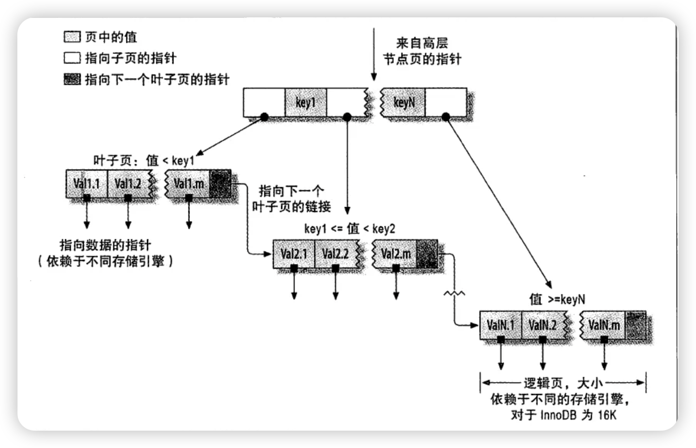

# MySQL 索引的数据结构

[toc]

## 简介

MySQL 使用多种数据结构来实现不同类型的索引，分别有： B Tree 结构、B+ Tree 结构、哈希表结构、倒排索引结构和 R Tree 结构，每种数据结构都有其特定的用途和优势。我们可以根据表中列的使用场景来设置相应的索引，不同的列可以设置不同的索引类型（前提是 MySQL 引擎支持的索引）。

---

## B Tree 结构

B-Tree 是一种平衡树结构，广泛用于数据库和操作系统中，用于存储和管理大块数据。

### 结构特点

B+ Tree 由根结点、内部节点和叶子结点组成，每个节点可以有多个子节点，所有叶子节点在同一层。节点内键（Key）是有序的，每个键左侧的子树键值小于该键，右侧的子树键值大于该键。

- **数据存储**：在 B-Tree 中，每个节点都可以直接存储键值对应的数据。不仅叶子节点，内部节点也可能直接包含完整的数据记录。
- **叶子节点**：B Tree 的所有叶子节点都在同一层，但是不一定通过链表连接，不方便进行范围查询和有序遍历，范围查询可能需要频繁的回到父节点或进行更多的分支遍历。
- **树的高度较高**：相比 B+ Tree，B Tree 的节点可以存储更多数据，因此树的高度可能会更高。

### 优点

- 查找、插入和删除操作高效，适合大规模数据。

### 缺点

- **空间占用**：结构较为复杂，占用空间较大。
- **更新开销**：插入、删除和更新操作需要维护树的平衡，开销较大。
- **查询方式**：不支持范围查询和排序。

### 适用场景

- 适用于需要频繁访问和更新少量特定数据的应用，如文件系统。

---

## B+ Tree 结构

B+ Tree 是一种平衡树结构，所有叶子节点都在同一层，叶子节点存储数据记录，并通过链表连接。B+ Tree 是 MySQL 的默认索引类型，特别是在 InnoDB 存储引擎中。

### 结构特点

B+ Tree 由根结点、内部节点和叶子结点组成，每个节点可以有多个子节点，所有叶子节点在同一层。节点内键（Key）是有序的，每个键左侧的子树键值小于该键，右侧的子树键值大于该键。

- **数据存储**：在 B+ Tree 中，内部节点存储索引键和指向子节点的指针，不存储实际数据，这样减少了分支节点的大小，使得更多的分支节点可以加载到内存中。只有叶子结点存储实际记录的指针，可以访问完整数据。
- **叶子节点**：存储索引键和指向实际数据记录的指针，所有叶子节点都在同一层而且通过链表连接，形成一个有序链表，便于范围查询和有序遍历。
- **平衡性**：所有叶子节点在同一层，从根节点到任一叶子节点的路径长度相同。

### 优点

- **范围查询支持**：能够高效支持等值查询（`=`）、范围查询（`BETWEEN`、`>`, `<`、`>=`、`<=`）和前缀匹配查询（`LIKE 'prefix%'`）。
- **有序性**：索引键有序排列，支持有序遍历。
- **稳定性**：查询性能稳定。

### 缺点

- **空间占用**：结构较为复杂，占用空间较大。
- **更新开销**：插入、删除和更新操作需要维护树的平衡，开销较大。

### 适用场景

- 适用于大多数查询场景，如查找、更新、删除、排序（`ORDER BY`）和分组（`GROUP BY`）。

### 存储引擎中的 B+ Tree 结构

#### InnoDB

- InnoDB 存储引擎使用聚簇索引（Clustered Index），主键索引使用 B+ Tree 结构。数据记录按主键顺序存储在叶节点中。
- 二级索引用 B+ Tree 结构存储索引键和对应的主键值。

#### MyISAM

- MyISAM 存储引擎也使用 B+ Tree 结构，但其索引和数据是分开的。索引文件存储 B+ Tree 结构的索引，数据文件存储实际数据。

---

## 哈希表结构

哈希索引基于哈希表实现，主要用于等值比较查询，即精确匹配搜索。它不保持数据的任何排序顺序，而是直接通过计算键的哈希值来定位数据行。

### 结构特点

- **桶（Bucket）**：哈希表根据哈希函数将索引键映射到特定的桶，每个桶内的数据保存在一个链表或者树中（包含索引键和指向数据记录的指针）。
- **哈希函数**：用于将索引键转换为哈希值，以确定存储位置。

### 优点

- **查询速度**：对等值查询（`=` 和 `IN`）速度极快。
- **实现简单**：哈希表结构简单，操作高效。
- **空间效率高**：不需要存储指针。

### 缺点

- **不支持范围查询**：无法进行范围查询和排序操作。
- **不支持模糊查询**： 无法处理部分匹配查询（如 `LIKE 'pattern%'`）。
- **不支持排序**：无法进行排序操作。
- **冲突处理**：需要处理哈希冲突，对于有大量重复键值的列，可能导致性能下降。

### 适用场景

- 适用于需要高效等值查询的场景，如基于唯一标识符的查询。
- 常用于内存存储引擎（如 MEMORY 引擎）。

---

## 倒排索引结构

倒排索引用于全文搜索，特别适合处理大量文本数据。MySQL 中全文索引使用的是倒排索引结构，Elastic 使用的也是倒排索引结构。

### 结构特点

- **词典（Dictionary）**：存储唯一的词条（Term），通常用于全文搜索。
- **倒排列表（Inverted List）**：每个词条对应一个倒排列表，存储出现该词条的文档标识符（Document ID）和位置信息。

### 优点

- **全文搜索支持**：能够高效支持复杂的自然语言文本搜索。
- **查询灵活性**：支持多种搜索模式，如布尔查询、短语查询等。

### 缺点

- **空间占用**：占用大量空间，维护开销高。
- **更新复杂性**：插入、删除和更新操作复杂，性能不稳定。
- **列类型局限性**：只适用于CHAR、VARCHAR 或 TEXT 列。

### 适用场景

- 适用于需要全文搜索功能的应用，如博客、文档管理系统和内容管理系统。
- 常用于 InnoDB 和 MyISAM 存储引擎。

---

## R-Tree 结构

R-Tree 是一种用于空间数据索引的树结构，特别适合地理信息系统（GIS）中的空间查询。

### 结构特点

- **节点**：包含最小边界矩形（Minimum Bounding Rectangles, MBRs）和指向子节点或数据条目的指针。
- **叶子节点**：存储空间对象（如点、线、多边形）的 MBRs 和指向实际对象的指针。

### 优点

- **空间查询支持**：专门用于地理空间查询，能够高效支持点、线、多边形的空间关系查询。
- **动态调整**：自动调整树结构以保持平衡和效率。

### 缺点

- **复杂性**：实现和维护复杂。
- **不适合范围查询**：相比 B+ Tree，范围查询性能较差。

### 适用场景

- 常用于地理信息系统（GIS）应用，如地图服务和地理空间数据分析。
- 主要用于 MyISAM 存储引擎，不支持 InnoDB。

---

## 数据结构对比

| 数据结构 | 优点                                           | 缺点                               | 适用场景                                               |
| -------- | ---------------------------------------------- | ---------------------------------- | ------------------------------------------------------ |
| B Tree   | 查找、插入和删除操作高效，适合大规模数据       | 不支持范围查询和有序遍历           | 适用于需要频繁访问和更新少量特定数据的应用，如文件系统 |
| B+ Tree  | 高效的范围查询和有序遍历，查询性能稳定         | 空间占用大，更新开销高             | 大多数查询场景，特别是排序和分组                       |
| 哈希表   | 等值查询速度极快，结构简单，插入和删除操作简单 | 不支持范围查询和排序，冲突处理复杂 | 高效等值查询，如内存存储引擎，缓存系统                 |
| 倒排索引 | 全文搜索高效，适合处理大量文本数据             | 空间占用大，更新复杂               | 需要全文搜索功能的应用，如搜索引擎，文档检索系统       |
| R-Tree   | 支持空间查询，自动调整平衡                     | 实现复杂，范围查询性能较差         | 地理信息系统                                           |

---

## B Tree 和 B+ Tree 对比

| 特性       | B+ Tree                                                      | B Tree                                                       |
| ---------- | ------------------------------------------------------------ | ------------------------------------------------------------ |
| 数据存储   | 内部节点存储索引键，叶子节点存储数据和指针，使树可以有更高的分支因子，从而降低了树的高度，提高了存储效率 | 所有节点都可存储完整数据，降低了节点的分支因子，导致存储效率低 |
| 叶子节点   | 通过双向链表连接，支持有序遍历                               | 叶子节点不一定通过链表连接，不便于范围查询                   |
| 查询效率   | 查询性能稳定，适合范围查询和有序遍历                         | 查询性能较为稳定，但不如 B+ Tree 高效                        |
| 空间占用   | 节点存储大量指针和冗余数据，空间开销较大                     | 节点存储数据较多，空间利用率相对较高                         |
| 维护复杂性 | 插入、删除和更新操作复杂，需要维护树的平衡                   | 插入、删除和更新操作同样复杂，需要维护树的平衡               |
| 适用场景   | 广泛用于数据库索引，特别是支持范围查询和排序的场景           | 一般用于需要存储大量数据的场景，范围查询较少                 |

B+ Tree 是 MySQL 中最常用的索引数据结构，具有高效的范围查询和有序遍历能力，查询性能稳定。而 B Tree 虽然也有其优点，但由于其叶子节点不一定通过链表连接，范围查询需要遍历所有节点，不适合范围查询和排序操作。因此，在实际数据库应用中，B+ Tree 更为广泛使用。

---

## 总结

- **B Tree 和 B+ Tree**：B+ Tree 是 B Tree 的改进版本，内部节点仅存储索引键，叶子节点存储数据，支持高效的范围查询和顺序遍历，是 MySQL 中的常用索引类型。

- **哈希表**：适合等值查询，不支持范围查询，在内存中效率极高，但在磁盘上的性能不如 B+ Tree。

- **倒排索引**：适用于全文搜索，特别适合处理文本数据，查找包含特定词条的文档高效，但不适用于其他类型的查询。

- **R Tree**：适用于存储和查询多维空间数据，支持复杂的空间查询操作，如地理信息系统（GIS）应用中的点、线、多边形的交叉和包含查询。

通过理解这些数据结构及其特点和适用场景，可以更好地选择和使用索引来优化数据库性能，满足不同类型的查询需求。