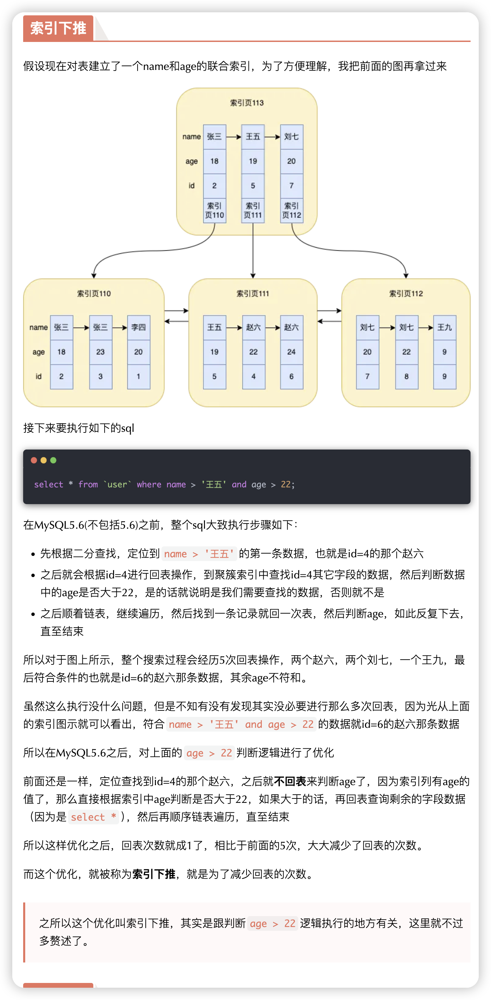

# 回表查询、索引覆盖和索引下推

[toc]

## 简介

在 MySQL 查询优化中，理解回表查询、索引覆盖和索引下推是非常重要的。这些概念有助于提高查询效率，减少磁盘 I/O，并优化查询性能。

---

## 回表查询

在 MySQL 中，回表查询是指在执行查询时，由于索引不能覆盖查询所需的所有列，数据库在通过索引定位到数据行后，还需要再访问实际的数据表以获取完整的行数据。这一过程通常涉及额外的磁盘 I/O 开销，因此理解和优化回表查询对于提高查询性能非常重要。

### 原理

当使用索引进行查询时，MySQL 会首先通过索引查找到满足条件的行的位置（即主键值或行指针）。如果查询所需的数据列全部包含在索引中（即覆盖索引），则可以直接从索引中读取数据，不需要回表查询。但如果查询需要的列不完全在索引中，MySQL 需要通过索引查找到行的位置，然后再去实际的数据表中读取完整的行数据，这个过程就叫做回表查询。

### 示例

假设我们有一个表 `employees`，结构如下：

```sql
CREATE TABLE employees (
    id INT PRIMARY KEY,
    name VARCHAR(100),
    age INT,
    department VARCHAR(100),
    INDEX idx_name (name)
);
```

现在假设你要查询 `name = 'Alice'` 的员工的 `id` 和年龄：

```sql
EXPLAIN SELECT id, age FROM employees WHERE name = 'Alice';
```

在这个查询中，`name` 列上有索引 `idx_name`。MySQL 使用该索引查找 `name = 'Alice'` 的记录。然而，由于查询还需要返回 `id` 和 `age` 列的值，而这两个列不在 `idx_name` 索引中，所以 MySQL 需要通过索引查找到对应的行位置，然后回表读取 `id` 和 `age` 列的数据。

#### EXPLAIN 结果解析

```sql
+----+-------------+-----------+-------+---------------+---------+---------+-------+------+-------------+
| id | select_type | table     | type  | possible_keys | key     | key_len | ref   | rows | Extra       |
+----+-------------+-----------+-------+---------------+---------+---------+-------+------+-------------+
|  1 | SIMPLE      | employees | ref   | idx_name      | idx_name| 102     | const |    1 | Using where |
+----+-------------+-----------+-------+---------------+---------+---------+-------+------+-------------+
```

在这个 `EXPLAIN` 结果中，`key` 列显示使用了索引 `idx_name`，但是 `Extra` 列显示了 `Using where`，这表示 MySQL 使用了 `where` 条件进行结果过滤，所以可以推断，使用索引查询出符合条件的数据，因为索引中没有 `age`，所以进行回表查询。

### 回表查询流程

当 MySQL 进行查询时，回表查询的过程涉及服务器层和存储引擎层的协同工作。以下是一个详细的流程：

1. **服务器层处理查询请求**

- **查询解析**：当一个 SQL 查询到达 MySQL 时，首先由服务器层的解析器解析 SQL 语句，生成对应的解析树。
- **查询优化**：解析树被传递给查询优化器，优化器根据表的统计信息、索引的选择性等，决定使用哪个索引进行查询。对于回表查询，优化器选择一个索引来查找符合条件的行指针（ROWID）或主键值。

2. **存储引擎层索引查找**

- **索引扫描**：服务器层将查询请求传递给存储引擎。存储引擎根据传入的索引条件，在索引结构中查找符合条件的索引条目。比如在 InnoDB 中，存储引擎会通过 B+ 树结构进行索引扫描。
- **获取行指针或主键值**：存储引擎层通过索引查找到对应的行指针（在 MyISAM 中）或主键值（在 InnoDB 中）。此时，存储引擎层还没有读取实际的行数据。

3. **服务器层请求回表**

- **决定回表**：如果查询需要的列不在索引中，服务器层会识别出这一点，并要求存储引擎层回表获取完整的行数据。
- **多次回表**：服务器层可能会多次请求存储引擎层回表，特别是当索引只能部分过滤条件时。例如，如果有多个条件，可能会多次请求回表以获取符合所有条件的行。

4. **存储引擎层回表操作**

- **读取实际数据**：存储引擎层根据索引提供的行指针或主键值，再次访问数据页，从数据表中读取完整的行数据。在 InnoDB 中，使用主键值直接定位到聚簇索引中的行，读取完整的行数据；在 MyISAM 中，使用行指针定位到数据文件中的行位置，读取完整的行数据。
- **返回行数据**：存储引擎将读取到的行数据返回给服务器层。

5. **服务器层处理结果**

- **数据过滤与合并**：服务器层接收到存储引擎返回的行数据后，进行数据过滤（如 WHERE 子句中未被索引处理的条件），然后将数据合并、排序、聚合等。
- **结果返回客户端**：最终处理后的结果集通过连接层返回给客户端。

### 回表查询的开销

- **I/O 操作的增加**：每次回表都需要额外的磁盘 I/O 操作，这在数据量较大时，可能导致性能瓶颈。
- **CPU 处理的增加**：回表操作还可能增加 CPU 的处理负担，特别是在大量查询和并发请求的场景下。
- **内存使用的增加**：如果索引不能覆盖查询的所有列，回表会导致更多的数据页被加载到内存中，增加内存使用。

### 如何优化回表查询

1. **使用覆盖索引**： 通过创建包含所有查询列的复合索引，可以避免回表查询。例如，如果查询经常需要 `id` 和 `age` 列，可以创建一个复合索引：

   ```sql
   CREATE INDEX idx_name_id_age ON employees (name, id, age);
   ```

   这样查询：

   ```sql
   EXPLAIN SELECT id, age FROM employees WHERE name = 'Alice';
   ```

   就可以直接从索引中获取所有需要的数据，而不需要回表查询。

2. **选择性较高的索引**： 如果查询条件涉及多个列，应选择性较高的列创建索引，以减少回表次数。

3. **适当的表结构设计**： 通过规范化和反规范化设计，可以减少不必要的列访问，从而减少回表查询。例如，可以通过拆分大表或者将频繁查询的列放在一起。

4. **使用覆盖索引和索引下推结合**： MySQL 5.6 引入的索引下推（Index Condition Pushdown, ICP）可以在索引扫描阶段应用过滤条件，减少回表次数。这在复杂查询中特别有用。

### 小结

回表查询在 MySQL 中是由于索引不能完全覆盖查询所需的列而引起的，需要通过索引查找到行位置后，再去数据表中读取完整的行数据。理解回表查询的原理和优化方法，对于提升查询性能至关重要。通过合理设计索引、使用覆盖索引、选择性较高的索引和优化表结构，可以有效减少回表查询，提高查询性能。

---

## 索引覆盖

在 MySQL 中，索引覆盖（覆盖索引，Covering Index）是指一个查询的所有列都能够从同一个索引中获取，不需要回表访问实际的数据表。这种情况能够显著提升查询性能，因为 MySQL 可以直接从索引中获取所需的数据，避免了额外的磁盘 I/O 开销。

### 原理

通常情况下，索引中包含的是索引列以及指向数据表中完整行的指针。当查询需要获取的数据列全部在索引中时，MySQL 就可以完全依赖索引返回结果，而不需要访问表中的数据行。由于索引通常比完整的数据表小，并且可以驻留在内存中，这种操作大大提高了查询效率。

### 示例

假设我们有一个 `employees` 表，结构如下：

```sql
CREATE TABLE employees (
    id INT PRIMARY KEY,
    name VARCHAR(100),
    age INT,
    department VARCHAR(100),
    INDEX idx_name_age (name, age)
);
```

现在假设你要查询员工的姓名和年龄：

```sql
EXPLAIN SELECT name, age FROM employees WHERE name = 'Alice';
```

在这个查询中，`name` 和 `age` 列都包含在索引 `idx_name_age` 中。MySQL 可以直接从索引中获取 `name` 和 `age` 的值，而不需要回表查询，这就是索引覆盖。

#### EXPLAIN 结果解析

~~~sql
+----+-------------+-----------+-------+---------------+-------------+---------+-------+------+------------------+
| id | select_type | table     | type  | possible_keys | key         | key_len | ref   | rows | Extra            |
+----+-------------+-----------+-------+---------------+-------------+---------+-------+------+------------------+
|  1 | SIMPLE      | employees | ref   | idx_name_age  | idx_name_age| 102     | const |    1 | Using index      |
+----+-------------+-----------+-------+---------------+-------------+---------+-------+------+------------------+

~~~

在这个 `EXPLAIN` 结果中，`key` 列显示使用了索引 `idx_name_age`，`Extra` 列显示了 `Using index`，这表示 MySQL 使用了覆盖索引。

### 覆盖索引的优点

1. **减少 I/O 操作**：MySQL 只需要访问索引，而不需要访问数据表，从而减少了磁盘 I/O 操作。
2. **提高查询性能**：索引通常比表数据小得多，存储在更高效的数据结构中（如 B+ 树）。只需从索引中读取数据，而不需要访问磁盘上的数据文件，可以显著加快查询速度。
3. **避免回表查询**：通过覆盖索引，可以避免多余的回表查询，特别是在查询频繁的场景下效果尤为明显。
4. **降低锁的开销**：因为不需要访问实际的表数据，覆盖索引查询可以减少锁定开销，特别是在高并发场景下。

### 如何创建覆盖索引

为了利用覆盖索引，必须确保查询的所有列都包含在索引中。这通常通过创建包含多个列的复合索引来实现。

如果你经常需要查询 `name` 和 `age` 列，可以创建一个复合索引：

```sql
CREATE INDEX idx_name_age ON employees (name, age);
```

这个索引不仅可以加速基于 `name` 的查询，还可以使查询仅依赖索引，而不需要回表读取 `age` 列的数据，但在编写 SQL 语句时，要遵循最左匹配原则。

### 适用场景

- **选择性较高的列**：当查询的条件和返回的列集中在选择性较高的列时，使用覆盖索引能有效提升性能。
- **频繁查询的场景**：在高并发或频繁查询的应用中，覆盖索引能减少对磁盘的压力，提升整体响应速度。
- **数据量较大的表**：在大表中，减少回表查询的次数可以显著减少查询的开销。

### 覆盖索引的限制

- **索引大小**：创建覆盖索引时需要权衡索引的大小。过多的列会导致索引过大，从而影响插入、更新操作的性能。
- **存储开销**：覆盖索引需要额外的存储空间，如果表中有大量列或创建了多个索引，会导致存储空间的消耗增大。
- **最左匹配原则**：使用索引覆盖要满足最左匹配原则。

### 小结

索引覆盖是一种有效的查询优化手段，它能够通过让查询仅依赖索引来减少 I/O 操作，提升查询性能。在设计 MySQL 表结构和索引时，合理利用覆盖索引，可以在许多场景中显著优化查询速度。

---

## 索引下推

在 MySQL 中，索引下推（Index Condition Pushdown，ICP）是在 MySQL 5.6 引入的优化技术。它允许在索引扫描阶段进行部分过滤条件的处理，从而减少需要回表的数据量。这项优化对查询性能的提升尤其明显，特别是在处理涉及范围条件的查询时。

### 原理

在传统的 MySQL 查询执行过程中，当使用索引查找数据时，如果索引不能完全覆盖查询的过滤条件，MySQL 通常会先通过索引找到符合初步条件的记录，然后再回表获取完整的数据行，再应用剩余的过滤条件。

有了索引下推，MySQL 可以在索引扫描阶段就应用部分过滤条件，减少回表读取的数据行数。这样一来，可以显著减少不必要的回表操作，尤其在数据量较大时，这种优化带来的性能提升非常显著。

### 示例

假设有一个表 `products`，结构如下：

```sql
CREATE TABLE products (
    id INT PRIMARY KEY,
    category VARCHAR(100),
    price DECIMAL(10, 2),
    stock INT,
    INDEX idx_category_price (category, price)
);
```

如果我们进行以下查询：

```sql
EXPLAIN SELECT * FROM products WHERE category = 'electronics' AND price > 100;
```

#### 传统查询流程

在没有索引下推之前，MySQL 会首先通过 `idx_category_price` 索引找到所有 `category = 'electronics'` 的记录，然后逐个回表检查 `price > 100` 的条件。即使 `price > 100` 的记录很少，MySQL 仍需要回表检查所有 `category = 'electronics'` 的记录，这会产生大量的回表操作。

#### 启用索引下推后的查询流程

有了索引下推功能，MySQL 可以在扫描 `idx_category_price` 索引时就将 `price > 100` 的条件应用到索引扫描过程中。这样一来，MySQL 只会回表那些同时满足 `category = 'electronics'` 和 `price > 100` 的记录，大大减少了回表次数。

在 `EXPLAIN` 的 `Extra` 列中，你会看到 `Using index condition` 的字样，表明查询使用了索引下推优化。

```sql
+----+-------------+----------+-------+------------------------+--------------------+---------+-------+------+--------------------------+
| id | select_type | table    | type  | possible_keys          | key                | key_len | ref   | rows | Extra                    |
+----+-------------+----------+-------+------------------------+--------------------+---------+-------+------+--------------------------+
|  1 | SIMPLE      | products | range | idx_category_price     | idx_category_price | 102     | const |    5 | Using index condition    |
+----+-------------+----------+-------+------------------------+--------------------+---------+-------+------+--------------------------+
```

**综合示例**

> 节选自 [1.5万字+30张图盘点索引常见的11个知识点 (qq.com)](https://mp.weixin.qq.com/s/kqK0JYtsFAhYzxzsI0VO4g)



### 索引下推的优点

1. **减少回表操作**：索引下推通过提前过滤条件，减少了需要回表的数据行数，降低了磁盘 I/O 的开销。
2. **提升查询性能**：特别是在数据量大、索引覆盖范围广的情况下，索引下推可以显著提高查询的执行速度。
3. **处理复杂条件**：对于涉及多个条件的复杂查询，索引下推可以将部分条件在索引层进行处理，避免无效的回表。

### 适用场景

- **范围查询**：如使用 `>`、`<`、`BETWEEN` 等范围操作符的查询。
- **多条件查询**：尤其是其中一些条件可以应用于索引列而另一些条件不能。
- **大表查询**：在数据量大的表中，索引下推能够有效减少不必要的回表，提高查询效率。

##### 小结

索引下推是 MySQL 的一种重要查询优化技术，尤其适用于复杂查询和大表查询场景。通过在索引扫描阶段应用过滤条件，索引下推减少了回表的次数，从而显著提升了查询性能。了解和利用索引下推，可以帮助你更有效地优化 MySQL 查询，提升数据库的整体响应速度。

---

## 总结

- **回表查询**：当索引无法覆盖所有查询列时，查询需要先通过索引找到行指针，再回表读取完整的行数据。这种操作增加了 I/O 开销。
- **索引覆盖**：当查询所需的所有列都在一个索引中时，可以避免回表查询，从而提高查询性能，是优化查询的有效手段。
- **索引下推**：允许在索引扫描阶段应用部分过滤条件，减少回表次数，从而优化查询性能，是复杂查询的重要优化技术。