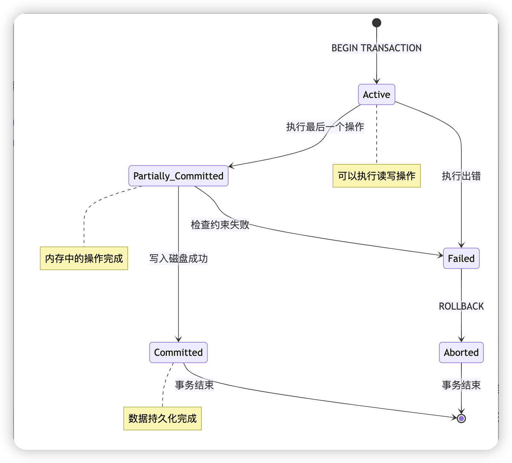
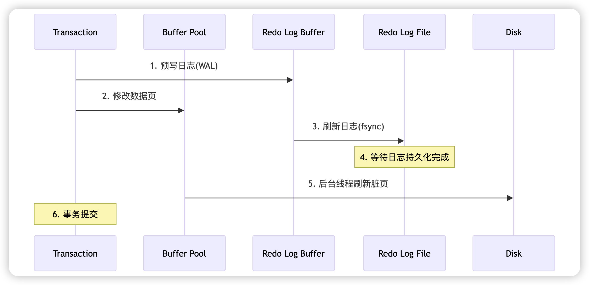
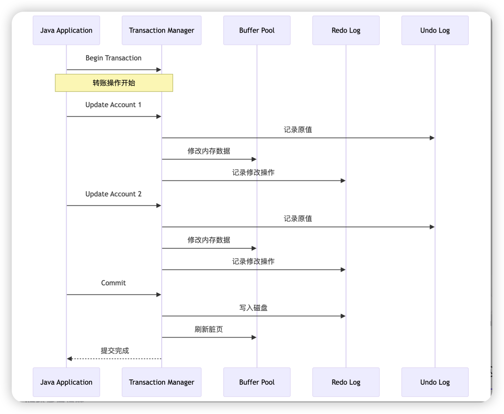
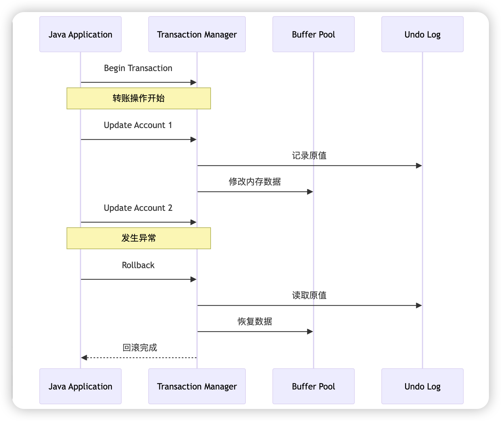
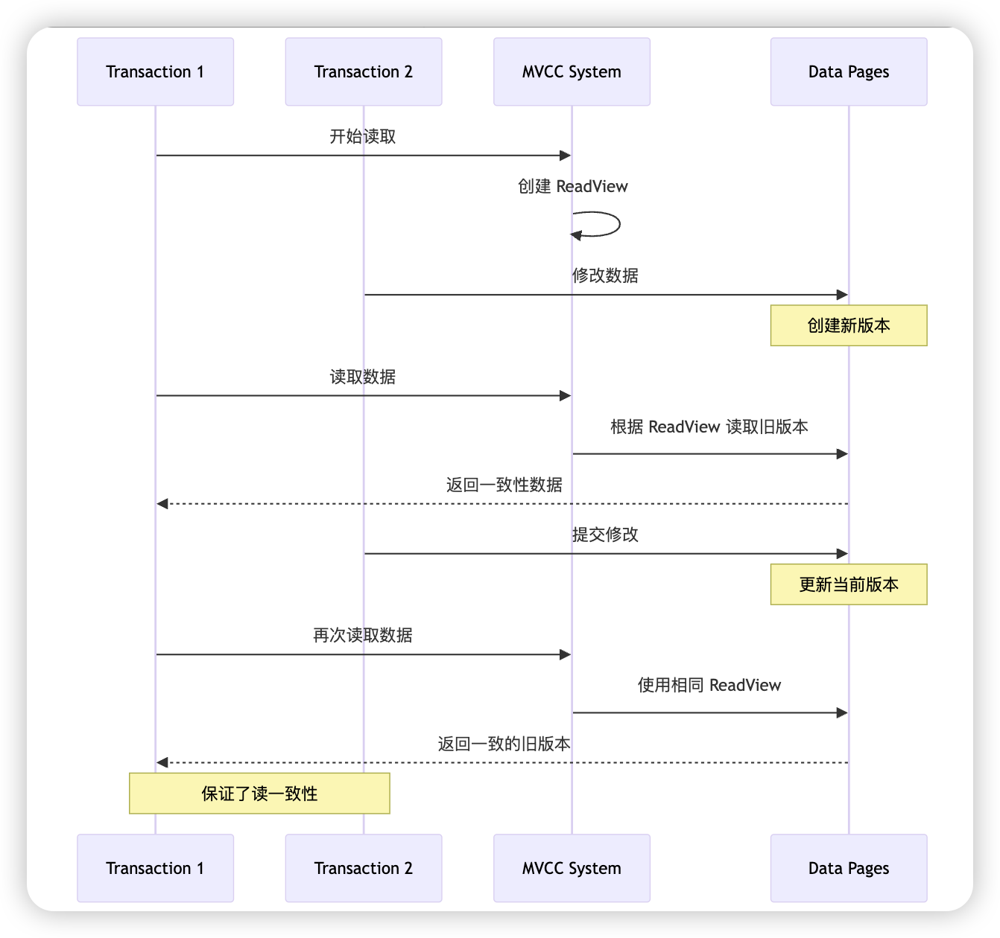

## Java MySQL 事务实现详解

[toc]

#### 简介

本文主要以 Java应用作为客户端，讲解 MySQL 的事务与 MySQL 的日志系统和 MVCC 版本机制的联动关系。

---

#### 1. 事务的原理

##### 1.1 定义
事务是数据库操作的最小工作单位，是一组不可分割的操作集合。在 Java 应用中，一个事务可能包含多个数据库操作，这些操作要么全部成功，要么全部失败。

##### 1.2 ACID 特性

1. **原子性（Atomicity）**
   - 事务中的所有操作作为一个整体执行
   - 要么全部成功，要么全部失败
   - 通过 undo log 实现

2. **一致性（Consistency）**
   - 事务执行前后，数据库从一个一致性状态转换到另一个一致性状态
   - 确保数据库完整性约束不被破坏

3. **隔离性（Isolation）**
   - 多个事务并发执行时，彼此之间不会互相干扰
   - 通过锁机制和 MVCC 实现

4. **持久性（Durability）**
   - 事务一旦提交，其修改将永久保存在数据库中
   - 通过 redo log 实现

##### 1.3 事务的生命周期



1. **Active（活动）**：
   - 事务开始执行第一个操作
   - 可以执行读写操作

2. **Partially Committed（部分提交）**：
   - 最后一个操作执行完成
   - 还未写入磁盘

3. **Committed（已提交）**：
   - 事务完成，数据持久化
   - 不可回滚

4. **Failed（失败）**：
   - 发生错误，无法继续执行
   - 需要回滚

5. **Aborted（中止）**：
   - 事务回滚完成
   - 数据恢复到事务开始前的状态

---

#### 2. MySQL 的日志机制

##### 2.1 Redo Log（重做日志）

**基本概念**

- 作用：确保事务的持久性，防止数据库崩溃时的数据丢失。
- 存储格式：物理日志，记录页面的实际修改
- 写入策略：WAL（Write-Ahead Logging）

**工作原理**

~~~mermaid
graph TB
  A[事务修改] --> B[写入redo log buffer]
  B --> C{刷盘策略}
  C -->|0| D[每次提交都刷盘]
  C -->|1| E[每秒刷盘]
  C -->|2| F[由操作系统决定]
  D --> G[磁盘]
  E --> G
  F --> G
~~~



**WAL（Write-Ahead Logging）机制的工作流程**

1. 事务开始前，先写入 redo log（预写日志）
2. 日志写入成功后，才修改内存中的数据页
3. 事务提交时，确保 redo log 已经写入磁盘

4. 数据页的刷盘可以在之后异步进行

**事务提交的详细步骤**

~~~sql
-- 1. 事务开始
BEGIN;

-- 2. 生成 redo log 记录
-- LSN (Log Sequence Number) 递增
INSERT INTO redo_log (lsn, data) VALUES (1001, '更新操作1');

-- 3. 修改 Buffer Pool 中的数据页
UPDATE accounts SET balance = balance - 100;

-- 4. 写入 redo log file
-- 确保 LSN <= 文件中最新的 LSN
fsync(redo_log_file);

-- 5. 提交事务
COMMIT;
~~~

**Buffer Pool 的刷盘策略**

- 后台线程周期性刷新
- 脏页比例达到阈值时刷新
- 系统空闲时刷新
- 系统关闭时刷新

##### 2.2 Undo Log（回滚日志）

**作用**

Undo Log 是用于支持事务的回滚操作的日志。它记录了在事务执行过程中，数据被修改前的旧值，从而使得在回滚时可以恢复数据到事务开始前的状态。

- 在事务未提交前，Undo Log 必须保留，以支持回滚。

- 在事务成功提交后，Undo Log 失去回滚的意义，但还可能被其他事务（如 MVCC 机制中的快照读）使用。

**记录内容**

```sql
-- 示例：更新操作的 Undo Log
原数据：UPDATE accounts SET balance = 1000 WHERE id = 1;
Undo Log 记录：
{
    "type": "UPDATE",
    "table": "accounts",
    "where": {"id": 1},
    "old_values": {"balance": 900}
}
```

**原理**

~~~mermaid
graph TB
  A[事务开始] --> B[生成undo log记录]
  B --> C[数据修改]
  C --> D{事务提交?}
  D -->|是| E[标记undo log可复用]
  D -->|否| F[执行回滚操作]
  F --> G[根据undo log恢复数据]
  E --> H[等待purge线程清理]
~~~

**事务提交后的 Undo Log 处理流程**

- 等待被其他事务使用
  - 在基于 **MVCC（多版本并发控制）** 的机制下，Undo Log 存储旧版本数据供其他事务读取（快照读）。
  - 因此，即使事务已提交，Undo Log 也不能立即删除，需等待确保不再被其他事务访问。

- 标记为可清理状态
  - 一旦没有其他事务需要访问某个 Undo Log 的记录，MySQL 会将该 Undo Log 标记为“可清理”状态。

- 清理（Purge）过程
  - **后台线程异步清理**：MySQL 的 Purge 线程定期扫描标记为可清理的 Undo Log 并进行物理删除。
  - 清理操作会将 Undo Log 中的空间释放，归还给表空间文件（对于 InnoDB），以便未来事务使用。

---

#### 3. MVCC 版本机制

##### 3.1 基本概念

**版本链**

~~~mermaid
graph TB
  A[当前版本<br>TRX_ID=100] --> B[历史版本1<br>TRX_ID=99]
  B --> C[历史版本2<br>TRX_ID=98]
  C --> D[历史版本3<br>TRX_ID=97]
~~~

##### 3.2 MVCC 实现原理

1. **隐藏字段**

   - DB_TRX_ID：创建版本号
   - DB_ROLL_PTR：回滚指针
   - DB_ROW_ID：行ID

   ~~~sql
   CREATE TABLE users (
     id INT PRIMARY KEY,
     name VARCHAR(50),
     balance DECIMAL(10,2),
     -- 隐藏字段
     -- DB_TRX_ID: 事务ID
     -- DB_ROLL_PTR: 回滚指针
     -- DB_ROW_ID: 行ID(如果没有主键)
   );
   ~~~

2. **ReadView**

   - creator_trx_id:  创建Read View的事务ID

   - trx_ids：活跃事务列表
   - up_limit_id：最小活跃事务ID
   - low_limit_id：下一个事务ID

**执行原理**

~~~mermaid
graph TB
  A[事务开始] --> B[生成Read View]
  B --> C[查询数据]
  C --> D{版本链比对}
  D -->|可见| E[返回数据]
  D -->|不可见| F[沿版本链找下一版本]
~~~

##### 3.3 可见性判断

~~~mermaid
graph TB
  A[开始判断] --> B{trx_id < up_limit_id?}
  B -->|是| C[可见]
  B -->|否| D{trx_id > low_limit_id?}
  D -->|是| E[不可见]
  D -->|否| F{trx_id in trx_ids?}
  F -->|是| G[不可见]
  F -->|否| H[可见]
~~~

---

#### 4. 示例流程

##### 4.1 成功提交的示例

**Java 代码示例**

```java
@Transactional
public void transfer(String fromAccount, String toAccount, BigDecimal amount) {
    try {
        // 1. 开始事务
        jdbcTemplate.update(
            "UPDATE accounts SET balance = balance - ? WHERE id = ?",
            amount, fromAccount
        );
        
        // 2. 记录 undo log
        // 3. 修改内存中的数据
        // 4. 生成 redo log
        jdbcTemplate.update(
            "UPDATE accounts SET balance = balance + ? WHERE id = ?",
            amount, toAccount
        );
        
        // 5. 提交事务
        // 6. 写入 redo log
        // 7. 刷新脏页
    } catch (Exception e) {
        throw new RuntimeException("Transfer failed", e);
    }
}
```

**执行流程**



##### 4.2 回滚的示例

**Java 代码示例**

```java
@Transactional
public void transferWithRollback(String fromAccount, String toAccount, BigDecimal amount) {
    try {
        // 1. 扣减转出账户
        jdbcTemplate.update(
            "UPDATE accounts SET balance = balance - ? WHERE id = ?",
            amount, fromAccount
        );
        
        // 2. 模拟异常
        if (someCondition) {
            throw new RuntimeException("Transfer failed");
        }
        
        // 3. 增加转入账户
        jdbcTemplate.update(
            "UPDATE accounts SET balance = balance + ? WHERE id = ?",
            amount, toAccount
        );
    } catch (Exception e) {
        // 4. 触发回滚
        // 5. 读取 undo log
        // 6. 恢复数据
        throw new RuntimeException("Transfer failed, rolling back", e);
    }
}
```

**回滚流程**



##### 4.3 事务并发控制

**MVCC 读取流程**

```sql
-- 事务1：读取数据
SELECT * FROM accounts WHERE id = 1;

-- 事务2：并发更新
UPDATE accounts SET balance = balance - 100 WHERE id = 1;
```

**并发控制流程**



---

#### 5. 各隔离级别实现原理

~~~mermaid
graph TB
  A[隔离级别] --> B[READ UNCOMMITTED]
  A --> C[READ COMMITTED]
  A --> D[REPEATABLE READ]
  A --> E[SERIALIZABLE]
  
  B --> F[无锁读取]
  C --> G[MVCC语句级快照]
  D --> H[MVCC事务级快照]
  E --> I[串行化执行]
~~~

---

#### 总结

通过以上详细说明，我们可以看到 Java 应用中 MySQL 事务的实现是一个复杂的过程，涉及多个组件的协同工作。理解这些原理对于正确使用事务、处理并发问题和优化性能都有重要意义。