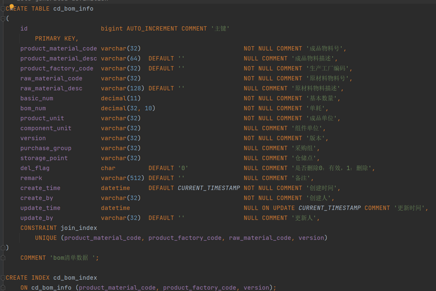
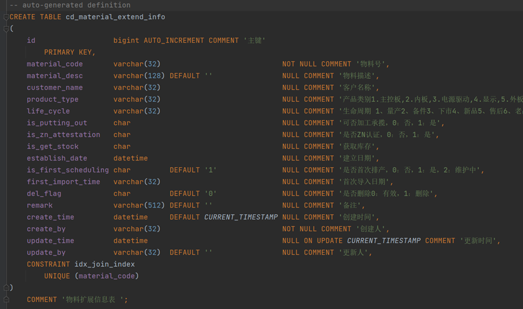
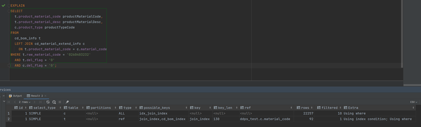
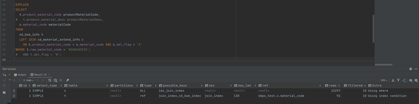
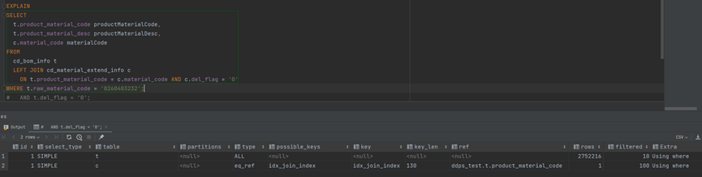
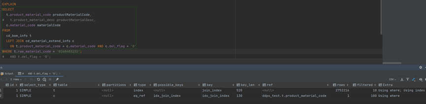
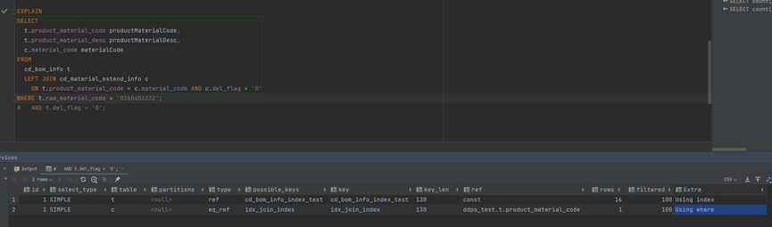
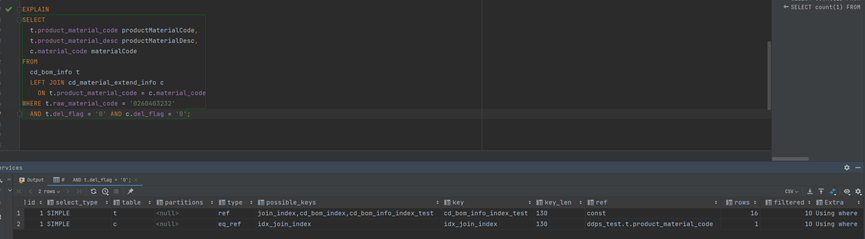

## LeftJoin索引失效

[toc]

#### 一、 背景

查看生产环境日志发现一条慢SQL，执行时间为1秒多。

~~~sql
SELECT
  t.product_material_code productMaterialCode,
  t.product_material_desc productMaterialDesc,
  c.product_type productTypeCode
FROM
  cd_bom_info t
  INNER JOIN cd_material_extend_info c
    ON t.product_material_code = c.material_code
WHERE t.raw_material_code = '0260403232'
  AND t.del_flag = '0'
  AND c.del_flag = '0';
~~~

---

---

#### 二、表信息

cd_bom_info，2890961条数据。

cd_material_extend_info，22668条数据。

两张表索引如上图。

---

---

#### 三、 调优过程

##### 1. 执行explain命令查看索引情况

cd_material_extend_info 中的 material_code 有唯一索引，但是没走索引。

---

##### 2. 查看 on 条件字段索引情况和字符集

查看 on 条件，发现字段均有索引。

同时查看两个字段的字符集和是否一致，字符集不一致会导致索引失效。

---

##### 3. 修改where和on条件

LeftJoin 查询条件保留原则：左表的筛选条件用 where，右表的筛选条件用on。

on 的执行优先级高于 where。

查看执行计划，索引仍旧没有生效。

注意：该步骤修改的SQL会造成和原SQL的查询数据不一致！

---

##### 4. 排查SQL中 cd_material_extend_info 表的字段

cd_material_extend_info 中的 product_type 字段没有索引，怀疑因此造成了全表扫描，为了验证，将 product_type 字段改为 material_code (唯一索引)。

查看执行计划，cd_material_extend_info 表索引生效了，由此确定是因为 product_type字段没有设置索引导致了 cd_material_extend_info 没有走索引。

但是 cd_bom_info 表索引失效了，而且数据扫描量更大。

---

##### 5. 排查SQL中 cd_bom_info 表的字段

排查 cd_bom_info的字段，on 条件和 where 条件均有索引。

排查 select 字段，查看是否索引覆盖。如果索引没有覆盖，要回表查询，如果MySQL认为回表查询不如全表扫描效率高，则会采用全表方式。

select 中 product_material_desc 没有设置索引。

将 select 中的 product_material_desc 暂时注掉，发现两张表的索引均生效，但是数据扫描量更大，查看SQL执行效率，相差不大。

---

##### 6. 给 cd_bom_info 创建索引

~~~sql
-- 创建该索引，与没有索引效果一致。
create index cd_bom_info_index_test
    on cd_bom_info (product_material_code, product_material_desc, raw_material_code);

-- 调整上面索引的字段顺序，将 raw_material_code 放至首位。
drop index cd_bom_info_index_test on cd_bom_info;

create index cd_bom_info_index_test
    on cd_bom_info (raw_material_code, product_material_code, product_material_desc);

~~~

查看执行计划，发现两张表索引均生效，且扫描数据量显著减少。

查看执行时间，只有几十毫秒。

因此，在创建复合索引时，要将数据区分度大的列放在前面，而且在查询时要满足最左匹配原则。

---

##### 7. 恢复原SQL

因为将 where 条件和 on 条件互换的话，对查询结果有影响，所以恢复原SQL查看效果。

索引生效，执行时间降低。

---

---

#### 四、 总结

由上述过程可发现，归根结底还是索引失效问题。

在排查该类问题时，先确定索引可能失效的地方，然后逐一排查。