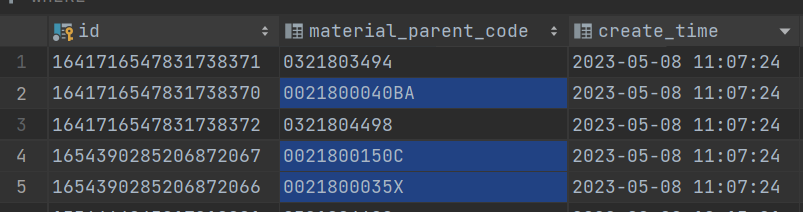

## MySQL中Long和String不对应问题

~~~sql
UPDATE
    mat_parent_info
SET update_id='systemJob',
    create_time='2023-05-08 11:07:24.333',
    update_time='2023-05-08 11:07:24.351'
WHERE deleted = 1
  AND (
        id IN (
               1641716547831738370, 1654390285206872066, 1654390285206872067
        )
    );
~~~

执行完以上SQL，预计更新3条记录，但实际更新5条记录。

数据库ID为varchar类型，但是代码中传的是Long类型，所以导致了MySQL匹配失误的问题，多更新了数据。

解决方案：

保持代码和数据库类型保持一致。