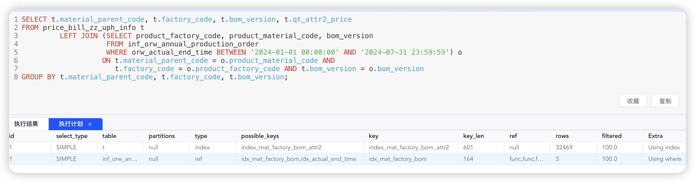
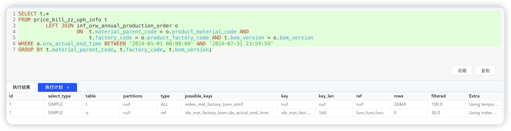

## 优化 OR 条件过多导致的查询超时

[toc]

#### 背景

在生成年度累积报表时（如【自制成本收入年累报表】），需要根据排产订单中的【工厂、物料、BOM版本】进行分组查询。尤其是在数据量较大的情况下（例如 2024 年 1-7 月的排产数据），生成报表时遇到了查询超时问题。这主要是由于分组查询后的数据量较大，且查询中使用了大量的 `OR` 条件。

本文将探讨针对这种场景的优化策略，并提供不同的解决方案以供参考。具体使用哪种方案，应根据实际业务需求及数据量大小来选择。

---

#### 问题分析

以下代码片段展示了问题的根源。在处理过程中，代码基于输入参数列表循环拼接 `OR` 条件。由于输入的列表包含了数千条记录，这种大量的 `OR` 条件在数据库中执行时导致了性能问题，最终导致查询超时。

~~~java
// 自制UPH单价
List<PriceBillZzUphInfo> priceBillZzUphInfoParamList = orwAnnualProductionOrderList.stream()
        .map(item -> new PriceBillZzUphInfo()
                .setFactoryCode(item.getProductFactoryCode())
                .setMaterialParentCode(item.getProductMaterialCode())
                .setBomVersion(item.getBomVersion())
        )
        .collect(Collectors.toList());
List<PriceBillZzUphInfo> priceBillZzUphInfoResultList = this.priceBillZzUphInfoProviderService.getByMatAndFacAndBom(priceBillZzUphInfoParamList);

// getByMatAndFacAndBom
public List<PriceBillZzUphInfo> getByMatAndFacAndBom(List<PriceBillZzUphInfo> list) {
    if (CollUtil.isEmpty(list)) {
        return Collections.emptyList();
    }

    LambdaQueryWrapper<PriceBillZzUphInfo> lambdaQueryWrapper = Wrappers.lambdaQuery();
    lambdaQueryWrapper
            .and(queryWrapper -> {
                queryWrapper.eq(PriceBillZzUphInfo::getStatus, 1);
            })
            .and(queryWrapper -> {
                list.forEach(item -> {
                    queryWrapper.or(query -> {
                        query.eq(PriceBillZzUphInfo::getMaterialParentCode, item.getMaterialParentCode());
                        query.eq(PriceBillZzUphInfo::getFactoryCode, item.getFactoryCode());
                        query.eq(PriceBillZzUphInfo::getBomVersion, item.getBomVersion());
                    });
                });
            });

    return list(lambdaQueryWrapper);
}
~~~

在该场景中，`orwAnnualProductionOrderList` 涉及的数据时间范围是[上个月所在年的第一天, 上个月的最后一天]，该时间范围内的数据需要根据【工厂代码】、【物料代码】和【BOM版本】进行多条件查询。

生成的 SQL 如下：

~~~SQL
SELECT *
FROM price_bill_zz_uph_info
WHERE deleted = 1
  AND ((status = 1) AND ((material_parent_code = '0031800390C' AND factory_code = '80G0' AND bom_version = '02') OR
                         (material_parent_code = '0021800126A' AND factory_code = '80K0' AND bom_version = '10') OR
                         .........;
~~~

---

#### 方案分析

该问题的最终定位便是 SQL 的查询超时，所以解决方案也是围绕解决该 SQL 的查询效率问题，可以从 SQL 和业务等方面进行优化。

##### 方案一：入参去重

直接原因是入参过多，导致了 SQL 拼接条件过多。所以先对入参进行去重，但是去重后的入参仍然有七千多条，仍旧超时。所以该方案不可行。

##### 方案二：分页或者分批查询

使用分页查询，因为不确定具体的符合条件的数据量，所以无法简便且准确的进行分页查询。

分批查询，将入参进行分批，比如每一千条或一百条查询一次，该方案可以控制在有效时间内返回数据并进行处理。但是该方案会造成多次查询数据库，且 OR 条件过多会导致索引失效，在数据量较大时，查询效率仍旧会低。

所以，分页或者分批查询在本次业务场景下可行性低。

##### 方案三：UNION 代替 OR

使用 UNION 来代替 OR 条件查询，这是在进行 SQL 优化时的一种方案。但是在本次业务背景下，OR 条件查询参数过多，会造成很多 union 拼接，并不合理。

##### 方案四：IN 代替 OR

使用 `IN` 条件语句代替 `OR` 条件查询有两种形式：

###### 1. 分别对列进行 `IN` 查询，在代码中进行数据筛选。

~~~java
queryWrapper.in(PriceBillZzUphInfo::getMaterialParentCode, materialCodeList)
        .in(PriceBillZzUphInfo::getFactoryCode, factoryCodeList)
        .in(PriceBillZzUphInfo::getBomVersion, bomVersionList);
~~~

在 mybatis-plus 中使用如上的 Wrapper 条件，查询出所有数据后，再根据入参进行有效数据的获取。该方案可以正常获取数据并进行处理，但是 `IN` 条件查询参数过多时会造成索引失效，导致效率较慢。

###### 2. 对多列进行 `IN` 查询。

在 SQL 层面使用多条件 `IN` 查询。XML 文件内容如下：

~~~sql
SELECT material_parent_code, factory_code, bom_version, qt_attr2_price
FROM price_bill_zz_uph_info
WHERE status = 1 AND deleted = 1 AND (material_parent_code, factory_code, bom_version) IN
<foreach collection="list" item="item" open="(" separator="," close=")">
    (#{item.materialParentCode},#{item.factoryCode},#{item.bomVersion})
</foreach>
~~~

对应的 SQL语句如下：

~~~sql
SELECT material_parent_code, factory_code, bom_version, qt_attr2_price
FROM price_bill_zz_uph_info
WHERE status = 1 AND deleted = 1 AND (material_parent_code, factory_code, bom_version) IN
      (('0041800262KA', '8783', '03'), ('0041800808', '8710', '03'), ('0041800808', '8710', '03')......);
~~~

查看执行计划：

查看执行计划发现可以使用索引，而且执行时间要比原 SQL 短，但是依旧要几秒甚至十几秒。

###### 小结

使用 `IN` 条件查询来代替 `OR` 可以在一定程度上缓解查询慢的问题，但是在该业务场景下，更多的原因是因为入参的数据量比较大，所以 I/O 耗时严重，而且 MySQL 的服务器层在解析优化该 SQL 时耗时也会多一些，各方面原因导致了整体耗时仍旧较高。

##### 方案五：JOIN 查询（采用）

使用 JOIN 查询，直接在 SQL 中进行时间范围的控制，在 ON 条件中进行参数控制，并添加如下索引：

~~~SQL
CREATE INDEX index_mat_factory_bom_attr2
    ON price_bill_zz_uph_info (material_parent_code, factory_code, bom_version, qt_attr2_price);
    
CREATE INDEX idx_mat_factory_bom
    ON inf_orw_annual_production_order (product_material_code, product_factory_code, bom_version);
~~~

SQL 语句：

~~~sql
SELECT t.material_parent_code, t.factory_code, t.bom_version, t.qt_attr2_price
FROM price_bill_zz_uph_info t
         LEFT JOIN (SELECT product_factory_code, product_material_code, bom_version
                    FROM inf_orw_annual_production_order
                    WHERE orw_actual_end_time BETWEEN #{beginTime} AND #{endTime}) o
                   ON t.material_parent_code = o.product_material_code AND
                      t.factory_code = o.product_factory_code AND t.bom_version = o.bom_version
GROUP BY t.material_parent_code, t.factory_code, t.bom_version;
~~~

查看执行计划，发现均可以使用索引：

---

#### 采用方案要点分析

上述方案五中，要注意以下几点：

##### 联合索引的顺序

联合索引的列顺序是物料、工厂、BOM 版本，因为数据的区分度是物料>工厂>BOM 版本，以该方式建立索引，可以提高索引的有效利用率。

##### 条件查询的顺序

条件查询列的顺序要跟联合索引的列顺序对应，防止索引失效，要遵循最左匹配原则。

##### 精简查询字段

在该需求中，因为只需要 `t.material_parent_code, t.factory_code, t.bom_version, t.qt_attr2_price` 这四列的值即可，所以对于 `price_bill_zz_uph_info` 表建立的联合索引也多加了一列 `qt_attr2_price`，这样做的目的是为了减少 MySQL 的回表。

要根据具体的需求来确定索引，如果查询条件列过多，并不适合将所有的列全部放到索引中，因为维护索引也有资源和性能的损耗。

##### LEFT JOIN 使用中间表

不是直接 JOIN `inf_orw_annual_production_order` 表，像如下 SQL 会造成索引失效。

~~~sql
SELECT t.*
FROM price_bill_zz_uph_info t
         LEFT JOIN inf_orw_annual_production_order o
                   ON  t.material_parent_code = o.product_material_code AND
                       t.factory_code = o.product_factory_code AND t.bom_version = o.bom_version
WHERE o.orw_actual_end_time BETWEEN '2024-01-01 00:00:00' AND '2024-07-31 23:59:59'
GROUP BY t.material_parent_code, t.factory_code, t.bom_version;
~~~

查看执行计划：

---

#### 总结

在大数据量、高复杂度的查询场景下，简单的 `OR` 条件可能导致严重的性能问题。通过合理的查询优化策略，如批量处理、索引优化、使用临时表、以及查询重构，可以显著改善查询性能，避免超时问题。

这些优化方法应结合业务需求和实际数据量灵活应用，以确保在维持系统性能的同时满足业务需求。
