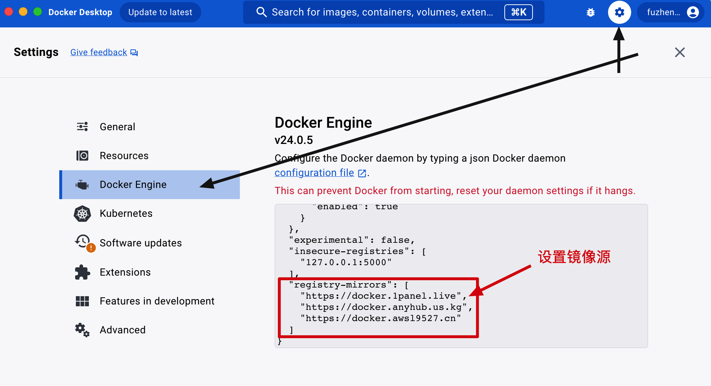

# 从 0 开始安装 Docker 和 Portainer

[toc]

## 一、基础安装

### 1. 查看系统的内核版本

```shell
uname -r
```

```shell
3.10.0-1160.80.1.el7.x86_64
```

- `uname -r`
- x86 64 位系统，如果是 32 位是不能安装 docker 的

### 2. yum 更新到最新版本

```shell
sudo yum update
```

```shell
Last metadata expiration check: 1:15:10 ago on Sat 27 Nov 2021 04:22:53 PM CST.
Dependencies resolved.
Nothing to do.
Complete!
```

- `sudo yum update`
- 看到显示 `Complete` 就代表完成了，整个过程需要 5-10 分钟左右

注意：可能会更新失败，那就操作以下指令

```bash
## 建议备份当前的 yum 源配置，以防万一需要恢复
sudo cp /etc/yum.repos.d/CentOS-Base.repo /etc/yum.repos.d/CentOS-Base.repo.bak

## 从阿里云下载 CentOS 7 的 yum 源配置文件并替换现有的配置
sudo curl -o /etc/yum.repos.d/CentOS-Base.repo https://mirrors.aliyun.com/repo/Centos-7.repo

## 清理旧的缓存并生成新的缓存
sudo yum clean all
sudo yum makecache

## 再次更新
sudo yum update
```

### 3. 安装Docker所需的依赖包

```shell
[root@CodeGuide ~]# sudo yum install -y yum-utils device-mapper-persistent-data lvm2
```

~~~shell
Last metadata expiration check: 1:16:16 ago on Sat 27 Nov 2021 04:22:53 PM CST.
Package yum-utils-4.0.21-3.el8.noarch is already installed.
Package device-mapper-persistent-data-0.9.0-4.el8.x86_64 is already installed.
Package lvm2-8:2.03.12-10.el8.x86_64 is already installed.
Dependencies resolved.
Nothing to
~~~

- `sudo yum install -y yum-utils device-mapper-persistent-data lvm2`
- 看到显示 `Complete` 就代表完成了，整个过程需要 1-3 分钟左右

### 4. 设置Docker的yum的源

```shell
sudo yum-config-manager --add-repo https://mirrors.aliyun.com/docker-ce/linux/centos/docker-ce.repo    
```

```shell
Adding repo from: https://download.docker.com/linux/centos/docker-ce.repo
```

- `sudo yum-config-manager --add-repo https://download.docker.com/linux/centos/docker-ce.repo`
- 鉴于国内网络问题，强烈建议使用国内源。以下是阿里云的软件源。**如果是海外如AWS云就不要设置yum源**

```bash
sudo yum-config-manager \
    --add-repo \
    https://mirrors.aliyun.com/docker-ce/linux/centos/docker-ce.repo
sudo sed -i 's/download.docker.com/mirrors.aliyun.com\/docker-ce/g' /etc/yum.repos.d/docker-ce.repo    
```

### 5. 查看仓库所有Docker版本

```shell
[root@CodeGuide ~]# yum list docker-ce --showduplicates | sort -r
Installed Packages
docker-ce.x86_64               3:20.10.9-3.el8                 docker-ce-stable 
docker-ce.x86_64               3:20.10.8-3.el8                 docker-ce-stable 
docker-ce.x86_64               3:20.10.7-3.el8                 docker-ce-stable 
docker-ce.x86_64               3:20.10.6-3.el8                 docker-ce-stable 
docker-ce.x86_64               3:20.10.5-3.el8                 docker-ce-stable 
docker-ce.x86_64               3:20.10.4-3.el8                 docker-ce-stable 
docker-ce.x86_64               3:20.10.3-3.el8                 docker-ce-stable 
docker-ce.x86_64               3:20.10.2-3.el8                 docker-ce-stable 
docker-ce.x86_64               3:20.10.1-3.el8                 docker-ce-stable 
docker-ce.x86_64               3:20.10.11-3.el8                docker-ce-stable 
docker-ce.x86_64               3:20.10.11-3.el8                @docker-ce-stable
docker-ce.x86_64               3:20.10.10-3.el8                docker-ce-stable 
docker-ce.x86_64               3:20.10.0-3.el8                 docker-ce-stable 
docker-ce.x86_64               3:19.03.15-3.el8                docker-ce-stable 
docker-ce.x86_64               3:19.03.14-3.el8                docker-ce-stable 
docker-ce.x86_64               3:19.03.13-3.el8                docker-ce-stable 
Docker CE Stable - x86_64                       7.1 kB/s | 3.5 kB     00:00    
Available Packages
```

- `yum list docker-ce --showduplicates | sort -r`
- 这里可以看到你能安装的最新版本

### 6. 安装Docker

```shell
[root@CodeGuide ~]# sudo yum install docker-ce
[root@CodeGuide ~]# 推荐；sudo yum install -y docker-ce-25.0.5 docker-ce-cli-25.0.5 containerd.io
```

- 安装默认最新版本的 Docker `最新版本可能有坑，最好指定版本安装`

```shell
[root@CodeGuide ~]# sudo yum install <FQPN>
```

- 安装指定版本，例如：`yum install -y docker-ce-25.0.5 docker-ce-cli-25.0.5 containerd.io`

### 7. 安装Docker-Compose

#### 7.1 正常安装

**官网地址**

```shell
sudo curl -L "https://github.com/docker/compose/releases/download/1.29.2/docker-compose-$(uname -s)-$(uname -m)" -o /usr/local/bin/docker-compose
sudo chmod +x /usr/local/bin/docker-compose    
```

**镜像地址**

```shell
# 指定路径【推荐】
sudo curl -L https://gitee.com/fustack/docker-compose/releases/download/v2.24.1/docker-compose-linux-x86_64 -o /usr/local/bin/docker-compose
# 设置权限
sudo chmod +x /usr/local/bin/docker-compose    
```

#### 7.2 离线安装

```shell
# 下载；docker-compose-`uname -s`-`uname -m` 查看版本；https://github.com/docker/compose/releases/tag/v2.18.1
# 重命名
mv docker-compose-linux-x86_64 docker-compose
# 加入执行权限
sudo chmod +x /usr/local/bin/docker-compose
# 查看 docker-compose 版本
docker-compose -v    
```

```shell
sudo chmod +x /usr/local/bin/docker-compose

docker-compose -v
Docker Compose version v2.18.1   
```

- 安装后就可以使用 compose 命令了；`docker-compose -f environment-docker-compose.yml up -d`

### 8. 启动Docker并添加开机自启动

```shell
# 启动 Docker
[root@CodeGuide ~]# sudo systemctl start docker
```

```shell
# 开机启动 Docker
[root@CodeGuide ~]# systemctl enable docker
```

```shell
# 重启 Docker
sudo systemctl restart docker
```

### 9. 查看 Docker 版本

```shell
[root@CodeGuide ~]# docker --version

Docker version 20.10.21, build baeda1f
```

### 10. 卸载 Docker

```shell
[root@CodeGuide ~]# sudo yum remove docker \
                  docker-client \
                  docker-client-latest \
                  docker-common \
                  docker-latest \
                  docker-latest-logrotate \
                  docker-logrotate \
                  docker-selinux \
                  docker-engine-selinux \
                  docker-engine
```

### 11. Docker 常用命令

```shell
# Docker帮助
[root@CodeGuide ~]# docker --help

# 查看Docker版本
[root@CodeGuide ~]# docker --version

# 搜索镜像文件，如：docker search mysql
[root@CodeGuide ~]# docker search <image>

# 拉取镜像文件， 如：docker pull mysql
[root@CodeGuide ~]# docker pull <image>

# 查看已经拉取下来的所以镜像文件
[root@CodeGuide ~]# docker images

# 删除指定镜像文件
[root@CodeGuide ~]# docker rmi <image>

# 发布指定镜像文件
[root@CodeGuide ~]# docker run --name <name> -p 80:8080 -d <image>

# 查看正在运行的所有镜像
[root@CodeGuide ~]# docker ps

# 查看所有发布的镜像
[root@CodeGuide ~]# docker ps -a

# 删除执行已发布的镜像
[root@CodeGuide ~]# docker rm <image>
```

### 12. 设置国内源

阿里云提供了镜像源：[https://cr.console.aliyun.com/cn-hangzhou/instances/mirrors (opens new window)](https://cr.console.aliyun.com/cn-hangzhou/instances/mirrors)- 登录后你会获得一个专属的地址。

使用以下命令来设置 Docker 国内源：- 或者你可以通过 `vim /etc/docker/daemon.json` 进入修改添加 registry-mirrors 内容后重启 Docker

```yaml
sudo mkdir -p /etc/docker
sudo tee /etc/docker/daemon.json <<-'EOF'
{
  "registry-mirrors": ["https://***替换为你的地址***.mirror.aliyuncs.com"]
}
EOF
sudo systemctl daemon-reload
sudo systemctl restart docker
```

可用镜像检测：[https://status.1panel.top/status/docker(opens new window)](https://status.1panel.top/status/docker)

#### 12.1 本地Docker软件配置



```yaml
{ "registry-mirrors" : [
    "https://docker.1panel.live",
    "https://dc.j8.work",
    "https://docker.m.daocloud.io"
  ],
  "builder": {
    "gc": {
      "enabled": true,
      "defaultKeepStorage": "20GB"
    }
  },
  "experimental": false,
  "features": {
    "buildkit": true
  }
}
```

这个命令会创建一个 `/etc/docker/daemon.json` 文件，并将国内源的配置写入其中。然后你只需要重启 Docker 服务即可使配置生效，可以通过运行 `sudo systemctl restart docker` 命令来重启 Docker 服务。

**解决目前Docker Hub国内无法访问方法**

自从2023年5月中旬，著名Docker 容器平台：`hub.docker.com` “不知” 何种原因国内均无法正常访问了。

这样对国内服务器拉取Docker仓库影响比较大。不过得亏国内有 Docker Hub 镜像平台。有付费的，有免费的！

#### 12.2 Linux 配置 Docker 镜像

```yaml
sudo mkdir -p /etc/docker
sudo tee /etc/docker/daemon.json <<-'EOF'
{
"registry-mirrors": [
  "https://docker.1panel.live",
  "https://dc.j8.work",
  "https://docker.m.daocloud.io",
  "https://dockerproxy.com",
  "https://docker.mirrors.ustc.edu.cn",
  "https://docker.nju.edu.cn"
]
}
EOF
sudo systemctl daemon-reload
sudo systemctl restart docker
```

### 13. 远程连接 - 不推荐

```shell
vim /lib/systemd/system/docker.service
```

```shell
[Unit]Description=Docker Application Container Engine
Documentation=http://docs.docker.com
After=network.target
Wants=docker-storage-setup.service
Requires=docker-cleanup.timer

[Service]
Type=notify
NotifyAccess=main
EnvironmentFile=-/run/containers/registries.conf
EnvironmentFile=-/etc/sysconfig/docker
EnvironmentFile=-/etc/sysconfig/docker-storage
EnvironmentFile=-/etc/sysconfig/docker-network
Environment=GOTRACEBACK=crash
Environment=DOCKER_HTTP_HOST_COMPAT=1
Environment=PATH=/usr/libexec/docker:/usr/bin:/usr/sbin
ExecStart=/usr/bin/dockerd-current \
          --add-runtime docker-runc=/usr/libexec/docker/docker-runc-current \
          --default-runtime=docker-runc \
          --exec-opt native.cgroupdriver=systemd \
          --userland-proxy-path=/usr/libexec/docker/docker-proxy-current \
          --init-path=/usr/libexec/docker/docker-init-current \
          --seccomp-profile=/etc/docker/seccomp.json \
          -H tcp://0.0.0.0:2375 -H unix:///var/run/docker.sock \
          $OPTIONS \
          $DOCKER_STORAGE_OPTIONS \
          $DOCKER_NETWORK_OPTIONS \
          $ADD_REGISTRY \
          $BLOCK_REGISTRY \
          $INSECURE_REGISTRY \
          $REGISTRIES
ExecReload=/bin/kill -s HUP $MAINPID
LimitNOFILE=1048576
LimitNPROC=1048576
LimitCORE=infinity
TimeoutStartSec=0
Restart=on-abnormal
KillMode=process

[Install]
WantedBy=multi-user.target
```

- 添加：`-H tcp://0.0.0.0:2375 -H unix:///var/run/docker.sock \`

```shell
# 加载
systemctl daemon-reload
# 重启
systemctl restart docker
# 测试
curl http://127.0.0.1:2375/info
```

- 之后你就可以打开 IDEA 的 Services 配置 Docker 了；`tcp://180.76.138.**:2375` 验证连接后就可以使用了。

### 14. 卸载Docker

```shell
/Applications/Docker.app/Contents/MacOS/Docker --uninstall
```