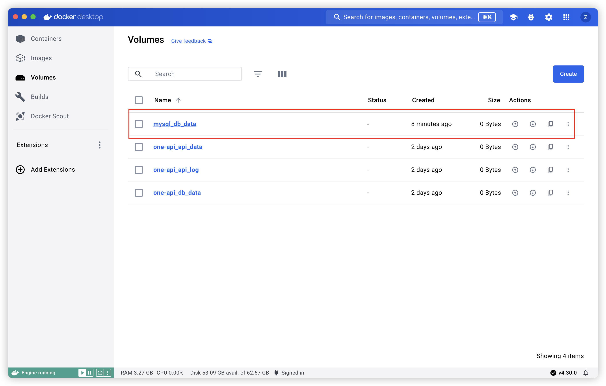
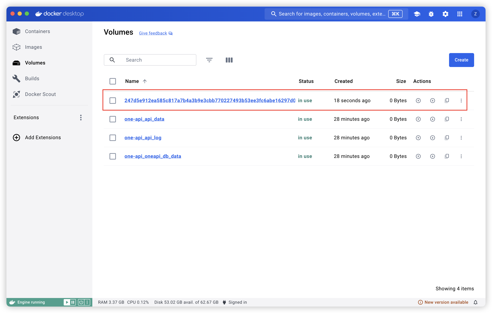
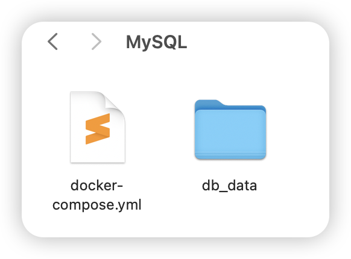

## docker 中安装 MySQL

[toc]

#### 背景

在 Docker 中部署和安装 MySQL 非常简单，你可以使用 Docker Compose 或直接使用 Docker 命令行。以下是两种方法的详细步骤。

---

#### 安装方法

##### 使用 Docker Compose

首先，创建一个 docker-compose.yml 文件，并添加以下内容：

~~~yaml
version: '3.8'

services:
  db:
    image: mysql:8.0
    platform: linux/amd64  # 可选项，用于指定平台
    container_name: mysql_container
    environment:
      MYSQL_ROOT_PASSWORD: rootpassword
      MYSQL_DATABASE: mydatabase
      MYSQL_USER: myuser
      MYSQL_PASSWORD: mypassword
    ports:
      - "3306:3306"
    volumes:
      - db_data:/var/lib/mysql

volumes:
  db_data:
~~~

然后，在终端中运行以下命令来启动 MySQL 容器：

~~~bash
docker-compose up -d
~~~

这个命令会在后台启动 MySQL 容器，并根据 docker-compose.yml 文件的配置进行安装和设置。

##### 使用 Docker 命令行

你可以直接使用 Docker 命令行来拉取 MySQL 镜像并运行容器：

~~~bash
# 拉取 MySQL 镜像
docker pull mysql:8.0

# 运行 MySQL 容器
docker run --name mysql_container -e MYSQL_ROOT_PASSWORD=rootpassword -e MYSQL_DATABASE=mydatabase -e MYSQL_USER=myuser -e MYSQL_PASSWORD=mypassword -p 3306:3306 -v mysql_data:/var/lib/mysql -d mysql:8.0
~~~

---

#### 启动参数

这里的参数解释：

- --name mysql_container: 容器名称。
- -e MYSQL_ROOT_PASSWORD=rootpassword: 设置 root 用户密码。
- -e MYSQL_DATABASE=mydatabase: 创建一个新的数据库。
- -e MYSQL_USER=myuser: 创建一个新的用户，使用 root 用户可以不设置。
- -e MYSQL_PASSWORD=mypassword: 新用户的密码，使用 root 用户可以不设置。
- -p 3306:3306: 映射容器的 3306 端口到主机的 3306 端口（宿主机端口：容器端口）。
- -v mysql_data:/var/lib/mysql: 将容器的 /var/lib/mysql 目录挂载到主机上的 mysql_data 卷，以便持久化数据。
- -d: 后台运行容器。

---

#### 连接 MySQL

一旦容器启动后，你可以通过以下命令连接到 MySQL 容器：

~~~bash
docker exec -it mysql_container mysql -u myuser -p mypassword mydatabase
~~~

---

#### 数据持久化

使用 volumes 持久化数据，这样即使容器删除数据也不会丢失。在 docker-compose.yml 文件中定义了 db_data 卷，或者在 docker run 命令中使用 -v mysql_data:/var/lib/mysql 进行数据持久化。

volumes 的配置在 docker-compose.yml 文件中可以有不同的方式，根据你的需要来选择适合的配置。通常有两种方式来配置 volumes：

1. 命名卷（Named Volumes）

   适用于不需要直接访问宿主机文件系统的情况，由 Docker 管理卷的生命周期。

2. 绑定挂载（Bind Mounts）

   适用于需要直接访问和管理宿主机上的文件的情况，特别是开发环境中常用。

##### 命名卷（Named Volumes）

命名卷是由 Docker 管理的卷，数据存储在 Docker 的管理目录中。最常用的配置方法是使用命名卷，因为它简单并且不需要指定主机目录。

在 docker-compose.yml 文件中，你可以像下面这样配置命名卷：

~~~yaml
version: '3.9'

services:
  db:
    image: mysql:latest
    container_name: mysql_latest
    environment:
      MYSQL_ROOT_PASSWORD: root#123QAZ
      MYSQL_DATABASE: one-api
      # MYSQL_USER: myuser
      # MYSQL_PASSWORD: mypassword
    ports:
      - "3308:3306"
    volumes:
      - db_data:/var/lib/mysql
      # - ./db_data:/var/lib/mysql

volumes:
	# 定义一个命名卷
  db_data: 
~~~

在这个例子中，db_data 是一个命名卷，Docker 将会自动管理它。如图：

如果不自定义命名卷，docker 也会进行管理，只不过命名不规范。

~~~yaml
version: '3.9'

services:
  db:
    image: mysql:latest
    container_name: mysql_latest
    environment:
      MYSQL_ROOT_PASSWORD: root#123QAZ
      MYSQL_DATABASE: one-api
      # MYSQL_USER: myuser
      # MYSQL_PASSWORD: mypassword
    ports:
      - "3308:3306"
~~~

如果容器多了且都不对卷进行命名，会十分难管理。

##### 绑定挂载（Bind Mounts）

绑定挂载允许你将主机的某个目录挂载到容器中。这样你可以直接访问和修改主机上的文件。

在 docker-compose.yml 文件中，你可以像下面这样配置绑定挂载：

~~~yaml
version: '3.9'

services:
  db:
    image: mysql:latest
    container_name: mysql_latest
    environment:
      MYSQL_ROOT_PASSWORD: root#123QAZ
      MYSQL_DATABASE: one-api
      # MYSQL_USER: myuser
      # MYSQL_PASSWORD: mypassword
    ports:
      - "3308:3306"
    volumes:
      # - db_data:/var/lib/mysql
      # 使用绑定挂载
      - ./db_data:/var/lib/mysql

# 这里不需要 volumes 定义
~~~

在这个例子中，`./db_data` 是指 `docker-compose.yml` 在宿主机中的同级目录 `db_data`，Docker 将会把它挂载到容器的 /var/lib/mysql 目录中。如图：

---

#### 总结

通过上面的方式，可以在 Docker 中轻松部署和安装 MySQL。
