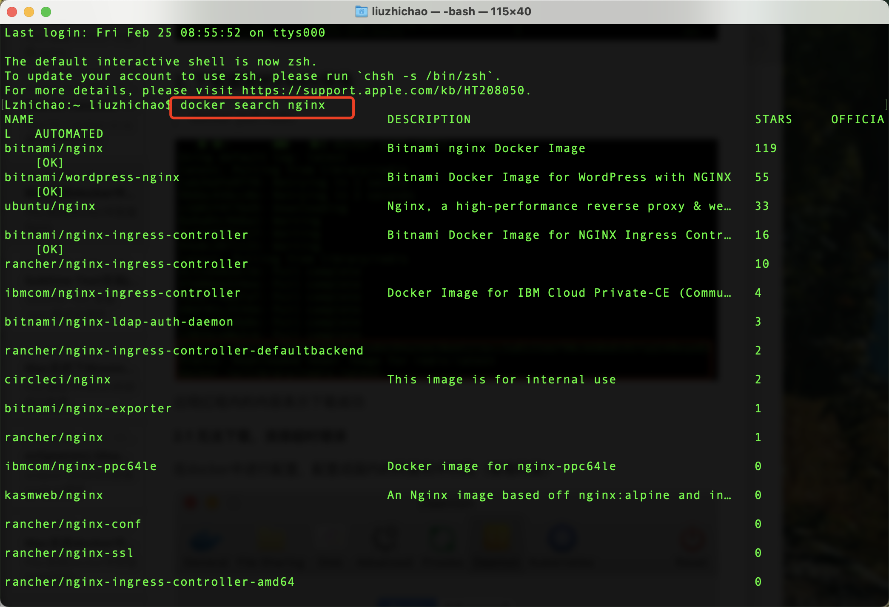
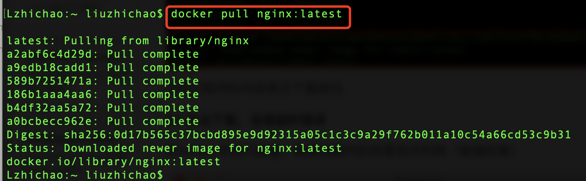
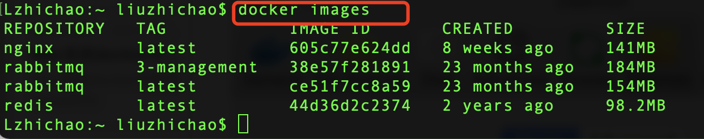
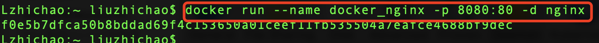
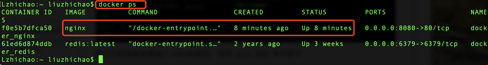
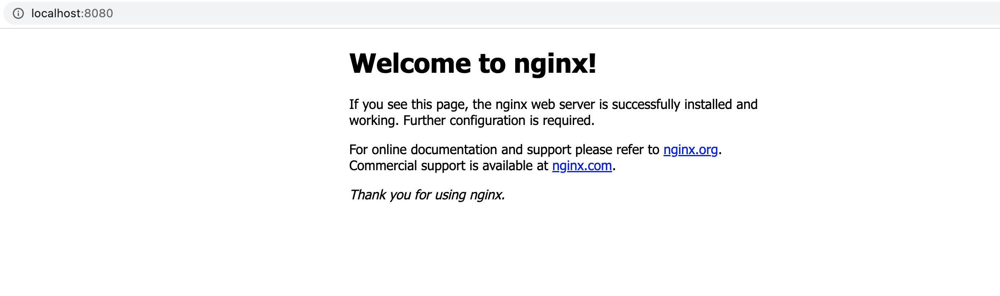
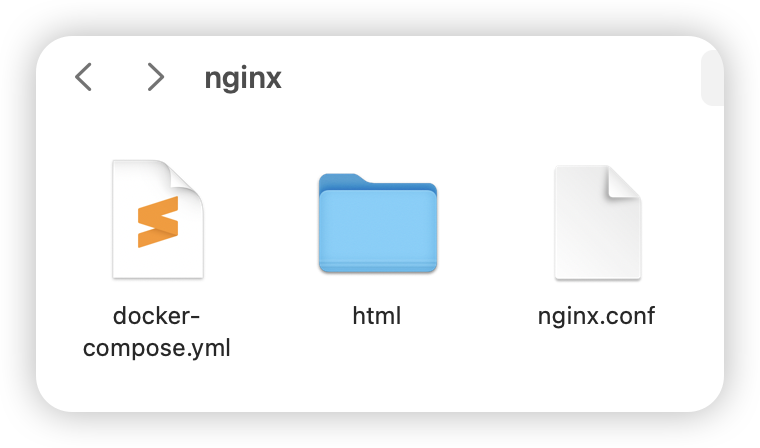
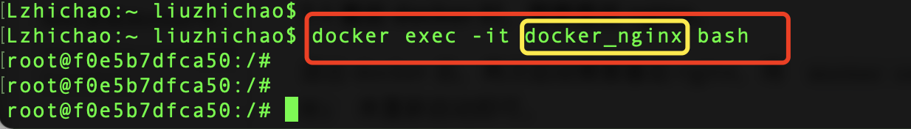

## Mac 系统 docker 中安装 nginx

[toc]

#### 简介

本文主要介绍如何在 docker 中安装 nginx，分为命令安装和文件安装两种形式。

---

#### 命令安装

##### 1. 搜索可用的镜像

> docker search nginx

##### 2. 拉取redis镜像

> docker pull nginx:latest

##### 2.1 无法下载，连接超时错误

在docker中进行配置，配置成国内的阿里和中科院（首推阿里）

在配置时，最初使用https协议配置，提示 "registry-mirrors" : No certs for rnpwate.mirror.aliyuncs.com 错误，改成 http 即可。

##### 3. 查看下载下来的镜像

> docker images

##### 4. 启动nginx

> docker run --name docker_nginx -p 8080:80 -d nginx

Mac 中在 docker 中安装 nginx 不方便直接改配置文件（没有 vim 相关命令），可以将配置文件进行挂载，参考 7.2

关于启动参数的说明：

*  -d：启动哪个镜像并后台运行
* --name：服务名字
* -p 8080:80：将本地的8080端口映射到容器的80端口

##### 5. 查看运行的容器

> docker ps

##### 6. 通过浏览器访问

出现 nginx 首页表示安装成功

---

#### docker-compose 文件安装

我们也可以使用 Docker Compose 来安装和管理 Nginx。

##### docker-compose.yml文件

首先，创建一个 `docker-compose.yml` 文件：

~~~yaml
version: '3.9'

services:
  nginx:
    image: nginx:latest
    container_name: mynginx
    ports:
      - "80:80"
~~~

正确配置 `nginx.conf` 文件和 `index.html` 文件后，在同一目录下运行以下命令来启动 Nginx：

~~~sh
docker-compose up -d
~~~

在这个 `docker-compose.yml` 文件中：

- image 指定要使用的 Nginx 镜像。

- container_name 为容器指定名字。

- ports 用于将宿主机的端口映射到容器的端口。

- volumes 用于将宿主机的文件或目录挂载到容器中，以便于配置和静态文件管理。

---

#### 挂载配置文件

通常情况下，我们需要将配置文件进行挂载到宿主机，方便我们对配置文件进行修改。此时我们要在宿主机中补充两个配置文件，分别是 `nginx.conf` 和 `index.html`。

##### nginx.conf

在 `docker-compose.yml` 文件的同级目录中创建 `nginx.conf` 文件，内容如下：

~~~nginx
worker_processes 1;

events {
    worker_connections 1024;
}

http {
    server {
        listen 80;
        server_name localhost;

        location / {
            root /usr/share/nginx/html;
            index index.html index.htm;
        }
    }
}
~~~

###### 配置文件分析：

1. worker_processes 1;

   这行配置指定了 Nginx 启动的工作进程数量。通常，设置为与 CPU 核心数量相同的值以提高性能。在这个例子中，worker_processes 被设置为 1，这意味着 Nginx 将使用一个工作进程。

2. events { ... }

   events 块包含与处理连接相关的配置。

   worker_connections 1024;这行配置指定每个工作进程可以同时打开的最大连接数。在这个例子中，每个工作进程最多可以处理 1024 个连接。

3. http { ... }

   http 块包含 HTTP 服务器相关的配置。

4. server { ... }

   server 块定义了一个虚拟主机的配置。

   - listen 80;

     这行配置指定 Nginx 监听的端口号。在这个例子中，Nginx 监听 HTTP 请求的默认端口 80。

   - server_name localhost;

     这行配置指定服务器的主机名。在这个例子中，服务器的主机名是 localhost。

5. location / { ... }

   location 块定义了针对特定 URL 路径的配置。

   - location / { ... }

     这行配置表示针对根路径 (/) 的所有请求将应用该配置。

   - root /usr/share/nginx/html;

     这行配置指定请求的文档根目录。在这个例子中，请求将从 /usr/share/nginx/html 目录中查找文件。

   - index index.html index.htm;

     这行配置指定了默认的索引文件列表。如果用户请求一个目录而没有指定文件，Nginx 将尝试查找并返回 index.html 或 index.htm 文件。

##### index.html

在 `docker-compose.yml` 文件的同级目录中创建 `index` 目录，在里面创建 `index.html` 文件，如果不正确配置该文件，访问时会提示 403。文件内容如下：

~~~html
<!DOCTYPE html>
<html lang="en">
<head>
    <meta charset="UTF-8">
    <meta name="viewport" content="width=device-width, initial-scale=1.0">
    <title>Welcome to Nginx</title>
    
</head>
<body>
    <h1>Welcome to Nginx!</h1>
    
If you see this page, the Nginx web server is successfully installed and working.

</body>
</html>
~~~

这个简单的 index.html 文件展示了一个基本的欢迎页面，适用于 Nginx 服务器的默认首页。你可以根据需要进一步扩展和定制这个 HTML 文件。

##### 目录结构

目录结构如下，`html` 文件夹中存放 `index.html` 文件：

##### 启动 nginx

1. 命令启动

   ~~~sh
   docker run --name docker_nginx -p 8080:80 -v ./nginx.conf:/etc/nginx/nginx.conf -v ./html:/usr/share/nginx/html -d nginx
   ~~~

   参数说明：

   - -d	启动哪个镜像并后台运行
   - --name               服务名字
   - -p 8080:80    将本地的8080端口映射到容器的80端口
   - 第一个 `-v`，是挂载的主配置文件 `nginx.conf`，便于后面修改。

   *  第二个 `-v`，默认启动页面，便于验证是否启动成功。

2. docker-compose.yml 启动

   在上面的启动文件中，添加挂载卷（volumes）即可。内容如下：

   ~~~yaml
   version: '3.9'
   
   services:
     nginx:
       image: nginx:latest
       container_name: mynginx
       ports:
         - "80:80"
       volumes:
         - ./nginx.conf:/etc/nginx/nginx.conf
         - ./html:/usr/share/nginx/html
   ~~~

   执行命令

   ~~~sh
   docker-compose up -d
   ~~~

##### 访问 nginx

浏览器访问 `localhost` 即可。

---

#### 命令操作 nginx

执行以下命令，可以进入 docker 中的 nginx 容器，通过命令操作 nginx。

~~~sh
docker exec -it docker_nging bash
~~~

---

#### 总结

通过以上步骤，我们可以在 Docker 容器中安装和运行 Nginx，并可以将配置文件挂载到宿主机中，这样可以方便地管理 Nginx 服务器的相关配置。

