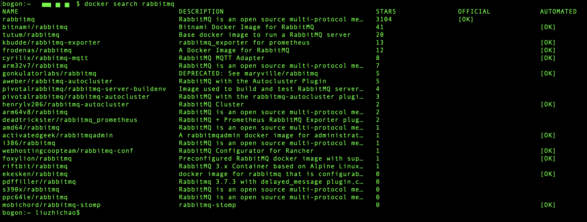
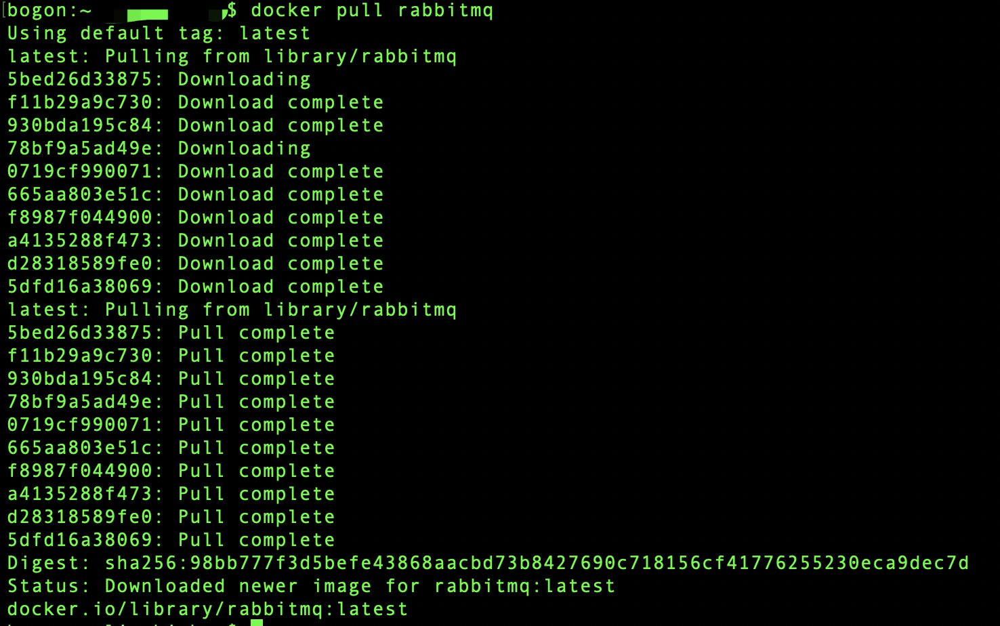
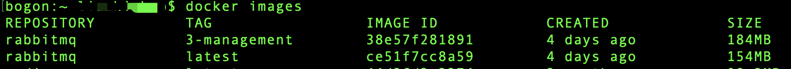
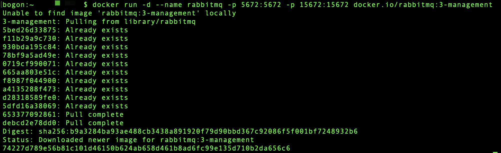
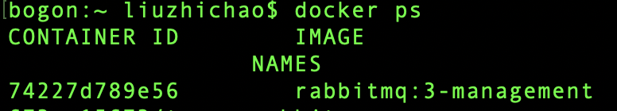

---

---

## docker中安装RabbitMQ

[toc]

#### 1. 搜索可用的镜像

> docker search rabbitmq

---

#### 2. 下载相应的镜像

> docker pull rabbitmq												## 默认下载latest版本，但是该版本没有web管理界面 

> docker  pull rabbitmq:3-management				  ## 该版本有web管理界面，建议直接拉取该镜像

---

#### 3. 查看下载下来的镜像

> docker images

---

#### 4. 启动镜像

> docker run -d --name rabbitmq -p 5672:5672 -p 15672:15672 docker.io/rabbitmq:3-management

---

#### 5. 查看mq是否运行

> docker ps

---

#### 6. 访问web界面

> localhost:15672							## 默认的用户名/密码： guest/guest