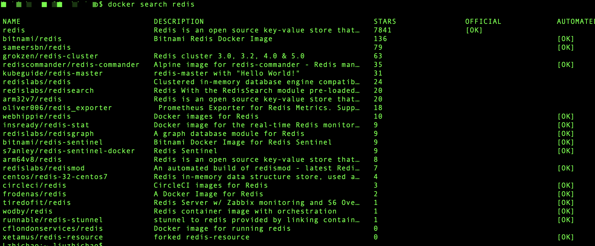
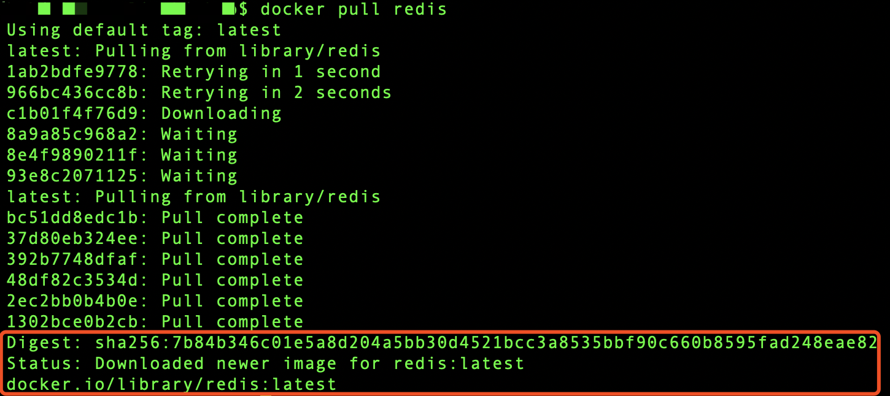
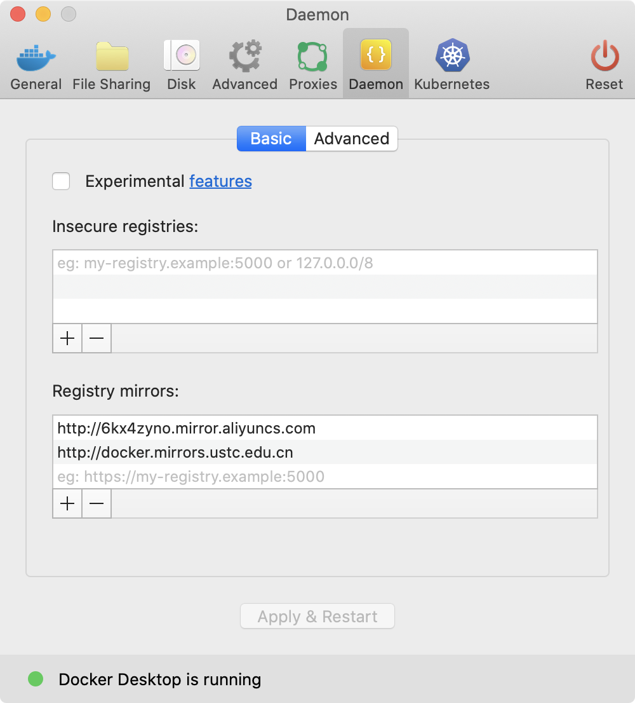
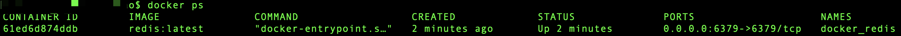
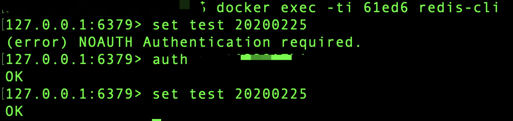
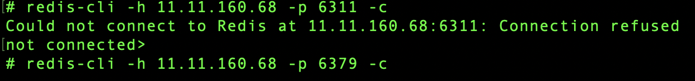
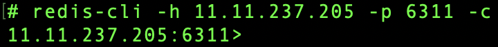
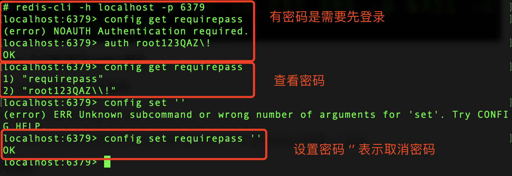

## docker中安装Redis

[TOC]

#### 1. 搜索可用的镜像

> docker search redis



---

#### 2. 下载最新的redis镜像

> docker pull redis



出现红框内的内容表示下载成功

##### 2.1 无法下载，连接超时错误

在docker中进行配置，配置成国内的阿里和中科院（首推阿里）



在配置时，最初使用https协议配置，提示 "registry-mirrors" : No certs for rnpwate.mirror.aliyuncs.com 错误，改成 http 即可。

---

#### 3. 查看下载下来的镜像

> docker images


---

#### 4. 启动redis

> docker run -d --name docker_redis -p 6379:6379 redis:latest redis-server --appendonly yes --requirepass "root123QAZ\!"


关于启动参数的说明：

* docker run -d	后台运行
* --name               服务名字
* -p 6379:6379    将容器的6379端口映射到主机的6379端口
* redis-server --appendonly yes    在容器中执行 redis-server 命令，并打开redis持久化配置
* --requirepass   设置密码（密码中不能包含！）

---

#### 5. 查看运行的容器

> docker ps



---

#### 6. 连接redis并进行测试

> docker exec -ti 61ed6 redis-cli



第三行报错是需要输入redis的密码，使用 `auth 密码` 命令即可

也可以在连接时便输入密码， 只不过安全性低一些

> ```
> docker exec -ti 61ed6 redis-cli -h localhost -p 6379 -a 你的密码
> ```

---

#### 7. 注意事项

##### 7.1 重启 docker 时，需要重启 redis。

退出 docker 后，再次启动需要重启 redis，不能重新执行 run 命令，否则报错如下，显示已有 container。

> Error response from daemon: Conflict. The container name "/docker_redis" is already in use by container "61ed6d874ddb466ec11dc432e2d87b707f3edc1e6febd74fd8e0d6531f081823". You have to remove (or rename) that container to be able to reuse that name.

此时，需要用 `docker restart docker_redis(镜像名称)` 来重新启动即可。

##### 7.2 docker 中连接 redis 

首先先在 docker 中进入 redis 的 container

> docker exec -it docker_redis sh

要在进入 redis 的 container 时就进行连接，输入以下命令，若有密码则在后面加 -a password

>redis-cli -h localhost -p 6379 -c -a root123QAZ\!

参数详解：

* -h 主机名
* -p 端口
* -c 集群查找
* -a 密码

如果在连接时一开始出现错误，或者由于输入错误导致连接不上等操作，出现如下 entity需要 control+c 终止



如果不 control+c 终止，则会一直重复报错，正确输入界面如下（#开头）：



##### 7.3 docker 中设置/取消 redis 密码

首先进行 redis 连接，7.2 中操作

> docker exec -it docker_redis sh
>
> redis-cli -h localhost -p 6379 -c -a root123QAZ\!      # 没有密码不需要 -a 参数

查看现有密码

> config get requirepass

设置密码

> config set requirepass xxxx              # xxxx 是设置的密码，如果要取消密码就设置为  `‘’`

当前有密码时需要先进行登录

> auth password

流程如图：



