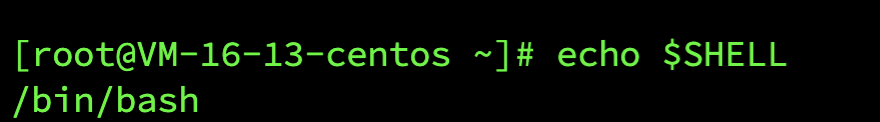
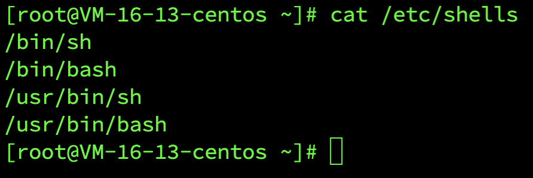
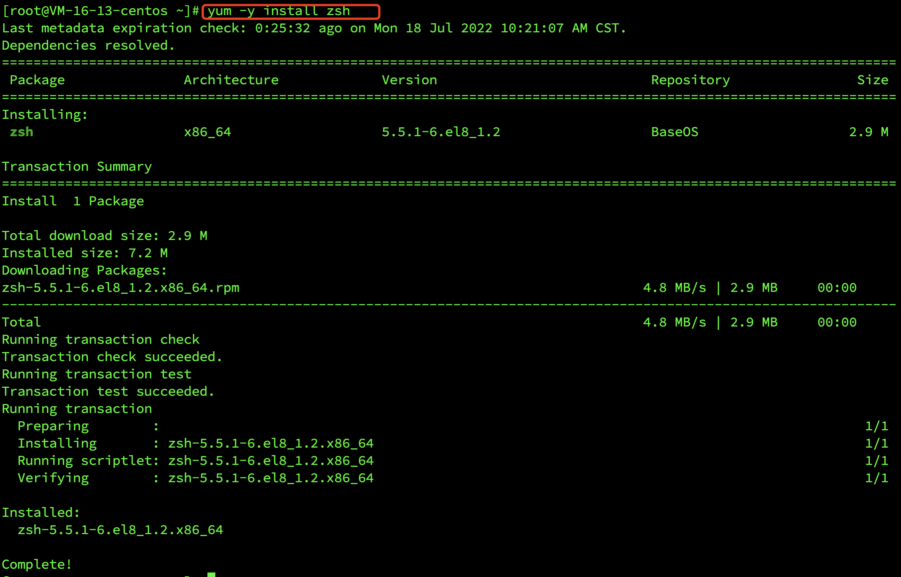
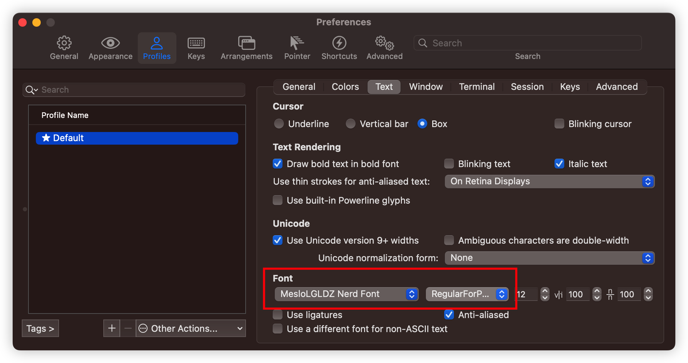

## CentOS 8.0 安装 zsh

[toc]

#### 一、 简介

> 全名：Oh My Zsh 是一个增强版的 shell 工具
>
> 官网：https://ohmyz.sh/

---

#### 二、 安装

##### 1. 查看当前系统使用 shell

> echo $SHELL



##### 2. 查看系统是否已经安装了 zsh

> cat /etc/shells
>
> 

##### 3. 用 yum 进行安装

> yum -y install zsh



##### 4. 查看 shell 列表

> cat /etc/shells


> 安装 homebrew，开代理。
>
> /bin/bash -c "$(curl -fsSL https://raw.githubusercontent.com/Homebrew/install/HEAD/install.sh)"
>
> 
>
> 写入配置文件
>
> echo 'eval "$(/opt/homebrew/bin/brew shellenv)"' >> ~/.zprofile
> eval "$(/opt/homebrew/bin/brew shellenv)"
>
> 
>
> 查看版本信息，确认安装成功。
>
> brew -v
>
> 
>
> 安装 item2
>
> brew install iterm2 --cask
>
> 
>
> 安装 zsh
>
> brew install zsh
>
> 
>
> 安装0h-my-zsh
>
> sh -c "$(curl -fsSL https://raw.githubusercontent.com/ohmyzsh/ohmyzsh/master/tools/install.sh)"
>
> 
>
> 切换到 zsh
>
> chsh -s /bin/zsh
>
> 
>
> 安装Powerlevel9k主题
>
> git clone https://github.com/bhilburn/powerlevel9k.git ~/.oh-my-zsh/custom/themes/powerlevel9k
>
> 
>
> 安装字体
>
> https://github.com/ryanoasis/nerd-fonts/blob/e9ec3ae4548e59eb9a6531f38370cb99ca591e16/patched-fonts/Meslo/L-DZ/complete/Meslo%20LG%20L%20DZ%20Regular%20Nerd%20Font%20Complete.otf
>
> 
>
> 安装:[Material Design] 颜色主题
>
> https://github.com/MartinSeeler/iterm2-material-design
>
> 
>
> 修改配置文件，全覆盖配置，配置在下面
>
> vim ~/.zshrc
>
> 
>
> 重启
>
> source ~/.zshrc
>
> 提示报错：因为部分插件没有下载下来导致
> [oh-my-zsh] plugin 'zsh-syntax-highlighting' not found
> [oh-my-zsh] plugin 'zsh-autosuggestions' not found
>
> 下载插件：
>
> git clone https://github.com/zsh-users/zsh-autosuggestions.git ~/.oh-my-zsh/custom/plugins/zsh-autosuggestions
>
> git clone https://github.com/zsh-users/zsh-syntax-highlighting.git ~/.oh-my-zsh/custom/plugins/zsh-syntax-highlighting
>
> 重启
>
> source ~/.zshrc
>
> 
>
> 如果打开显示乱码，则是因为字体的原因，修改字体即可正常显示。
>
> iterm2 --> setting --> profiles --> text --> font
>
> 


**如果遇到环境变量无效问题，建议回过头来查看终端类型，再做正确的设置。**

从`macOS Catalina`(10.15.x) 版开始，`Mac`使用`zsh`作为默认`Shell`，使用`.zprofile`，所以对应命令：

```bash
echo 'eval "$(/opt/homebrew/bin/brew shellenv)"' >> ~/.zprofile
eval "$(/opt/homebrew/bin/brew shellenv)"
```

如果是`macOS Mojave` 及更低版本，并且没有自己配置过`zsh`，使用`.bash_profile`：

```bash
echo 'eval "$(/opt/homebrew/bin/brew shellenv)"' >> ~/.bash_profile
eval "$(/opt/homebrew/bin/brew shellenv)"
```


~~~bash
vim ~/.zshrc //配置全覆盖

export ZSH="$HOME/.oh-my-zsh"
 
ZSH_THEME="powerlevel9k/powerlevel9k"
POWERLEVEL9K_MODE="nerdfont-complete"
POWERLEVEL9K_PROMPT_ON_NEWLINE=true
POWERLEVEL9K_LEFT_PROMPT_ELEMENTS=(os_icon user dir_writable dir vcs)
POWERLEVEL9K_RIGHT_PROMPT_ELEMENTS=(status command_execution_time root_indicator background_jobs time disk_usage ram)
#POWERLEVEL9K_MULTILINE_LAST_PROMPT_PREFIX="%(?:%{$fg_bold[green]%}➜ :%{$fg_bold[red]%}➜ )"
#POWERLEVEL9K_MULTILINE_FIRST_PROMPT_PREFIX=""
#POWERLEVEL9K_USER_ICON="\uF415" # 
POWERLEVEL9K_ROOT_ICON="\uF09C"
#POWERLEVEL9K_SUDO_ICON=$'\uF09C' # 
POWERLEVEL9K_TIME_FORMAT="%D{%H:%M}"
#POWERLEVEL9K_VCS_GIT_ICON='\uF408 '
#POWERLEVEL9K_VCS_GIT_GITHUB_ICON='\uF408 '
 
ZSH_DISABLE_COMPFIX=true
 
ENABLE_CORRECTION="true"
COMPLETION_WAITING_DOTS="true"
 
plugins=(
  git
  iterm2
  macports
  man
  macos
  python
  composer
  zsh-syntax-highlighting
  zsh-autosuggestions
)
 
source $ZSH/oh-my-zsh.sh
 
alias suroot='sudo -E -s'
 
# source ~/.bash_profile
 
if [ -f ~/.bash_profile ]; then
    . ~/.bash_profile;
~~~


