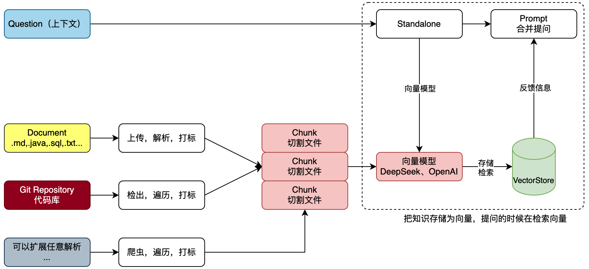
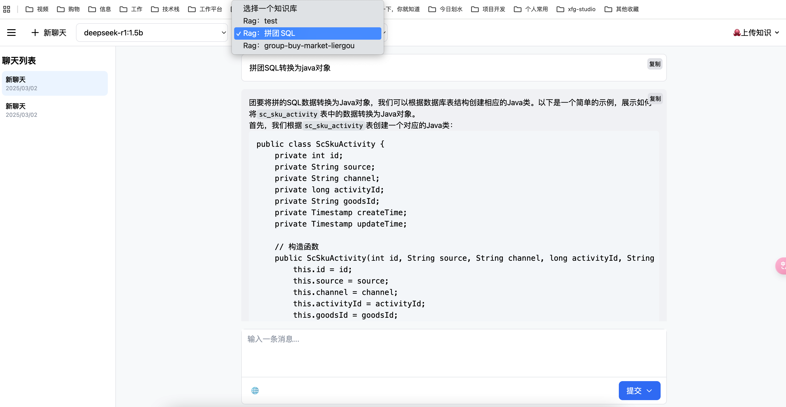
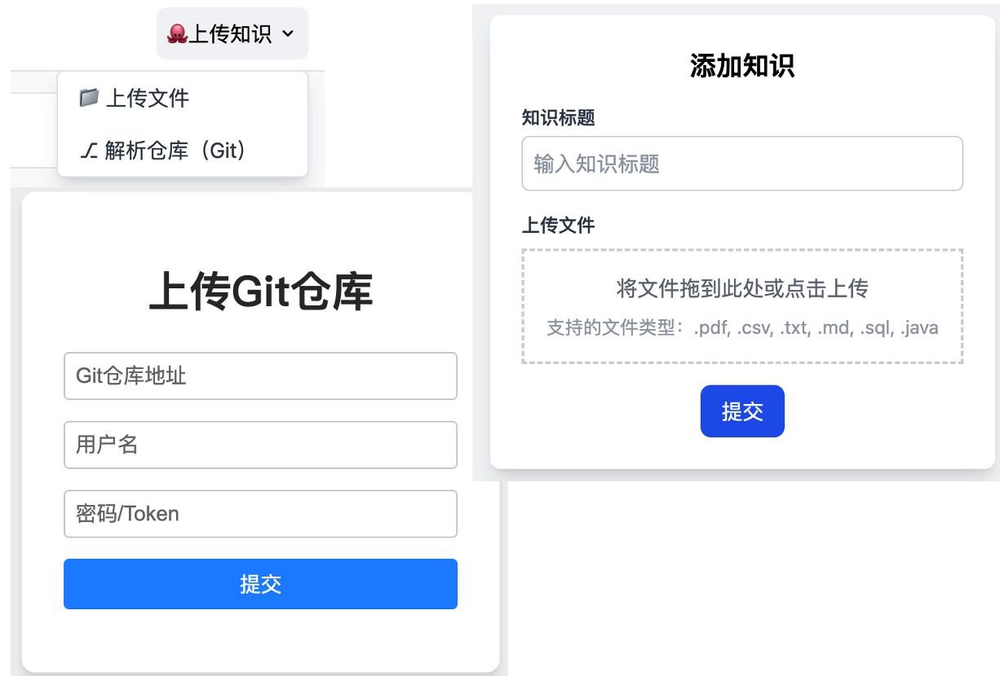
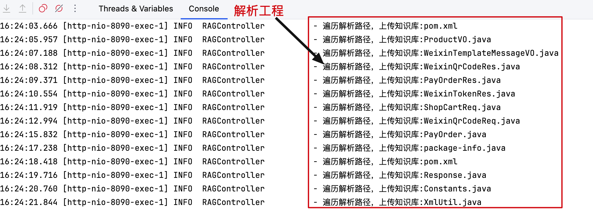

# 第1节：关于 AI RAG 知识库项目介绍

[toc]

## 一、项目简述

基于 Ollama 部署 DeepSeek 大模型，提供 API 接口。运用 Spring AI 框架承接接口实现 RAG 知识库能力。这款 RAG 知识库支持文本解析，以及 Git 代码库的解析。

工程结构采取2层架构，轻量化设计，重点在于突出 RAG 功能实现。以此方式，帮助大家更好的理解，除了工程架构外的 RAG 知识库搭建。方便大家快速上手学习。

---

## 二、什么是 RAG

[RAG：检索增强生成](https://www.promptingguide.ai/zh/techniques/rag)

它通用语言模型通过微调就可以完成几类常见任务，比如分析情绪和识别命名实体。这些任务不需要额外的背景知识就可以完成。要完成更复杂和知识密集型的任务，可以基于语言模型构建一个系统，访问外部知识源来做到。这样的实现与事实更加一性，生成的答案更可靠，还有助于缓解“幻觉”问题。

Meta AI 的研究人员引入了一种叫做检索增强生成（Retrieval Augmented Generation，RAG）的方法来完成这类知识密集型的任务。RAG 把一个信息检索组件和文本生成模型结合在一起。RAG 可以微调，其内部知识的修改方式很高效，不需要对整个模型进行重新训练。

RAG 会接受输入并检索出一组相关/支撑的文档，并给出文档的来源（例如维基百科）。这些文档作为上下文和输入的原始提示词组合，送给文本生成器得到最终的输出。这样 RAG 更加适应事实会随时间变化的情况。这非常有用，因为 LLM 的参数化知识是静态的。RAG 让语言模型不用重新训练就能够获取最新的信息，基于检索生成产生可靠的输出。

Lewis 等人（2021）提出一个通用的 RAG 微调方法。这种方法使用预训练的 seq2seq 作为参数记忆，用维基百科的密集向量索引作为非参数记忆（使通过神经网络预训练的检索器访问）

---

## 三、功能流程

我们知道 AI（OpenAI/DeepSeek）的信息回复是基于我们的提问，提问的信息越完善准确，越可以更好的反馈结果。
那么对于一个Git项目或者一个工程的全部SQL，我们需要对工程信息发起提问，但不想每次都从工程或者SQL中做整理，那么就可以把这些信息提交给知识库。那么每次提问的时候选择对应的知识库，就可以帮我们携带文本向量匹配知识，之后进行一起提交给 AI 大模型来提问。如图；

- 首先，文本知识库可以是非常多种的类型，不非得限定到文字，也可以是sql或者java代码。那么这里我们就可以解析一类是上传的文件，一类是Git代码库的项目。也可以是来自于网页的内容之后爬虫。这些内容都可以被解析处理。
- 之后，把文件进行切割，存储到向量模型。存储的时候要对文件进行打标，标记出属于哪个知识库。甚至你可以做的更细致，比如，项目工程时，这是什么包下的什么类。都可以打标。完事后存储到向量库。这个也就是说所说的文本向量化。
- 最后，在进行提问的时候，以提交的问题和问题到向量库检索，一起合并信息进行提问，这样提问的信息描述会更加定向准确，也就可以获得更好的回答。如，我们问的是，`请对拼团项目SQL语句，生产对应的所有JavaPO对象。`那么这个时候就会反馈类信息了。也可以为运营伙伴提供必要的SQL语句`请提供我要查询xxx、yyy、zzz数据，在什么时间产生的数据。`，他们也就不用非得找研发要SQL语句了。这样就可以帮助企业提效了。

---

## 四、项目演示

### 1. 对话页面

- 这是通过非常多的AI工具😂（课程会演示这个操作），实现的一款非常简单漂亮的UI效果。

### 2. 上传知识

- 上传知识，可以解析不同类型的知识库。
- 除了课程提供的文档库、代码库，你可以增加其他的知识库，如；网页的解析，与网页内容对话。让我们的UI，增加一个侧边栏，读取当前网页内容，分析对话。这样在公司中的一些工程的日志，错误分析时，可以更快的处理。

### 3. 解析知识 - 后台日志

- 上传知识后，可以看到日志信息。

---

## 五、课程信息

### 1. 基础技术

- JDK 17 ~ 21
- Postgresql
- SpringBoot 3.2.3
- Spring AI 0.8.1 ~ 1.0.0
- Redis
- Docker
- Ollama + DeepSeek

### 2. 获得知识

- 【前端】基于 DeepSeek 等 AI 大模型，学习前端 UI 设计和实现。几乎在0编码完成。
- 【后端】熟练使用 SpringBoot、Redis、Postgresql（向量库）搭建 AI 编程项目框架
- 【后端】Spring AI，结合 Ollama（DeepSeek）、OPenAI 对接使用
- 【后端】Spring AI，RAG 增强检索实现，支持文本解析、Git 代码库解析
- 【后端】掌握多线程模型对知识库检索的异步响应，提高切割存储效率
- 【后端】Flux 异步响应是接口编写和 UI 流式应答对接
- 【运维】Linux、Docker、Portainer、Nginx，服务的运维部署

