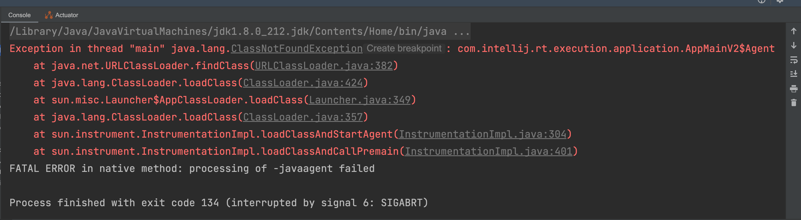

## Mac OS 解决 IDEA 启动报错问题

[toc]

#### 一、 背景

为了记录由于系统升级和 app 升级而导致的 idea 在 Mac OS 系统下启动报错的系列问题。

---

#### 二、 Too many open files in system  

顾名思义就是当前系统打开了太多文件，系统最多能打开的文件数和每个进程能打开的最大文件数是有限制的。

##### 1. 个人出现场景

- 启动项目时偶尔出现 
- 使用 JRebel 以 Debug 模式启动项目，进行编译时。

##### 2. 报错原因

- 内核限制：操作系统打开的句柄数过多
- launchd 对进程做了限制
- shell 对进程做了限制

##### 3. 解决方案

###### 3.1 内核的限制

整个操作系统可以打开的文件数受内核的限制，可以通过以下命令查看：

~~~shell
sysctl kern.maxfiles
sysctl kern.maxfilesperproc
~~~

输出内容如下：

~~~shell
kern.maxfiles: 40960 # 系统最多能够打开的文件数目
kern.maxfilesperproc: 20480 # 每个进程最多能打开的文件数目
~~~

以上是修改之后的值，初始值分别是 10240 和 2048，每个进程最多只能打开 2048 个文件，这对于比较大的 Java 项目进行编译可能会不够用。

临时修改上面两个值：

~~~shell
sudo sysctl -w kern.maxfiles=40960 # 或其他你选择的数字
sudo sysctl -w kern.maxfilesperproc=20480 # 或其他你选择的数字
~~~

如果需要永久修改的话，需要修改系统文件 **/etc/sysctl.conf** （该文件可能不存在，不存在则手动创建），在文件中添加以下内容：

~~~shell
kern.maxfiles=40960
kern.maxfilesperproc=20480
~~~

###### 3.2 launchd 对进程的限制

查看当前的限制：

~~~shell
launchctl limit maxfiles
~~~

输出内容如下：

~~~shell
maxfiles    20480          40960 
           进程限制				系统限制
~~~

**临时修改：**

~~~shell
sudo launchctl limit maxfiles 20480 40960
~~~

**永久修改则需要创建plist 文件：**

在 **/Library/LaunchDaemons** 目录下创建 **limit.maxfiles.plist** 文件。

在文件中修改（或增加）以下内容：

~~~shell
<?xml version="1.0" encoding="UTF-8"?>
<!DOCTYPE plist PUBLIC "-//Apple//DTD PLIST 1.0//EN" "http://www.apple.com/DTDs/PropertyList-1.0.dtd">
<plist version="1.0">
  <dict>
    <key>Label</key>
    <string>limit.maxfiles</string>
    <key>ProgramArguments</key>
    <array>
      <string>launchctl</string>
      <string>limit</string>
      <string>maxfiles</string>
      <string>20480</string>
      <string>40960</string>
    </array>
    <key>RunAtLoad</key>
    <true/>
    <key>ServiceIPC</key>
    <false/>
  </dict>
</plist>
~~~

修改文件权限：只有在创建文件时才需要修改文件权限，如果文件已存在则不需修改

~~~shell
sudo chown root:wheel /Library/LaunchDaemons/limit.maxfiles.plist
sudo chmod 644 /Library/LaunchDaemons/limit.maxfiles.plist
~~~

重新载入配置文件：

~~~shell
sudo launchctl load -w /Library/LaunchDaemons/limit.maxfiles.plist
~~~

文件名字要根据是新增的配置文件还是修改的配置文件去做动态修改。

###### 3.3 shell 的限制

通过一下命令查看：

~~~shell
ulimit -a
~~~

输出内容如下：

~~~shell
-t: cpu time (seconds)              unlimited
-f: file size (blocks)              unlimited
-d: data seg size (kbytes)          unlimited
-s: stack size (kbytes)             8192
-c: core file size (blocks)         0
-v: address space (kbytes)          unlimited
-l: locked-in-memory size (kbytes)  unlimited
-u: processes                       2784
-n: file descriptors                20480     # 注意该参数
~~~

通过 `ulimit -S -n 20480` 来修改。如果需要保持修改，可以将这一句命令加入你的 `.bash_profile` 或 `.zshrc` 等。

###### 3.4 总结

一般来说，修改了上述三个限制，重启一下，这个问题就可以解决了。

在实际操作中，我修改到第二步重启，第三个就自动修改了。

###### 3.5 修改 IDEA 的 idea.vmoptions 文件

路径： Help-->Edit Custom VM Options

增加： -XX:-MaxFDLimit = 20480

重启 IDEA 

---

#### 三、 Exception in thread "main" java. Lang. ClassNotFoundException Create breakpoint ： com. intellij.rt.execution.application.AppMainv2$Agent

该问题的场景可能并不像问题描述的样子，我出现该问题的场景是在启动 5 个 Java 服务后，启动第 6 个时报该错误。

##### 1. 出现场景

在启动 5 个 Java 服务后，启动第 6 个时报该错误。

##### 2. 报错原因

网上的答案千奇百怪，试过方案也都无效，最终的解决还是去解决了  **Too many open files in system** 问题之后就好了。

##### 3. 解决方案

按照解决 ** Too many open files in system** 的操作进行即可。

---

#### 四、 IDEA 更新后启动第 6 个服务变灰

idea 更新之后通过 services 窗口启动服务，在启动到第 6 个服务时，会变灰色。

##### 1. 出现场景

通过 services 窗口启动服务，在启动到第 6 个服务时，会变灰色。

##### 2. 报错原因

idea 更新后默认启动的服务数是 5 个。

##### 3. 解决方案

Preference-->Temporary-->Tmpporary configurations limit

---

#### 五、 集成 ES，Jrebel 启动报错（无法加载 Bean）

该错误只在 Jrebel 启动时报错，IDEA 正常启动没有问题。

该错误可能是由于 Jrebel 和正常启动的类加载机制不同，将相应的 Bean添加@Lazy（org.springframework.context.annotation）注解，懒加载即可。

~~~java
2023-12-25 16:41:39.373 ERROR 96367 --- [           main] o.s.boot.SpringApplication               : Application run failed

org.springframework.beans.factory.BeanCreationException: Error creating bean with name 'elasticsearchPulsarConsumer': Injection of resource dependencies failed; nested exception is org.springframework.beans.factory.BeanCreationException: Error creating bean with name 'ISystemElasticsearchRepository': Post-processing of FactoryBean's singleton object failed; nested exception is java.lang.RuntimeException: java.lang.NoSuchFieldException: advised
	at org.springframework.context.annotation.CommonAnnotationBeanPostProcessor.postProcessProperties(CommonAnnotationBeanPostProcessor.java:337)
	at org.springframework.beans.factory.support.AbstractAutowireCapableBeanFactory.populateBean(AbstractAutowireCapableBeanFactory.java:1422)
	at org.springframework.beans.factory.support.AbstractAutowireCapableBeanFactory.doCreateBean(AbstractAutowireCapableBeanFactory.java:594)
	at org.springframework.beans.factory.support.AbstractAutowireCapableBeanFactory.createBean(AbstractAutowireCapableBeanFactory.java:517)
	at org.springframework.beans.factory.support.AbstractBeanFactory.lambda$doGetBean$0(AbstractBeanFactory.java:323)
	at org.springframework.beans.factory.support.DefaultSingletonBeanRegistry.getSingleton(DefaultSingletonBeanRegistry.java:222)
	at org.springframework.beans.factory.support.AbstractBeanFactory.doGetBean(AbstractBeanFactory.java:321)
	at org.springframework.beans.factory.support.AbstractBeanFactory.getBean(AbstractBeanFactory.java:202)
	at org.springframework.beans.factory.support.DefaultListableBeanFactory.preInstantiateSingletons(DefaultListableBeanFactory.java:879)
	at org.springframework.context.support.AbstractApplicationContext.finishBeanFactoryInitialization(AbstractApplicationContext.java:878)
	at org.springframework.context.support.AbstractApplicationContext.__refresh(AbstractApplicationContext.java:550)
	at org.springframework.context.support.AbstractApplicationContext.jrLockAndRefresh(AbstractApplicationContext.java:41002)
	at org.springframework.context.support.AbstractApplicationContext.refresh(AbstractApplicationContext.java:42008)
	at org.springframework.boot.web.servlet.context.ServletWebServerApplicationContext.refresh(ServletWebServerApplicationContext.java:141)
	at org.springframework.boot.SpringApplication.refresh(SpringApplication.java:747)
	at org.springframework.boot.SpringApplication.refreshContext(SpringApplication.java:397)
	at org.springframework.boot.SpringApplication.run(SpringApplication.java:315)
	at org.springframework.boot.SpringApplication.run(SpringApplication.java:1226)
	at org.springframework.boot.SpringApplication.run(SpringApplication.java:1215)
	at com.cloud.CloudSystemApplication.main(CloudSystemApplication.java:23)
Caused by: org.springframework.beans.factory.BeanCreationException: Error creating bean with name 'ISystemElasticsearchRepository': Post-processing of FactoryBean's singleton object failed; nested exception is java.lang.RuntimeException: java.lang.NoSuchFieldException: advised
	at org.springframework.beans.factory.support.FactoryBeanRegistrySupport.getObjectFromFactoryBean(FactoryBeanRegistrySupport.java:119)
	at org.springframework.beans.factory.support.AbstractBeanFactory.getObjectForBeanInstance(AbstractBeanFactory.java:1818)
	at org.springframework.beans.factory.support.AbstractAutowireCapableBeanFactory.getObjectForBeanInstance(AbstractAutowireCapableBeanFactory.java:1266)
	at org.springframework.beans.factory.support.AbstractBeanFactory.doGetBean(AbstractBeanFactory.java:333)
	at org.springframework.beans.factory.support.AbstractBeanFactory.getBean(AbstractBeanFactory.java:202)
	at org.springframework.beans.factory.config.DependencyDescriptor.resolveCandidate(DependencyDescriptor.java:276)
	at org.springframework.beans.factory.support.DefaultListableBeanFactory.doResolveDependency(DefaultListableBeanFactory.java:1287)
	at org.springframework.beans.factory.support.DefaultListableBeanFactory.resolveDependency(DefaultListableBeanFactory.java:1207)
	at org.springframework.context.annotation.CommonAnnotationBeanPostProcessor.autowireResource(CommonAnnotationBeanPostProcessor.java:537)
	at org.springframework.context.annotation.CommonAnnotationBeanPostProcessor.getResource(CommonAnnotationBeanPostProcessor.java:513)
	at org.springframework.context.annotation.CommonAnnotationBeanPostProcessor$ResourceElement.getResourceToInject(CommonAnnotationBeanPostProcessor.java:653)
	at org.springframework.beans.factory.annotation.InjectionMetadata$InjectedElement.inject(InjectionMetadata.java:239)
	at org.springframework.beans.factory.annotation.InjectionMetadata.inject(InjectionMetadata.java:130)
	at org.springframework.context.annotation.CommonAnnotationBeanPostProcessor.postProcessProperties(CommonAnnotationBeanPostProcessor.java:334)
	... 19 common frames omitted
Caused by: java.lang.RuntimeException: java.lang.NoSuchFieldException: advised
	at io.seata.spring.annotation.GlobalTransactionScanner.wrapIfNecessary(GlobalTransactionScanner.java:287)
	at org.springframework.aop.framework.autoproxy.AbstractAutoProxyCreator.postProcessAfterInitialization(AbstractAutoProxyCreator.java:299)
	at org.springframework.beans.factory.support.AbstractAutowireCapableBeanFactory.applyBeanPostProcessorsAfterInitialization(AbstractAutowireCapableBeanFactory.java:431)
	at org.springframework.beans.factory.support.AbstractAutowireCapableBeanFactory.postProcessObjectFromFactoryBean(AbstractAutowireCapableBeanFactory.java:1939)
	at org.springframework.beans.factory.support.FactoryBeanRegistrySupport.getObjectFromFactoryBean(FactoryBeanRegistrySupport.java:116)
	... 32 common frames omitted
Caused by: java.lang.NoSuchFieldException: advised
	at java.lang.Class.getDeclaredField(Class.java:2070)
	at io.seata.spring.util.SpringProxyUtils.getAdvisedSupport(SpringProxyUtils.java:91)
	at io.seata.spring.util.SpringProxyUtils.findInterfaces(SpringProxyUtils.java:59)
	at io.seata.spring.annotation.GlobalTransactionScanner.wrapIfNecessary(GlobalTransactionScanner.java:257)
	... 36 common frames omitted

2023-12-25 16:41:40.167 ERROR 96367 --- [ileListener_3_1] io.seata.config.FileConfiguration        : fileListener execute error, dataId :service.disableGlobalTransaction

java.lang.reflect.InvocationTargetException: null
	at sun.reflect.GeneratedMethodAccessor124.invoke(Unknown Source)
	at sun.reflect.DelegatingMethodAccessorImpl.invoke(DelegatingMethodAccessorImpl.java:43)
	at java.lang.reflect.Method.invoke(Method.java:498)
	at io.seata.config.ConfigurationCache.lambda$proxy$1(ConfigurationCache.java:108)
	at io.seata.config.Configuration$$EnhancerByCGLIB$$1.getLatestConfig(<generated>)
	at io.seata.config.FileConfiguration$FileListener.onChangeEvent(FileConfiguration.java:399)
	at io.seata.config.ConfigurationChangeListener.lambda$onProcessEvent$0(ConfigurationChangeListener.java:62)
	at java.util.concurrent.Executors$RunnableAdapter.call(Executors.java:511)
	at java.util.concurrent.FutureTask.run(FutureTask.java:266)
	at java.util.concurrent.ThreadPoolExecutor.runWorker(ThreadPoolExecutor.java:1149)
	at java.util.concurrent.ThreadPoolExecutor$Worker.run(ThreadPoolExecutor.java:624)
	at io.netty.util.concurrent.FastThreadLocalRunnable.run(FastThreadLocalRunnable.java:30)
	at java.lang.Thread.run(Thread.java:748)
Caused by: java.lang.IllegalStateException: org.springframework.boot.web.servlet.context.AnnotationConfigServletWebServerApplicationContext@8054fe2 has not been refreshed yet
	at org.springframework.context.support.AbstractApplicationContext.assertBeanFactoryActive(AbstractApplicationContext.java:1095)
	at org.springframework.context.support.AbstractApplicationContext.getBean(AbstractApplicationContext.java:1125)
	at io.seata.spring.boot.autoconfigure.provider.SpringBootConfigurationProvider.get(SpringBootConfigurationProvider.java:100)
	at io.seata.spring.boot.autoconfigure.provider.SpringBootConfigurationProvider.get(SpringBootConfigurationProvider.java:85)
	at io.seata.spring.boot.autoconfigure.provider.SpringBootConfigurationProvider.get(SpringBootConfigurationProvider.java:80)
	at io.seata.spring.boot.autoconfigure.provider.SpringBootConfigurationProvider.access$300(SpringBootConfigurationProvider.java:46)
	at io.seata.spring.boot.autoconfigure.provider.SpringBootConfigurationProvider$1.intercept(SpringBootConfigurationProvider.java:63)
	at io.seata.config.FileConfiguration$$EnhancerByCGLIB$$1.getLatestConfig(<generated>)
	... 13 common frames omitted

2023-12-25 16:41:40.168 ERROR 96367 --- [ileListener_3_1] io.seata.config.FileConfiguration        : fileListener execute error, dataId :service.vgroupMapping.cloud-system-group

java.lang.reflect.InvocationTargetException: null
	at sun.reflect.GeneratedMethodAccessor124.invoke(Unknown Source)
	at sun.reflect.DelegatingMethodAccessorImpl.invoke(DelegatingMethodAccessorImpl.java:43)
	at java.lang.reflect.Method.invoke(Method.java:498)
	at io.seata.config.ConfigurationCache.lambda$proxy$1(ConfigurationCache.java:108)
	at io.seata.config.Configuration$$EnhancerByCGLIB$$1.getLatestConfig(<generated>)
	at io.seata.config.FileConfiguration$FileListener.onChangeEvent(FileConfiguration.java:399)
	at io.seata.config.ConfigurationChangeListener.lambda$onProcessEvent$0(ConfigurationChangeListener.java:62)
	at java.util.concurrent.Executors$RunnableAdapter.call(Executors.java:511)
	at java.util.concurrent.FutureTask.run(FutureTask.java:266)
	at java.util.concurrent.ThreadPoolExecutor.runWorker(ThreadPoolExecutor.java:1149)
	at java.util.concurrent.ThreadPoolExecutor$Worker.run(ThreadPoolExecutor.java:624)
	at io.netty.util.concurrent.FastThreadLocalRunnable.run(FastThreadLocalRunnable.java:30)
	at java.lang.Thread.run(Thread.java:748)
Caused by: java.lang.IllegalStateException: org.springframework.boot.web.servlet.context.AnnotationConfigServletWebServerApplicationContext@8054fe2 has not been refreshed yet
	at org.springframework.context.support.AbstractApplicationContext.assertBeanFactoryActive(AbstractApplicationContext.java:1095)
	at org.springframework.context.support.AbstractApplicationContext.getBean(AbstractApplicationContext.java:1125)
	at io.seata.spring.boot.autoconfigure.provider.SpringBootConfigurationProvider.get(SpringBootConfigurationProvider.java:100)
	at io.seata.spring.boot.autoconfigure.provider.SpringBootConfigurationProvider.get(SpringBootConfigurationProvider.java:85)
	at io.seata.spring.boot.autoconfigure.provider.SpringBootConfigurationProvider.get(SpringBootConfigurationProvider.java:80)
	at io.seata.spring.boot.autoconfigure.provider.SpringBootConfigurationProvider.access$300(SpringBootConfigurationProvider.java:46)
	at io.seata.spring.boot.autoconfigure.provider.SpringBootConfigurationProvider$1.intercept(SpringBootConfigurationProvider.java:63)
	at io.seata.config.FileConfiguration$$EnhancerByCGLIB$$1.getLatestConfig(<generated>)
	... 13 common frames omitted

2023-12-25 16:41:41.170 ERROR 96367 --- [ileListener_3_1] io.seata.config.FileConfiguration        : fileListener execute error, dataId :service.disableGlobalTransaction

java.lang.reflect.InvocationTargetException: null
	at sun.reflect.GeneratedMethodAccessor124.invoke(Unknown Source)
	at sun.reflect.DelegatingMethodAccessorImpl.invoke(DelegatingMethodAccessorImpl.java:43)
	at java.lang.reflect.Method.invoke(Method.java:498)
	at io.seata.config.ConfigurationCache.lambda$proxy$1(ConfigurationCache.java:108)
	at io.seata.config.Configuration$$EnhancerByCGLIB$$1.getLatestConfig(<generated>)
	at io.seata.config.FileConfiguration$FileListener.onChangeEvent(FileConfiguration.java:399)
	at io.seata.config.ConfigurationChangeListener.lambda$onProcessEvent$0(ConfigurationChangeListener.java:62)
	at java.util.concurrent.Executors$RunnableAdapter.call(Executors.java:511)
	at java.util.concurrent.FutureTask.run(FutureTask.java:266)
	at java.util.concurrent.ThreadPoolExecutor.runWorker(ThreadPoolExecutor.java:1149)
	at java.util.concurrent.ThreadPoolExecutor$Worker.run(ThreadPoolExecutor.java:624)
	at io.netty.util.concurrent.FastThreadLocalRunnable.run(FastThreadLocalRunnable.java:30)
	at java.lang.Thread.run(Thread.java:748)
Caused by: java.lang.IllegalStateException: org.springframework.boot.web.servlet.context.AnnotationConfigServletWebServerApplicationContext@8054fe2 has not been refreshed yet
	at org.springframework.context.support.AbstractApplicationContext.assertBeanFactoryActive(AbstractApplicationContext.java:1095)
	at org.springframework.context.support.AbstractApplicationContext.getBean(AbstractApplicationContext.java:1125)
	at io.seata.spring.boot.autoconfigure.provider.SpringBootConfigurationProvider.get(SpringBootConfigurationProvider.java:100)
	at io.seata.spring.boot.autoconfigure.provider.SpringBootConfigurationProvider.get(SpringBootConfigurationProvider.java:85)
	at io.seata.spring.boot.autoconfigure.provider.SpringBootConfigurationProvider.get(SpringBootConfigurationProvider.java:80)
	at io.seata.spring.boot.autoconfigure.provider.SpringBootConfigurationProvider.access$300(SpringBootConfigurationProvider.java:46)
	at io.seata.spring.boot.autoconfigure.provider.SpringBootConfigurationProvider$1.intercept(SpringBootConfigurationProvider.java:63)
	at io.seata.config.FileConfiguration$$EnhancerByCGLIB$$1.getLatestConfig(<generated>)
	... 13 common frames omitted

2023-12-25 16:41:41.170 ERROR 96367 --- [ileListener_3_1] io.seata.config.FileConfiguration        : fileListener execute error, dataId :service.vgroupMapping.cloud-system-group

java.lang.reflect.InvocationTargetException: null
	at sun.reflect.GeneratedMethodAccessor124.invoke(Unknown Source)
	at sun.reflect.DelegatingMethodAccessorImpl.invoke(DelegatingMethodAccessorImpl.java:43)
	at java.lang.reflect.Method.invoke(Method.java:498)
	at io.seata.config.ConfigurationCache.lambda$proxy$1(ConfigurationCache.java:108)
	at io.seata.config.Configuration$$EnhancerByCGLIB$$1.getLatestConfig(<generated>)
	at io.seata.config.FileConfiguration$FileListener.onChangeEvent(FileConfiguration.java:399)
	at io.seata.config.ConfigurationChangeListener.lambda$onProcessEvent$0(ConfigurationChangeListener.java:62)
	at java.util.concurrent.Executors$RunnableAdapter.call(Executors.java:511)
	at java.util.concurrent.FutureTask.run(FutureTask.java:266)
	at java.util.concurrent.ThreadPoolExecutor.runWorker(ThreadPoolExecutor.java:1149)
	at java.util.concurrent.ThreadPoolExecutor$Worker.run(ThreadPoolExecutor.java:624)
	at io.netty.util.concurrent.FastThreadLocalRunnable.run(FastThreadLocalRunnable.java:30)
	at java.lang.Thread.run(Thread.java:748)
Caused by: java.lang.IllegalStateException: org.springframework.boot.web.servlet.context.AnnotationConfigServletWebServerApplicationContext@8054fe2 has not been refreshed yet
	at org.springframework.context.support.AbstractApplicationContext.assertBeanFactoryActive(AbstractApplicationContext.java:1095)
	at org.springframework.context.support.AbstractApplicationContext.getBean(AbstractApplicationContext.java:1125)
	at io.seata.spring.boot.autoconfigure.provider.SpringBootConfigurationProvider.get(SpringBootConfigurationProvider.java:100)
	at io.seata.spring.boot.autoconfigure.provider.SpringBootConfigurationProvider.get(SpringBootConfigurationProvider.java:85)
	at io.seata.spring.boot.autoconfigure.provider.SpringBootConfigurationProvider.get(SpringBootConfigurationProvider.java:80)
	at io.seata.spring.boot.autoconfigure.provider.SpringBootConfigurationProvider.access$300(SpringBootConfigurationProvider.java:46)
	at io.seata.spring.boot.autoconfigure.provider.SpringBootConfigurationProvider$1.intercept(SpringBootConfigurationProvider.java:63)
	at io.seata.config.FileConfiguration$$EnhancerByCGLIB$$1.getLatestConfig(<generated>)
	... 13 common frames omitted

2023-12-25 16:41:42.171 ERROR 96367 --- [ileListener_3_1] io.seata.config.FileConfiguration        : fileListener execute error, dataId :service.disableGlobalTransaction

java.lang.reflect.InvocationTargetException: null
	at sun.reflect.GeneratedMethodAccessor124.invoke(Unknown Source)
	at sun.reflect.DelegatingMethodAccessorImpl.invoke(DelegatingMethodAccessorImpl.java:43)
	at java.lang.reflect.Method.invoke(Method.java:498)
	at io.seata.config.ConfigurationCache.lambda$proxy$1(ConfigurationCache.java:108)
	at io.seata.config.Configuration$$EnhancerByCGLIB$$1.getLatestConfig(<generated>)
	at io.seata.config.FileConfiguration$FileListener.onChangeEvent(FileConfiguration.java:399)
	at io.seata.config.ConfigurationChangeListener.lambda$onProcessEvent$0(ConfigurationChangeListener.java:62)
	at java.util.concurrent.Executors$RunnableAdapter.call(Executors.java:511)
	at java.util.concurrent.FutureTask.run(FutureTask.java:266)
	at java.util.concurrent.ThreadPoolExecutor.runWorker(ThreadPoolExecutor.java:1149)
	at java.util.concurrent.ThreadPoolExecutor$Worker.run(ThreadPoolExecutor.java:624)
	at io.netty.util.concurrent.FastThreadLocalRunnable.run(FastThreadLocalRunnable.java:30)
	at java.lang.Thread.run(Thread.java:748)
Caused by: java.lang.IllegalStateException: org.springframework.boot.web.servlet.context.AnnotationConfigServletWebServerApplicationContext@8054fe2 has not been refreshed yet
	at org.springframework.context.support.AbstractApplicationContext.assertBeanFactoryActive(AbstractApplicationContext.java:1095)
	at org.springframework.context.support.AbstractApplicationContext.getBean(AbstractApplicationContext.java:1125)
	at io.seata.spring.boot.autoconfigure.provider.SpringBootConfigurationProvider.get(SpringBootConfigurationProvider.java:100)
	at io.seata.spring.boot.autoconfigure.provider.SpringBootConfigurationProvider.get(SpringBootConfigurationProvider.java:85)
	at io.seata.spring.boot.autoconfigure.provider.SpringBootConfigurationProvider.get(SpringBootConfigurationProvider.java:80)
	at io.seata.spring.boot.autoconfigure.provider.SpringBootConfigurationProvider.access$300(SpringBootConfigurationProvider.java:46)
	at io.seata.spring.boot.autoconfigure.provider.SpringBootConfigurationProvider$1.intercept(SpringBootConfigurationProvider.java:63)
	at io.seata.config.FileConfiguration$$EnhancerByCGLIB$$1.getLatestConfig(<generated>)
	... 13 common frames omitted

2023-12-25 16:41:42.172 ERROR 96367 --- [ileListener_3_1] io.seata.config.FileConfiguration        : fileListener execute error, dataId :service.vgroupMapping.cloud-system-group

java.lang.reflect.InvocationTargetException: null
	at sun.reflect.GeneratedMethodAccessor124.invoke(Unknown Source)
	at sun.reflect.DelegatingMethodAccessorImpl.invoke(DelegatingMethodAccessorImpl.java:43)
	at java.lang.reflect.Method.invoke(Method.java:498)
	at io.seata.config.ConfigurationCache.lambda$proxy$1(ConfigurationCache.java:108)
	at io.seata.config.Configuration$$EnhancerByCGLIB$$1.getLatestConfig(<generated>)
	at io.seata.config.FileConfiguration$FileListener.onChangeEvent(FileConfiguration.java:399)
	at io.seata.config.ConfigurationChangeListener.lambda$onProcessEvent$0(ConfigurationChangeListener.java:62)
	at java.util.concurrent.Executors$RunnableAdapter.call(Executors.java:511)
	at java.util.concurrent.FutureTask.run(FutureTask.java:266)
	at java.util.concurrent.ThreadPoolExecutor.runWorker(ThreadPoolExecutor.java:1149)
	at java.util.concurrent.ThreadPoolExecutor$Worker.run(ThreadPoolExecutor.java:624)
	at io.netty.util.concurrent.FastThreadLocalRunnable.run(FastThreadLocalRunnable.java:30)
	at java.lang.Thread.run(Thread.java:748)
Caused by: java.lang.IllegalStateException: org.springframework.boot.web.servlet.context.AnnotationConfigServletWebServerApplicationContext@8054fe2 has not been refreshed yet
	at org.springframework.context.support.AbstractApplicationContext.assertBeanFactoryActive(AbstractApplicationContext.java:1095)
	at org.springframework.context.support.AbstractApplicationContext.getBean(AbstractApplicationContext.java:1125)
	at io.seata.spring.boot.autoconfigure.provider.SpringBootConfigurationProvider.get(SpringBootConfigurationProvider.java:100)
	at io.seata.spring.boot.autoconfigure.provider.SpringBootConfigurationProvider.get(SpringBootConfigurationProvider.java:85)
	at io.seata.spring.boot.autoconfigure.provider.SpringBootConfigurationProvider.get(SpringBootConfigurationProvider.java:80)
	at io.seata.spring.boot.autoconfigure.provider.SpringBootConfigurationProvider.access$300(SpringBootConfigurationProvider.java:46)
	at io.seata.spring.boot.autoconfigure.provider.SpringBootConfigurationProvider$1.intercept(SpringBootConfigurationProvider.java:63)
	at io.seata.config.FileConfiguration$$EnhancerByCGLIB$$1.getLatestConfig(<generated>)
	... 13 common frames omitted

Disconnected from the target VM, address: '127.0.0.1:55096', transport: 'socket'
~~~

