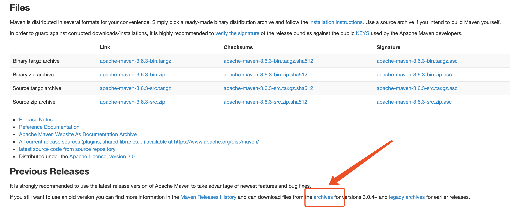
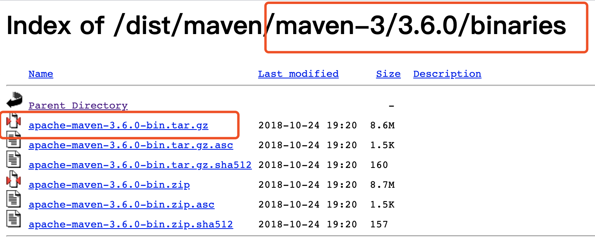
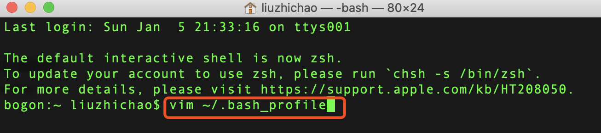
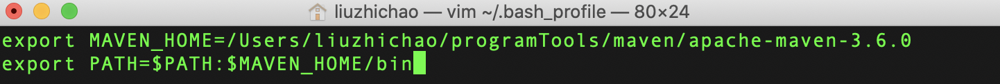
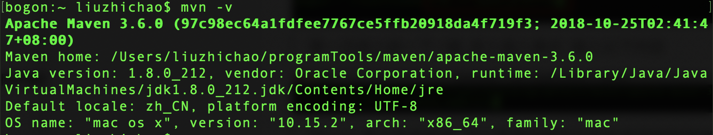

## Mac系统下Maven的安装与配置

[TOC]

#### 一 、Maven下载

##### Maven 最新版本下载地址

> http://maven.apache.org/download.cgi

##### 历史版本下载地址

> 点击 archives 下载其他版本, 如下图

> 进入后选择相应的版本点击进入, 选择 binaries/ 路径, 进入下载相应的包, 如下图

---

#### 二、Maven 安装

> 将压缩包进行解压, 解压到想要的位置, 也可以解压完毕后移动到自己想要的位置, 记住路径, 方便后面的配置

---

#### 三、Maven 配置

##### setting 文件配置(安装目录 --> conf --> setting.xml)

* 仓库地址: 在被注释掉的<localRepository>标签下面添加自己的<localRepository>仓库地址</localRepository>

* 镜像地址: 在<mirrors>标签中添加<mirror>标签

~~~java
<mirror>
	<id>alimaven</id>
	<mirrorOf>central</mirrorOf>
	<name>aliyun maven</name>
	<url>http://maven.aliyun.com/nexus/content/repositories/central/</url>
</mirror>
~~~

* 代理: 在<proxy>标签中添加自己的代理

##### 环境变量配置

> 打开终端工具Terminal, 输入命令: `vim ~/.bash_profile`

> 第一次进入按一下 i 键, 进入插入模式, 插入以下内容

> Maven 路径容易输错, 可以直接将解压后的包直接拖到终端中, 会自动生成路径

> 按下键盘的 esc 键, 输入 `:wq`   然后按回车

> 输入 `source .bash_profile`, 按回车使 bash_profile 文件生效

---

#### 四、检查环境变量是否配置成功

> 打开终端工具Terminal, 输入命令: `mvn -v`

> 出现如上 Maven 版本信息则证明配置成功