## ClashForWindows配置OpenAI规则

[toc]

#### 一、背景

由于OpenAI以及谷歌的bard和微软的Bing等AI工具只对指定国家开放，所以需要配置不同的路由规则在访问相关IP时用特定的机场节点。只针对Windows系统进行说明，有两种方式：图形化和直接修改配置文件。

---

#### 二、直接修改配置文件

图形化也是修改配置文件，所以直接修改配置文件可以更省时省力。

打开clash客户端，找到Profiles栏，右击订阅的配置文件，点击Edit。

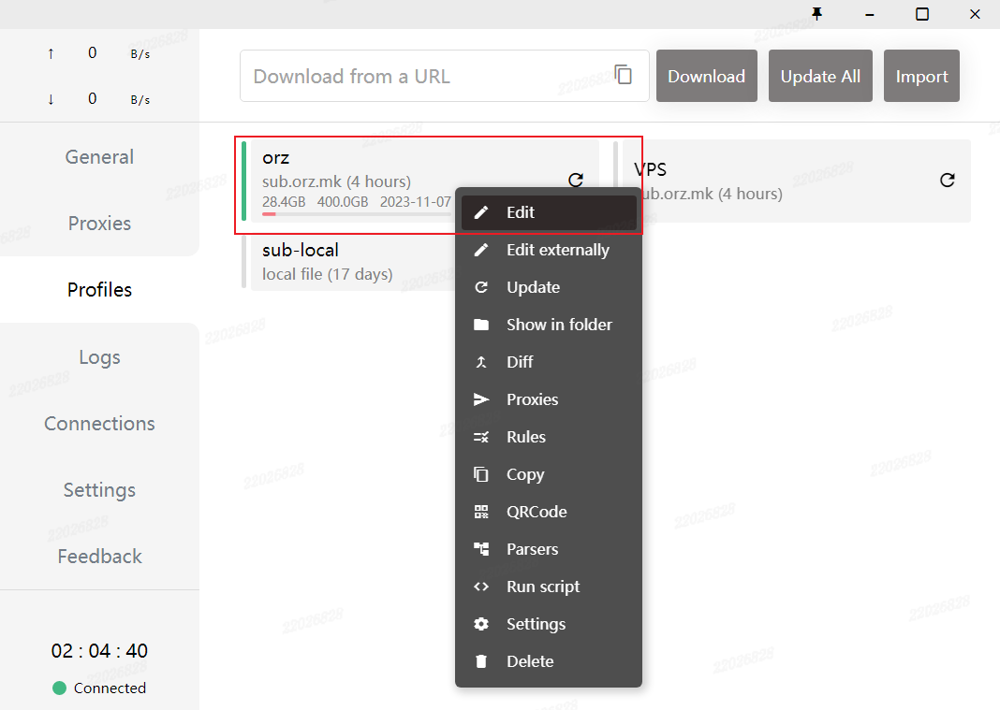

打开配置文件，在proxy-groups中添加一个代理组，仿照上面的添加自定义的代理组。

注意proxies这一配置，配置的机场节点要和配置文件上面的proxies的name属性对应。

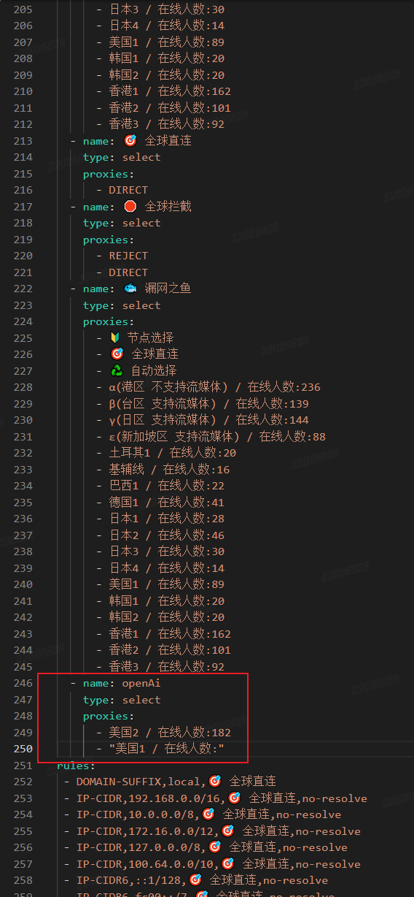

添加规则，基于刚才的代理组添加规则

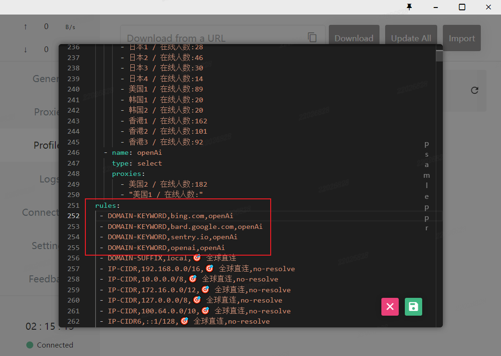

点击保存，访问openAI，查看连接日志判断是否修改成功。

如果访问不成功，注意排查是否选择了Profiles，以及是否保存成功，也可重启一下。

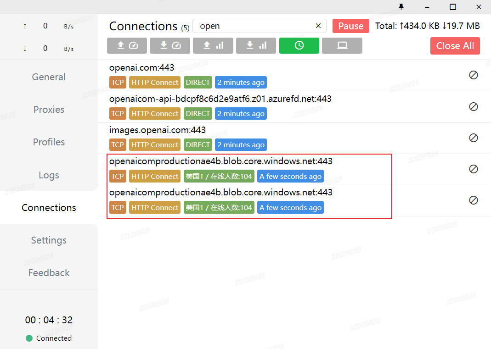

---

#### 三、图形化修改

右键订阅文件，选择Proxies。

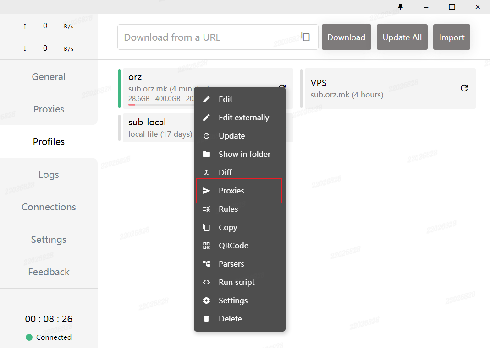

点击add。

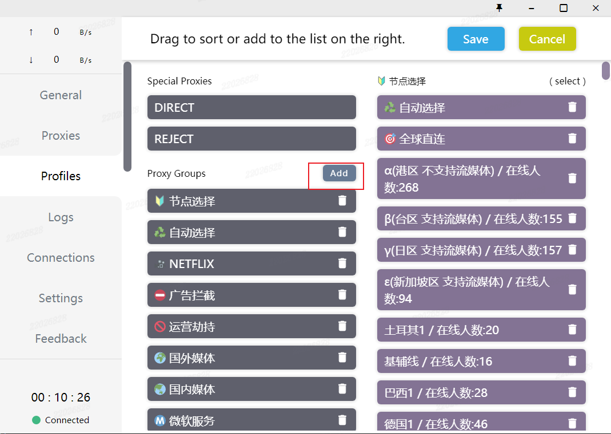

取名字保存即可。

- select 策略组：通过 UI 菜单手动选择一个策略。
- url-test 策略组：**自动测速，并发测试所有子策略，选择延迟最低的策略。**其中有以下几个参数需要注意：url：用于测试的 URL，测试地址可自定义，建议选择在全球都有节点的 URL，我们常用屏幕上的这个网址。
  timeout：测试的最长等待时间，超过该时间的策略将标记为失败不再继续等待。
  interval：每次测试的间隔时间。
  tolerance：容忍度，如果某几个策略测试结果相差不大，那么会导致在这几个策略中频繁切换，如果策略的代理服务器的出口 IP 不同，可能会触发目标网站的风险控制。所以加入了容忍度设计，仅当新一次的测试结果中，最佳策略比原选中策略的延迟差大于容忍度时，才会切换至新的策略。
- fallback 策略组：**选择可用的策略中，最靠前的策略。**基本与 url-test 一致，区别在于 fallback 只关心策略是否可用，并顺序选择最靠前的可用策略，并不关心测速结果的具体值。可以通过调小 timeout 参数将缓慢线路也标记为不可用，该类型没有 tolerance 参数。
- ssid 策略组：根据当前的 Wi-Fi SSID 选择一个策略。主要是针对有软路由环境得WiFi，当连接到指定WiFi SSID得时候切换到直连模式，当使用流量和其他WiFi时，走规则分流模式。
- load-balance 策略组：**负载均衡组，随机从子策略中选取一个策略使用。**当配置了 url 参数时，会按照 fallback 组的行为进行可用性检查，然后仅从可用的子策略中随机选取。

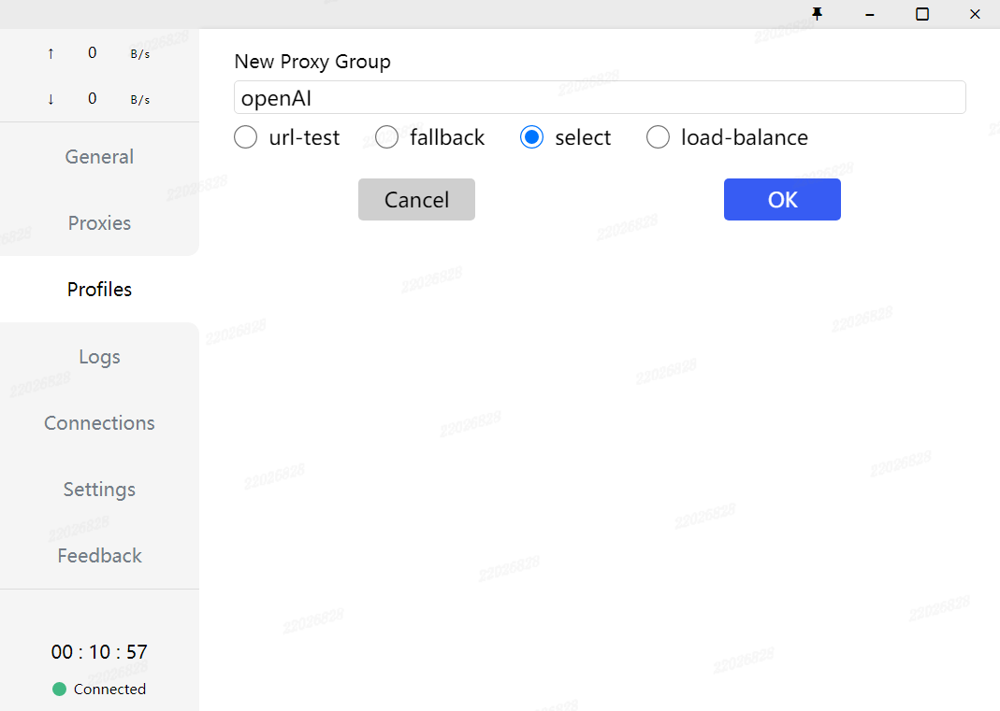

点击OK，返回页面一定要记得点击save！！！

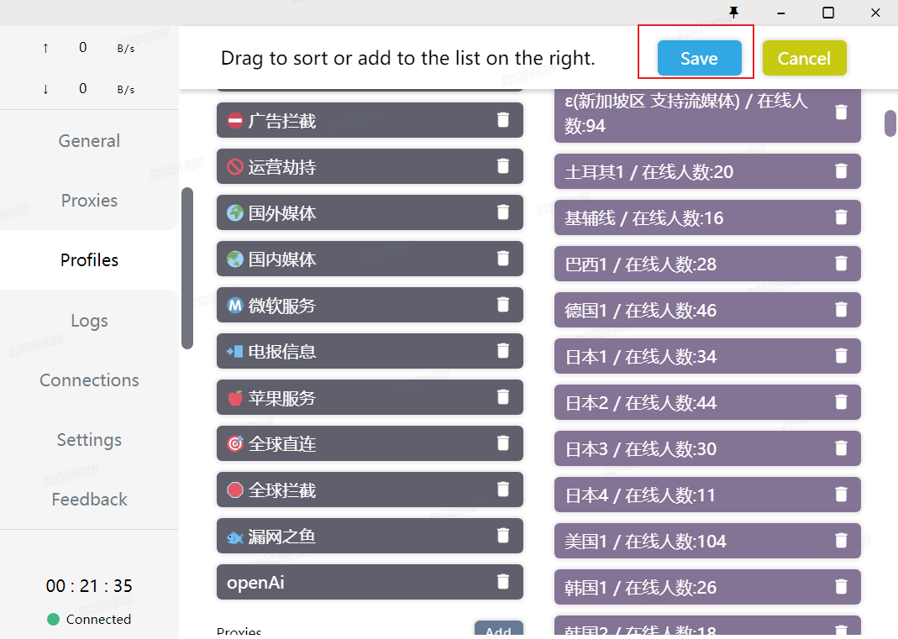

接下来配置规则，右击订阅文件，点击Rules

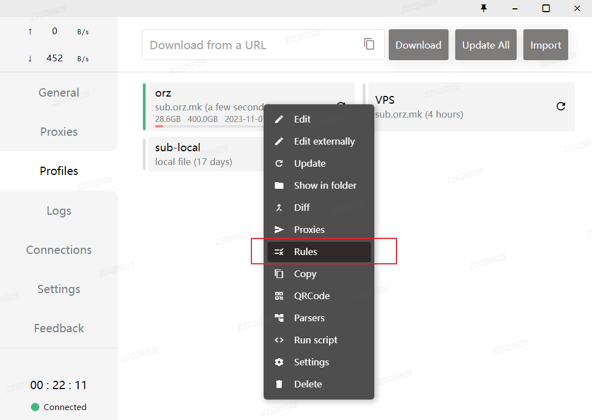

点击Add。

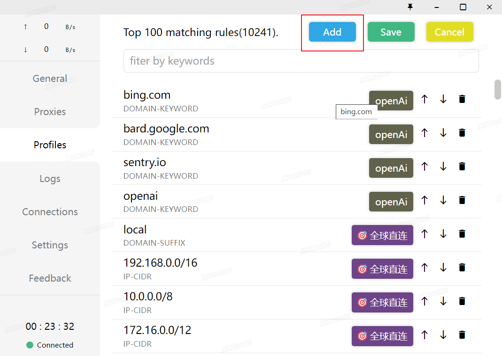

进行规则设置，设置地址的策略以及代理（组）。这一步可以看出，可以不进行代理组的设置，直接对该地址设置成固定的机场节点，代理组的好处是可以有多个节点。

- DOMAIN-SUFFIX：域名后缀匹配
- DOMAIN：域名匹配
- DOMAIN-KEYWORD：域名关键字匹配
- IP-CIDR：IP段匹配
- SRC-IP-CIDR：源IP段匹配
- GEOIP：GEOIP数据库（国家代码）匹配
- DST-PORT：目标端口匹配
- SRC-PORT：源端口匹配
- PROCESS-NAME：源进程名匹配
- RULE-SET：Rule Provider规则匹配
- MATCH：全匹配

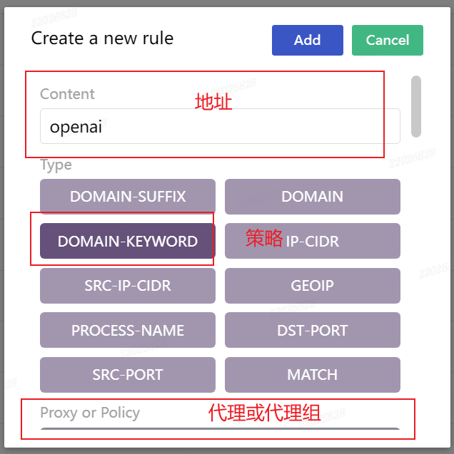

挨个设置自己想要的代理，图形化界面操作较多，需要添加每个规则。

点击Save！点击Save！点击Save！