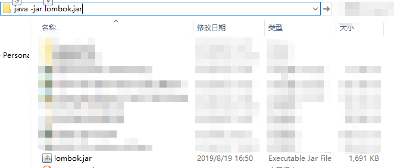
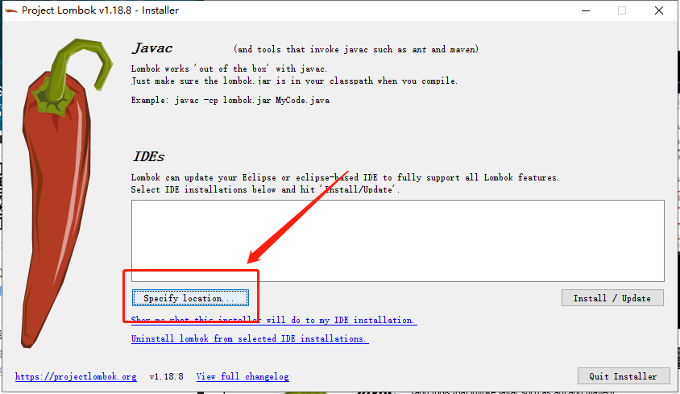
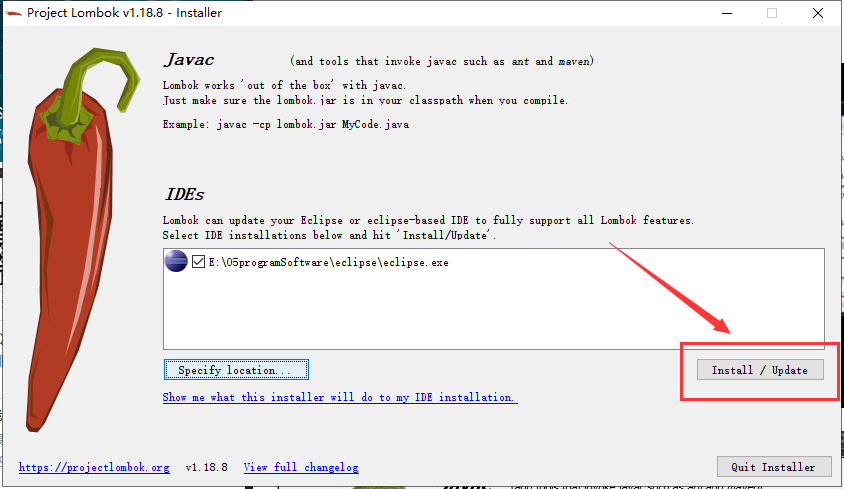
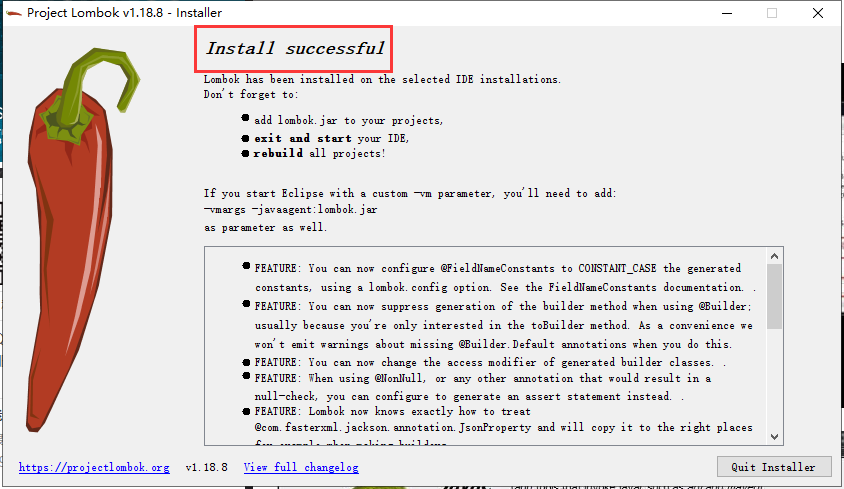
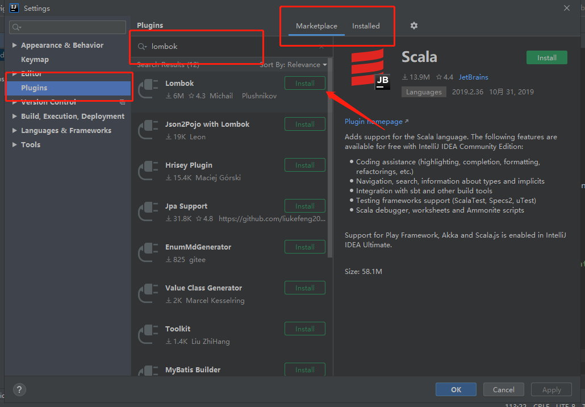

## eclipse/sts&Idea安装lombok插件

[TOC]

#### 	1. 下载jar包

> ​		https://projectlombok.org/download

---

#### 	2. 切到lombok的下载目录,执行命令:java -jar lombok.jar

​	

---

#### 	3. 选择要执行的.exe文件

​	

---

#### 	4. 安装

​	

---

#### 	5. 成功

​	

---

#### 	6. 添加依赖

```java
				<dependency>
            <groupId>org.projectlombok</groupId>
            <artifactId>lombok</artifactId>
            <!-- <version>1.18.2</version> -->
        </dependency>
```

---

#### 7.IDEA安装lombok插件



