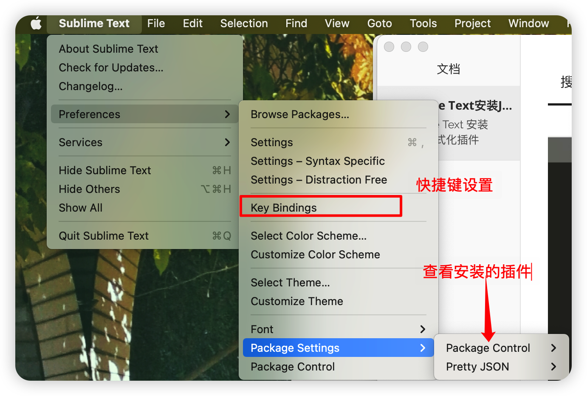

## Sublime Text 安装 Json 格式化插件

[toc]

#### 1. 安装 Package Control

​	首先需要安装 `Package Control` 如果已安装则跳过。

​	按 `Command + Shift + P` 打开命令框，搜索 PC 选择 `Install Package Control` 进行安装

​	

​	选择之后稍微等待一会，成功后弹窗如下：

---

#### 2. 安装 Pretty Json

​	按 `Command + Shift + P` 打开命令框，搜索 PCI，打开 package 安装框

​	搜索 Pretty JSON，进行安装

 

---

#### 3. 格式化 json

> Mac： command + control + J
>
> Windows： Ctrl + Alt + J

---

#### 4. 快捷键失效

查看已经安装的插件以及添加快捷键设置

将格式化 JSON 的快捷键添加进去

配置信息如下：

> [
> 	{ "keys": ["ctrl+command+j"], "command": "pretty_json" },
> ]