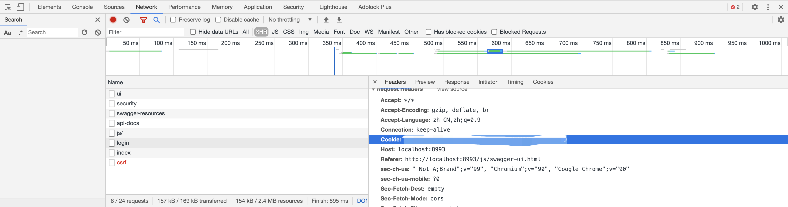
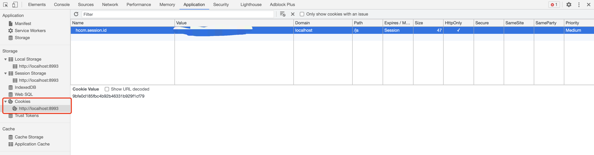
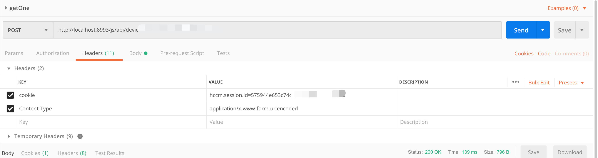

## Postman 测试需要登录的接口

[toc]

> 使用 postman 测试接口时，需要先登录的解决办法。以 Google 浏览器为例。

##### 获取已登录的 cookie 信息

> 首先要获取已登录的 cookie 信息，cookie 里会存放当前登录的用户的信息。
>
> 要获取 cookie 信息，首先要是已登录的状态，无论是在系统中进行登录还是 swagger 接口测试已登录都可以，只要是已经有登录的状态，哪怕是重新登陆一次都可以。
>
> 获取方式有两种，实际采用的为第一种，个人感觉比较稳妥。

###### 方式一

​	该方式是实际采用的有效地方式。

​	我是在已经登录过的 swagger 接口测试界面进行获取的数据，打开 F12 调试界面获取 cookie，如图：

---

###### 方式二

​	该方式也可以获取到 cookie 信息，不过还需要手动进行拼接，不如方式一简便。

---

##### postman 测试时传 cookie 信息

​	将 cookie 信息放在 header 里发送请求，Content-Type 根据实际接口情况（可不填），如图：

​	key： cookie/Cookie 都可以； value：是 sessionId=sessionIdValue 

​	value 是拼接的形式，所以建议直接使用方式一获取完整的 cookie 的 value，防止自己拼接错误。