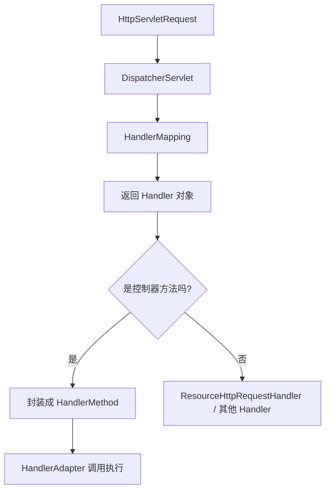

# Spring MVC HandlerMethod 技术解析


## 前言

在 Spring MVC 的请求处理流程中，HandlerMethod 是一个极其核心的概念。

当你在控制器中编写如下代码时：

```java
@GetMapping("/hello")
public String hello() {
    return "hi";
}
```

Spring 并不是直接调用 hello() 方法，而是将它包装成一个 **HandlerMethod 对象** 来进行统一管理。

------

## HandlerMethod 简介

HandlerMethod 是 Spring MVC 对 **控制器方法（Controller Method）** 的封装类，定义在包：`org.springframework.web.method.HandlerMethod` 。

### 主要职责

- **保存控制器对象实例（Bean）**
- **保存方法对象（Method）**
- **保存方法参数、返回类型、注解信息**
- **用于反射执行控制器方法**

它让 Spring MVC 的请求调度器（DispatcherServlet）能够以统一的方式处理各种控制器，而无需直接依赖具体类或方法。

### 请求流程

当 DispatcherServlet 收到一个 HTTP 请求时，Spring MVC 的处理流程如下：



### 对应源码

在 `RequestMappingHandlerMapping` 中：

```java
protected HandlerMethod getHandlerInternal(HttpServletRequest request) throws Exception {
    HandlerMethod handlerMethod = lookupHandlerMethod(request);
    return handlerMethod.createWithResolvedBean();
}
```

可以看到，Spring 会将匹配的控制器方法封装成一个 HandlerMethod 对象，并存入 HttpServletRequest 的属性中。

参考源码位置：

- org.springframework.web.method.HandlerMethod
- org.springframework.web.servlet.DispatcherServlet
- org.springframework.web.servlet.HandlerMapping
- org.springframework.web.servlet.mvc.method.annotation.RequestMappingHandlerMapping

------

## 获取当前请求的 HandlerMethod

Spring 提供了一个常量：

```java
HandlerMapping.BEST_MATCHING_HANDLER_ATTRIBUTE
```

它是 DispatcherServlet 存储在 request 中的关键属性，用于保存匹配到的 Handler。

通过下面代码即可在任何组件中获取当前处理方法：

```java
Object handler = request.getAttribute(HandlerMapping.BEST_MATCHING_HANDLER_ATTRIBUTE);
```

- 如果当前请求由控制器方法处理，则 handler 是一个 HandlerMethod；
- 如果由资源处理器、Servlet 或其他组件处理，则是其他类型。

------

## 代码示例（全局异常处理为例）

当在系统中使用 `@RestControllerAdvice` 进行全局异常处理且系统中的返回值不唯一时，比如：部分接口返回是自定义的 `Result` 类，部分接口返回的是 Spring 的 `ResponseEntity`。

此时，就需要根据请求方法的返回值来进行判断，从而封装异常信息。

```java
/**
 * 兜底异常处理
 */
@ExceptionHandler(value = Exception.class)
public Object exceptionHandler(Exception e, HttpServletRequest request) {
    log.error("系统内部异常 :{}", Throwables.getStackTraceAsString(e));

    if (isResultEndpoint(request)) {
        return Result.Exception("系统内部异常", e.getMessage());
    }

    return new ResponseEntity<>(
            new ErrorResult(500, "系统内部异常", ExceptionUtil.getMessage(e)),
            HttpStatus.INTERNAL_SERVER_ERROR);
}

/**
 * 判断当前请求的处理方法返回类型是否为 Result。
 * 该方法用于识别控制器方法返回类型，以决定是否使用 Result 进行异常响应封装。
 *
 * @param request 当前的 HttpServletRequest 请求对象，用于获取匹配的处理方法信息
 * @return true 如果返回类型为 Result；false 否则
 */
private boolean isResultEndpoint(HttpServletRequest request) {
    // 从请求中获取当前匹配的处理方法对象
    Object attr = request.getAttribute(HandlerMapping.BEST_MATCHING_HANDLER_ATTRIBUTE);

    // 判断是否为控制器方法
    if (!(attr instanceof HandlerMethod)) {
        return false;
    }

    // 获取方法的返回类型
    HandlerMethod hm = (HandlerMethod) attr;
    Class<?> returnType = hm.getMethod().getReturnType();

    // 如果返回类型是 Result 或其子类, 则返回 true; 否则返回 false
    return Result.class.isAssignableFrom(returnType);
}
```

**为什么要判断 `!(attr instanceof HandlerMethod)`** 

在 Spring MVC 中，不是所有请求都会映射到控制器方法，因此：

| **场景**       | **对象类型**                          | **说明**                            |
| -------------- | ------------------------------------- | ----------------------------------- |
| 访问静态资源   | ResourceHttpRequestHandler            | 例如 /css/app.css                   |
| 访问错误页     | DefaultErrorController 或其他 Handler | 例如 /error                         |
| 访问 Actuator  | 特定的 EndpointHandler                | /actuator/health                    |
| 自定义 Servlet | HttpServlet                           | 通过 @WebServlet 注册的传统 Servlet |

这些请求并不走 @RequestMapping 的映射机制，所以 attr 不会是 HandlerMethod。

此时返回 false 可避免错误地解析控制器方法信息。

------

## 核心属性与常用方法

| **方法 / 属性**          | **类型**          | **说明**                                  |
| ------------------------ | ----------------- | ----------------------------------------- |
| getBean()                | Object            | 获取控制器实例对象                        |
| getBeanType()            | Class<?>          | 获取控制器类类型                          |
| getMethod()              | Method            | 获取被映射的 Java 反射方法                |
| getReturnType()          | Class<?>          | 获取返回类型                              |
| getMethodParameters()    | MethodParameter[] | 获取参数列表                              |
| hasMethodAnnotation()    | boolean           | 判断方法上是否存在某个注解                |
| createWithResolvedBean() | HandlerMethod     | 创建新的 HandlerMethod（解决懒加载 Bean） |

这些方法在框架开发中非常常用，比如自定义注解解析、接口鉴权、日志审计等。

------

## 典型应用场景

| **应用场景**     | **说明**                              | **示例**                                 |
| ---------------- | ------------------------------------- | ---------------------------------------- |
| **全局异常处理** | 根据返回类型动态构造响应体            | 参考上面的代码示例                       |
| **接口日志打印** | 从 HandlerMethod 获取方法名与注解信息 | hm.getMethod().getName()                 |
| **API 权限控制** | 检查控制器或方法上自定义注解          | hm.hasMethodAnnotation(Permission.class) |
| **AOP 参数增强** | 提取参数类型信息进行自定义校验        | hm.getMethodParameters()                 |

------

## 总结

- HandlerMethod 是对控制器方法的统一封装，承载 Bean、Method、参数、返回类型与注解等元信息，支撑 DispatcherServlet 的标准化调用流程。
- 通过 `HandlerMapping.BEST_MATCHING_HANDLER_ATTRIBUTE` 可在横切位置（拦截器、异常处理等）获取当前 HandlerMethod；但需先判断是否为 HandlerMethod，避免静态资源等场景误用。
- 常用能力：获取控制器与方法信息、参数与返回类型、注解判定、懒加载 Bean 解析。可用于统一异常封装、权限与审计、日志与可观测性、AOP 增强等。
